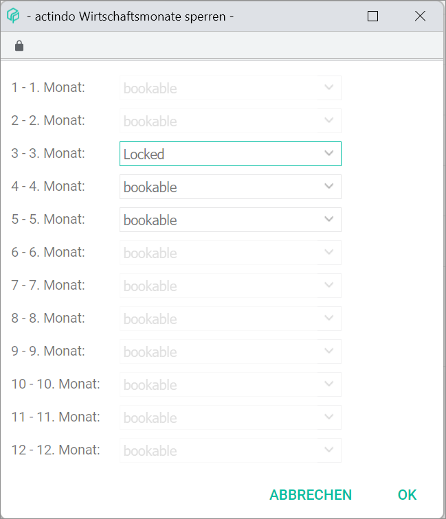
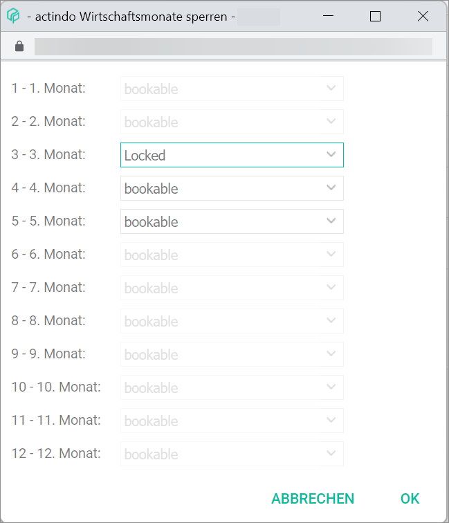

[!!User Interface lock months](../UserInterface/01_Book.md#lock-months)  
[!!User Interface bookings](../UserInterface/01a_Bookings.md)  

# Lock a period for bookings

The *Lock months* menu entry of the *EDIT* context menu in the *BOOKINGS* tab allows to lock months for bookings.

Once the bookings in a particular booking period are processed, they cannot be changed or deleted any more, and the corresponding booking period is regarded as closed. However, new bookings can be entered in a closed booking period, if necessary. If this is to be avoided, the *Lock months* function can be used to lock one or several periods for bookings. When a booking period is locked, any subsequent transaction will be booked automatically in the following bookable booking period.

In contrast to booking processing, month locking can be undone if necessary, that is, locked months can be made bookable again. For detailed information about processing bookings, see [Process bookings](./07_ProcessBookings.md).

#### Prerequisites

- The accounting is configured via the configuration wizard, see [Run the accounting wizard](../Integration/01_RunAccountingWizard.md).
- A valid fiscal year is created, see [Create a fiscal year](../Integration/04_ManageFiscalYear.md#create-a-fiscal-year).
- A fiscal year is selected, see [Select fiscal year](./01_SelectFiscalYear.md).
- A booking or multiple bookings have been created, see [Create a manual booking](./04_CreateManualBooking.md).

#### Procedure

*Accounting > Select fiscal year > Book > Tab BOOKINGS > Context menu EDIT > Menu entry Lock months*

1. Click the *Lock months* menu entry in the *EDIT* context menu.  
A window opens for you to select the month(s) to be locked for bookings.

  

2. Lock the month(s) as necessary by selecting *Locked* in the drop-down list of the corresponding month(s).

  > [Info] This action can be reversed by selecting the *bookable* option in the drop-down list for the corresponding month(s).

3. Click the [OK] button.  
A pop-up window is displayed shortly to confirm that the changes are being saved. The selected month(s) are now locked for bookings.
