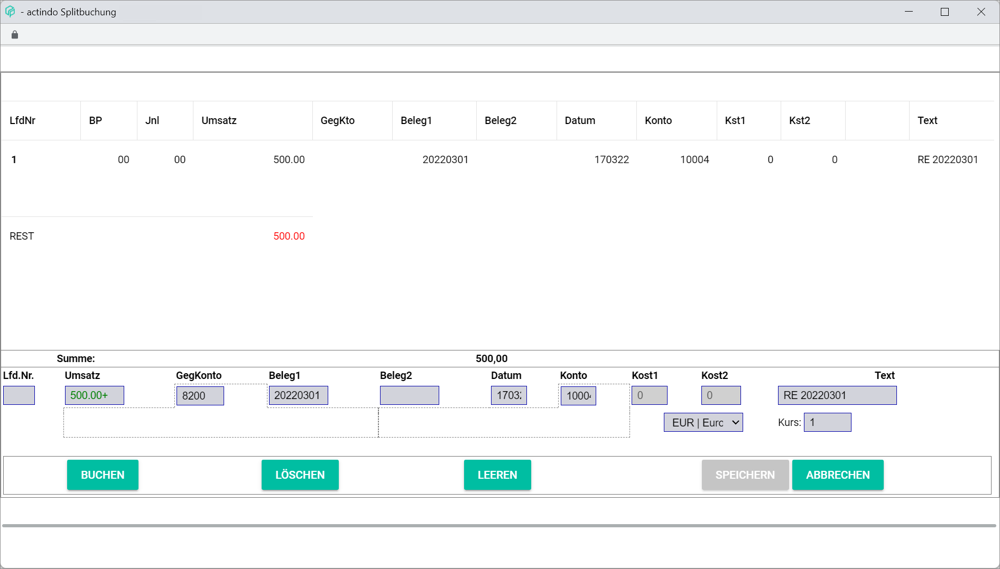
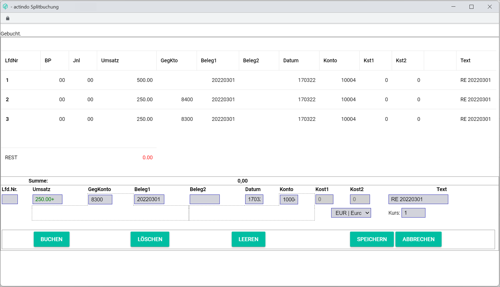

[!!User Interface Split posting](../UserInterface/01a_Bookings.md#split-posting)   
[!!User Interface Post](../UserInterface/01_Book.md)  

# Split a posting

In some occasions, it may be necessary to split a posting to keep track of different items separately, for example if an invoice includes products with different tax rates or if total costs must be divided into two or more cost centres. Split postings can affect both debit and credit accounts, that is, incoming and outgoing invoices.

The split posting must be performed during the manual posting process. For detailed information about creating a manual posting, see [Create a manual posting](./04_CreateManualBooking.md). If an invoice is nevertheless split after the posting has been automatically registered or manually created due to a business transaction, a copy of the main posting with the new contra accounts is created.

Once the splitting has been performed, the different split (partial) postings are assigned to the corresponding accounts. The split postings are displayed in the postings list below the main posting.

#### Prerequisites

A fiscal year has been selected, see [Select fiscal year](./01_SelectFiscalYear.md).

#### Procedure

*Accounting > Post > Tab POSTINGS*

1. If necessary, click the *Currency code* drop-down list and select the appropriate currency for the posting. All available currencies are displayed in the list. By default, the base currency is preselected.

2. Enter the posting amount in the *Turnover* field. This field is mandatory.  

    > [Info] The fields *Turnover*, *Date* and *Account* must be filled to split a posting. The *Contra Account* field can be specified when splitting the posting.

3. Enter a reference number, usually the invoice number, in the *Receipt 1* field.

4. Enter the date for the manual posting in the *Date* field. Date format must be DDMMYY.

5. Enter a personal account number in the *Account* field, that is, a debtor (customer) or a creditor (provider) account number.

6. Enter any other relevant posting information in the corresponding fields.

7. Click the [SPLIT] button.  
    The *Split posting* window is displayed.  

    

8. Split the posting in the *Split posting* window by following the steps below:  

    + Enter the partial amount for the split posting in the *Turnover* field.
    + Enter the corresponding contra account for the split posting in the *Contra account* field.
    + Click the [POST] button.    
    The split posting is displayed in the *Split posting* window below the main posting. The notice *Posted.* is displayed in the top left corner of the *Split posting* window.

    > [Info] An error message is displayed in the top left corner of the *Split posting* window if the split posting failed.

9. Repeat the step **8** for each split posting.
    A message in the top left corner of the *Split posting* window confirms each split posting. The split postings are now listed underneath the main posting in the *Split posting* window.

    

    > [Info] As soon as the total posting amount in the *Split posting* window equals *0.00*, the [SAVE] button is unlocked.

9. Click the [SAVE] button.  
The notice *Split posting applied* is displayed in the top left corner of the *Split posting* window. The *Split posting* window is closed automatically. The split posting is displayed in the postings list below the corresponding main posting.

    
