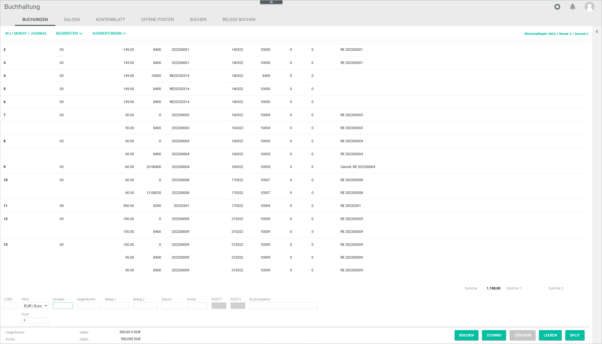

[!!User Interface split booking](../UserInterface/01a_Bookings.md#split-booking)   
[!!User Interface book](../UserInterface/01_Book.md)  

# Split a booking

In some occasions, it may be necessary to split a booking to keep track of different items separately, for example if an invoice includes products with different tax rates or if total costs must be divided into two or more cost centres. Split bookings can affect both debit and credit accounts, that is, incoming and outgoing invoices.
The split posting must be performed during the manual posting process. For detailed information about creating a manual posting, see [Create a manual posting] (./04_CreateManualBooking.md).   
If an invoice is nevertheless split after the posting has been automatically registered or manually created due to a business transaction, a copy of the main posting with the new contra accounts is created. 
Once the splitting has been performed, the different split (partial) postings are assigned to the corresponding accounts. The split postings are displayed in the postings list below the main posting.

#### Prerequisites

A fiscal year has been selected, see [Select fiscal year](./01_SelectFiscalYear.md).

#### Procedure

*Accounting > Select fiscal year > Book > Tab BOOKINGS*

1. If necessary, click the *Currency code* drop-down list and select the appropriate currency for the posting. All available currencies are displayed in the list. By default, the base currency is preselected.

  > [Info] The booking numbers must be sequential and are added by the system automatically.

2. Enter the total invoice value in the *Turnover* field.

3. Enter the date for the manual booking in the *Date* field. Date format must be DDMMYY.

4. Enter a personal account number in the *Account* field, that is, a debtor (customer) or a creditor (provider) account number.

  > [Info] The fields *Date* and *Account* must be filled out to be able to split a booking. The *Contra Account* field can be specified when splitting the booking.

5. Enter any other relevant booking information in the corresponding fields.

  > [Info] Even though it is not compulsory, it is highly recommended to fill in the *Receipt 1* field, as the system identifies and groups together any subsequent bookings taking this field as reference.

6. Click the [SPLIT] button.  
The *Split booking* window is displayed.  

  

7. Split the booking as necessary assigning each split booking to the corresponding contra account.

8. Repeat the step **7** for each split posting.
A message in the top left corner of the *Split booking* window confirms each split booking. The split bookings are now listed underneath the main booking in the *Split booking* window.

  

  > [Info] As soon as the total posting amount in the *Split posting* window equals *0.00*, the [SAVE] button is unlocked.

9. Click the [SAVE] button.  
The notice *Split posting applied* is displayed in the top left corner of the *Split booking* window. The *Split booking* window is closed automatically. The split posting is displayed in the postings list below the corresponding main posting.
