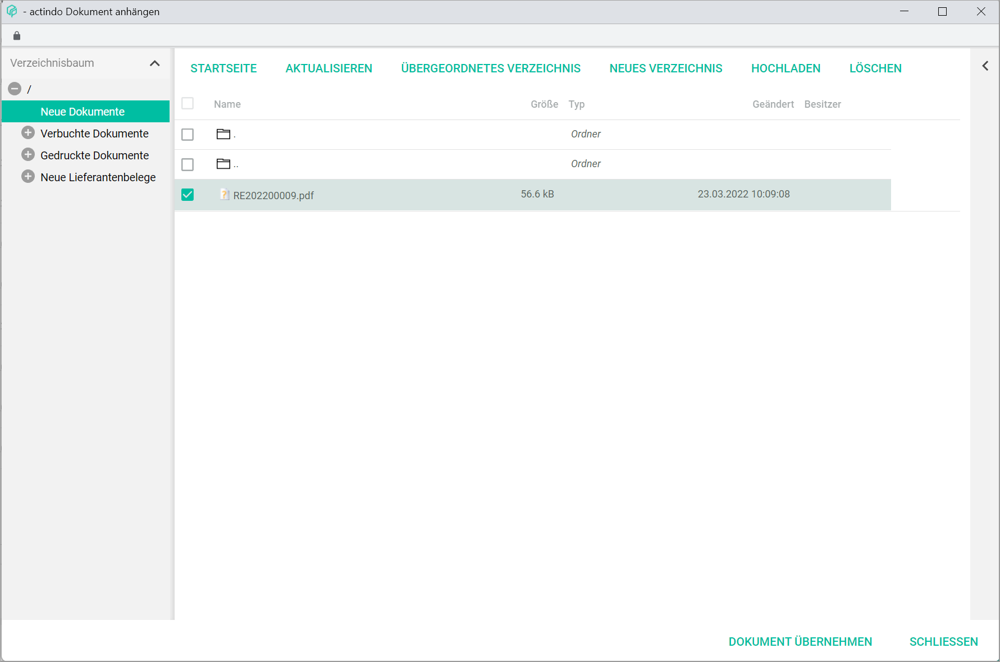
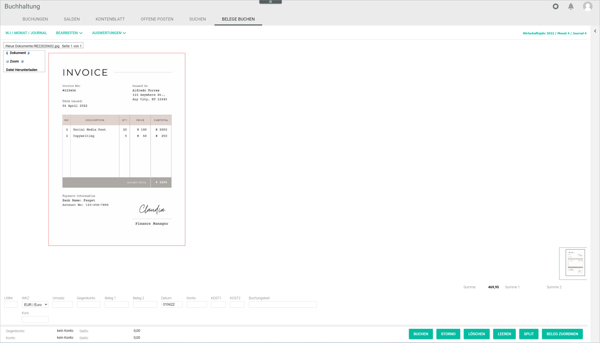

[!!Documents](RetailSuiteDocorg)  
[!!Purchasing](RetailSuiteSourcing)   
[!!Payment processing](RetailSuiteBanking)  
[!!User Interface Postings](../UserInterface/01a_Bookings.md)  
[!!User Interface Post receipts](../UserInterface/01f_BookReceipts.md)  
[!!User Interface Supplier receipts](../UserInterface/01_Book.md#supplier-receipts)  
[!!User Interface Debtors/creditors](../UserInterface/02a_DebtorsCreditors.md)    

# Manage receipts

Receipts are used to document all transactions and, therefore, play an indispensable role for a correct accounting. There are many different types of receipts, such as invoice, order confirmation, or credit note.

The *Accounting* module offers three possible ways to manage and assign receipts to postings:

- Click the [ASSIGN RECEIPT] button in the *POSTINGS* tab to assign a receipt to an existing posting in the postings list, see [Retrieve a receipt](#retrieve-a-receipt).
- Access the *POST RECEIPTS* tab to assign a receipt uploaded in the *Documents* module and create the corresponding posting manually, see [Post a receipt](#post-a-receipt).
- Click the *Supplier receipts* menu entry in the *EDIT* context menu to specifically assign a supplier receipt, see [Post a supplier receipt](#post-a-supplier-receipt).

> [Info] *Supplier receipts* is a special feature that interacts with the *Purchasing* and *Payment processing* modules, and therefore the appropriate settings must be configured first.

## Retrieve a receipt

You can retrieve and assign a receipt that has not yet been registered to an existing posting. Any unregistered receipts uploaded in the system are displayed in the *POST RECEIPTS* tab.  

After being uploaded, the receipts are stored in the *New documents* folder in the *Documents* module. Once they are booked, they are moved automatically into the *Registered documents* folder and then placed in the appropriate subfolder according to the following structure:

- 10000-69999 personal account numbers in case of a debtors'/customers' document
- 70000-79999 personal account numbers in case of a creditors'/suppliers' document

#### Prerequisites

- A fiscal year has been selected, see [Select fiscal year](./01_SelectFiscalYear.md).
- The *Documents* module has been installed.
- A receipt has been uploaded in the *Documents* module.

[comment]: <> (Ist PDF das einzige unterstütze Format? Nope, JPG und PNG auch. Andere Formate? Info dazu?)

#### Procedure

*Accounting > Select fiscal year > Post > Tab POSTINGS*

1. Select the posting to be assigned a receipt from the postings list in the *POSTINGS* tab.  
The existing posting details are displayed in the input line fields.

2. Click the [ASSIGN RECEIPT] button.  
The *Attach Document* window is displayed.

  

[comment]: <> (Der button wird bei mir nicht angezeigt. Muss da eine bestimmte Einstellung vorgenommen werden, damit das angezeigt wird? Ich habe allerdings auch in der Sandbox Dokumente nicht installiert - ist das eine Voraussetzung? Muss dann auf jeden Fall mit in die Prerequisites, da das nicht als allgemeine Voraussetzung im Kapitel General drin ist...
Ggf. nochmal Infos dazu einholen.)

3. Click the *New documents* folder in the side bar.  
All unassigned documents are displayed.

  

4. Select the document to be assigned to the posting in the list of documents.

5. Click the [SELECT DOCUMENT] button.  
The selected document has been assigned to the posting. The *Attach Document* window is closed. The  icon (=Beleg, EN: receipt) is displayed next to the posting in the postings list.

  

  > [Info] You can click the  icon to display the corresponding receipt. The *Attached document* window is displayed. If the receipt assignment needs to be undone due to a mistake, click the [CANCEL ASSIGNMENT] button in the *Attached document* window.

## Post a receipt

External receipts uploaded to the system and not yet registered can be assigned manually in the *Accounting* module. The invoices uploaded in the *New documents* folder in the *Documents* module are recognized by the system and displayed in the *POST RECEIPTS* tab.

#### Prerequisites

- A fiscal year has been selected, see [Select fiscal year](./01_SelectFiscalYear.md).
- The *Documents* module has been installed.
- A receipt has been uploaded in the *Documents* module.

[comment]: <> (Ist PDF das einzige unterstützte Format? Nope, JPG und PNG auch. Andere Formate? Info dazu?)

#### Procedure

*Accounting > Select fiscal year > Post > Tab POST RECEIPTS*

  > [Info] All unassigned documents uploaded in the *New documents* folder in the *Documents* module are displayed in the *POST RECEIPTS* tab. If there are no unassigned documents, the notice *No documents left to be registered* is displayed in the *POST RECEIPTS* tab.

1. Select the document to be assigned. You can scroll through the available documents with the  and  arrows to the left and right of the word *Document*.

2. In the input line under the document, click the *Currency code* drop-down list and select the appropriate currency for the posting. All available currencies are displayed in the list. By default, the base currency is preselected.

  > [Info] Currency exchange rate can also be adjusted if needed in the *Rate* field.

3. Enter the posting amount in the *Turnover* field. This field is mandatory.

  > [Info] The fields *Turnover*, *Contra account*, *Date* and *Account* must be filled to create a manual posting.

4. Enter an account number in the *Contra account* field.

  > [Info] After you have entered at least two numbers in the field, a list is displayed below the field with all accounts matching the entry. You can also select the corresponding account in the list.

5. Enter a reference number, usually the invoice number, in the *Receipt 1* field.

 > [Info] Even though it is not mandatory, it is highly recommended to fill in the *Receipt 1* field, as it is used as a reference to identify and assign any subsequent postings, for example for an invoice settlement or a credit note in case of refund.

6. Enter the date for the manual posting in the *Date* field. The valid date format is *DDMMYY*.

7. Enter an account number in the *Account* field.

  > [Info] After you have entered at least two numbers in the field, a list is displayed below the field with all accounts matching the entry. You can also select the corresponding account in the list.

8. If desired, enter any other relevant manual posting information in the corresponding fields.

9. Click the [POST] button.  
The manual posting is created and linked to the selected receipt. The notice "Document linked. Posted." is displayed above the input line. The new posting is displayed in the postings list in the *POSTINGS* tab. The  icon (=Beleg, EN: receipt) is displayed next to the posting in the postings list.

  > [Info] If there are further unregistered documents, they will be displayed in the *POST RECEIPTS* tab. Otherwise, the notice "No documents left to be registered" is displayed.

## Post a supplier receipt

In addition to the posting process and assignment of general receipts, there is an enhanced function to specifically post supplier receipts.

Suppliers' invoices can be uploaded in the *New supplier receipts* folder in the *Documents* module, which will be recognized by the system and displayed in the *Acquire* tab in the *Supplier receipts* window. Once the supplier receipts are posted, they are moved automatically into the *Acquired documents* folder.

Moreover, this function interacts with the *Purchasing* and *Payment processing* modules, and allows to check supplier receipts before booking them in the system and to automatize payment conditions.

[comment]: <> (ACQUIRE probably "enter" -ERFASSEN- or "park" -vorerfassen", SAP Terminology)

#### Prerequisites

- A fiscal year has been selected, see [Select fiscal year](./01_SelectFiscalYear.md).
- The *Supplier receipts + payment proposal list* plug-in has been installed.
- The *New supplier receipts* folder has been created in the *Documents* module, if not already available.
- At least one supplier receipt has been uploaded in the *New supplier receipts* folder.

[comment]: <> (New supplier receipts/Neue Lieferantenbelege Ordner selber erstellen oder ist irgendwie automatisch erstellt?)

#### Procedure

*Accounting > Select fiscal year > Post > Tab POSTINGS*

1. Click the [EDIT] button in the header above the postings list.  
A context menu is displayed.

  

2. Click the *Supplier receipts* menu entry in the context menu.     
  The *Supplier receipts* window is displayed. The external receipts uploaded in the *New supplier receipts* folder in the *Documents* module are displayed in the *Acquire* tab.

  

    > [Info] If there are no receipts to be booked, the message *No documents left to be registered* is displayed.

3. Select the document to be assigned. You can scroll through the available documents with the  and  arrows to the left and right of the word *Document*.

4. In the input line under the document, enter the posting amount in the *Turnover* field. This field is mandatory.

  > [Info] The currency exchange rate can also be adjusted if needed in the *Exchange rate* field. The fields *Turnover*, *Contra account*, *Date*, *Account* and *Posting text* must be filled to create a manual posting.

5. Enter an account number or an account description in the *Contra account* field.

  > [Info] After you have entered at least three characters in the field, a list is displayed with all accounts matching the entry. You can also select the corresponding account in the list. Alternatively, click the drop-down list and select the applicable contra account.

6. Enter a reference number, usually the invoice number, in the *Receipt 1* field.

 > [Info] Even though it is not mandatory, it is highly recommended to fill in the *Receipt 1* field, as it is used as a reference to identify and assign any subsequent postings, for example for an invoice settlement or a credit note in case of refund.

7. Enter the date for the manual posting in the *Date* field. The valid date format is *DDMMYY*.

8. Enter an account number or an account description in the *Account* field.

  > [Info] After you have entered at least three characters in the field, a list is displayed with all accounts matching the entry. You can also select the corresponding account in the list. Alternatively, click the drop-down list and select the applicable contra account.

9. Click the *Payment target* drop-down list and select the appropriate payment target for the receipt. The payment target configured in the supplier settings, if any, is preselected, see [Invoicing](../UserInterface/02a_DebtorsCreditors.mdinvoicing-1).

  > [Info] A split posting can also be performed with the [SPLIT] button, if necessary. For detailed information, see [Split a posting](./09_SplitBooking.md).

9. Click the [ACQUIRE] button.  
A pop-up window is displayed while the changes are being saved. The supplier receipt has been acquired and is displayed in the *Overview* tab.  

  

  > [Info] To enter the supplier receipt in the system, they need to be released in the *Purchasing* module first. Once they have been released in the *Purchasing* module, the status changes from **New** (red) to **Released** (yellow-green) in the *Status* column.

[comment]: <> (Link zu Einkauf hinzufügen, wenn verfügbar!)

11. Click the *Financial accounting takeover* tab and select the receipt to be entered in the system.

  > [Info] When selecting a receipt, the receipt data are displayed in the input line. Changes can still be made here before takeover and saved with the [SAVE] button.

12. Double check all posting details and, if no further changes are needed, click the [TAKE OVER SELECTED ONES] button.    
The receipt has been registered in the *Accounting* module. The posting is displayed in the postings list. An open item for the corresponding supplier (creditor) has been created.

  

[comment]: <> (New screenshot to be added)
