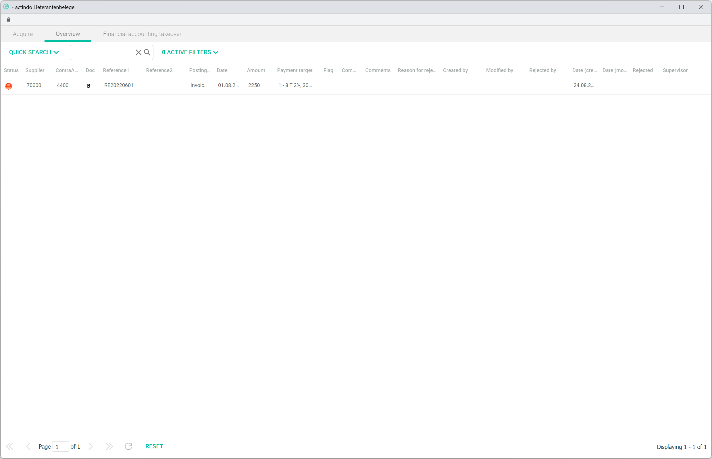
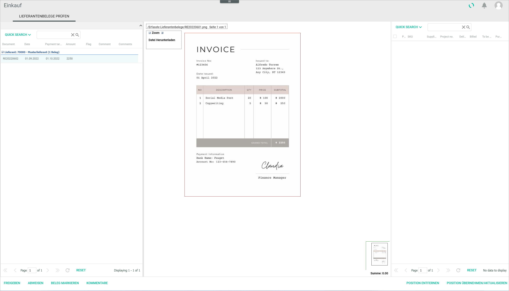

[!!User interface Postings](../UserInterface/01a_Bookings.md)
[!!User interface Post receipts](../UserInterface/01f_BookReceipts.md)
[!!User interface Postings header](../UserInterface/01_Header.md)
[!!User interface Debtors/creditors](../UserInterface/02a_DebtorsCreditors.md)    

[comment]: <> (Ggf. Link zu Documents, Purchasing and Payment processing hinzufügen, wenn verfügbar) 

# Manage receipts

Receipts are used to document all transactions and, therefore, play an indispensable role for a correct accounting. Every posting needs to have a receipt as a basis. There are many different types of receipts, such as invoice, credit note, cash voucher or rebooking document.

The *Accounting* module offers three possible ways to manage and assign receipts to postings:

- Click the [ASSIGN RECEIPT] button in the *POSTINGS* tab to assign a receipt to an existing posting in the postings list, see [Retrieve a receipt](#retrieve-a-receipt).
- Access the *POST RECEIPTS* tab to assign a receipt uploaded in the *Documents* module and create the corresponding posting manually, see [Post a receipt](#post-a-receipt).
- Click the *Supplier receipts* menu entry in the *EDIT* context menu to specifically assign a supplier receipt, see [Post a supplier receipt](#post-a-supplier-receipt).

> [Info] *Supplier receipts* is a special feature that interacts with the *Purchasing* and *Payment processing* modules, and therefore the appropriate settings must be configured first.

## Retrieve a receipt

You can retrieve and assign a receipt that has not yet been registered to an existing posting. Any unregistered receipts uploaded in the system are displayed in the *POST RECEIPTS* tab.  

After being uploaded, the receipts are stored in the *New documents* folder in the *Documents* module. Once they are booked, they are moved automatically into the *Registered documents* folder and then placed in the appropriate sub-folder according to the following structure:

- 10000-69999 personal account numbers in case of a debtors'/customers' document
- 70000-99999 personal account numbers in case of a creditors'/suppliers' document

#### Prerequisites

- A fiscal year has been selected, see [Select fiscal year](./01_SelectFiscalYear.md).
- The *Documents* module has been installed.
- A receipt has been uploaded in the *Documents* module.

#### Procedure

*Accounting > Post > Tab POSTINGS*

1. Select the posting to be assigned a receipt from the postings list in the *POSTINGS* tab.  
    The existing posting details are displayed in the input line fields.

2. Click the [ASSIGN RECEIPT] button.  
    The *Attach Document* window is displayed.

    > [Info] This button is only displayed if the *Documents* module is installed.

    

3. Click the *New documents* folder in the side bar.  
    All unassigned documents are displayed.

    

4. Select the document to be assigned to the posting in the list of documents.

5. Click the [SELECT DOCUMENT] button.  
    The selected document has been assigned to the posting. The *Attach Document* window is closed. The  icon (=Beleg, EN: receipt) is displayed next to the posting in the postings list.

    

    > [Info] You can click the  icon to display the corresponding receipt. The *Attached document* window is displayed. If the receipt assignment needs to be undone due to a mistake, click the [CANCEL ASSIGNMENT] button in the *Attached document* window.

## Post a receipt

External receipts uploaded in the system and not yet registered can be assigned manually in the *Accounting* module. The invoices uploaded in the *New documents* folder in the *Documents* module are recognized by the system and displayed in the *POST RECEIPTS* tab.

#### Prerequisites

- A fiscal year has been selected, see [Select fiscal year](./01_SelectFiscalYear.md).
- The *Documents* module has been installed.
- A receipt has been uploaded in the *Documents* module.

#### Procedure

*Accounting > Post > Tab POST RECEIPTS*

> [Info] All unassigned documents uploaded in the *New documents* folder in the *Documents* module are displayed in the *POST RECEIPTS* tab. If there are no unassigned documents, the *No documents left to be registered* notice is displayed in the *POST RECEIPTS* tab.

1. Select the document to be assigned. You can scroll through the available documents using the arrows to the left and right of  *Document* .

2. In the input line under the document, click the *Currency code* drop-down list and select the appropriate currency for the posting. All currencies configured in the system are displayed in the list. By default, the base currency is preselected.

    > [Info] Currency exchange rate can also be adjusted if needed in the *Rate* field.

3. Enter the posting amount in the *Turnover* field. This field is mandatory.

    > [Info] The fields *Turnover*, *Contra account*, *Date* and *Account* must be filled to create a manual posting.

4. Enter an account number in the *Contra account* field.

    > [Info] After you have entered at least two numbers in the field, a list is displayed below the field with all accounts matching the entry. You can also select the corresponding account in the list.

5. Enter a reference number, usually the invoice number, in the *Receipt 1* field.

6. Enter the date for the manual posting in the *Date* field. The valid date format is *DDMMYY*.

7. Enter an account number in the *Account* field.

    > [Info] After you have entered at least two numbers in the field, a list is displayed below the field with all accounts matching the entry. You can also select the corresponding account in the list.

8. If desired, enter any other relevant manual posting information in the corresponding fields.

9. Click the [POST] button.  
    The manual posting is created and linked to the selected receipt. The notice "Document linked. Posted." is displayed above the input line. The new posting is displayed in the postings list in the *POSTINGS* tab. The  icon (=Beleg, EN: receipt) is displayed next to the posting in the postings list.

    > [Info] If there are further unregistered documents, they will be displayed in the *POST RECEIPTS* tab. Otherwise, the notice "No documents left to be registered" is displayed.

## Post a supplier receipt

In addition to the posting process and assignment of general receipts, there is an enhanced function to specifically post supplier receipts.

Suppliers' invoices can be uploaded in the *New supplier receipts* folder in the *Documents* module, which will be recognized by the system and displayed in the *Acquire* tab in the *Supplier receipts* window. Once the supplier receipts are posted, they are moved automatically into the *Acquired documents* folder.

Moreover, this function interacts with the *Purchasing* and *Payment processing* modules, and allows to check supplier receipts before posting them in the system. For example, the person who placed the order can be responsible for approving the supplier receipt and releasing the payment.

[comment]: <> (Finance team lead: Funktion dient Zahlungsfreigabe, Zahlungsbedingungen werden im Lieferanten hinterlegt. Check, ob was fehlt?)

[comment]: <> (Evtl. Link zur Funktion Zahlungsvorschlagsliste - Skonto erkennen, automatischer Abzug des Kontos, usw.- in der Zahlungsabwicklung hinzufügen, wenn verfügbar)

### Acquire a supplier receipt

You can enter a supplier receipt uploaded in the system and create and associated manual posting.  

#### Prerequisites

- A fiscal year has been selected, see [Select fiscal year](./01_SelectFiscalYear.md).
- The *Supplier receipts + payment proposal list* plug-in has been installed.
- The *New supplier receipts* folder has been created in the *Documents* module, if not already available.
- At least one supplier receipt has been uploaded in the *New supplier receipts* folder.

#### Procedure

*Accounting > Post > Tab POSTINGS*

1. Click the [EDIT] button in the header above the postings list.  
    A context menu is displayed.

    

2. Click the *Supplier receipts* menu entry in the context menu.     
    The *Supplier receipts* window is displayed. The external receipts uploaded in the *New supplier receipts* folder in the *Documents* module are displayed in the *Acquire* tab.

    

    > [Info] If there are no receipts to be booked, the *No documents left to be registered* notice is displayed.

3. Select the document to be assigned. You can scroll through the available documents using the arrows to the left and right of  *Document* .

4. In the input line under the document, enter the posting amount in the *Turnover* field. This field is mandatory.

    > [Info] The currency exchange rate can also be adjusted, if needed, in the *Exchange rate* field. The fields *Turnover*, *Contra account*, *Date*, *Account* and *Posting text* must be filled to create a manual posting.

5. Enter an account number or an account description in the *Contra account* field.

    > [Info] After you have entered at least three characters in the field, a list is displayed with all accounts matching the entry. You can also select the corresponding account in the list. Alternatively, click the drop-down list and select the applicable contra account.

6. Enter a reference number, usually the invoice number, in the *Receipt 1* field.

7. Enter the date for the manual posting in the *Date* field. The valid date format is *DDMMYY*.

8. Enter an account number or an account description in the *Account* field.

    > [Info] After you have entered at least three characters in the field, a list is displayed with all accounts matching the entry. You can also select the corresponding account in the list. Alternatively, click the drop-down list and select the applicable contra account.

9. Click the *Payment target* drop-down list and select the appropriate payment target for the receipt. The payment target configured in the supplier settings, if any, is preselected, see [Invoicing](../UserInterface/02a_DebtorsCreditors.md#invoicing).

    > [Info] A split posting can also be performed with the [SPLIT] button, if necessary. For detailed information, see [Split a posting](./09_SplitBooking.md).

10. Click the [ACQUIRE] button.  
    A pop-up window is displayed while the changes are being saved. The supplier receipt has been acquired and is displayed as *New* in the *Overview* tab.  

    

### Release a supplier receipt in Purchasing

To post a supplier receipt in the system, it needs to be released in the *Purchasing* module first.

[comment]: <> (Link zu Einkauf hinzufügen, wenn verfügbar!)

#### Prerequisites

- The supplier receipt has been entered in the system, see [Acquire a supplier receipt](#acquire-a-supplier-receipt).
- The supervisor is set to the person responsible for the receipt release in the *CRM information* tab in the suppliers' configuration, see [CRM information](../UserInterface/02a_DebtorsCreditors.md#crm-information).
- The supplier settings are adjusted according to the service or product supplied, see *Default values* section in [Invoicing](02a_DebtorsCreditors.md#invoicing).   

#### Procedure

*Purchasing > Check supplier receipts*

1. Click the receipt to be released in the list.  
    The receipt entered in the system is displayed in the central section of the workspace.

    

2. If the supplier receipt is found to be correct, click the [RELEASE] button.
    A confirmation window is displayed.

    

3. Click the [OK] button in the confirmation window.  
    The supplier receipt is no longer displayed in the *Check supplier receipt* tab.  

    > [Info] After it has been released in the *Purchasing* module, the supplier receipt status changes from **New** (red) to **Released** (yellow-green) in the *Status* column of the *Overview* tab in the *Supplier receipts* window.

### Financial accounting takeover

You can select the released supplier receipt and make any necessary checks or changes before posting it.

#### Prerequisites

The supplier receipt has been released in the *Purchasing* module, see [Release a supplier receipt in Purchasing](#release-a-supplier-receipt-in-purchasing).

#### Procedure

*Accounting > Post > Tab POSTINGS > Context menu EDIT > Menu option Supplier receipts > Sub-tab Financial accounting takeover*

1. Select the receipt to be posted in the system.  
    The receipt data are displayed in the input line.

2. Make any necessary checks and changes.

3. Click the [SAVE] button.  
    A pop-up window is displayed while the changes are being saved.

4. Select the receipt to be posted and, if no further changes are needed, click the [TAKE OVER SELECTED ONES] button.      
    A pop-window is displayed while the receipt is being taken over. The receipt has been posted to the *Accounting* module. The posting is displayed in the postings list. An open item for the corresponding supplier (creditor) has been created.

    > [Info] After it has been taken over, the supplier receipt status changes from **Released** (yellow-green) to **Completed** (green) in the *Status* column of the *Overview* tab in the *Supplier receipts* window.
