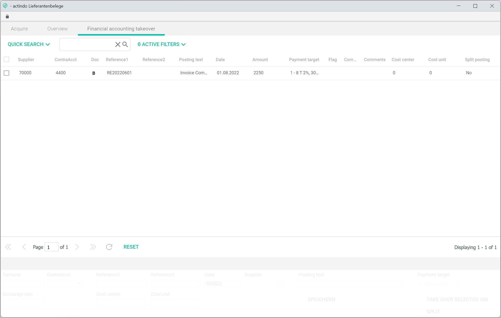

[!!Documents](RetailSuiteDocorg)  
[!!Einkauf](RetailSuiteSourcing)   
[!!Zahlungsabwicklung](RetailSuiteBanking)  
[!!User Interface bookings](../UserInterface/01a_Bookings.md)  
[!!User Interface book receipts](../UserInterface/01f_BookReceipts.md)  
[!!User Interface supplier receipts](../UserInterface/01_Book.md#supplier-receipts)  
[!!User Interface debtors/creditors](../UserInterface/02a_DebtorsCreditors.md)    

# Manage receipts

Receipts are used to document all transactions and, therefore, play an indispensable role for a correct accounting. There are many different types of receipts, such as invoice, order confirmation, or credit note, among others.

The *Accounting* module offers three possible ways to manage and assign receipts to bookings:

- Click the [ASSIGN RECEIPT] button in the *POSTINGS* tab to assign a receipt to an existing posting in the postings list, see [Retrieve a receipt](#retrieve-a-receipt).
- Access the *POST RECEIPTS* tab to assign a receipt available as a PDF and create a posting manually, see [Post a receipt](#post-a-receipt).
- Click the *Supplier receipts* menu entry in the *EDIT* context menu to specifically assign a supplier receipt, see [Post a supplier receipt](#post-a-supplier-receipt)

> [Info] *Supplier receipts* is a special feature that interacts with the *Purchasing* and *Payment processing* modules, and therefore the appropriate settings must be configured first.

When a receipt is booked in the *BOOK RECEIPTS* tab, it is linked to the assigned booking. A  icon will be then displayed next to the booking in the bookings list. When clicking the  icon, the corresponding receipt is displayed.

[comment]: <> (Work in progress!)

## Retrieve a receipt

You can retrieve and assign a receipt that has not yet been registered to an existing posting. Any unregistered receipts uploaded in the system are displayed in the *POST RECEIPTS* tab.  

After being uploaded, the receipts are stored in the *New documents* folder in the *Documents* module. Once they are booked, they are moved automatically into the *Registered documents* folder and then placed in the appropriate subfolder according to the following structure:

- 10000-69999 personal account numbers in case of a debtors'/customers' document
- 70000-79999 personal account numbers in case of a creditors'/suppliers' document

#### Prerequisites

- The accounting is configured via the configuration wizard, see [Run the accounting wizard](../Integration/01_RunAccountingWizard.md).
- A fiscal year has been selected, see [Select fiscal year](./01_SelectFiscalYear.md).
- A manual booking is created, see [Create a manual booking](./04_CreateManualBooking.md).
- A receipt is uploaded in PDF format in the *Documents* module.

#### Procedure

*Accounting > Select fiscal year > Book > Tab BOOKINGS*

1. Select the booking to be assigned a receipt from the bookings list in the *BOOKINGS* tab.  
The existing booking details are displayed in the input line fields.

2. Click the [ASSIGN RECEIPT] button.  
The *Attach Document* window is displayed.

  

3. Select the document to be assigned to the booking from the *New documents* folder.

  

4. Click the [SELECT DOCUMENT] button.  
The selected document has been assigned to the posting. The *Attach Document* window is closed. The  icon (=Beleg, EN: receipt) is displayed next to the posting in the postings list.

  

  > [Info] Click the  icon to display the corresponding receipt.

5. If the receipt assignment needs to be undone due to a mistake, click the [CANCEL ASSIGNMENT] button.

  

## Book a receipt

External receipts uploaded to the system and not yet registered can be assigned manually in the *Accounting* module. For example, suppliers' invoices can be uploaded as a PDF in the *Documents* module, which will be recognized by the system and displayed in the *BOOK RECEIPTS* tab.

#### Prerequisites

- The accounting is configured via the configuration wizard, see [Run the accounting wizard](../Integration/01_RunAccountingWizard.md).
- A fiscal year is selected, see [Select fiscal year](./01_SelectFiscalYear.md).
- A receipt is uploaded in PDF format in the *Documents* module.

#### Procedure

*Accounting > Select fiscal year > Book > Tab BOOK RECEIPTS*

  > [Info] The external receipts uploaded in the *New documents* folder in the *Documents* module are displayed here. If there are no receipts to be booked, the message *No documents left to be registered* is displayed when clicking the *BOOK RECEIPTS* tab.

  

1. If necessary, click the *Currency code* drop-down list and select the appropriate currency for the posting. All available currencies are displayed in the list. By default, the base currency is preselected.

  > [Info] Currency exchange rate can also be adjusted if needed in the *Rate* field.

2. Enter the total invoice value in the *Turnover* field.

3. Enter an account number in the *Contra Account* field.

4. Enter the date for the manual booking in the *Date* field. Date format must be DDMMYY or DD.MM.YY.

5. Enter the creditor (supplier) account number in the *Account* field.

  > [Info] Note that the fields *Contra Account*, *Date*,  *Account* must be filled out to be able to book a receipt.

6. Enter any other relevant booking information in the corresponding fields.

  > [Info] Even though it is not compulsory, it is highly recommended to fill in the *Receipt 1* field, as the system identifies and groups together any subsequent bookings taking this field as reference.

  

7. Click the [BOOK] button.  
The manual posting is created and linked to the selected receipt. The notice "Document assigned." is displayed above the input line. The new posting is displayed in the postings list in the *POSTINGS* tab. The  icon (=Beleg, EN: receipt) is displayed next to the posting in the postings list.

  

  > [Info] If there are further unregistered documents, they will be displayed in the *BOOK RECEIPTS* tab. Otherwise, the notice "No documents left to be registered" is displayed.

## Book a supplier receipt

In addition to the posting process and assignment of general receipts, there is an enhanced function to specifically post supplier receipts.

Suppliers' invoices can be uploaded as a PDF in the *New supplier receipts* folder in the *Documents* module, which will be recognized by the system and displayed in the *Acquire* tab in the *Supplier receipts* window. Once the supplier receipts are posted, they are moved automatically into the *Acquired documents* folder.

 Moreover, this function interacts with the *Purchasing* and *Payment processing* modules, and allows to check supplier receipts before booking them in the system and to automatize payment conditions.

[comment]: <> (ACQUIRE probably "enter" -ERFASSEN- or "park" -vorerfassen", SAP Terminology)

#### Prerequisites

- The accounting is configured via the configuration wizard, see [Run the accounting wizard](../Integration/01_RunAccountingWizard.md).
- A fiscal year is selected, see [Select fiscal year](./01_SelectFiscalYear.md).
- The appropriate plug-in is installed (Checking of supplier receipts + payment proposal list).
- The corresponding folder is created in the *Documents* module.
- Supplier receipts are uploaded in the *New supplier receipts* folder.

#### Procedure

*Accounting > Select fiscal year > Book > Tab BOOKINGS > Context menu EDIT > Menu entry Supplier receipts*

1.  Click the *Supplier receipt* menu entry.  
The *Supplier receipts* window is displayed. The external receipts uploaded in the *New supplier receipts* folder in the *Documents* module are displayed in the *Acquire* tab.

    

    > [Info] If there are no receipts to be booked, the message *No documents left to be registered* is displayed.

  [comment]: <> (They do not appear in Acquire if located in New supplier receipts folder, but in the New documents. Check why/if correct/if it is a bug?)

2. Enter the total invoice value in the *Turnover* field.

  > [Info] Currency exchange rate can also be adjusted if needed in the *Exchange rate* field.

3. Enter the corresponding booking details in the *ContraAcct* and *Supplier* fields.

4. Enter the date for the manual booking in the *Date* field. Date format must be DDMMYY or DD.MM.YY.

5. Enter a description account number in the *Posting text* field.

  > [Info] Note that the fields *ContraAcct*, *Date*,  *Supplier* and *Posting text* must be filled out to be able to acquire a receipt.

6. Enter any other relevant booking information in the corresponding fields.

  > [Info] Even though it is not compulsory, it is highly recommended to fill in the *Reference1* field, as the system identifies and groups together any subsequent bookings taking this field as reference.

7. Select the appropriate payment target for the receipt in the *Payment target* drop-down list.

  

8. A split booking can also be performed with the [SPLIT] button, if necessary. For detailed information, see [Split a booking](./09_SplitBooking.md).

9. Click the [ACQUIRE] button.  
The supplier receipt has been acquired and is displayed in the *Overview* tab.  

  

  > [Info] To be able to enter the supplier receipt in the system, they need to be released in the *Purchasing* module first. For detailed information, see [Check supplier receipts](#to-be-completed). Once they have been released in the *Purchasing* module, the status changes to **released** (colour yellow-green) in the *Status* column.

11. Click the *Financial accounting takeover* tab and select the receipt to be entered in the system.

  > [Info] When selecting a receipt, the receipt data are displayed in the entry line. Some changes can still be made here before takeover and saved with the [SAVE] button.

 Double check all booking details and, if no further changes are needed, click the [TAKE OVER SELECTED ONES] button.   
 The receipt is now registered in the *Accounting* module. The booking is displayed in the bookings list. An open item for the corresponding supplier (creditor) is created.

  
