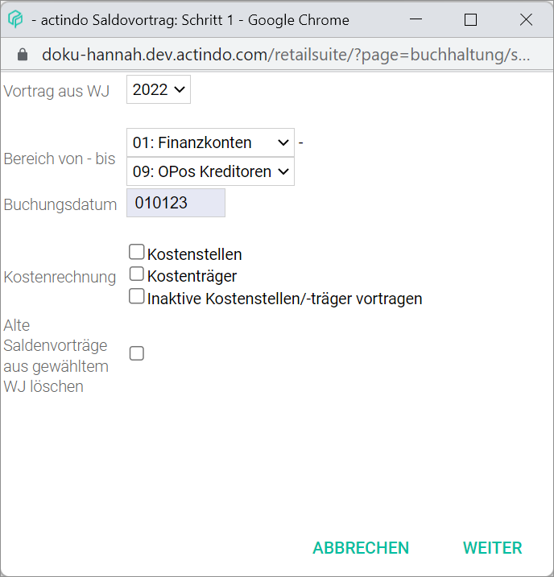

[!!User Interface Balance carried forward](../UserInterface/01_Book.md#balance-carried-forward)  
[!!User Interface Settings Balance carried forward](../UserInterface/02h_BalanceCarriedForward.md)  

# Create a balance carried forward

At the turn of the fiscal year, any outstanding balances must be carried forward to the next one. Closing balances will then be transferred as opening balances into the new fiscal year.

By using the balance carry forward, outstanding account balances and open items can be transferred from one fiscal year to the next. This is possible for both personal accounts (debtors and creditors) and impersonal accounts (for example bank or tax accounts).

Special journals are preconfigured in the system to carry balances and open items forward. For example, journal 98 contains all balances carried forward for debtors open items. These settings can be completely customized. For detailed information, see [User Interface Settings balance carried forward](../UserInterface/02h_BalanceCarriedForward.md).

#### Prerequisites

- A fiscal year has been selected, see [Select fiscal year](./01_SelectFiscalYear.md).
- A new fiscal year has been created, see [Create a fiscal year](../Integration04_ManageFiscalYear.md#create-a-fiscal-year).
- The balance carried forward function is configured, see [User Interface Settings Balance carried forward](../UserInterface/02h_BalanceCarriedForward.md).

#### Procedure

*Accounting > Book > Tab BOOKINGS*

1. Click the [EDIT] button in the header above the postings list.  
A context menu is displayed.

  

2. Click the *Balance carried forward...* menu entry in the context menu.     
  The *Balance carried forward: step 1* window is displayed.

  

  

[comment]: <> (Prüfen, woher/warum die Unterschiede. Zweites Bild offenbar bei EB-Werten angezeigt. Weitere Info notwendig.)

3. Click the *Carry forward from FY* drop-down list and select the appropriate fiscal year. All available fiscal years prior to the currently selected fiscal year are displayed in the list.

4. Click the *Range from - to* drop-down lists and select the account classes to be carried forward. The account classes as preconfigured in the *BALANCE CARRIED FORWARD* tab are displayed.

5. If necessary, change the posting date in the *Posting date* field. By default, the first day of the next fiscal year is preselected.

6. If necessary, select the appropriate option(s) in the *Cost accounting* field.

[comment]: <> (Unsicher, wann das vorkommt.)

7. Select the *Delete old balances carried forward from selected FY* checkbox if necessary.

[comment]: <> (Was genau passiert dann? Wird empfohlen, das zu machen? Oder könnte das Probleme geben, weil Daten gelöscht werden? Weitere Info notwendig.)

8. Click the [CONTINUE] button.  
The *Retrieve account balances* window is displayed.

  

[comment]: <> (Neues Screenshot mit Kostenrechnung?)

9. Select the account balances to be carried forward in the *Accounts* field.

  > [Info] To select multiple items, press and hold the **Ctrl** key while clicking with the mouse the corresponding accounts balances.

10. Click the [CONTINUE] button.  
The *Carry balances forward* window is displayed. The pop-up window *Balance carried forward completed* is displayed. The selected balances have been carried forward.

11. Click the [CLOSE] button.  
The *Carry balances forward* window is closed.
