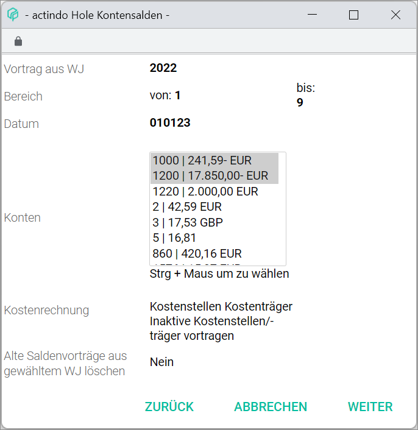

[!!User Interface balance carried forward](../UserInterface/01_Book.md#balance-carried-forward)  
[!!User Interface settings balance carried forward](../UserInterface/02h_BalanceCarriedForward.md)  

# Create a balance carried forward

At the turn of the fiscal year, any outstanding balances must be carried forward to the next one. Closing balances will then be transferred as opening balances into the new fiscal year.

By using the balance carry forward, outstanding account balances and open items can be transferred from one fiscal year to the next. This is possible for both personal accounts (debtors and creditors) and impersonal accounts (for example bank or tax accounts).

Special journals are preconfigured in the system to carry balances and open items forward. For example, journal 98 contains all balances carried forward for debtors open items. These settings can be completely customized. For detailed information, see [User Interface settings balance carried forward](../UserInterface/02h_BalanceCarriedForward.md).

#### Prerequisites

- The accounting is configured via the configuration wizard, see [Run the accounting wizard](../Integration/01_RunAccountingWizard.md).
- A new valid fiscal years is created, see [Create a fiscal year](../Integration04_ManageFiscalYear.md#create-a-fiscal-year).
- A fiscal year is selected, see [Select fiscal year](./01_SelectFiscalYear.md).
- The balance carried forward function is configured, see [User Interface settings balance carried forward](../UserInterface/02h_BalanceCarriedForward.md).

#### Procedure

*Accounting > Select fiscal year > Book > Tab BOOKINGS > Context menu EDIT > Menu entry Balance carried forward*

1. Click the *Balance carried forward* menu entry.  
The *Balance carried forward: step 1* window is displayed.

  

3. Click the *Carry forward from FY* drop-down list and select the appropriate fiscal year. All available fiscal years prior to the currently selected fiscal year are displayed in the list.

3. Select the accounts to be carried forward from the *Range from - to* drop-down lists.

5. If necessary, change the booking date. By default, the first day of the currently selected fiscal year is preset. 

5. Select the *Delete old balances carried forward from selected FY* checkbox if necessary.

6. Click the [CONTINUE] button.  
The *Retrieve account balances* window is displayed.

  

7. Select the account balances to be carried forward in the *Accounts* field.

  > [Info] To select multiple items, press and hold the **Ctrl** key while clicking with the mouse the corresponding accounts balances.

8. Click the [CONTINUE] button.  
A message confirms that the balance is carried forward. The window closes automatically.
