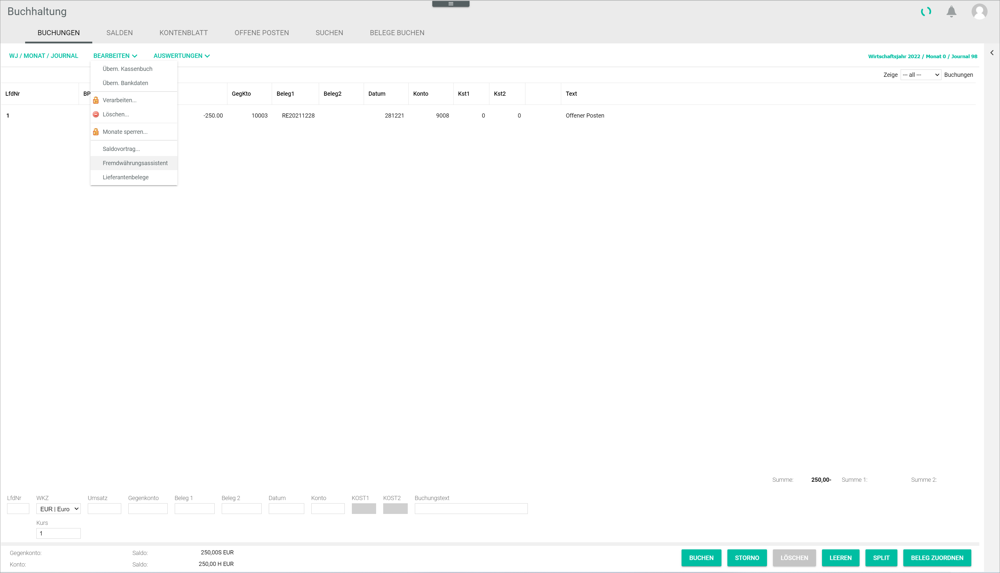
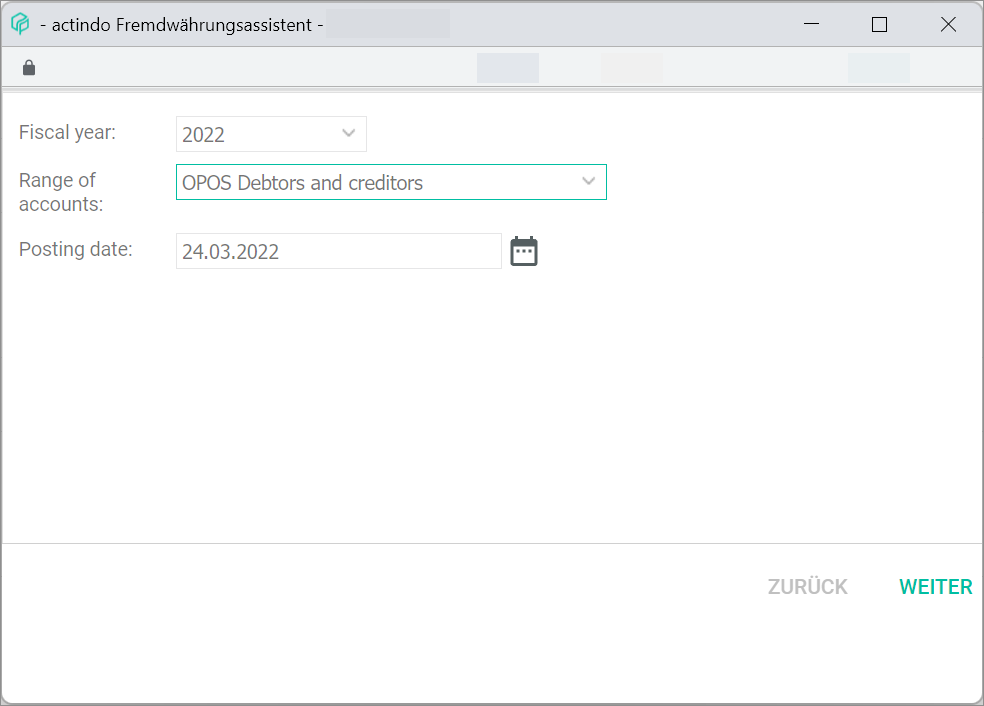
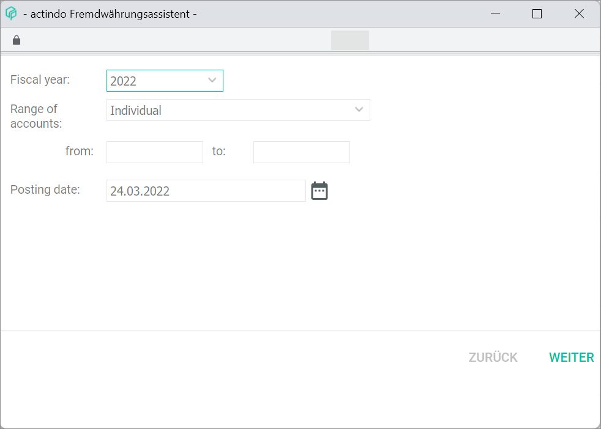
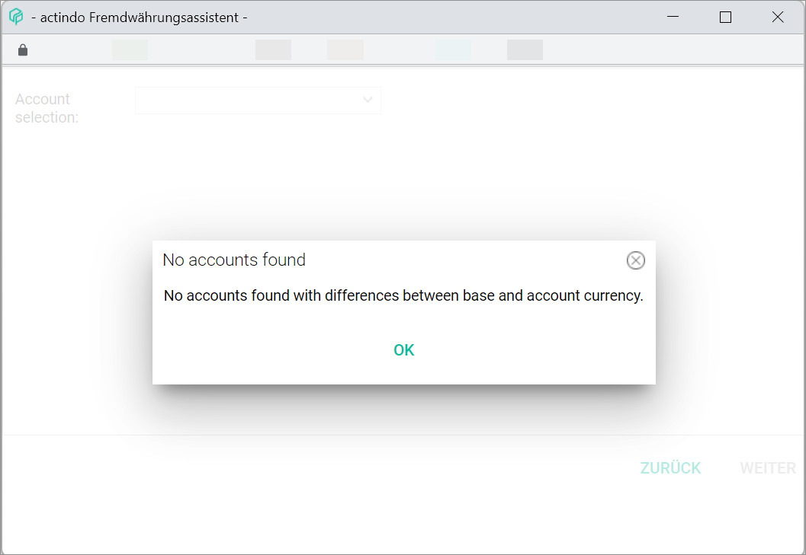
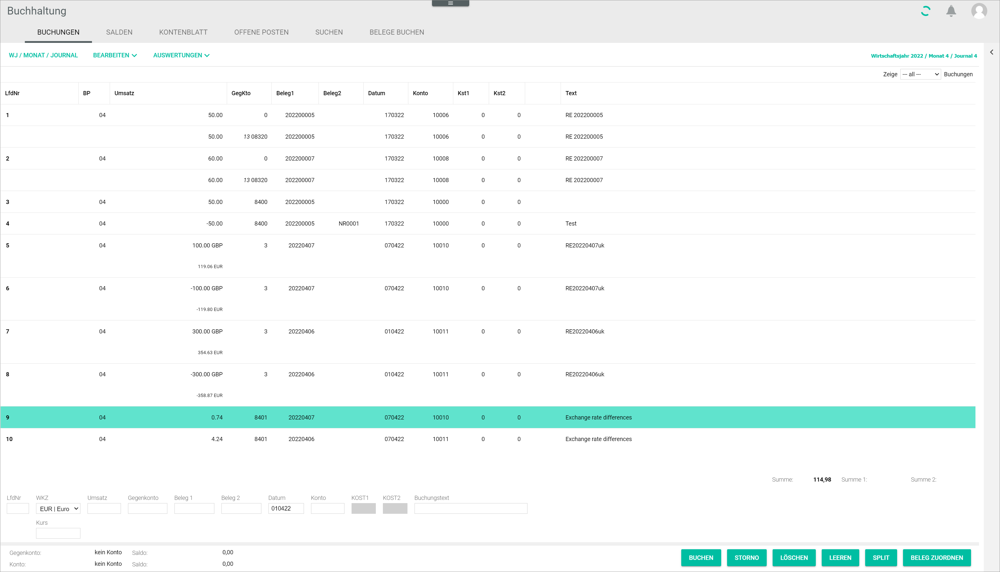

[!!User Interface foreign currency wizard](../UserInterface/01_Book.md#foreign-currency-wizard)  
[!!User Interface accounts](../UserInterface/02b_Accounts.md)  
[!!Manage accounts](../Integration/03_ManageAccounts.md)

# Book exchange rate fluctuations

Companies issuing invoices in a foreign currency, for example GBP, can also manage these invoices in the *Accounting* module. For this purpose, the corresponding accounts must be set up in the foreign currency. For detailed information, see [Create an account](../Integration/03_ManageAccounts.md#create-an-account).

However, the *Accounting* module can only work with the base currency configured in the system. Due to currency exchange rate fluctuations, there can be a difference between the converted amount booked at the time of ordering (open item) and the amount booked at the time of payment.  

 To counteract these fluctuations, the system retrieves once a day the current foreign currency exchange rates as published by the ECB and applies them automatically, therefore always working with the most up-to-date information.

 The *Foreign currency wizard* menu entry of the *EDIT* context menu in the *BOOKINGS* tab allows to book this difference automatically.

#### Prerequisites

- The accounting is configured via the configuration wizard, see [Run the Accounting Wizard](../Integration/01_RunAccountingWizard.md).
- A fiscal year is selected, see [Select fiscal year](./01_SelectFiscalYear.md).
- The corresponding accounts are set up in the foreign currency, see [Manage accounts](../Integration/03_ManageAccounts.md).
- The corresponding revenues and expenses accounts to book exchange rate differences are set up in the base currency, see [Create an account](../Integration/03_ManageAccounts.md#create-an-account).

#### Procedure

*Accounting > Select fiscal year > Book > Tab BOOKINGS > Context menu EDIT > Menu entry Foreign currency wizard*

1. Click the *Foreign currency wizard* menu entry.  
The *Foreign currency wizard* window is displayed.

  

2. Select the appropriate fiscal year in the *Fiscal year* field.

3. Select the applicable accounts in the *Range of accounts* drop-down list.

  > [Info] Select the *Individual* option to enter a self-defined account number range.

  

4. Enter the corresponding date in the *Booking date* field.

  > [Info] You can type in the booking date or use the  icon.

  [comment]: <> (In the screenshot "Posting date")

5. Click the [CONTINUE] button.  
The *Account selection* drop-down list is displayed.

  

  > [Info] The system checks the relevant accounts within the selected range and fiscal year. If no accounts are find, the following message is displayed:

  

6. Select the applicable account(s) in the *Account selection* drop-down list.  

7. Click the [CONTINUE] button.   
A pop-up window confirms that the exchange rate difference has been successfully booked. The existing exchange rate differences are booked automatically in the corresponding revenues or expenses accounts and are displayed as new bookings in the bookings list.

  

  > [Info] It may be necessary to refresh the page to see the new bookings displayed in the *BOOKINGS* tab.
