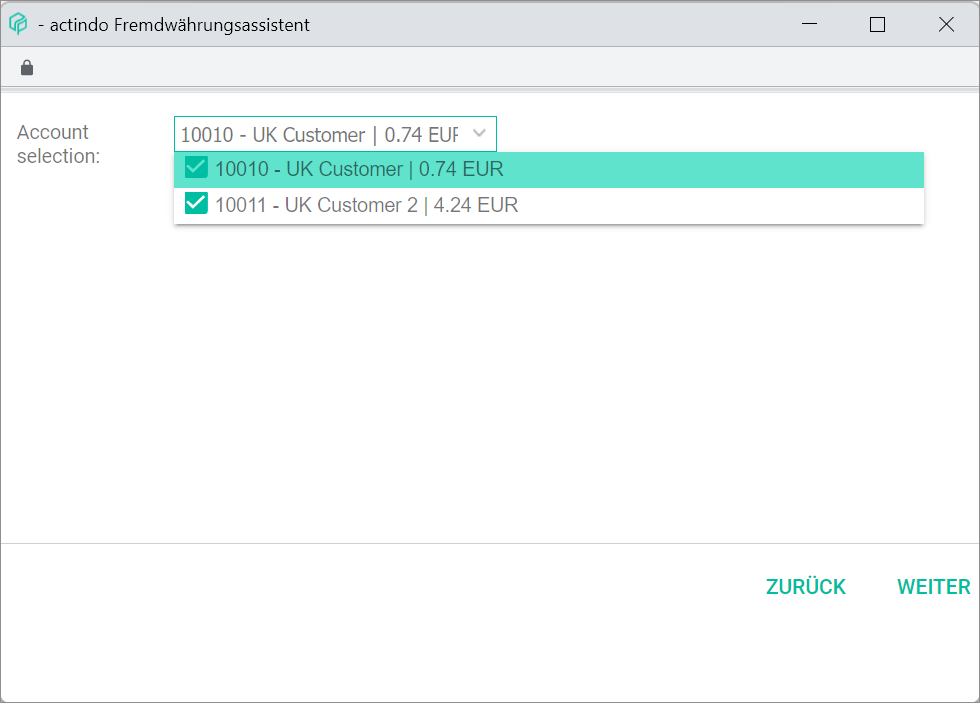

[!!User Interface Foreign currency wizard](../UserInterface/01_Book.md#foreign-currency-wizard)  
[!!User Interface Accounts](../UserInterface/02b_Accounts.md)  
[!!Manage accounts](../Integration/03_ManageAccounts.md)

# Book exchange rate fluctuations

Companies issuing invoices in a foreign currency, for example GBP, can also manage these invoices in the *Accounting* module. For this purpose, the corresponding accounts must be set up in the foreign currency. For detailed information, see [Create an account](../Integration/03_ManageAccounts.md#create-an-account).

The *Accounting* module only works with the base currency configured in the system. Due to currency exchange rate fluctuations, there can be a difference between the converted amount posted at the time of ordering (open item) and the amount posted at the time of payment. To counteract these fluctuations, the system retrieves once a day the current foreign currency exchange rates as published by the ECB and applies them automatically, so that it always works with the most up-to-date information. The *Foreign currency wizard* allows to post this difference automatically.

#### Prerequisites

- A fiscal year has been selected, see [Select fiscal year](./01_SelectFiscalYear.md).
- The corresponding personal account is set up in the foreign currency, see [Manage accounts](../Integration/03_ManageAccounts.md).
- The corresponding revenues and expenses accounts to book exchange rate differences are set up in the base currency, see [Create an account](../Integration/03_ManageAccounts.md#create-an-account).

[comment]: <> (Wird das in dem Kapitel beschrieben? Oder muss das noch ergänzt werden? -> Konten 2150 - Aufw. aus Kursdifferenzen und 2660 - Erträge aus Kursdifferenzen sind standardmäßig verfügbar, evtl. prüfen, ob Funktion auch aktiv ist. Man könnte evtl. eine Prozedur in diesem Kapitel dazu hinzufügen, da es nicht so deutlich ist. Oder wenn nicht standardmäßig verfügbar, müssen diese Konten erstellt werden, damit die Kursdifferenzen gebucht werden können. Auch noch extra account als Erlöskonto zu UK Drittland, oder zum relevanten Land. Stimmt es so?)

#### Procedure

*Accounting > Select fiscal year > Book > Tab POSTINGS*

1. Click the [EDIT] button in the header above the postings list.  
A context menu is displayed.

  

2. Click the *Balance carried forward...* menu entry in the context menu.     
The *Foreign currency wizard* window is displayed.

  

3. Click the *Fiscal year* drop-down list and select the appropriate fiscal year. All available fiscal years are displayed in the list.

3. Click the *Range of accounts* drop-down list and select the applicable option. The following options are available:  

  - **Open items debtors and creditors**  
  Select this option to search for open items both in debtors and creditors accounts.
  - **Open items debtors**  
  Select this option to search for open items in debtors accounts only.
  - **Open items creditors**  
  Select this option to search for open items in creditors accounts only.
  - **Individual**  
  Select this option to enter a self-defined account number range. When selecting this option, the additional *From* and *To* fields are displayed.  

  

4. Click the  button and select the desired date.

[comment]: <> (Oder eher durchgängig "calendar widget"?)

  [comment]: <> (In the screenshot "Posting date")

5. Click the [CONTINUE] button.  
The *Account selection* drop-down list is displayed.

  

  > [Info] If no accounts within the selected range and fiscal year have been found, the *No accounts found* notice is displayed.

6. Click the *Account selection* drop-down list and select the checkboxes of the applicable accounts. All available accounts are displayed in the list.

7. Click the [CONTINUE] button.   
The *Successfully posted* pop-up window is displayed. The exchange rate differences have been posted in the corresponding revenues or expenses accounts and are displayed as new postings in the postings list.

[comment]: <> (Check name of pop-up window! Evtl. pop-up window screenshot hinzufügen.)

  

  > [Info] If the posting is not yet displayed in the list, click the  (Refresh) button to update the postings list in the *POSTINGS* tab.
