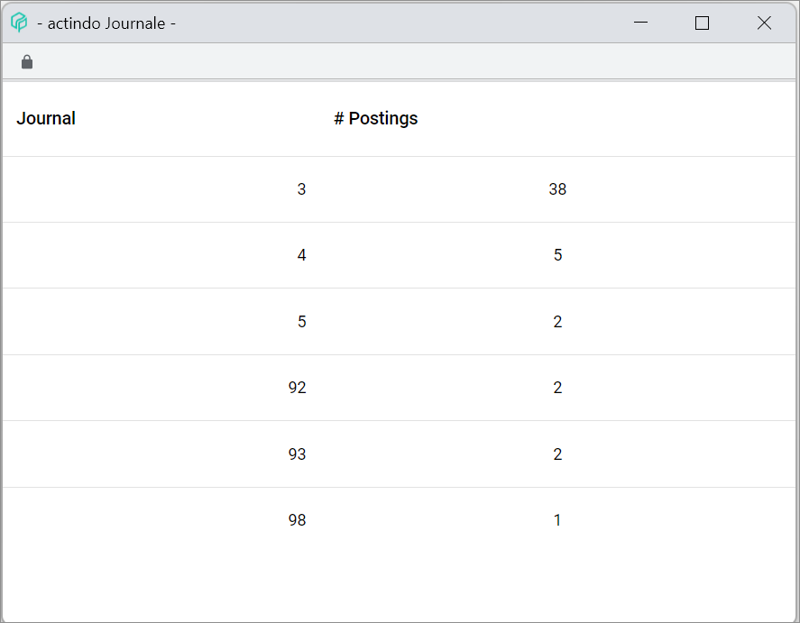

[!!User Interface Select fiscal year](../UserInterface/00a_FiscalYear.md)  
[!!User Interface Settings fiscal years](../UserInterface/02d_FiscalYears.md)  
[!!Select fiscal year](../Operation/01_SelectFiscalYear.md)  
[!!User Interface FY/MONTH/JOURNAL](../UserInterface/00_Book.md#fymonthjournal)   
[!!Manage the fiscal year](../Integration/04_ManageFiscalYear.md)  

# Access postings from another period

A fiscal year is the period over which a company's accounts are calculated, which generally lasts 12 months and which may or may not coincide with the calendar year.

Journal and months are used to arrange a company's business transactions within a fiscal year. An accounting period contains only the postings recorded in that specific period. Accessing postings from other periods may be necessary, for example, if a posting needs to be adjusted or if a transaction performed at a later stage must be manually posted in a specific period.

[comment]: <> (Verwendung von Posting period ist schwierig, denn Spalte BP -Buchungsperiode- zeigt meinstens den Monat an und nicht das Journal.)

A journal is a chronological record of all accounting transactions posted within a specified period of time. There are two main types of journals preconfigured in the system:

  - General journals (1-12) are paired with the corresponding fiscal year months, regardless of whether the fiscal year coincides with the calendar year or not. This means that all transactions posted automatically in the first month of the fiscal year will be found in journal 1, all transactions posted in the second month of the fiscal year in the journal 2, and so on. Therefore, when selecting  the accounting period to perform a manual posting, make sure that the selected month and journal match.

[comment]: <> (Eher: It is recommended to post transactions carried out in January in Journal 01, in February in Journal 02, ans so on.)

[comment]: <> (That means, the first fiscal year month corresponds to journal 1, the second to journal 2 and so on. Ich denke, das stimmt so nicht)

  - Special journals (90-99) are preconfigured in the system to post automatically open items and balances to be carried forward from a fiscal year to the next one.

Special months are also preconfigured in the system for special business transactions, such as balances carried forward or subsequent postings.

#### Prerequisites

- A valid fiscal year has been created, see [Create a fiscal year](../Integration/04_ManageFiscalYear.md#create-a-fiscal-year).
- A fiscal year has been selected, see [Select fiscal year](./01_SelectFiscalYear.md).

#### Procedure

*Accounting > Post > Tab POSTINGS*

1. Click the *FY/MONTH/JOURNAL* button.  
The *Select fiscal year* window is displayed.  

  

2.  Click the *Fiscal year* drop-down list and select a fiscal year.  
The *Period* date fields are filled in automatically.

3. Click the *Month* drop-down list and select a month. The selected month determines the posting period, this means, the period where the transaction is posted.  

  > [Info] Apart from the calendar months, special posting periods can also be selected to post balances carried forward, subsequent postings and closing postings. For detailed information, see [Select fiscal year](../UserInterface/00a_FiscalYear.md).

4. Enter a journal number in the *Journal* field. Alternatively, click the [LIST] button.  
The *Journals* window is displayed with the available journals and the postings contained in each of them.

  

  > [Info] Journals 1-12 are paired with the corresponding fiscal year months, regardless of whether the fiscal year coincides with the calendar year or not. This means that all transactions posted automatically in the first month of the fiscal year will be found in journal 1, all transactions posted in the second month of the fiscal year in the journal 2, and so on. Therefore, when selecting an accounting period to perform a manual posting, make sure that the selected month and journal match. Journals 90 to 99 are special journals preconfigured in the system to post automatically open items and balances to be carried forward from a fiscal year to the next one. The special journals settings can be edited and extended in the *BALANCES CARRIED FORWARD* tab in the *Settings* menu entry. For detailed information, see [Balance carried forward](../UserInterface/02h_BalanceCarriedForward.md). Further journals can be created if necessary.

[comment]: <> (Macht es hier Sinn, die Fixed bookings checkbox hinzuzufügen? Ich denke nicht.)

5. Click the [OK] button in the bottom right corner.   
  The postings registered in the selected posting period (fiscal year, month and journal) are displayed in the *POSTINGS* tab in the *Post* menu entry.  
