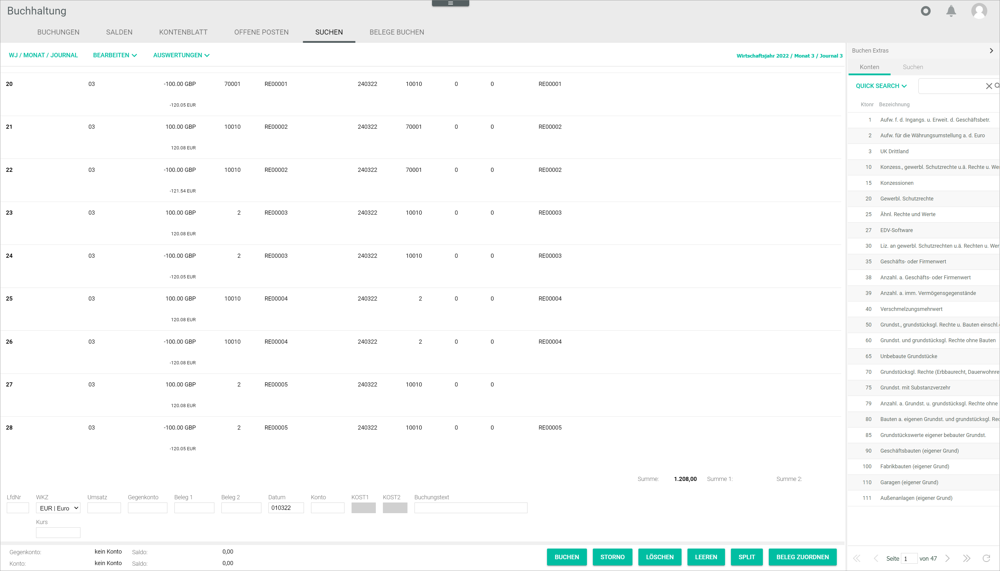
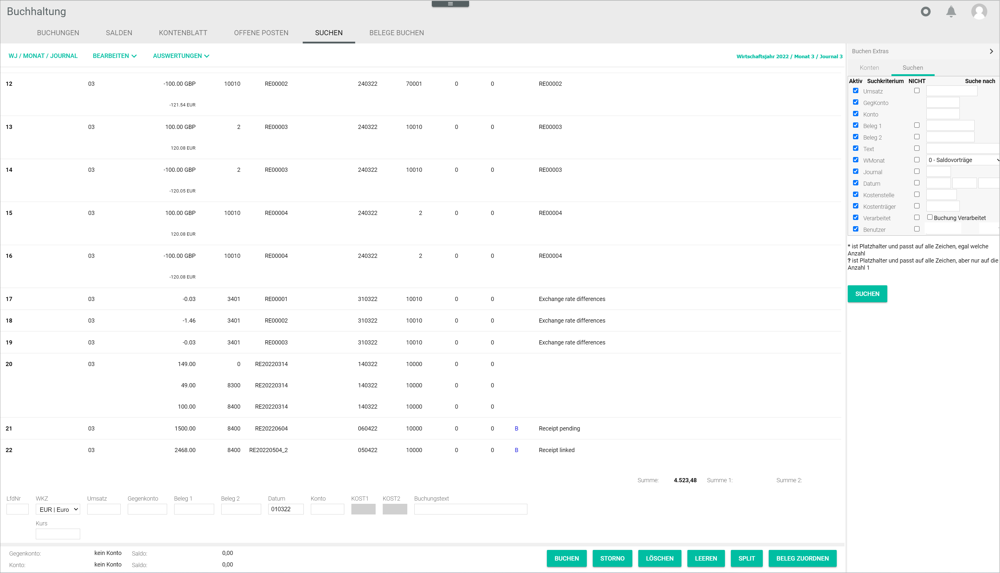
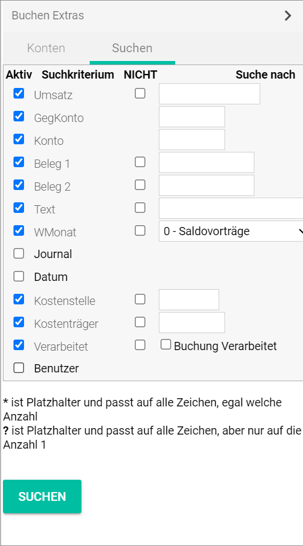

[!!Manage accounts](../Integration/03_ManageAccounts.md)
[!!User interface Postings](../UserInterface/01a_Bookings.md)
[!!User interface Search](../UserInterface/01e_Search.md)
[!!User interface Accounts](../UserInterface/02b_Accounts.md)  

# Search for accounting data

The extended search function in the *Accounting* module allows to search for a specific account or posting using different search criteria. This is useful to locate specific data for correction or checking purposes.

An account is an essential part of an accounting system used to track and summarize in chronological order all financial transactions (credits and debits) of the different business elements, such as assets, liabilities, income and expenses.

A posting is every entry recorded as credit or debit in the corresponding accounts.

## Search for an account

An account can be searched for by account number or by description.

#### Prerequisites

A fiscal year has been selected, see [Select fiscal year](./01_SelectFiscalYear.md).

#### Procedure

*Accounting > Post > Tab SEARCH > Tab Accounts*
*Accounting > Post > Side bar button Leftward arrow > Tab Accounts*

> [Info] The *Post extras* side bar can be displayed at any time and in any tab of the *Post* menu entry by clicking the  (Leftward arrow) button or hidden by clicking the  (Rightward arrow) button.

1. Click the *QUICK SEARCH* button.  
    A filter list with the *Acc. no.* and *Description* entries is displayed.

    

2.  If necessary, deselect the checkbox of the *Acc. no.* or *Description* entry to apply the search only to field of the selected option. By default, both options are selected and the all accounts containing the search text in either the *Acc.no.* or the *Description* field will be displayed in the search results.

3. Enter the search text (account number or description) in the search bar and press the **Enter** key or click the  (Search) button. You can enter any search text, even a partial account number or description.     
    All accounts containing the search text entered in the search bar are displayed in the search results.

4. Click the  icon to clear the search bar and start a new search.  

## Search for a posting

A posting can be searched for using different search criteria, such as turnover, account, journal, and the corresponding search values.

#### Prerequisites

A fiscal year has been selected, see [Select fiscal year](./01_SelectFiscalYear.md).

#### Procedure

*Accounting > Post > Tab SEARCH > Tab Search*
*Accounting > Post > Side bar button Leftward arrow > Tab Search*

> [Info] The *Post extras* side bar can be displayed at any time and in any tab of the *Post* menu entry by clicking the  (Leftward arrow) button or hidden by clicking the  (Rightward arrow) button.

1. In the *Active* column, select the checkbox of the desired search criterion you want to apply to your search. The following search criteria are available:  

    - *Turnover*  
    - *Contra account*  
    - *Account*  
    - *Receipt 1*  
    - *Receipt 2*  
    - *Text*  
    - *Month*  
    - *Journal*  
    - *Date*  
    - *Cost center*
    - *Cost object*  
    - *Processed*  
    - *User*  

    Depending on the selected criterion, checkboxes and a text fields are displayed in the *NOT* and *Search for* columns.       

    

2.  If necessary, select the checkbox in the *NOT* column to exclude the corresponding value from the search.

    > [Info] The checkbox in the *NOT* column is only available for certain search criteria.

3. Enter the search value in the text field in the *Search for* column. You can use the following placeholders when entering the search value:

    - An asterisk (*) represents any number of characters.
    - A question mark (?) represents a single character.

4. Click the [SEARCH] button.  
    All postings matching your search criteria are displayed in the workspace of the selected tab.

    > [Info] You need to switch the tab to hide the search results in the workspace.
