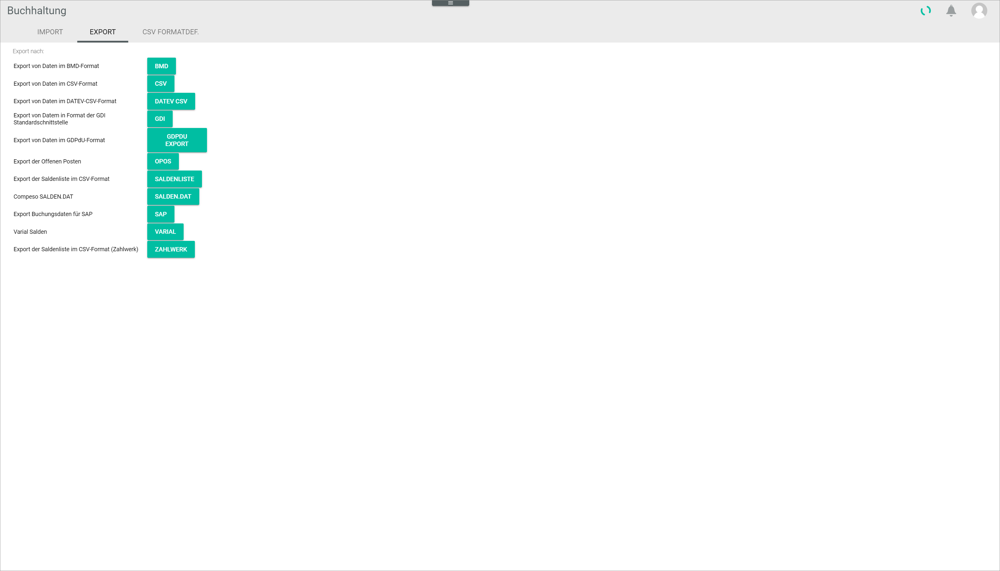
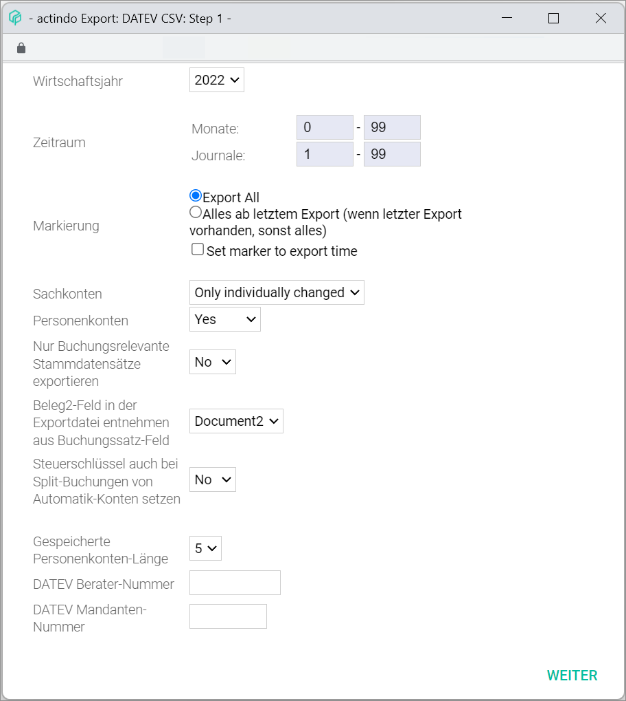
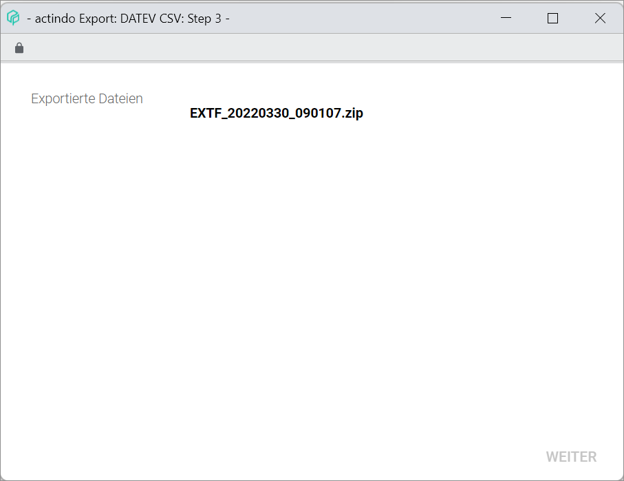
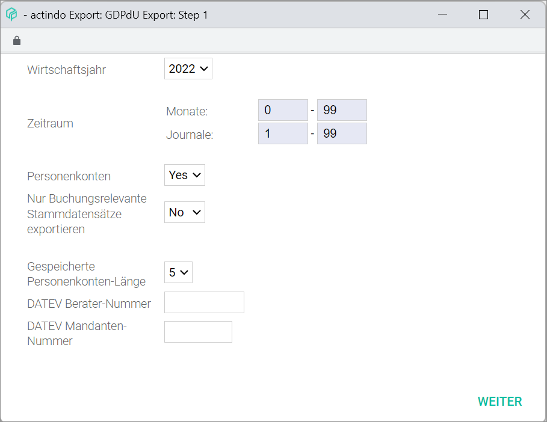
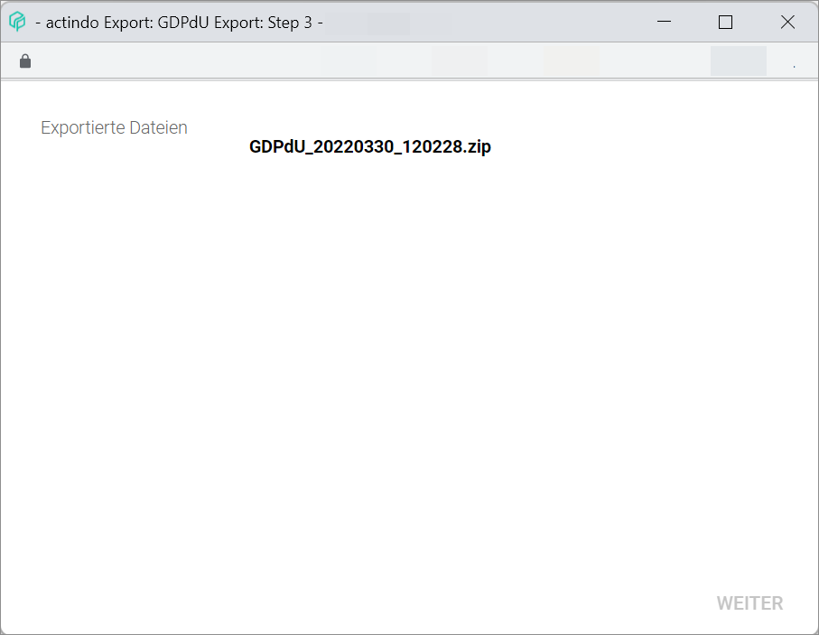
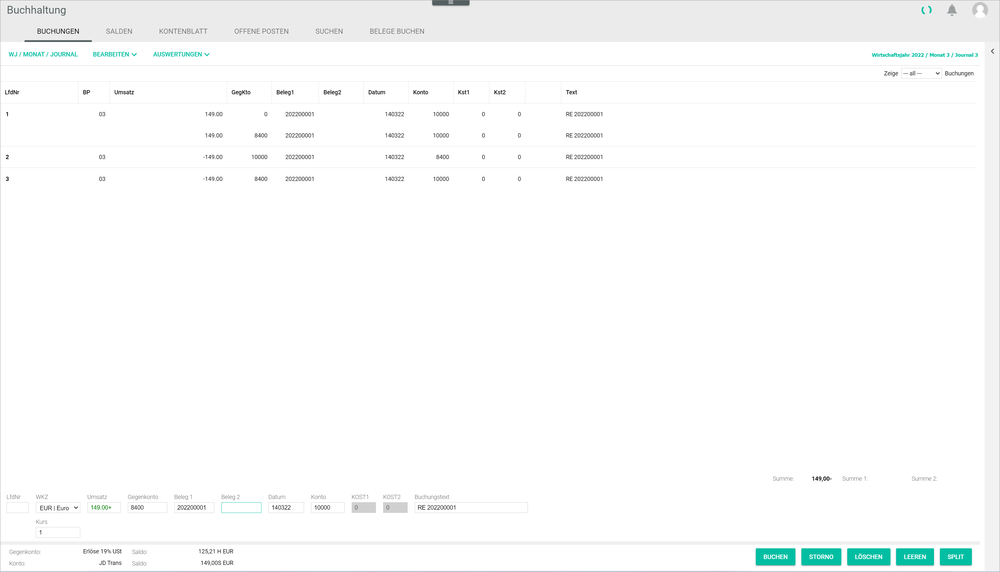
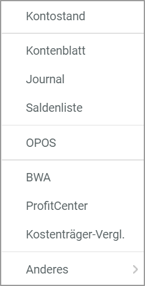
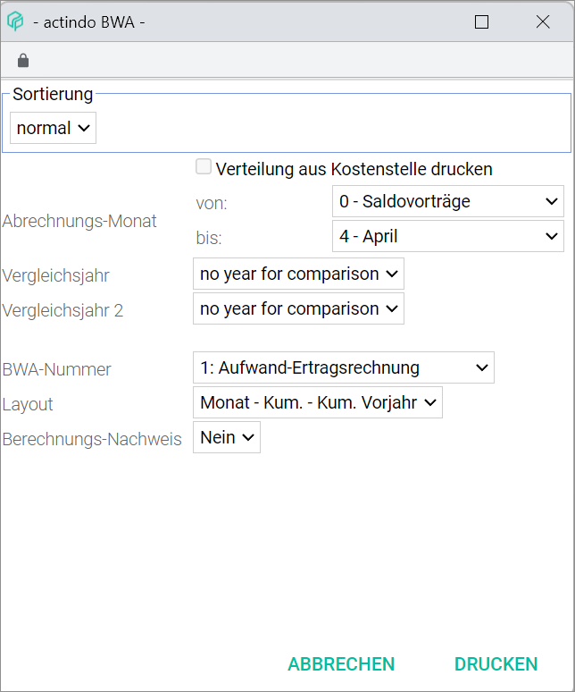
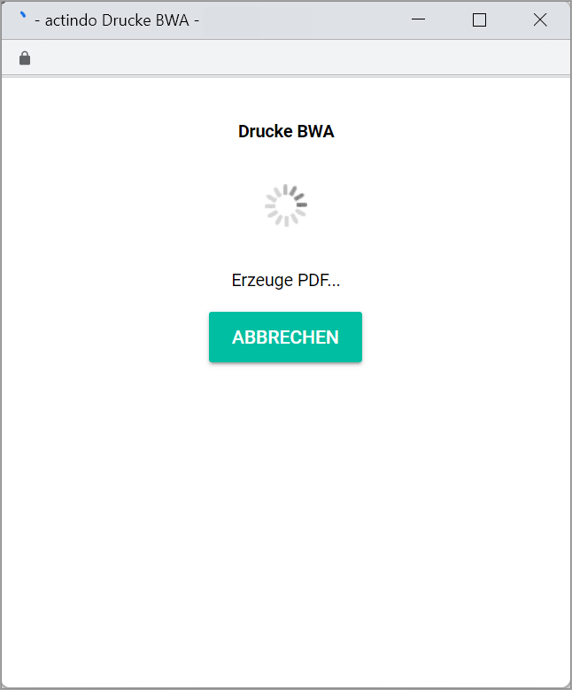

[!!User Interface Export DATEV CSV](../UserInterface/03b_Export.md#datev-csv)  
[!!User Interface GDPdU export](../UserInterface/03b_Export.md#gdpdu-export)  
[!!User Interface CVS format definition](../UserInterface/03c_CSVFormatDef.md)  
[!!User Interface BWA](../UserInterface/01_Book.md#bwa)  
[!!User Interface BWA assignment](../UserInterface/02i_BWAAssignment.md)  
[!!Manage the BWA reports](../Integration/07_ManageBWAReports.md)  

# Provide the accounting data

The *Accounting* module offers an export function to export data in different formats. The most widely used financial formats for accounting software are supported.

Exporting data may be necessary to perform an external audit, create a balance sheet or prepare the annual accounts. These tasks are usually performed at the end of a fiscal year. The system also includes a reporting functionality to create different report types and export them as a PDF.

## Export the data for DATEV

Accounting data can be exported into a DATEV CSV compatible file to be later imported in DATEV software for further processing.  

#### Prerequisites

A fiscal year has been selected, see [Select a fiscal year](./01_SelectFiscalYear.md).

#### Procedure

*Accounting > Extras > Tab EXPORT*

1. Click the [DATEV CSV] button.    
The *Export: DATEV CSV: Step 1* window is displayed.

  

2. Click the *Fiscal year* drop-down list and select the fiscal year to be exported. All available fiscal years are displayed in the list.

3. Enter the period of months and journals to be exported in the *Months* and *Journals* fields.

4. Select the appropriate radio button in the *Selection* field. The following option are available:

  - **Export all**  
  Select this option to export all data.
  - **All from last export on (if last export exists, otherwise all)**   
  Select this option to export all new data added after last export.

 If desired, select the *Set marker to export time* checkbox.

5. Click the *Impersonal accounts* drop-down list and select the appropriate option. The following options are available:

  - **Only individually changed**  
  Select this option to export only the impersonal accounts that have been individually changed.
  - **--- All ---**  
  Select this options to export all impersonal accounts.
  - **Custom**  
  Select this option to enter a user-defined account number or account range.
  - **No**  
    Select this option if you do not want to export impersonal accounts.

    > [Info] When selecting the **Custom** option, the *Custom* field to enter a custom account number or account number range and the *Export sub-postings* drop-down list to decide whether or not exporting the sub-postings are displayed.

6. Click the *Personal accounts* drop-down list and select the appropriate option. The following options are available:

    - **Yes**  
    Select this option to export all personal accounts.
    - **Custom**  
    Select this option to enter a user-defined account number or account range.
    - **No**  
    Select this option if you do not want to export the personal accounts.  

    > [Info] When selecting the **Custom** option, the *Custom* field to enter a custom account number or account number range.

7. Click the *Export only posting-relevant master data records* drop-down list and select the appropriate option. The following options are available:

  - **Yes**  
  Select this option to export only master data that are relevant for the selected postings.
  - **No**  
  Select this option to export all master data, regardless of their relevance for the selected postings.

8. Click the *Take Receipt 2 field in the export document from posting record field* drop-down list and select the appropriate option. The following options are available:  

  - **Document 1**
  - **Document 2**
  - **Document 3**
  - **Document 4**

9. Click the *Add tax keys also in split postings of automatic accounts* drop-down list and select the appropriate option. The following options are available:

  - **Yes**  
  Select this option to include the applicable tax key in split postings of automatic accounts.
  - **No**  
  Select this option not to include the applicable in split postings of automatic accounts.

10. If necessary, click the *Saved personal account length* drop-down list and select the appropriate option. By default, the personal account length preconfigured in the system is preselected.

  > [Info) It is important to select the appropriate length to make sure that the personal account numbers are exported in full length.

11. If necessary, enter the corresponding numbers in the *DATEV advisor number* and *DATEV client number* fields.

12. Click the [CONTINUE] button.  
The export has been started. The *Export: DATEV CSV: Step 2* window is displayed. An *Exporting* notice and a loading icon are displayed in the window. A confirmation window is displayed when the export has been finished.

  

13. Click the [OK] button in the confirmation window.  
  The confirmation window is closed. The *Export: DATEV CSV: Step 3* window is displayed. The exported file(s) are displayed as a zip file.

14. Click the zip file.  
The zip file has been downloaded.

  

  > [Info] By default, the downloaded export file is saved in the *Downloads* folder of your device.

## Export the data GDPdU-compliant

Accounting data can be exported into a GDPdU-compliant audit file format, a legal requirement for German companies on data access established by the German tax authorities.

#### Prerequisites

A fiscal year is selected, see [Select a fiscal year](./01_SelectFiscalYear.md).

#### Procedure

*Accounting > Extras > Tab EXPORT*

  

1. Click the [GDPdU EXPORT] button.    
The *Export: GDPdU Export: Step 1* window is displayed.

  

2. Click the *Fiscal year* drop-down list and select the fiscal year to be exported. All available fiscal years are displayed in the list.

3. Enter the period of months and journals to be exported in the *Months* and *Journals* fields.

4. Click the *Personal accounts* drop-down list and select the appropriate option. The following options are available:

  - **Yes**  
  Select this option to export the personal accounts.
  - **No**  
  Select this option if you do not want to export the personal accounts.

5. Click the *Export only posting-relevant master data records* drop-down list and select the appropriate option. The following options are available:

  - **Yes**  
  Select this option to export only master data that are relevant for the selected postings.
  - **No**  
  Select this option to export all master data, regardless of their relevance for the selected postings.

6. If necessary, click the *Saved personal account length* drop-down list and select the appropriate option. By default, the personal account length preconfigured in the system is preselected.

  > [Info) It is important to select the appropriate length to make sure that the personal account numbers are exported in full length.

7. If necessary, enter the corresponding numbers in the *DATEV advisor number* and *DATEV client number* fields.

8. Click the [CONTINUE] button.  
The export has been started. The *Export: GDPdU Export: Step 2* window is displayed. An *Exporting* notice and a loading icon are displayed in the window. A confirmation window is displayed when the export has been finished.

  

9. Click the [OK] button in the confirmation window.  
  The confirmation window is closed. The *Export: GDPdU Export: Step 3* window is displayed. The exported file(s) are displayed as a zip file.

  

10.  Click the zip file.  
The zip file has been downloaded.

  > [Info] By default, the downloaded export file is saved in the *Downloads* folder of your device.

## Create a PDF evaluation

Accounting data can be exported for business evaluation  purposes. The system offers a functionality to create and customize BWA reports. For detailed information, see [Manage reports](../Integration/07_ManageBWAReports.md).

You can access the PDF export of BWA evaluations from all tabs in the *Post* menu entry.

#### Prerequisites

A fiscal year has been selected, see [Select a fiscal year](./01_SelectFiscalYear.md).

#### Procedure

*Accounting > Post*

1. Click the [EVALUATIONS] button in the header.  
A context menu is displayed.  

  

2. Click the *BWA* menu entry.  
The window *BWA* is displayed.  

  

3. Click the *Sorting* drop-down list and select the appropriate option. The following options are available:

  - **Normal**  
  Select this option to include all available data in the BWA report.
  - **By cost centre**  
  Select this option to sort the data by cost center. When selecting this option, a second drop-down list is displayed containing all available cost centers.
  - **By cost unit**  
  Select this option to sort the data by cost unit. When selecting this option, a second drop-down list is displayed containing all available cost units.

4.  If necessary, select the *Print cost centre allocation* checkbox. The checkbox is only unlocked, if the options **By cost centre** or **By cost unit** are selected in the *Sorting* drop-down list.

5. Click the *Accounting month from - to* drop-down lists and select the months to be included. All available months are displayed in the list.

6. If applicable, click the *Comparison year* and *Comparison year 2* drop-down lists and select the fiscal years to be compared in the BWA report. All available fiscal years are displayed in the list. If you want no fiscal year to be compared, select the **No year for comparison** option.

7. Click the *BWA number* drop-down list and select the desired BWA report. All available BWA reports are displayed in the list.

8. Click the *Layout* drop-down list and select the desired layout option. The following options are available:

  - **Month - cum. - cum. prior year**
  - **13 months cumulative**
  - **Prior-year comparison**
  - **13 month with comparison**

9. Click the *Show account* drop-down list and select the appropriate option. The following options are available:

  - **No**
  - **Yes**

10. Click the [PRINT] button.  
The PDF creation has been started. The *Printing BWA* window is displayed. An *Printing BWA* notice and a loading icon are displayed in the window. When finished, the PDF file is displayed in the window.

  
