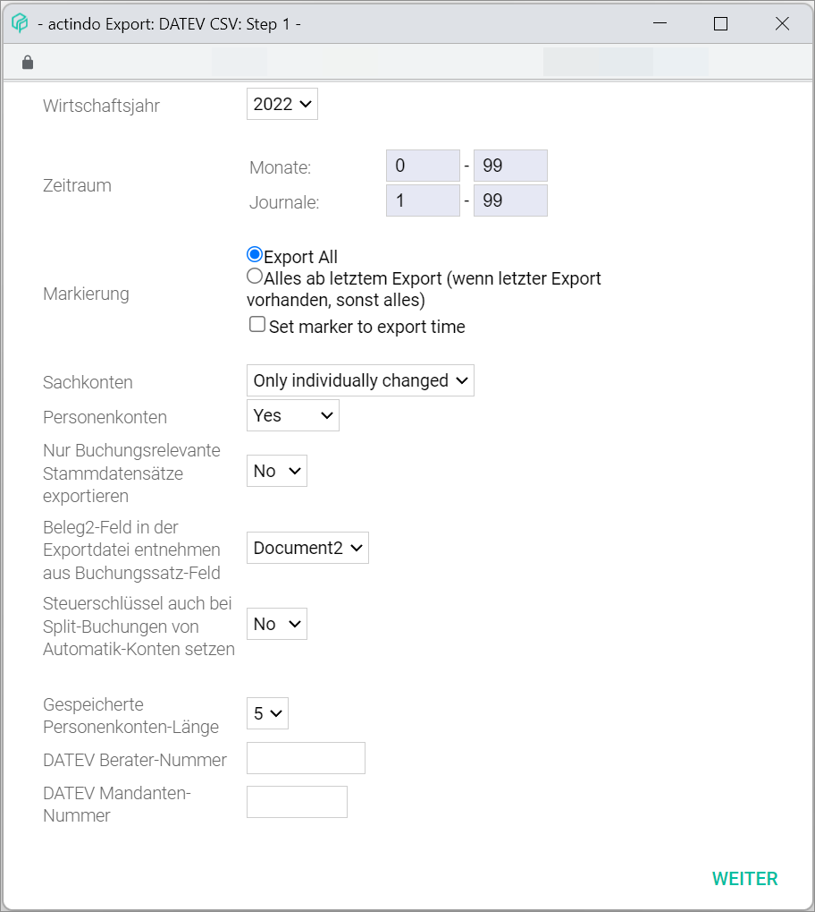
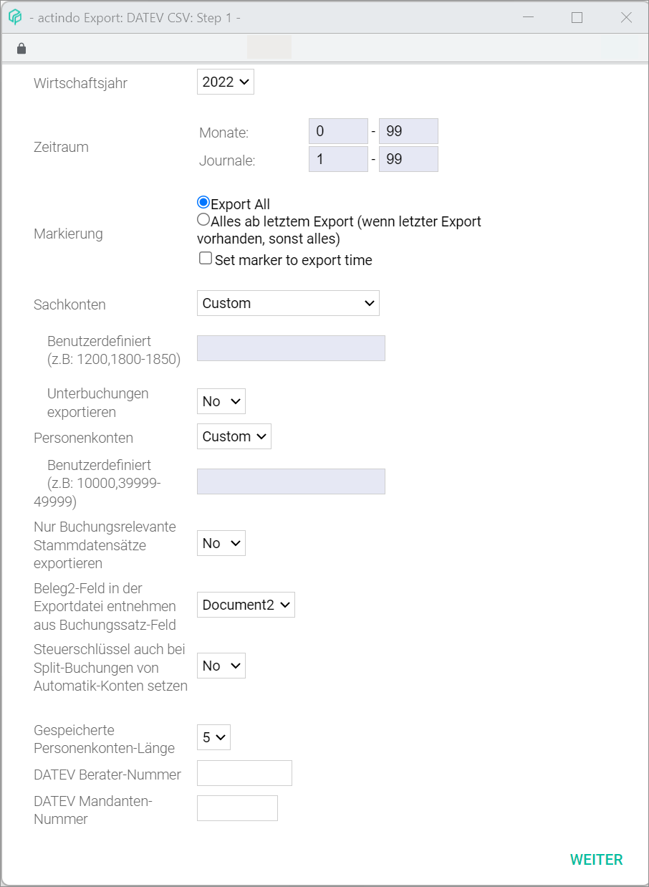
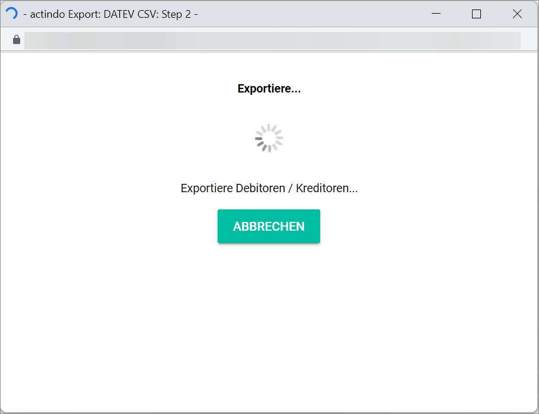
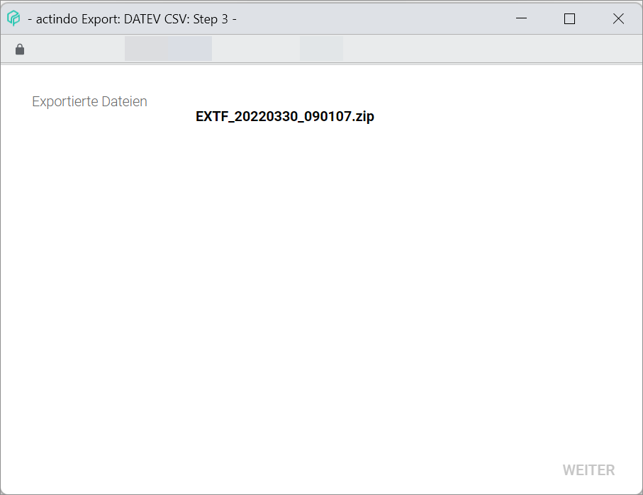
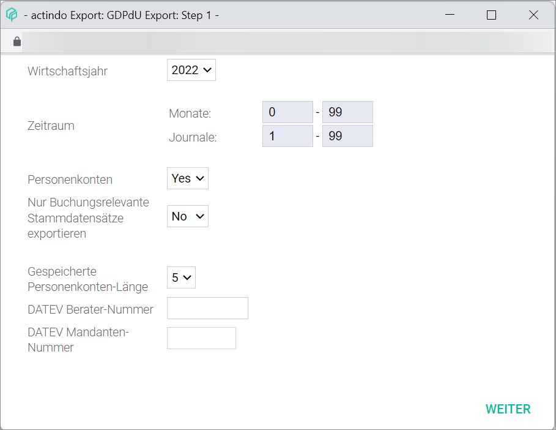
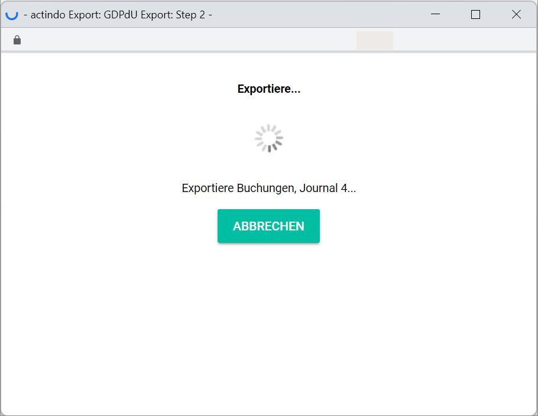
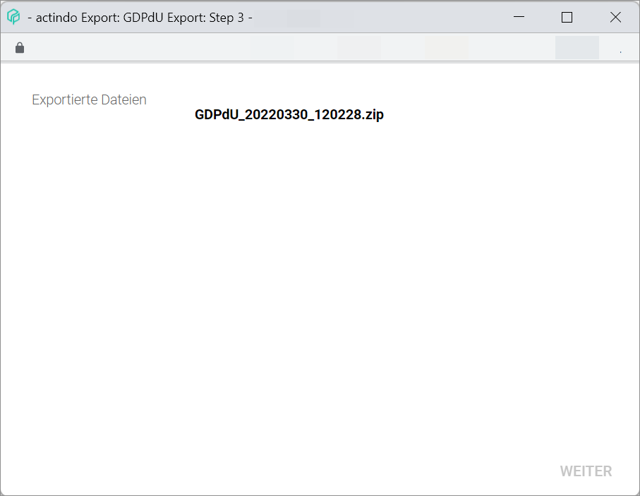
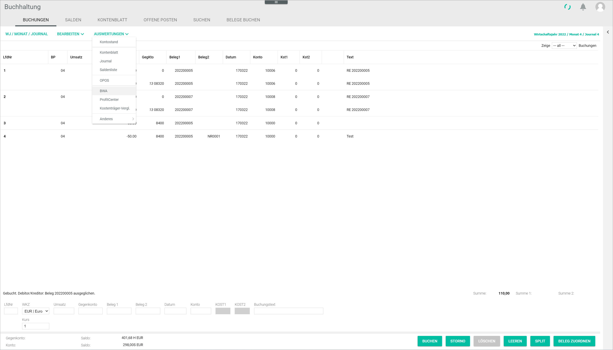
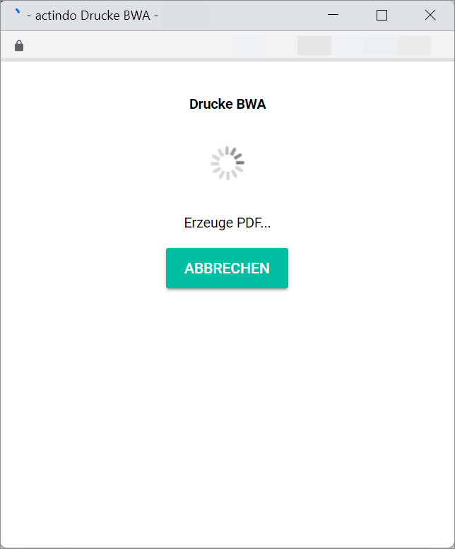

[!!User Interface export DATEV CSV](../UserInterface/03b_Export.md#datev-csv)  
[!!User Interface GDPdU export](../UserInterface/03b_Export.md#gdpdu-export)  
[!!User Interface CVS format definition](../UserInterface/03c_CSVFormatDef.md)  
[!!User Interface BWA](../UserInterface/01_Book.md#bwa)  
[!!User Interface BWA assignment](../UserInterface/02i_BWAAssignment.md)  
[!!Manage the BWA reports](../Integration/07_ManageBWAReports.md)  

# Provide the accounting data

The *Accounting* module offers an export function to export data in different formats. The most widely used financial formats for accounting software are supported.

Exporting data may be necessary to perform an external audit, create a balance sheet or prepare the annual accounts. These tasks are usually performed at the end of a fiscal year. The system also includes a reporting functionality to create different report types and export them in PDF format.

## Export the data for DATEV

Accounting data can be exported into a DATEV CSV compatible file to be later imported in DATEV software for further processing.  

#### Prerequisites

 - The accounting is configured via the configuration wizard, see [Run the accounting wizard](../Integration/01_RunAccountingWizard.md).
 - A fiscal year is selected, see [Select a fiscal year](./01_SelectFiscalYear.md).

#### Procedure

*Accounting > Select fiscal year > Extras > Tab EXPORT*

1. Click the [DATEV CSV] button.    
The *Export: DATEV CSV: Step 1* window is displayed.

  

2. Select the fiscal year to be exported in the *Fiscal year* drop-down list.

3. Enter the months and journals to be exported in the *Period* field.

4. Select the appropriate radio button (**Export all/All from last export on (if last export exists, otherwise all)**) in the *Selection* field. Mark the *Set marker to export time* checkbox, if necessary.

5. Select the appropriate options in the *Impersonal accounts* and *Personal accounts* drop-down lists.

  > [Info] When selecting the *Custom* option, additional fields are displayed to customized your export.

  

6. Select the appropriate option in the *Export only booking-relevant master data records* drop-down list.

7. Select the appropriate option in the *Take Receipt 2 field in the export document from booking record field* drop-down list.

  > [Info] Here it can be determined which value will be displayed in the *Receipt 2* field in the export file.

8. Select the appropriate option in the *Saved personal accounts length* drop-down list.

  > [Info] This field displays automatically the personal account length preconfigured in the system. This is used to make sure that the personal account numbers are exported in full length.

9. Enter the applicable information in the *DATEV advisor number* and *DATEV client number*, if necessary.

10. Click the [CONTINUE] button.  
A new window confirms the ongoing export process. When finished, a confirmation window is displayed.

  

11. Click the [OK] button.  
The confirmation window closes. A new window shows the exported file(s) as a zip file.

12. Click the zip file name.  
The zip file is downloaded in your computer.   

  

  > [Info] Per default, the downloaded export file is saved in the Downloads folder of your computer.

## Export the data GDPdU-compliant

Accounting data can be exported into a GDPdU-compliant audit file format, a legal requirement for German companies on data access established by the German tax authorities.

#### Prerequisites

  - The accounting is configured via the configuration wizard, see [Run the accounting wizard](../Integration/01_RunAccountingWizard.md).
  - A fiscal year is selected, see [Select a fiscal year](./01_SelectFiscalYear.md).

#### Procedure

*Accounting > Select fiscal year > Extras > Tab EXPORT*

  

1. Click the [GDPdU EXPORT] button.    
The *Export: GDPdU Export: Step 1* window is displayed.

  

2. Select the fiscal year to be exported in the *Fiscal year* drop-down list.

3. Enter the months and journals to be exported in the *Period* field.

4. Select the appropriate option in the *Personal accounts* drop-down list.

5. Select the appropriate option in the *Export only booking-relevant master data records* drop-down list.

6. Select the appropriate option in the *Saved personal accounts length* drop-down list.

  > [Info] This field displays automatically the personal account length preconfigured in the system. This is used to make sure that the personal account numbers are exported in full length.

7. Enter the applicable information in the *DATEV advisor number* and *DATEV client number*, if necessary.

8. Click the [CONTINUE] button.  
  A new window confirms the ongoing export process. When finished, a confirmation window is displayed.

  

9. Click the [OK] button.  
  The confirmation window closes. A new window shows the exported file(s) as a zip file.

  

## Create a PDF evaluation

Accounting data can be exported for business evaluation  purposes. The system offers a functionality to create and customize BWA reports. For detailed information, see [Manage reports](../Integration/07_ManageBWAReports.md).

#### Prerequisites

  - The accounting is configured via the configuration wizard, see [Run the accounting wizard](../Integration/01_RunAccountingWizard.md).
  - A fiscal year is selected, see [Select a fiscal year](./01_SelectFiscalYear.md).

#### Procedure

*Accounting > Select fiscal year > Book > Context menu EVALUATIONS > Menu entry BWA*

  

1. Click the *BWA* menu entry.  
The window *BWA* is displayed.  

  

2. Select the appropriate option in the *Sorting* drop-down list.

3. If necessary, mark the *Print cost centre allocation* checkbox.

4. Select the months to be included in the *Accounting month* drop-down lists.

5. If applicable, select the years to be compared in the BWA report in the *Comparison year* and *Comparison year 2* drop-down lists.

6. Select the BWA report in the *BWA number* drop-down list.

  > [Info] There are different preconfigured evaluation report types available in the system. They can be used as provided or completely customized. For detailed information, see [Manage reports](../Integration/07_ManageBWAReports.md).

7. Select one of the layout options in the *Layout* drop-down list.

8. Select the appropriate option in the *Show account* field.

9. Click the [PRINT] button.  
A new window confirms the ongoing PDF creation process. When finished, the PDF file opens automatically.

  
