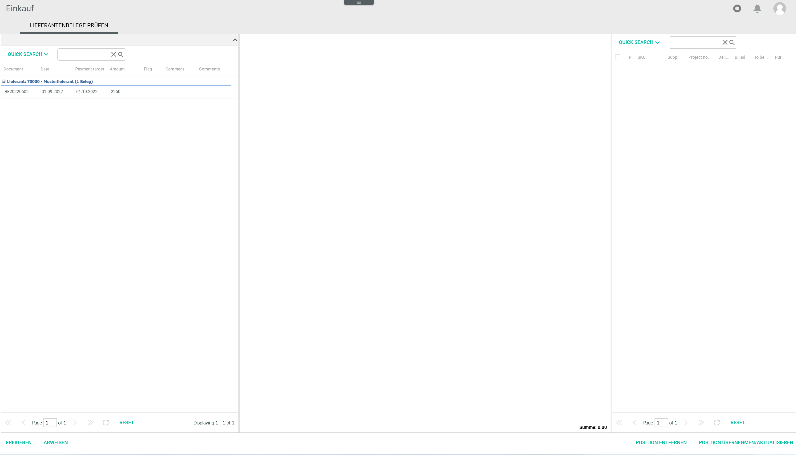

[!!User Interface Supplier receipts](../UserInterface/01_Book.md#supplier-receipts)
[!!Post a supplier receipt](../Operation/10_ManageReceipts.md#post-a-supplier-receipt)

# Check the supplier settings

Check and, if necessary, modify the supplier settings to release a supplier receipt in the *Purchasing* module.

#### Error Description

A supplier receipt has been entered in the system but is not displayed in the *Check supplier receipts* tab of the *Purchasing* module and, therefore, cannot be released.

Follow the instructions below to check and modify the supplier settings in the *Accounting* module.

#### Prerequisites

- A supplier receipt has been entered in the system, see [Acquire](../Operation/10_ManageReceipts.md#acquire).

#### Procedure

*Purchasing > Check supplier receipts*

1. Go to the *Accounting* module and check the supplier number for the supplier receipt to be released in the *Overview* tab of the *Supplier receipts* window.

  

2. Select the supplier in the *Customer/supplier list* available in the *DEBTORS/CREDITORS* tab.

  

3. Click the *Invoicing* sub-tab in the *Supplier (number)* tab.

  

4. Make sure that the *Only cost supplier/ordering process inactive* and *Goods receipt required* checkboxes in the *Default values* section are correctly configured.

  > [Info] You can hover the mouse over the checkboxes for further details. Alternatively, see [Invoicing](../UserInterface/2a_DebtorsCreditors.md#invoicing-1) for detailed information.

5. Click the *CRM information* sub-tab.  

  

6. Click the *Supervisor* drop-down list and select the applicable responsible person the *General* section.  

  > [Info] The supplier receipt to be released is only displayed in the *Purchasing* module to the supervisor configured in the supplier settings.

7. Click the [SAVE] button.  
The changes in the supplier settings have been saved.

8. Go back to the *Purchasing* module and select the *Check supplier receipts* menu entry.  
The supplier receipt is now displayed in the *Check the supplier receipts* tab.

  

9. Click the receipt to be released in the list.
The receipt entered in the system is displayed in the central section of the workspace.  

  

10. If the supplier receipt is found to be correct, click the [RELEASE] button. A confirmation window with the notice *Would you like to release the selected supplier receipt?* is displayed.

  

11. Click the [YES] button in the confirmation window to proceed.
The supplier receipt is no longer displayed in the *CHECK SUPPLIER RECEIPTS* tab.

> [Info] After it has been released in the *Purchasing* module, the supplier receipt status changes from *New* (red) to *Released* (yellow-green) in the *Status* column of the *Overview* tab of the *Supplier receipts* window.

[comment]: <> (Drei letzte Punkte sind gleich wie "Release a supplier receipt in Purchasing" in 10_ManageReceipts.md#post-a-supplier-receipt. Verlinken oder so lassen? Prozedur geht dann weiter mit Financial accounting takeover. Schritt 12 mit Verlinkung dahin oder so lassen?)

## Was this chapter helpful?

If you need further assistance, please contact the Customer Support.
