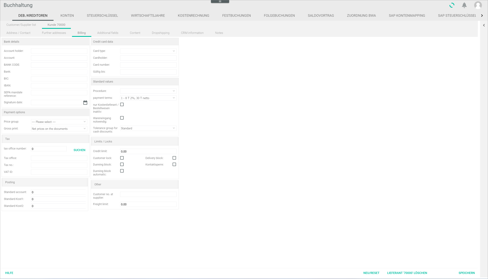
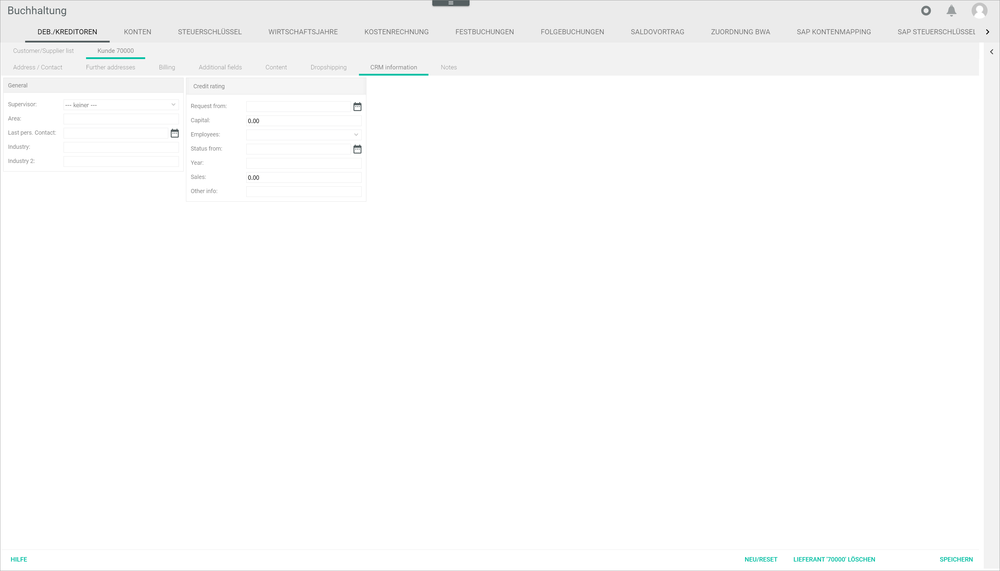

[!!User Interface Supplier receipts](../UserInterface/01_Book.md#supplier-receipts)
[!!Post a supplier receipt](../Operation/10_ManageReceipts.md#post-a-supplier-receipt)

# Check the supplier settings

Check and, if necessary, modify the supplier settings to release a supplier receipt in the *Purchasing* module.

#### Error Description

A supplier receipt has been entered in the system but is not displayed in the *Check supplier receipts* tab of the *Purchasing* module and, therefore, cannot be released.

Follow the instructions below to check and modify the supplier settings in the *Accounting* module.

#### Prerequisites

A supplier receipt has been entered in the system, see [Acquire a supplier receipt](../Operation/10_ManageReceipts.md#acquire).

#### Procedure

*Accounting > Post > Button EDIT > Menu entry Supplier receipts > Tab Overview*

1. Check the supplier number for the missing supplier receipt in the list of supplier receipts and switch to the *Customer/supplier* tab: *Accounting > Settings > DEBTORS/CREDITORS* .    
    The *DEBTORS/CREDITORS* tab is displayed. By default, the *Customer/Supplier list* tab is preselected.

  

2. Double-click the corresponding supplier in the *Customer/supplier list* tab.
  The *Supplier "Supplier number"* tab is displayed.

3. Click the *Invoicing* sub-tab in the *Supplier "Supplier number"* tab.
  The *Invoicing* sub-tab is displayed.

  

4. Make sure that the *Only cost supplier/ordering process inactive* and *Goods receipt required* checkboxes in the *Default values* section are correctly configured.

[comment]: <> (was ist denn die korrekte Einstellung? Gibt es da eine Vorgabe? Die zweite Checkbox ist bei mir gesperrt und kann gar nicht bearbeitet werden...)

  > [Info] You can hover the mouse over the checkboxes to display the tool tips.   
  For detailed information abpout the single fields, see [Invoicing](../UserInterface/02a_DebtorsCreditors.md#invoicing-1).

5. Click the *CRM information* sub-tab in the *Supplier "Supplier number"* tab.  
  The *CRM information* sub-tab is displayed.

  

6. Click the *Supervisor* drop-down list and select the applicable responsible person in the *General* section.  

  > [Info] The supplier receipt to be released is only displayed in the *Purchasing* module to the supervisor configured in the supplier settings.

7. Click the [SAVE] button.  
  The changes in the supplier settings have been saved. Depending on the changes made, one or several *Successfully saved* pop-up windows are displayed.

  

8. Switch to the *Purchasing* module: *Purchasing > Check supplier receipts* .   
    The *Check the supplier receipts* menu entry is opened. The *CHECK THE SUPPLIER RECEIPTS* tab with the supplier receipt is displayed.

  

[comment]: <> (Ist hier der Troubleshooting Teil nicht abgeschlossen? Problem war doch, dass der Beleg nicht angezeigt wurde. Jetzt ist er wieder da. Würde nur noch ne Info einfügen, dass der Beleg jetzt released werden kann und den Link zum entsprechenden Kapitel einfügen.)

9. Click the receipt to be released in the list.
The receipt entered in the system is displayed in the central section of the workspace.  

  

10. If the supplier receipt is found to be correct, click the [RELEASE] button. A confirmation window with the notice *Would you like to release the selected supplier receipt?* is displayed.

  

11. Click the [YES] button in the confirmation window to proceed.
The supplier receipt is no longer displayed in the *CHECK SUPPLIER RECEIPTS* tab.

  > [Info] After it has been released in the *Purchasing* module, the supplier receipt status changes from *New* (red) to *Released* (yellow-green) in the *Status* column of the *Overview* tab of the *Supplier receipts* window.

[comment]: <> (Drei letzte Punkte sind gleich wie "Release a supplier receipt in Purchasing" in 10_ManageReceipts.md#post-a-supplier-receipt. Verlinken oder so lassen? Prozedur geht dann weiter mit Financial accounting takeover. Schritt 12 mit Verlinkung dahin oder so lassen?)

## Was this chapter helpful?

If you need further assistance, please contact the Customer Support.
