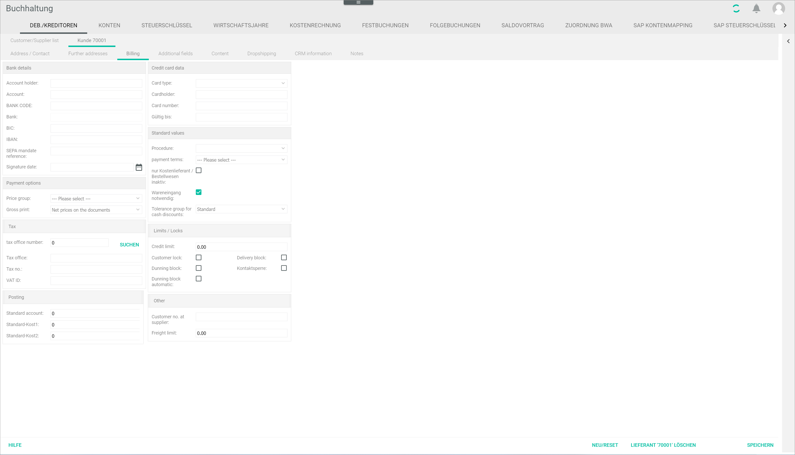
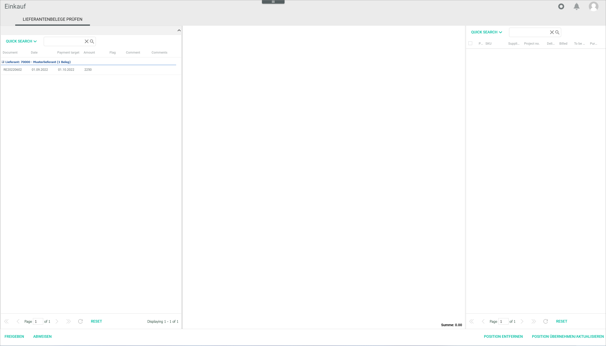

[!!Manage receipts](../Operation/10_ManageReceipts.md)
[!!User Interface Postings header](../UserInterface/01_Header.md)

# Handle a non-releasable supplier receipt

Check and, if necessary, modify the supplier settings to release a supplier receipt in the *Purchasing* module.

#### Error Description

When trying to release a supplier receipt, the *No items linked* window with the notice *Please link items first* is displayed in the *CHECK SUPPLIER RECEIPTS* tab in the *Check supplier receipts* menu entry of the *Purchasing* module.

Follow the instructions below to check and modify the supplier settings in the *Accounting* module.

#### Prerequisites

No prerequisites to fulfill.

#### Procedure

*Accounting > Post > Button EDIT > Menu entry Supplier receipts > Tab Overview*

  

1. Check and note the supplier number for the non-releasable supplier receipt in the *Overview* tab and switch to the *DEBTORS/CREDITORS* tab: *Accounting > Settings > Tab DEBTORS/CREDITORS*.    
    The *DEBTORS/CREDITORS* tab is displayed. By default, the *Customer/supplier list* tab is preselected.

    

2. Double-click the corresponding supplier in the *Customer/supplier list* tab.  
    The *Supplier "Supplier number"* tab is displayed.

3. Click the *Invoicing* sub-tab in the *Supplier "Supplier number"* tab.  
    The *Invoicing* sub-tab is displayed.

    

4. Deselect the *Goods receipt required* checkbox in the *Default values* section.

    > [Info] When selecting then *Only cost supplier/ordering process inactive* checkbox, the *Goods receipt required* is automatically locked and the corresponding function in the *Purchasing* module is set to inactive, as no items need to be linked to release the supplier receipt. The *Only cost supplier/ordering process inactive* checkbox can be selected when the supplier is a provider delivering a service, for example an internet provider. You can hover the mouse over the checkboxes to display the tool tips. For detailed information about these fields, [Invoicing](../UserInterface/02a_DebtorsCreditors.md#invoicing).

5. Click the [SAVE] button.  
    The changes in the invoicing information have been saved. The *Successfully saved* pop-up window is displayed.

    

6. Switch to the *Purchasing* module: *Purchasing > Check supplier receipts > Tab CHECK SUPPLIER RECEIPTS*.   
    The *CHECK SUPPLIER RECEIPTS* tab is displayed.

    

7. Check if the supplier receipt can be released.
    > [Info] If the supplier receipt cannot still be released, please contact the Customer Support.    

8. If desired, continue with the release process, see [Release a supplier receipt in Purchasing](../Operation/10_ManageReceipts.md#release-a-supplier-receipt-in-purchasing).

## Was this chapter helpful?

If you need further assistance, please contact your MPS consultant.
