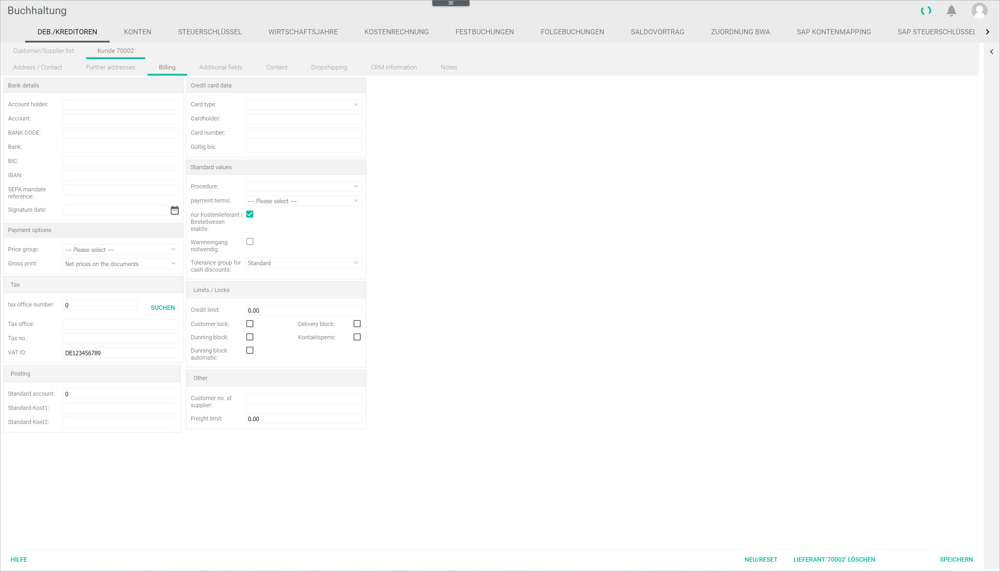

[!!User Interface Supplier receipts](../UserInterface/01_Book.md#supplier-receipts)
[!!Post a supplier receipt](../Operation/10_ManageReceipts.md#post-a-supplier-receipt)

# Handle a non-releasable supplier receipt

Check and, if necessary, modify the supplier settings to release a supplier receipt in the *Purchasing* module.

#### Error Description

When trying to release a supplier receipt, the *No items linked* window with the notice *Please link items first* is displayed in the *CHECK SUPPLIER RECEIPTS* tab in the *Check supplier receipts* menu entry of the *Purchasing* module.

Follow the instructions below to check and modify the supplier settings in the *Accounting* module.

#### Prerequisites

- A supplier receipt has been entered in the system, see [Acquire a supplier receipt](../Operation/10_ManageReceipts.md#acquire-a-supplier-receipt).
- The supplier receipt to be released is displayed in the *Check supplier receipts*, see [Display a missing supplier receipt](./02.DisplayMissingSupplierReceipt.md).

[comment]: <> (Diese Prerequisites machen hier vielleicht nicht so viel Sinn, denn beide sind Voraussetzungen, damit man überhaupt auf das Error kommt. So lassen oder No prerequisites to fulfill?)

#### Procedure

*Accounting > Post > Button EDIT > Menu entry Supplier receipts > Tab Overview*

  

1. Check the supplier number for the non-releasable supplier receipt in the *Overview* tab and switch to the *Customer/supplier* tab: *Accounting > Settings > DEBTORS/CREDITORS*.    
  The *DEBTORS/CREDITORS* tab is displayed. By default, the *Customer/Supplier list* tab is preselected.

  

2. Double-click the corresponding supplier in the *Customer/supplier list* tab.
  The *Supplier "Supplier number"* tab is displayed.

3. Click the *Invoicing* sub-tab in the *Supplier "Supplier number"* tab.
  The *Invoicing* sub-tab is displayed.

  

4. Deselect the *Goods receipt required* checkbox in the *Default values* section.

  > [Info] If both *Goods receipt required* and *Only cost supplier/ordering process inactive* checkboxes are selected, the *Goods receipt required* is locked. Deselect the *Only cost supplier/ordering process inactive* checkbox first in order to deselect the *Goods receipt required* checkbox.  
  You can hover the mouse over the checkboxes to display the tool tips. For detailed information about these fields, see [Invoicing](../UserInterface/02a_DebtorsCreditors.md#invoicing).

[comment]: <> (FH/Reviewer: Macht das überhaupt Sinn, dass beide Checkboxen gleichzeitig ausgewählt sind?)

5. If necessary, select the *Only cost supplier/ordering process inactive*.

  > [Info] This checkbox is only applicable if the supplier is a provider delivering a service, for example an internet provider. In this case, no items need to be linked in the *Purchasing* module to release a supplier receipt (the items section is, in fact, completely locked for the selected supplier).

  

6. Click the [SAVE] button.  
  The changes in the invoicing information have been saved. The *Successfully saved* pop-up window is displayed.

  

7. Switch to the *Purchasing* module: *Purchasing > Check supplier receipts > Tab CHECK SUPPLIER RECEIPTS*.   
  The *Check supplier receipts* menu entry is opened. The *CHECK SUPPLIER RECEIPTS* tab with the supplier receipt is displayed.

  

[comment]: <> (Evtl. Schritt 7 weglassen? Scheint überflüssig zu sein, denn es ist der Ausgangspunkt der Release a supplier receipt in Purchasing - Link im Schritt 8. Gleiches Gilt für 02_DisplayMissingSupplierReceipt. 7 weglassen?)  

8. To continue with the release process, see [Release a supplier receipt](../Operation/10_ManageReceipts.md#release-a-supplier-receipt-in-purchasing).

[comment]: <> (Es gibt eine dritte mögliche Meldung im Purchasing Modul, wenn keine der beiden Checkboxen ausgewählt sind: Zuweisung des Wareneingangs beim Lieferanten ist optional. Info dazu? Man kann trotzdem den Lieferantenbeleg freigeben)

## Was this chapter helpful?

If you need further assistance, please contact the Customer Support.
