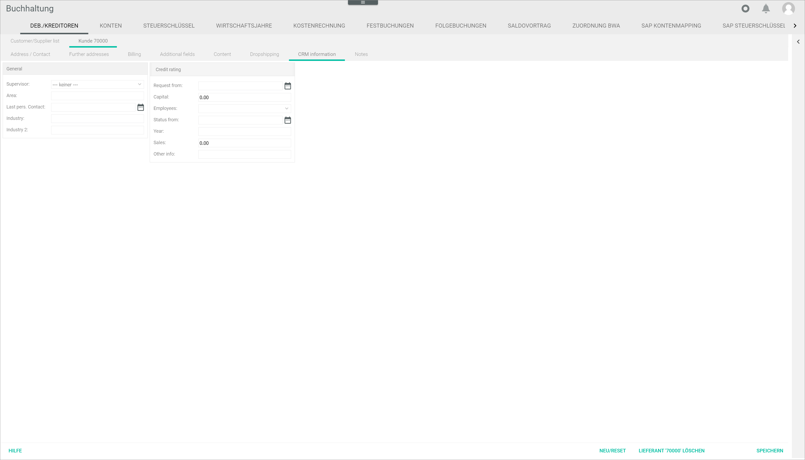

[!!User Interface Supplier receipts](../UserInterface/01_Book.md#supplier-receipts)
[!!Post a supplier receipt](../Operation/10_ManageReceipts.md#post-a-supplier-receipt)
[!!Release a supplier receipt in Purchasing](../Operation/10_ManageReceipts.md#release-a-supplier-receipt-in-purchasing)

# Display a missing supplier receipt

Check and, if necessary, modify the supplier settings to display a supplier receipt in the *Purchasing* module in order to release it.

#### Error Description

A supplier receipt has been entered in the system but is not displayed in the *CHECK SUPPLIER RECEIPTS* tab of the *Purchasing* module and, therefore, cannot be released.

Follow the instructions below to check and modify the supplier settings in the *Accounting* module.

#### Prerequisites

No prerequisites to fulfill.

#### Procedure

*Accounting > Post > Button EDIT > Menu entry Supplier receipts > Tab Overview*  

1. Check and note the supplier number for the missing supplier receipt and switch to the *DEBTORS/CREDITORS* tab: *Accounting > Settings > Tab DEBTORS/CREDITORS*.    
  The *DEBTORS/CREDITORS* tab is displayed. By default, the *Customer/Supplier list* tab is preselected.

  

2. Double-click the corresponding supplier in the *Customer/supplier list* tab.  
  The *Supplier "Supplier number"* tab is displayed.

3. Click the *CRM information* sub-tab in the *Supplier "Supplier number"* tab.  
  The *CRM information* sub-tab is displayed.

  

4. Click the *Supervisor* drop-down list and select the applicable responsible person in the *General* section.  

  > [Info] The supplier receipt to be released is only displayed in the *Purchasing* module to the supervisor configured in the supplier settings.

5. Click the [SAVE] button.  
  The changes in the CRM information have been saved. The *Successfully saved* pop-up window is displayed.

  

6. Switch to the *Purchasing* module: *Purchasing > Check supplier receipts > Tab CHECK SUPPLIER RECEIPTS*.   
  The *CHECK SUPPLIER RECEIPTS* tab is displayed.

  

7. Check if the missing supplier receipt is displayed.
  > [Info] If the supplier receipt is still not displayed, please contact the Customer Support.    

8. If desired, continue with the release process, see [Release a supplier receipt in Purchasing](../Operation/10_ManageReceipts.md#release-a-supplier-receipt-in-purchasing).

## Was this chapter helpful?

If you need further assistance, please contact the Customer Support.
