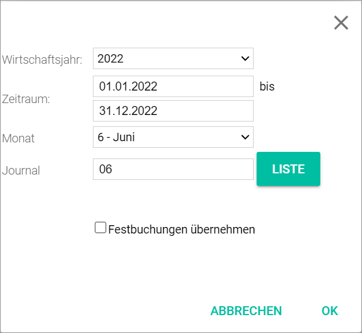
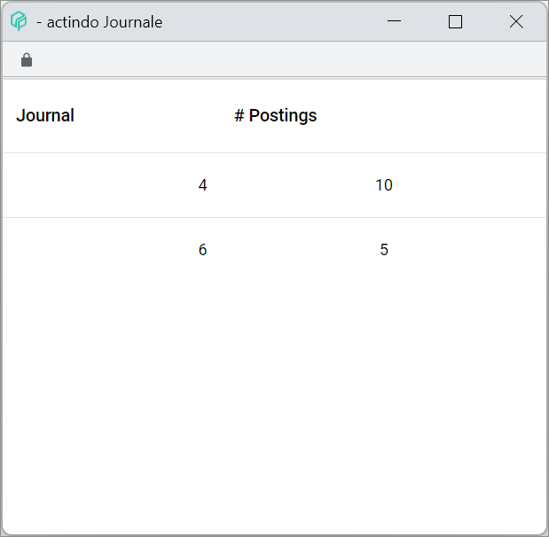

[!!User interface Settings Fiscal years](./02d_FiscalYears.md)
[!!User interface Settings Fixes postings](./02f_FixedBookings.md)
[!!User interface Settings Balance carried forward](./02h_BalanceCarriedForward.md)
[!!Manage the fiscal year](../Integration/04_ManageFiscalYear.md)
[!!Manage the fixed postings](../Integration/06_ManageFixedBookings.md)
[!!Select fiscal year](../Operation/01_SelectFiscalYear.md)

# Fiscal year

*Accounting*

When opening the *Accounting* module for the first time after logging in or after reloading the system, the fiscal year window is displayed. Select the appropriate values to display the corresponding period. For detailed information, see [Select fiscal year](../Operation/01_SelectFiscalYear.md).

- *Fiscal Year*  
    Click the drop-down list to select the fiscal year. All available fiscal years are displayed in the list.

- *Period (DD.MM.YYYY) to (DD.MM.YYYY)*  
    Period of the fiscal year. The period fields are filled in automatically after selecting the fiscal year. These fields are read-only.

- *Month*  
    Click the drop-down list to select the month. The following options are available:  

    - **0 - Balances carried forward**  
        Period used to post open items and balances carried forward from the previous fiscal year.
    - **1 - 12 - (calendar month)**  
        Regular postings are recorded in the corresponding calendar month.    
    - **13 - 15 - Subsequent postings**  
        Periods used to make postings retrospectively.  
    - **16 - 25 - Closing postings**  
        Periods used to make postings at year end in preparation for the annual financial reports (balance sheet and P&L).
    - **99 - General month**  
        Postings made in this period are not posted in month 99, but are automatically recorded in the corresponding calendar month depending on the posting date.

- *Journal*  
    Click the [LIST] button next to the field to display the list of journals and select a journal. Alternatively, you can enter the journal number.  

  There are two main types of journals preconfigured in the system:

  - General journals (1-12)  
      The journals 1 to 12 are paired with the fiscal year months, regardless of whether the fiscal year coincides with the calendar year or not. This means that all transactions posted in the first month of the fiscal year will be found in journal 1, all transactions posted in the second month of the fiscal year in the journal 2, and so on.

  - Special journals (90-99)  
      The journals 90 to 99 are specialized lists of transactions records preconfigured in the system. The special journals settings can be edited and extended in the BALANCES CARRIED FORWARD tab in the Settings menu entry, see [Balance carried forward](./02h_BalanceCarriedForward.md).

- [LIST]  
    Click this button to display all available journals with postings and the number of postings contained in each of them. The *Journals* window is displayed, see [Journals](#journals).

- [x] *Include fixed postings*  
    Choose whether or not include the fixed postings. If you select the checkbox, the *Fixed postings* section is displayed.

- *Fixed postings*    
    Available fixed posting batches. Click the appropriate batch to include the fixed postings. For detailed information, see [Manage fixed postings](../Integration/06_ManageFixedBookings.md).

- [OK]  
    Click this button to confirm the selected values.

- [CANCEL]  
    Click this button to cancel the selected values.

## Journals

*Accounting > Select fiscal year > Button LIST*

- *Journal*  
    Journal number. Click the journal to select it. The *Journal* window is closed and the selected journal is displayed in the *Journal* field of the *Select fiscal year* window, see [Fiscal year](#fiscal-year).

- *# Postings*  
    Number of postings in the corresponding journal.
