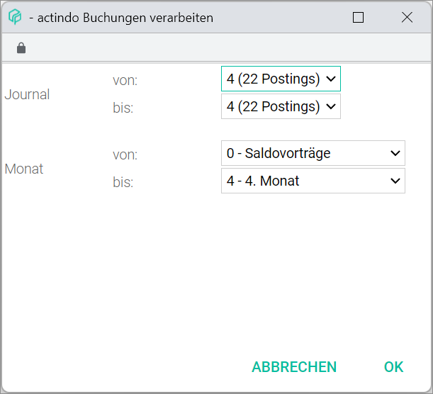
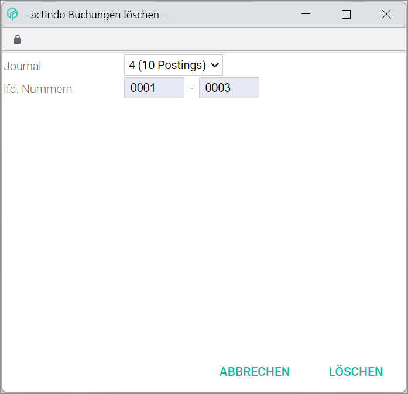
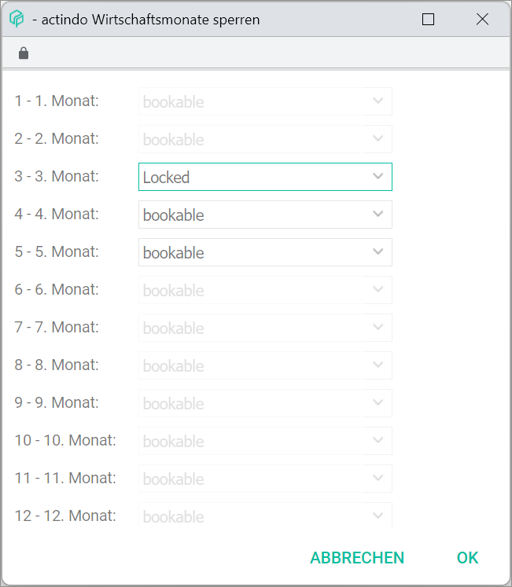
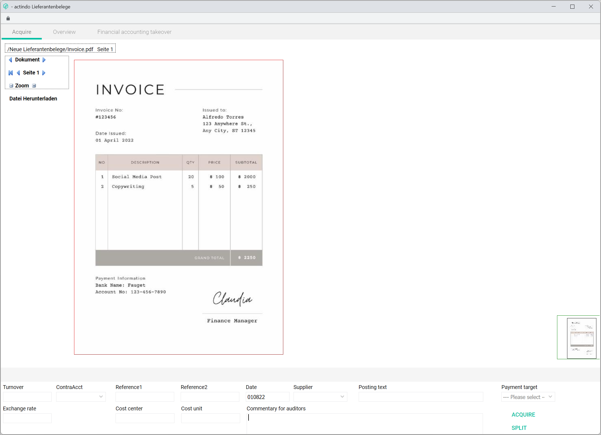
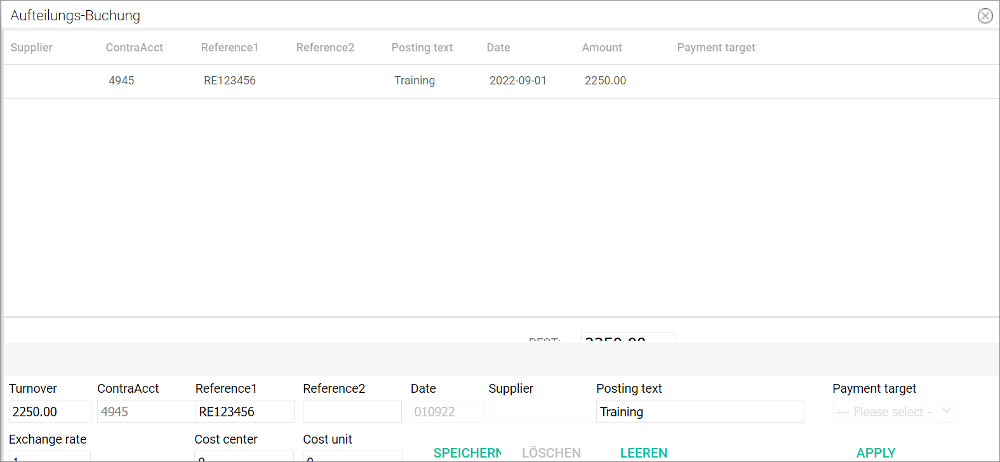
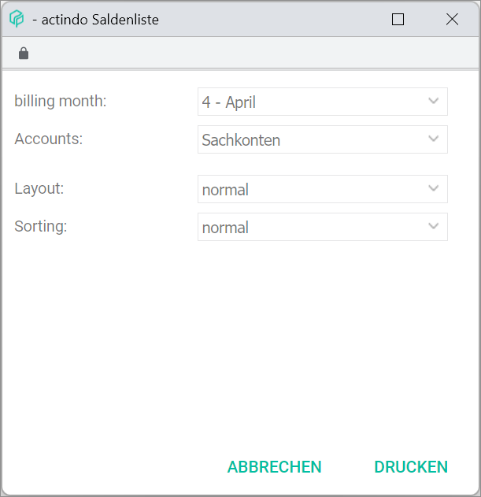
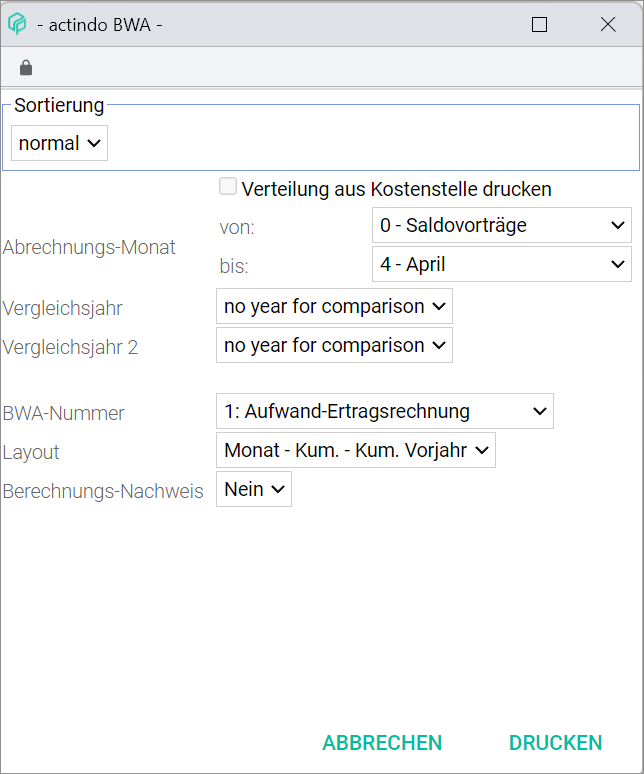

by default# Post

*Accounting > Post*

  

The Accounting *Post* menu entry is used to manage all existing postings and to create new ones.

The *Post* User Interface is composed of the following tabs:

  - [POSTINGS](./01a_Bookings.md)
  - [BALANCES](./01b_Balances.md)
  - [ACCOUNT SHEET](./01c_AccountSheet.md)
  - [OPEN ITEMS](./01d_OpenItems.md)
  - [SEARCH](./01e_Search.md)
  - [POST RECEIPTS](./01f_BookReceipts.md)

Additionally, the following cross-tab functions are contained.

## FY/MONTH/JOURNAL

*Accounting > Post > Button FY/MONTH/JOURNAL*

  

- [FY/MONTH/JOURNAL]  
Click this button to display the select fiscal year window. For detailed information, see [Fiscal year](./00a_FiscalYear.md) and [Select a fiscal year](../Operation/01_SelectFiscalYear.md). If necessary, new fiscal years can be created, edited or deleted. For detailed information about managing fiscal years, see [Manage the fiscal year](../Integration/04_ManageFiscalYear.md).

## EDIT

*Accounting > Post > Context menu EDIT*

 - [EDIT]  
 Click this button to display the *EDIT* context menu.

  

- *Cash book takeover*  
Click this menu entry to take over automatically cash payments registered in the cash book. The *Cash book takeover* window is displayed, see [Cash book takeover](#cash-book-takeover).

  [comment]: <> (RS FH about function and need of procedure. How is it used by customers?)

- *Bank data takeover*  
Click this menu entry to take over bank and payment details registered in the *Payment processing* module. The *Bank data synchronizing* window is displayed, see [Bank data takeover](#bank-data-takeover).

  [comment]: <> (FH: It can probably be deleted. It is no longer/hardly? used and will be deleted in next releases. To be confirmed!)

-  *Process*  
Click this menu entry to process several postings simultaneously. The *Process postings* window is displayed, see [Process](#process).

-  *Delete*  
Click this menu entry to delete several postings simultaneously. The *Delete postings* window is displayed, see [Delete](#delete).

-  *Lock months*  
Click this menu entry to lock one or several months for postings. The *Lock months* window is displayed, see [Lock months](#lock-months).

- *Balance carried forward*  
Click this menu entry to carry forward balances from one fiscal year to the next one. The *Balance carried forward: step 1* window is displayed, see [Balance carried forward](#balance-carried-forward).

- *Foreign currency wizard*  
Click this menu entry to post currency exchange differences automatically. The *Foreign currency wizard* window is displayed, see [Foreign currency wizard](#foreign-currency-wizard).

- *Supplier receipts*  
Click this menu entry to post specifically supplier receipts. The *Supplier receipts* window is displayed, see [Supplier receipts](#supplier-receipts).

### Cash book takeover  

*Accounting > Post > Context menu EDIT > Menu entry Cash book takeover*

  

This window displays all cash payments registered in the cash book, which can be taken over automatically in the *Accounting* module. All information provided in columns is read-only, except for the *T* column.

[comment]: <> (Add link when documentation is available)

  - *Seq. no.*  
    Sequential number as registered in the cash book.

  - [x] *T (Take over posting)*  
   Select this checkbox to take over an individual posting.

  - *BP*  
    Posting period as registered in the cash book.

  - *Jnl*  
    Journal as registered in the cash book.

  - *Turnover*  
    Turnover value as registered in the cash book. Revenues display a positive sign. Expenditures display a negative sign.

  - *Contra Account*  
    Contra account as registered in the cash posting.

  [comment]: <> (No account in cash book! What does the number stand for? As "Unbekannt!")   

  - *Receipt1*  
    Receipt 1 as registered in the cash book.

  - *Receipt2*  
    Receipt 2 as registered in the cash book.

  - *Date*  
    Date as registered in the cash book.

  - *Account*  
    Account as registered in the cash book.

  - *Cst1*  
    Cost 1 as registered in the cash book.

  - *Cst2*  
    Cost 2 as registered in the cash book.

  - *Text*  
    Free text as registered in the cash book.

  - [SELECT ALL]     
    Click this button to select all postings.

  - [SELECT NOTHING]    
    Click this button to deselect all postings.

  - *Amount*  
    Total amount of all postings in the cash book.

An individual posting from the cash book can be selected and partially edited before takeover. Click the posting to be edited. Its details are displayed in the input line.

[comment]: <> (Unsure! RS FH. Add operartion file? RS FH!)

  - *Seq. no.*  
   This field displays the posting sequential number and cannot be modified.  

  - *Turnover*  
  This field displays the turnover and cannot be modified.

  - *Contra account*  
  Enter the appropriate contra account. This field is compulsory.

  > [Info] After you have entered at least two numbers in the field, a list is displayed below the field with all accounts matching the entry. You can also select the corresponding account in the list. Alternatively, use the search function to find the account number, see [Search for an account](../Operation/13_SearchAccounting.md#search-for-an-account).

  - *Receipt1*  
  Enter the appropriate value if necessary. The existing value can be modified.

  - *Receipt2*  
  Enter the appropriate value if necessary. The existing value can be modified.

  - *Date*  
  This field displays the date and cannot be modified.

  - *Account*  
  This field displays the account and cannot be modified.

  - *Cost1*  
  Enter the appropriate value if necessary. The existing value can also be modified.

  - *Cost2*  
  Enter the appropriate value if necessary. The existing value can be modified.

  - *Text*  
  Enter the appropriate free text if necessary. The existing value can be modified.

  - [POST]    
  Click this button to post the edited posting.

  - [DELETE]    
  Click this button to delete the selected posting.

  [comment]: <> (FEHLER: löschen hier nicht möglich! -> even though takeover not yet performed? Probably because it is linked to cash book/Kassenbuch? What is the use of this button here? RS FH)

  - [CLEAR]    
  Click this button to clear all input line fields.

  - [SPLIT]    
  Click this button to split the selected posting.

  [comment]: <> (Fehlermeldungen: beim klicking auf SPLIT -> Unbekannte Bankbuchung. Wenn man versucht, eine Splitbuchung zu machen -> Meldung: Gebucht und in rot "Umsatz, GegKonto, Datum oder Konto leer! Ungültiges Datum!" Alle Felder sind aber richtig ausgefüllt, jetzt zeigen sie aber alle 0, außer Beleg 1, GegKonto und Text)

  - [SAVE]    
  Click this button to take over the selected postings.

### Bank data takeover  

[comment]: <> (This function is supposed to be deleted in a next release. Delete from here? Still in use? for how long? Worth completing it? RS FH/HG!)

*Accounting > Post > Context menu EDIT > Menu entry Bank data takeover*

  

This screen is also available in the *Payment processing* module. Both modules are closely linked with each other.

[comment]: <> (Link when available?)

  - *Bank account*  
  Click the drop-down list to select the bank account where data must be imported from.

 - *Load registered* [x]  
  Click this checkbox to activate the [SHOW REGISTERED] button.

  > [Info] This function is by default deactivated to reduce system overload and improve performance. This default setting can be changed in the *Settings* menu entry of the *Payment processing* module.

  [comment]: <> (Add link when available)

  - *FY/month*  
  Click the corresponding drop-down list to select the fiscal year and month of the data to be displayed.

  - [RETRIEVE/IMPORT]  
  Click this button to display the *Retrieve bank data* window, see [Retrieve bank data](#retrieve-bank-data).

[comment]: <> (RS FH needed. I did not manage to import bank data.)

  - [SHOW REGISTERED]  
  Click this button to display all posted payments.

  - [SHOW HIDDEN]  
  Click this button to display all hidden payments.

  - [QUICK SEARCH]  
  Click this button to display the *QUICK SEARCH* context menu. Payments can be searched for using the following search criteria:

    - *Turnover*
    - *Contra account*
    - *Receipt1*
    - *Receipt2*
    - *Account*
    - *Text*
    - *Reference*
    - *Recipient*

 [comment]: <> (Vorsicht: Übersetzung von Verwendungszweck? "Purpose code" is mentioned by FH in training video, but I think reference is meant)

 - [Search bar]  
 Enter here the value to be searched for. You can press ENTER to start the search.

 -  (Cross)  
 Click this button to delete the entered value.

 -  (Search)  
 Click this button to search for payments matching the entered values and search criteria.

The imported bank data are displayed in the following columns:

 - *Seq. no.*  
 This column displays the sequential number.

 - *T* (Take over)  
 Click the checkbox in this column to select the payment.

 - *B* (xxx)  
 This column displays the payment status.

  - Green  
  An incoming payment has been matched with an existing open item.
  - Yellow  
  An incoming payment probably matches and existing open item but there are discrepancies to be checked.
  - Red  
  No matching open item found for the payment.

    > [Info] If a payment is processed manually, a *M* will be displayed in this column.

[comment]: <> (B für Beleg, Bearbeiten, Buchhaltung??? Change column name accordingly here and in IU Terminology file! Add screenshot/icons)  

  - S (Search)  
  The  (Search) icon is displayed in this column. Click this button to search for open items.

 [comment]: <> (New window opens up. Name? Add and describe!)

 - *Turnover*  
 This column displays the turnover value.

 - *Contra account*  
 This column displays the contra account assigned, if any.

 - *Receipt1*  
 This column displays the receipt 1 value, usually the invoice number.

 - *Receipt2*  
 This column displays the receipt 2 value.

 > [Info] The following payment reference details are displayed in the columns view and used by the system to match each payment with an existing open item:
  - Customer number
  - Invoice number
  - Order number
  - Customer name
  - Customer e-mail address

 - *Date*  
 This column displays the payment date.

 - *Account*  
 This column displays the account assigned, if any.

 - *Text*  
 This column displays the posting text, if any.

-  (Refresh)  
 Click this button to update the payment list.

- [RESET]  
 Click this button to reset the payment list view.

 [comment]: <> (Unsure! Check!)

- Green [x]
- Yellow [x]
- Red [x]
- Grey [x]
- [M] [x]

[comment]: <> (Check last two!)

- [SELECT GREEN]
- [SELECT YELLOW]
- [RESET SELECTION]

The payments can also be processed manually. Click any payment in the list to display its values in the input line fields.

  - *Seq. no.*
  - *Turnover*
  - *Contra account*
  - *Receipt1*
  - *Receipt2*
  - *Date*
  -   (Calendar)
  - *Account*
  - *Cost1*
  - *Cost2*
  - *Text*

- [POST]

- [DELETE]

- [CLEAR]

- [SPLIT]

- [TAKE OVER MARKED]

- [HIDE MARKED]

- [SHOW MARKED]

- *Last retrieval*

- [LEARN FILE]

- [CANCEL]

#### Retrieve bank data

*Accounting > Post > Context menu EDIT > Menu entry Bank data takeover > Button RETRIEVE/IMPORT*

- *Bank*
- *Account / routing number*
- *Date from*  
 - **Automatic**  
 - **Selection** [Date field]
- *Import definition*
- *Edit*
- *CSV file*
- *Select file*
- *No file selected*

- [CANCEL]
- [FINALIZE]

### Process

*Accounting > Post > Context menu EDIT > Menu entry Process*

  

This window allows to select several postings to be processed simultaneously. For detailed information, see [Process postings](../Operation/07_ProcessBookings.md).

- *Journal from - to*  
Click these drop-down lists to select the journals to be processed. The drop-down list displays the existing journals including the postings recorded in each of them.

- *Month from - to*   
Click these drop-down lists to select the months to be processed. The drop-down lists display all available months in the system. The following options are available:  

  - **0 - Balances carried forward**
  - **1 - 12 - (calendar month)**
  - **13 - 15 - Subsequent postings**
  - **16 - 25 - Closing postings**
  - **99 - General month**

- [CANCEL]  
Click this button to cancel your selection.

- [OK]  
Click this button to confirm your selection.

### Delete

*Accounting > Post > Context menu EDIT > Menu entry Delete*

  

  This window allows to select several postings in a journal to be deleted simultaneously. For detailed information, see [Delete postings](../Operation/06_DeleteBookings.md).

  - *Journal*  
  Click this drop-down list to select the journal containing the postings to be deleted. The drop-down list displays the existing journals including the postings recorded in each of them.

  - *Seq. nos.*   
  Enter the sequential numbers corresponding to the postings to be deleted.

  - [CANCEL]  
  Click this button to cancel your selection.

  - [DELETE]  
  Click this button to delete the selected postings.

### Lock months

*Accounting > Post > Context menu EDIT > Menu entry Lock months*

  

  This window allows to select one or several months to be locked for postings. Locked months can also be unlocked and made available for postings again. For detailed information, see [Lock a period for postings](../Operation/08_LockPeriodBookings.md).

  - *[x] - [x] month*  
  Click this drop-down list to select the appropriate option. The following options are available:

   - **Locked**  
   Select this option to lock the month for postings. No further postings will be recorded in the selected month. Any further postings will be recorded in the next available month.

   - **Bookable**  
   Select this option to unlock a previously locked month. The selected month will be available for postings again.

  - [CANCEL]  
  Click this button to cancel your selection.

  - [OK]  
  Click this button to confirm your selection.

### Balance carried forward

*Accounting > Post > Context menu EDIT > Menu entry Balance carried forward*

  

**Balance carried forward: Step 1**

The *Balance carried forward: Step 1* window allows to select balances to be carried forward to the next fiscal year. For detailed information, see [Create a balance carried forward](../Operation/11_CreateBalanceCarriedForward.md).

- *Carry forward from FY*  
Click the drop-down list to select the year containing the balance(s) to be carried forward.

- *Range from - to*  
Click the drop-down list to select the account class range containing the balance(s) to be carried forward. The following options are available:

 - **01: Financial accounts**
 - **02: Impersonal accounts**
 - **03: Input tax + VAT**
 - **04: P&L**
 - **05: Open items debtors**
 - **06: Open items creditors**

- *Posting date*  
Enter the posting date for the balance(s) carried forward.

  > [Info] By default, the system displays the first day of the new fiscal year. This can be modified simply by typing in the desired posting date.

- *Cost accounting*  
Select the applicable checkbox(es) for the balances to be carried forward. The following checkboxes are available:  

  - *Cost centers*  
  Select this checkbox to carry forward the cost centers.
  - *Cost units*  
  Select this checkbox to carry forward the cost units.
  - *Inactive cost centers/units*  
  Select this checkbox to carry forward inactive cost centers and units.

  > [Info] The *Cost accounting* field and the corresponding checkboxes are displayed only when cost centers and/or cost units have been created in the fiscal year from which the balance is carried forward.

[comment]: <> (Cost unit sollte noch zu Cost object geändert werden in allen UI Dateien.) 

- *Delete old balances carried forward from selected FY* [x]  
Select this checkbox to delete the old balance(s) carried forward from the selected fiscal year.  

  > [Info] Previous balances carried forward will be then replaced by the new balances carried forward. The original postings in the previous fiscal year are not deleted though.

- [CANCEL]  
Click this button to cancel your selection.

- [CONTINUE]  
Click this button to proceed to the *Retrieve account balances* window.

**Retrieve account balances**

  

The *Retrieve account balances* window confirms the values previously selected and offers the possibility to narrow down the account selection.

- *Carry forward from FY*  
The previously selected fiscal year is displayed. This field is read-only.

- *Range from - to*  
The previously selected account class range is displayed. These fields are read-only.

- *Date*  
The previously selected posting date is displayed. This field is read-only.

- *Accounts*  
The accounts containing a balance to be carried forward are displayed together with the balance amount. The balance amount can be both positive or negative.

  >[Info] Hold the Ctrl (control) key and click each account with the left mouse button to select multiple accounts simultaneously.

- *Delete old balances carried forward from selected FY*  
If the checkbox has been previously selected, **Yes** is displayed. Otherwise, **No** is displayed. This field is read-only.

- [BACK]  
Click this button to go back to the previous step.

- [CANCEL]  
Click this button to cancel the whole process.

- [CONTINUE]  
Click this button to proceed and carry the selected balances forward.

### Foreign currency wizard

*Accounting > Post > Context menu EDIT > Menu entry Foreign currency wizard*

  

The *Foreign currency wizard* window allows to search for accounts containing exchange rate differences and post these differences automatically in special revenues and expenses accounts set up for this purpose. For detailed information, see [Post exchange rate fluctuations](../Operation/12_BookExchangeRateFluctuations.md).

- *Fiscal year*  
Click the drop-down list to select the applicable fiscal year.

- *Range of accounts*  
Click the drop-down list to select the applicable accounts. The following accounts can be selected:

 - **Open items debtors and creditors**  
 Select this option to check for exchange rate differences in debtors and creditors accounts.
 - **Open items debtors**  
 Select this option to check for exchange rate differences in debtors accounts.
 - **Open items creditors**  
 Select this option to check for exchange rate differences in creditors accounts.
 - **Individual**  
 Select this option to enter a self-defined account number range. When selecting this option, two new fields (*from* - *to*) are displayed. Enter the applicable account number range in these fields.

    

- *Posting date*  
Enter the corresponding posting date.

  > [Info] You can type in the posting date or use the  (Calendar) icon.

- [BACK]   
This button is inactive, as there is no previous step.

[comment]: <> (Comment added in the BUGS document for improvement, e.g. "ABBRECHEN/CANCEL" button instead, like in Saldovortrag function)

- [CONTINUE]  
Click this button to proceed to the next step. A window for account selection is displayed.

**Account selection**

- *Account selection*  
Click the drop-down list to select the account(s) containing the exchange rate difference(s) to be posted.

- [BACK]  
Click this button to go back to the previous step.

- [CONTINUE]  
Click this button to post the exchange rate difference(s) in the applicable revenues or expenses accounts.

### Supplier receipts

#### Acquire a receipt

*Accounting > Post > Context menu EDIT > Menu entry Supplier receipts > Tab Acquire*

The *Acquire* tab displays all unregistered supplier receipts uploaded to the *New supplier receipts* folder in the *Documents* module.

-  *Document*    
Click the arrow previous/next buttons to scroll through the documents.

-   *Page [x]*   
The current page number is displayed. Click the arrow first page/previous/next buttons to scroll through the pages.

- (-) *Zoom* (+)  
Click the -/+ buttons to zoom in and out of the document view.

- *Download file*  
Click this button to download the document.

- *Turnover*  
Enter the turnover value to be registered. This field is compulsory.

- *ContraAcct*  
Enter the appropriate contra account. This field is compulsory.

  >[Info] After you have entered at least three characters in the field, a list is displayed with all accounts matching the entry. You can also select the corresponding account in the list. Alternatively, click the drop-down list and select the applicable contra account.

- *Reference1*  
Enter an applicable reference value.

- *Reference2*  
Enter an applicable reference value.

- *Date*  
Enter the posting date. The valid date format is DDMMYY. This field is compulsory.

- *Supplier*  
Enter the applicable supplier account. This field is compulsory.

  > [Info] After you have entered at least three characters in the field, a list is displayed with all accounts matching the entry. You can also select the corresponding account in the list. Alternatively, click the drop-down list and select the applicable supplier account.

- *Posting text*  
Enter an appropriate posting text. This field is compulsory.

- *Payment target*  
Click the drop-down list to select the appropriate payment target. The payment target configured in the supplier settings, if any, is preselected. The following options are available:

 - **1 - 8 d 2%, 30 d net**
 - **2 - 30 d net**

- *Exchange rate*  
Enter the applicable exchange rate if necessary.

- *Cost center*  
Enter the appropriate cost center if necessary.

- *Cost unit*  
Enter the appropriate cost unit if necessary.

- *Commentary for auditors*  
Enter any relevant comments for potential auditors.

- [ACQUIRE]  
Click this button to register the receipt in the system.

- [SPLIT]  
Click this button to perform a split posting if necessary. The *Breakdown posting* window is displayed, see [Breakdown posting](#breakdown-posting).

#### Overview

*Accounting > Post > Context menu EDIT > Menu entry Supplier receipts > Tab Overview*

  

The *Overview* tab displays all receipts that have been preregistered in the system via the *Acquire* tab. The acquired receipts can be searched for using the [QUICK SEARCH] button. The overview can also be filtered using the filter function.

- [QUICK SEARCH]  
Click this button to display the *QUICK SEARCH* context menu. All search criteria are selected by default through a marked checkbox. Deselect any search criteria as necessary. The following search criteria are available:

 - *Status*  
 - *Supplier*
 - *ContraAcct*
 - *Doc*  
 - *Reference1*
 - *Reference2*
 - *Posting text*
 - *Date*
 - *Amount*
 - *Flag*
 - *Comment*
 - *Comments*
 - *Reason for rejection*
 - *Created by*
 - *Modified by*
 - *Date (creation)*
 - *Date (modification)*
 - *Rejected*
 - *Supervisor*
 - *Cost center*
 - *Cost unit*

 - [Search bar]  
 Enter here the value to be searched for. You can press ENTER to start the search.

 -  (Cross)  
 Click this button to delete the entered value.

 -  (Search)  
 Click this button to search for receipts matching the entered values and search criteria.

- [(X) ACTIVE FILTERS]

- *ACTIVE* (checkbox)  
 Select the corresponding checkbox to activate a search criteria.

- *FILTER BY*  
The following filter values are available:

  - Status  
 Click the drop-down list to select one or several of the following filter criteria:

   - **New**
   - **Released**
   - **Pending**
   - **Rejected**
   - **Completed**   

 - Supplier  
Enter the appropriate supplier account.

  - ContraAcct  
Enter the appropriate contra account.

  - Reference1  
Enter an appropriate reference value.

  - Reference2  
Enter an appropriate reference value.

  - Posting text  
Enter an appropriate posting text.

  - Date  
Click the drop-down list to select the applicable search criteria:
    - Select **=** to search for an exact date.
    - Select **between** to search for a date range.
    - Select **before** to search for a period up to a specific date.
    - Select **after** to search for a period after a specific date.  

    > [Info] You can type in the posting date or use the  (Calendar) icon.

  - Payment target  
Click the drop-down list to select the applicable payment target. The following options are available:

    - **1 - 8 d 2%, 30 d net**
    - **2 - 30 d net**

 - Created by  
Enter the name of the applicable user.

  - Modified by  
Enter the name of the applicable user.

  - Rejected by  
Enter the name of the applicable user.

  - Date (creation)  
Click the drop-down list to select the applicable search criteria:
    - Select **=** to search for an exact date.
    - Select **between** to search for a date range.
    - Select **before** to search for a period up to a specific date.
    - Select **after** to search for a period after a specific date.  

    > [Info] You can type in the posting date or use the  (Calendar) icon.

  - Date (modification)  
Click the drop-down list to select the applicable search criteria:
    - Select **=** to search for an exact date.
    - Select **between** to search for a date range.
    - Select **before** to search for a period up to a specific date.
    - Select **after** to search for a period after a specific date.  

    > [Info] You can type in the posting date or use the  (Calendar) icon.

  - Rejected  
Click the drop-down list to select the applicable search criteria (**Yes/No**).

  - Supervisor  
Enter the name of the applicable supervisor.

- [CANCEL]  
Click this button to cancel your selection.

- [APPLY]  
Click this button to apply the search criteria and values.

All information provided in columns is read-only.

- *Status*  
There are five possible statuses, all of them identified with a different color code. Hover over the status icon with the mouse to reveal its meaning. The five statuses available are:

  -  New
  -  Released
  - Pending
  -  Rejected
  -  Completed

  > [Info] The *Supplier receipts* feature works together with the *Purchasing* module, where the supplier receipts are checked and released (or rejected) by the assigned supervisor. The status changes here accordingly. For detailed information, see [Post a supplier receipt](../Operation/10_ManageReceipts.md#post-a-supplier-receipt).

[comment]: <> (Pending icon missing! To be completed.)

- *Supplier*  
The supplier account number is displayed.

- *ContraAcct*  
The contra account number is displayed.

- *Doc*  
Click the  icon to display the acquired receipt in a new window.

[comment]: <> (Describe new window? Angehängtes Dokument window. See 01a_Bookings.md, Document attached.)

- *Reference1*  
The reference 1 value is displayed if available.

- *Reference2*  
The reference 2 value is displayed if available.

- *Posting text*  
The posting text is displayed.

- *Date*  
The date is displayed.

- *Amount*  
The turnover amount is displayed.

- *Payment target*  
The selected payment target is displayed.

- *Flag*  
A color name may be displayed here if the receipt has been flagged in the *Purchasing* module.

[comment]: <> (Einkauf / Lieferantenbelege prüfen / Beleg markieren / Beleg marieren -> Flag + Comments)  

- *Comment*  
A brief comment may be displayed here if a comment has been added by flagging the receipt in the *Purchasing* module.

- *Comments*  
If further comments have been added, the  comment icon is displayed. Click the icon to read the comment(s) in a new window.

[comment]: <> (Einkauf / Lieferantenbelege prüfen / Beleg markieren / Kommentare)  

- *Reason for rejection*  
If the receipt has been rejected and a reason has been given, the  comment icon is displayed. Hover over the icon with the mouse to read the comment.

- *Created by*  
The assigned user name is displayed.

- *Modified by*  
The assigned user name is displayed.

- *Rejected by*  
The assigned user name is displayed.

- *Date (created)*  
The creation date is displayed.

- *Date (modification)*  
The modification date is displayed.

- *Rejected*  
If rejected, a struck-through red-colored **Yes** is displayed.

- *Supervisor*  
The assigned supervisor name is displayed.

-  -  (Fist page) - (Last page)  
  -  (Previous page) - (Next page)  
Click these buttons to navigate the receipt list.

- *Page [x] of [x]*  
Enter a page number to go to a specific page.

-  (Refresh)  
 Click this button to update the receipt list.

- [RESET]  
 Click this button to reset the receipt list view.

 [comment]: <> (Unsure! What does RESET button do?)

#### Financial accounting takeover

 *Accounting > Post > Context menu EDIT > Menu entry Supplier receipts > Tab Financial accounting takeover*

The *Financial account takeover* tab displays all receipts with **Released** status. An extra column displaying checkboxes is added.

- [x] (Checkbox)  
Click the checkbox in the column header to select all receipts listed. Click the checkbox in one or more individual receipts to take over only the selected ones.

When selecting a receipt, changes can still be made before takeover. For detailed information about posting supplier receipts, see [Post a supplier receipt](../Operation/10_ManageReceipts.md#post-a-supplier-receipt).

- [SAVE]  
Click this button to save any changes made to receipt data.

- [SPLIT]  
Click this button to perform a split posting if necessary. The *Breakdown posting* window is displayed, see [Breakdown posting](#breakdown-posting).

[comment]: <> (Neues Fenster; UI geschnitten, s. Screenshot -> Bug in OneNote)

- [TAKE OVER SELECTED ONES]  
Click this button to register the selected receipts in the system.

#### Breakdown posting

*Accounting > Post > Context menu EDIT > Menu entry Supplier receipts > Tab Financial accounting takeover > Select posting > Button SPLIT*

The *Breakdown posting* window allows to split a posting for a receipt supplier if necessary. The details displayed in columns is read-only.

- *Supplier*  
This column is displayed empty here.

- *ContraAcct*
This column displays the selected contra account.

- *Reference1*  
This column displays the receipt 1 value, usually the invoice number, if it has been entered.

- *Reference2*
This column displays the receipt 2 value, which can be any other reference number, such as the order number, if it has been entered.

- *Posting text*
This column displays the posting text, if it has been entered.

- *Date*
This column displays the posting date.

- *Amount*
This column displays the turnover value.

- *Payment target*
This column is displayed empty here.

- [REST]  
The remaining amount to be split is displayed. As soon as **0.00** is displayed in the *REST* field, the [APPLY] button becomes active.

The posting may be split using the input line.

- *Turnover*  
Enter the turnover amount for each partial posting.

- *ContraAcct*  
Enter the corresponding contra account for each partial posting.

- *Reference1*  
Enter a receipt 1 value for each partial posting if necessary.

- *Reference2*
Enter a receipt 2 value for each partial posting if necessary.

- *Date*
This field is inactive and cannot be modified.

- *Supplier*  
This field is inactive and cannot be modified.

- *Posting text*  
Enter a posting text for each partial posting if necessary.

- *Payment target*
This drop-down list is inactive.

- *Exchange rate*  
Modify the exchange rate if necessary.

- *Cost center*  
Enter the applicable cost center if necessary.

- *Cost unit*  
Enter the applicable cost unit if necessary.

- [SAVE]  
Click this button to save the partial postings and record them in the selected posting period.

  > [Info] When the total invoice amount has been divided, the rest amount will equal 0. At this point, the [APPLY] button becomes active and can be selected.

- [DELETE]  
Click this button to delete a selected partial posting if necessary.

- [CLEAR]  
Click this button to clear all input line fields.

- [CANCEL]  
Click this button to cancel the whole process.

## EVALUATIONS

*Accounting > Post > Context menu EVALUATIONS*

This menu allows to create and print out different sorts of evaluation reports for analysis or overview purposes.

- [EVALUATIONS]  
Click this button to display the *EVALUATIONS* context menu.

  

  - *Account balance*  
  Click this menu entry to display the *Account balance* window, see [Account balance](#account-balance).

  - *Account sheet*  
  Click this menu entry to display the *Account sheet* window, see [Account sheet](#account-sheet).

  - *Journal*  
  Click this menu entry to display the *Journal* window, see [Journal](#journal).

  - *Balance list*  
  Click this menu entry to display the *Balance list* window, see [Balance list](#balance-list).

  - *Open items*  
  Click this menu entry to display the *Open items* window, see [Open items](#open-items).

  - *BWA*  
  Click this menu entry to display the *BWA* window, see [BWA](#bwa).

  - *ProfitCenter*  
  Click this menu entry to display the *ProfitCenter* window, see [ProfitCenter](#profitcenter).

  - *Cost unit comparison*  
  Click this menu entry to display the *Cost unit comparison* window, see [Cost unit comparison](#cost-unit-comparison).

  - *Other*  
  Click this menu entry to display the *Chart of accounts* und *Deb./Cred.* sub-menu, see [Other](#other).

### Account balance

*Accounting > Post > Context menu EVALUATIONS > Menu entry Account balance*

  

- *Account*  
Enter the account number to be displayed.

- *Date*  
Enter the period to be included. The currently selected fiscal year is displayed by default.

- *Sorting*  
Click the drop-down list to select the sorting mode. The following options are available:

  - **Date**  
  Select this option to sort the data per date. If sorting by date is selected, the *Debit-credit interest rate* fields are displayed.  
  - **Amount**  
  Select this option to sort the data per amount.

- *Debit-credit interest rate*  
Enter the corresponding values in both fields.

- *Sorting*  
Click the drop-down list to select the sorting mode. The following options are available:

 - **Normal**  
 Select this option to include all data available matching the previously selected criteria.
 - **By cost centers**  
 Select this option to sort the data by cost center. When selecting this option, a new drop-down list is displayed containing the available cost centers.
 - **By cost units**  
 Select this option to sort the data by cost unit. When selecting this option, a new drop-down list is displayed containing the available cost centers.

 > [Info] The options **By cost centers** and **By cost units** are only displayed if cost centers and cost units have been set up in the *COST ACCOUNTING* tab, see [Cost accounting](./02e_CostAccounting.md).

- [CLOSE]  
Click this button to close the window.

- [PRINT]  
Click this button to create the evaluation report in a printable format. An evaluation report preview is displayed in a new window.

  

[comment]: <> (Dieses Fenster beschreiben? Drucken durch rechten Mausklik, sofern gesehen)

### Account sheet

*Accounting > Post > Context menu EVALUATIONS > Menu entry Account sheet*

  

- *Accounts newly posted to* [x]  
Select the checkbox to include only the newly added postings.

- *Reset mark* [x]  
Select the checkbox to ...

[comments]: <> (Alt-Doku: Setzen Sie einen Haken in das Kästchen, wenn nur die neu hinzugefügten Buchungen in dem Kontenblatt ausgegeben werden soll. Damit diese Funktion greift, muss zusätzlich das Feld Kennzeichen zurücksetzen angewählt werden. Stimmt das so? Was macht diese Funktion/Checkbox? Was ist mit "Kennzeichen zurücksetzen" gemeint?)

- *Month*  
Enter the period to be included.

- *Date*  
You can narrow down the period to be included specifying a date range. The valid date format is DDMMYY.

- *Accounts*  
Enter the account number range to be displayed.

- *Sorting*  
Click the drop-down list to select the sorting mode. The following options are available:

 - **Normal**  
 Select this option to include all data available matching the previously selected criteria.
 - **By cost centers**  
 Select this option to sort the data by cost center. When selecting this option, a new drop-down list is displayed containing the available cost centers.
 - **By cost units**  
 Select this option to sort the data by cost unit. When selecting this option, a new drop-down list is displayed containing the available cost centers.

 > [Info] The options **By cost centers** and **By cost units** are only displayed if cost centers and cost units have been set up in the *COST ACCOUNTING* tab, see [Cost accounting](./02e_CostAccounting.md).

- [CANCEL]  
Click this button to cancel your selection.

- [PRINT]  
Click this button to create the evaluation report in a printable format. The evaluation report preview is displayed in a new window.

### Journal

*Accounting > Post > Context menu EVALUATIONS > Menu entry Journal*

  

- *Month*  
Enter the month(s) to be included.

- *Journals*  
Enter the journal(s) to be included.

- *Sorting*  
Click the drop-down list to select the sorting mode. The following options are available:

 - **Normal**  
 Select this option to include all data available matching the previously selected criteria.
 - **By cost centers**  
 Select this option to sort the data by cost center. When selecting this option, a new drop-down list is displayed containing the available cost centers.
 - **By cost units**  
 Select this option to sort the data by cost unit. When selecting this option, a new drop-down list is displayed containing the available cost centers.

 > [Info] The options **By cost centers** and **By cost units** are only displayed if cost centers and cost units have been set up in the *COST ACCOUNTING* tab, see [Cost accounting](./02e_CostAccounting.md).

- [CANCEL]  
Click this button to cancel your selection.

- [PRINT]  
Click this button to create the evaluation report in a printable format. The evaluation report preview is displayed in a new window.

### Balance list

*Accounting > Post > Context menu EVALUATIONS > Menu entry Balance list*

  

- *Month*  
Click the drop-down list to select the month to be included. The following options are available:  

  - **0 - Balances carried forward**
  - **1 - 12 - (calendar month)**
  - **13 - 15 - Subsequent postings**
  - **16 - 25 - Closing postings**
  - **99 - General month**

- *Accounts*  
Click the drop-down list to select the accounts to be displayed. The following options are available:  

 - **Impersonal accounts**  
 Select this option to include impersonal accounts only.
 - **Customers (10000 - 69999)**  
 Select this option to include customers accounts only.
 - **Suppliers (70000 - 99999)**  
 Select this option to include suppliers accounts only.
 - **Individual**  
 Select this option to enter a self-defined account number range. When selecting this option, two new fields (*Accounts from* - *Accounts to*) are displayed. Enter the applicable account number range in these fields.

   

- *Layout*  
Click the drop-down list to select the preferred layout. There are two options available:  

 - **Normal**  
 Select this option to display a normal view.
 - **Balance list**  
 Select this option to display a balance list view.

 [comment]: <> (Difference? to be completed!)

 - *Sorting*  
 Click the drop-down list to select the sorting mode. The following options are available:

  - **Normal**  
  Select this option to include all data available matching the previously selected criteria.
  - **By cost centers**  
  Select this option to sort the data by cost center. When selecting this option, a new drop-down list containing the available cost centers is displayed. The additional drop-down list *Show distribution* allows to further customize the evaluation report.  
  - **By cost units**  
  Select this option to sort the data by cost unit. When selecting this option, a new drop-down list is displayed containing the available cost centers. The additional drop-down list *Show distribution* allows to further customize the evaluation report.

  > [Info] The options **By cost centers** and **By cost units** are only displayed if cost centers and cost units have been set up in the *COST ACCOUNTING* tab, see [Cost accounting](./02e_CostAccounting.md).

- [CANCEL]  
  Click this button to cancel your selection.

- [PRINT]  
  Click this button to create the evaluation report in a printable format.

### Open items

*Accounting > Post > Context menu EVALUATIONS > Menu entry Open items*

  

  - *Accounts*  
  Click the drop-down list to select the accounts to be displayed. The following options are available:  

    - **Customers (10000 - 69999)**  
    Select this option to include customers accounts only.
    - **Suppliers (70000 - 99999)**  
    Select this option to include suppliers accounts only.
    - **Individual**  
    Select this option to enter a self-defined account number range. When selecting this option, two new fields (*Accounts*) are displayed. Enter the applicable account number range in these fields.

      

  - *Month up to*  
  Click the drop-down list to select the month(s) to be included. The following options are available:

    - **0 - Balances carried forward**
    - **1 - 12 - (calendar month)**
    - **13 - 15 - Subsequent postings**
    - **16 - 25 - Closing postings**
    - **99 - General month**

    > [Info] The field name *Month up to* implies that actually a month range is selected. This means that all months between month 0 and the selected drop-down list option are displayed.

  - *Format*  
  Click the drop-down list to select the preferred format. The following options are available:

    - **Short format**  
    - **Short format, reduce postings**  
    - **Detailed**

  - [x] *Print manually cleared open items*   
  Select the checkbox to include all manually cleared open items.

  - [CANCEL]  
  Click this button to cancel your selection.

  - [PRINT]  
  Click this button to create the evaluation report in a printable format. An evaluation report preview is displayed in a new window.

### BWA

*Accounting > Post > Context menu EVALUATIONS > Menu entry BWA*

  

The *BWA* window allows to create and print our different types of BWA reports. For detailed information, see [Create a PDF evaluation](../Operation/15_ProvideAccountingData.md#create-a-pdf-evaluation).

  - *Sorting*  
Click the drop-down list to select the sorting mode. The following options are available:

  - **Normal**  
  Select this option to include all data available matching the previously selected criteria.
  - **By cost centers**  
  Select this option to sort the data by cost center. When selecting this option, a new drop-down list containing the available cost centers is displayed.
  - **By cost units**  
  Select this option to sort the data by cost unit. When selecting this option, a new drop-down list is displayed containing the available cost centers.

  > [Info] The options **By cost centers** and **By cost units** are only displayed if cost centers and cost units have been set up in the *COST ACCOUNTING* tab, see [Cost accounting](./02e_CostAccounting.md).

- [x] *Print cost center allocation*  
Select the checkbox to display the cost center allocation.

- *Month from - to*  
Click the drop-down list to select the month range to be included. The following options are available:

  - **0 - Balances carried forward**
  - **1 - 12 - (calendar month)**
  - **13 - 15 - Subsequent postings**
  - **16 - 25 - Closing postings**
  - **99 - General month**   

- *Comparison year* - *Comparison year 2*  
Click the drop-down list to select two different years to be compared with each other. If no year for comparison is desired, select the option **No year for comparison**.

- *BWA number*  
Click the drop-down list to select the BWA report type to be created. All available BWA reports are displayed in the list. The following options are available by default:

  - **1: Profit and loss account**
  - **2: Cash basis accounting**
  - **3: Liquidity statement**
  - **4: Liquidity**
  - **5: Monthly balance**

  > [Info] These evaluation reports are preconfigured in the system. All available reports can be completely customized or used as provided, and new reports can also be created. Any newly created reports will be displayed in the drop-down list. For detailed information about creating and managing BWA reports, see [Manage BWA reports](../Operation/07_ManageBWAReports.md).

- *Layout*  
Click the drop-down list to select the preferred layout. The following options are available:

  - **Month - cum. - cum. previous year**
  - **13 months cumulative**
  - **Previous year comparison**
  - **13 months with comparison**

- *Show account*  
Click the drop-down list to select whether or not the account number is to be included.

- [CANCEL]  
Click this button to cancel your selection.

- [PRINT]  
Click this button to create the evaluation report in a printable format. An evaluation report preview is displayed in a new window.

### ProfitCenter

*Accounting > Post > Context menu EVALUATIONS > Menu entry ProfitCenter*

  

- *Month*  
Click the drop-down list to select the month to be included. The following options are available:  

  - **0 - Balances carried forward**
  - **1 - 12 - (calendar month)**
  - **13 - 15 - Subsequent postings**
  - **16 - 25 - Closing postings**
  - **99 - General month**  

- *Comparison year*  
Click the drop-down list to select a comparison year. If no year for comparison is desired, select the option **No comp. year**.

- *Cost unit group*  
Click the drop-down list to select a cost unit group. If no cost unit group is needed, select the option *0 - No group*.  

  > [Info] For detailed information about creating and managing cost units, see [COST ACCOUNTING](./02e_CostAccounting.md).

[comment]: <> (Check how it works!?)

- *BWA number*  
Click the drop-down list to select the BWA report type to be created. All available BWA reports are displayed in the list. The following options are available by default:

    - **1: Profit and loss account**
    - **2: Cash basis accounting**
    - **3: Liquidity statement**
    - **4: Liquidity**
    - **5: Monthly balance**

  > [Info] These evaluation reports are preconfigured in the system. All available reports can be completely customized or used as provided, and new reports can also be created. Any newly created reports will be displayed in the drop-down list. For detailed information about creating and managing BWA reports, see [Manage BWA reports](../Operation/07_ManageBWAReports.md).

- *Layout*  
Click the drop-down list to select the preferred layout. The following options are available:  

  - **Month - Month previous year**
  - **Month - cum. - cum. previous year**
  - **13 months**
  - **Front page**

- [CANCEL]  
  Click this button to cancel your selection.

- [PRINT]  
  Click this button to create the evaluation report in a printable format. An evaluation report preview is displayed in a new window.

### Cost unit comparison

*Accounting > Post > Context menu EVALUATIONS > Menu entry Cost unit comparison*

  

- *Month*  
Click the drop-down list to select the month to be included. The following options are available:  

  - **0 - Balances carried forward**
  - **1 - 12 - (calendar month)**
  - **13 - 15 - Subsequent postings**
  - **16 - 25 - Closing postings**
  - **99 - General month**  

- *Cost unit group*  
Click the drop-down list to select a cost unit group. All available cost unit groups are displayed in the list.

  > [Info] For detailed information about creating and managing cost units, see [COST ACCOUNTING](./02e_CostAccounting.md).

[comment]: <> (Check how it works!?)

- *BWA number*  
Click the drop-down list to select the BWA report type to be created. All available BWA reports are displayed in the list. The following options are available by default:

    - **1: Profit and loss account**
    - **2: Cash basis accounting**
    - **3: Liquidity statement**
    - **4: Liquidity**
    - **5: Monthly balance**

  > [Info] These evaluation reports are preconfigured in the system. All available reports can be completely customized or used as provided, and new reports can also be created. Any newly created reports will be displayed in the drop-down list. For detailed information about creating and managing BWA reports, see [Manage BWA reports](../Operation/07_ManageBWAReports.md).

- [CANCEL]  
  Click this button to cancel your selection.

- [PRINT]  
  Click this button to create the evaluation report in a printable format. An evaluation report preview is displayed in a new window.

### Other
*Accounting > Post > Context menu EVALUATIONS > Menu entry Other*

When clicking the *Other* menu entry of the EVALUATIONS context menu, a sub-menu is displayed containing two additional entries: *Chart of accounts* and *Deb./Cred.*.

#### Chart of accounts

*Accounting > Post > Context menu EVALUATIONS > Menu entry Other > Sub-menu entry Chart of accounts*

  

- *Accounts*  
Enter the account number range to be displayed.

- *Sorting*  
Click the drop-down list to select the sorting mode. The following options are available:

  - **By number**
  - **By name**

- *[x] ONLY posted to*  
Select this checkbox to display only accounts posted to.

- [CANCEL]  
  Click this button to cancel your selection.

- [PRINT]  
  Click this button to create the evaluation report in a printable format. An evaluation report preview is displayed in a new window.

#### Deb./cred.

*Accounting > Post > Context menu EVALUATIONS > Menu entry Other > Sub-menu entry Deb./cred.*

  

- *Accounts*  
Enter the account number range to be displayed.

- [CANCEL]  
  Click this button to cancel your selection.

- [PRINT]  
  Click this button to create the evaluation report in a printable format. An evaluation report preview is displayed in a new window.
