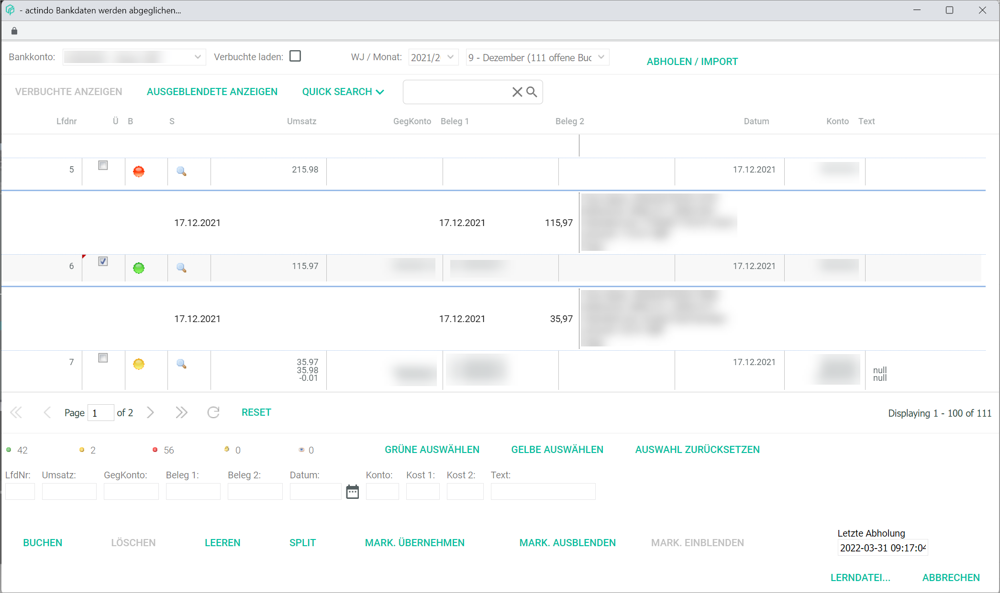
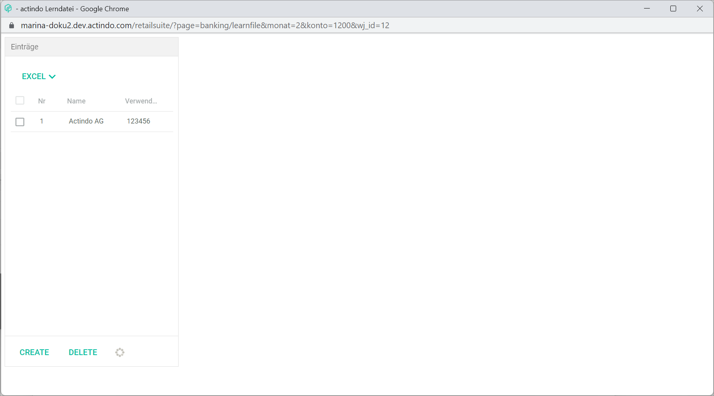

[!!User interface Fiscal year](./00a_FiscalYear.md)
[!!User interface Postings input line](./01_InputLine.md)
[!!User interface Search](./01e_Search.md)
[!!User interface Account sheet](./01c_AccountSheet.md)
[!!User interface Cost accounting](./02e_CostAccounting.md)
[!!Select a fiscal year](../Operation/01_SelectFiscalYear.md)
[!!Manage BWA reports](../Integration/07_ManageBWAReports.md)
[!!Manage receipts](../Operation/10_ManageReceipts.md)

# Postings header

*Accounting > Post*

In all tabs of the *Post* menu entry, an identical header is displayed. The contained elements and the corresponding functions are described below.

- [FY/MONTH/JOURNAL]  
    Click this button to display the *Select fiscal year* window, see [Fiscal year](./00a_FiscalYear.md).

- [EDIT]  
    Click this button to display the *EDIT* context menu. The following menu entries are displayed:

    - *Cash book takeover*  
        Click this menu entry to take over automatically cash payments registered in the cash book. The *Cash book takeover* window is displayed, see [Cash book takeover](#cash-book-takeover).

    - *Bank data takeover*  
        Click this menu entry to take over automatically bank transactions registered in the *Payment processing* module. The *Bank data synchronizing* window is displayed, see [Bank data takeover](#bank-data-takeover). 

    -  *Process*  
        Click this menu entry to process several postings simultaneously. The *Process postings* window is displayed, see [Process](#process).

    -  *Delete*  
        Click this menu entry to delete several postings simultaneously. The *Delete postings* window is displayed, see [Delete](#delete).

    -  *Lock months*  
        Click this menu entry to lock one or several months for postings. The *Lock months* window is displayed, see [Lock months](#lock-months).

    - *Balance carried forward*  
        Click this menu entry to carry forward balances from one fiscal year to the next one. The *Balance carried forward: step 1* window is displayed, see [Balance carried forward](#balance-carried-forward).

    - *Foreign currency wizard*  
        Click this menu entry to post currency exchange differences automatically. The *Foreign currency wizard* window is displayed, see [Foreign currency wizard](#foreign-currency-wizard).

    - *Supplier receipts*  
        Click this menu entry to post specifically supplier receipts. The *Supplier receipts* window is displayed, see [Supplier receipts](#supplier-receipts).

- [EVALUATIONS]  
    Click this button to display the *EVALUATIONS* context menu. The following menu entries are displayed:

    - *Account balance*  
        Click this menu entry to display the *Account balance* window, see [Account balance](#account-balance).

    - *Account sheet*  
        Click this menu entry to display the *Account sheet* window, see [Account sheet](#account-sheet).

    - *Journal*  
        Click this menu entry to display the *Journal* window, see [Journal](#journal).

    - *Balance list*  
        Click this menu entry to display the *Balance list* window, see [Balance list](#balance-list).

    - *Open items*  
        Click this menu entry to display the *Open items* window, see [Open items](#open-items).

    - *BWA*  
        Click this menu entry to display the *BWA* window, see [BWA](#bwa).

    - *ProfitCenter*  
        Click this menu entry to display the *ProfitCenter* window, see [ProfitCenter](#profitcenter).

    - *Cost object comparison*  
        Click this menu entry to display the *Cost object comparison* window, see [Cost object comparison](#cost-object-comparison).

    - *Other*  
        Click this menu entry to display the sub-menu. The following menu entries are displayed:
      - *Chart of accounts*, see [Chart of accounts](#chart-of-accounts).
      - *Deb./Cred.*, see [Deb./cred.](#debtors/creditors).

- *Fiscal year XXXX/Month X/Journal X*  
    The currently selected fiscal year, month and journal are displayed. This field is read-only. To change the fiscal year or the posting period, click the [FY/MONTH/JOURNAL] button. For detailed information, see [Select a fiscal year](../Operation/01_SelectFiscalYear.md).

-  (Left arrow)   
    Click this button to display the *Post extras* search side bar. For detailed information about the search bar, see [Search](./01e_Search.md).

## Cash book takeover  

*Accounting > Post > Button EDIT > Menu entry Cash book takeover*

The list displays all cash payments registered in the cash book, which can be taken over automatically in the *Accounting* module. All fields are read-only, except for those in the *T* column.

[comment]: <> (Link hinzufügen, wenn verfügbar)

- *Seq. no.*  
    Sequential number as registered in the cash book.

- [x] *T (Take over posting)*  
    Select this checkbox to select the posting for the take over. The [SAVE] button is unlocked.

- *PP*  
    Posting period as registered in the cash book.

- *Jnl*  
    Journal as registered in the cash book.

- *Turnover*  
    Turnover value as registered in the cash book. Revenues display a positive sign. Expenditures display a negative sign.

- *Contra Account*  
    Contra account as registered in the cash posting.

  [comment]: <> (No account in cash book! What does the number stand for? As "Unbekannt!")   

- *Receipt 1*  
    Receipt number 1 as registered in the cash book.

- *Receipt 2*  
    Receipt number 2 as registered in the cash book.

- *Date*  
    Date as registered in the cash book.

- *Account*  
    Account as registered in the cash book.

- *Cst1*  
    Cost 1 as registered in the cash book.

- *Cst2*  
    Cost 2 as registered in the cash book.

- *Text*  
    Free text as registered in the cash book.

- [SELECT ALL]     
    Click this button to select all postings in the list.

- [SELECT NOTHING]    
    Click this button to deselect all postings in the list.

- *Amount*  
    Total amount of all postings in the cash book.

An individual posting from the cash book can be selected and partially edited before takeover. Click the posting to be edited. Its details are displayed in the input line.

[comment]: <> (Unsure! Working correctly? Additional Info needed. Add operation file?)

- *Seq. no.*  
    This field displays the posting sequential number and cannot be modified.  

- *Turnover*  
    This field displays the turnover and cannot be modified.

- *Contra account*  
    Enter the appropriate contra account. This field is mandatory.

    > [Info] After you have entered at least two numbers in the field, a list is displayed below the field with all accounts matching the entry. You can select the corresponding account in the list.

- *Receipt 1*  
    Click the field to edit the receipt number.

- *Receipt 2*  
    Click the field to edit the receipt number.

- *Date*  
    This field displays the date and cannot be modified.

- *Account*  
    This field displays the account and cannot be modified.

- *Cost1*  
    Click the field to edit the cost number.

- *Cost2*  
    Click the field to edit the cost number.

- *Text*  
    Click the field to edit the text.

- [POST]    
    Click this button to post the edited posting.

- [DELETE]    
    Click this button to delete the selected posting. A confirmation window is displayed. Click the [OK] button to delete the selected postings.

  [comment]: <> (FEHLER: löschen hier nicht möglich! -> even though takeover not yet performed? Probably because it is linked to cash book/Kassenbuch? What is the use of this button here? Extra Info needed)

- [CLEAR]    
    Click this button to clear all input line fields.

- [SPLIT]    
    Click this button to split the selected posting. The *Split posting* window is displayed, see [Split posting](#split-posting).

  [comment]: <> (Splitbuchungfunktion scheint hier nicht zu funktionieren. Bug? Fehlermeldungen: beim klicking auf SPLIT -> Unbekannte Bankbuchung. Wenn man versucht, eine Splitbuchung zu machen -> Meldung: Gebucht und in rot "Umsatz, GegKonto, Datum oder Konto leer! Ungültiges Datum!" Alle Felder sind aber richtig ausgefüllt, jetzt zeigen sie aber alle 0, außer Beleg 1, GegKonto und Text)

- [SAVE]    
    Click this button to take over the selected postings. The button is only unlocked if at least one posting is selected.

- [CANCEL]    
    Click this button to cancel any changes. A confirmation window is displayed. Click the [OK] button to close the *Cash book takeover* window.

### Split posting

*Accounting > Post > Button EDIT > Menu entry Cash book takeover > Button SPLIT*

For a detailed description of the contained elements and the corresponding functions, see [Split posting](./01_InputLine.md#split-posting).

## Bank data takeover  

*Accounting > Post > Button EDIT > Menu entry Cash book takeover*

The list displays all bank transactions registered in a selected bank account, which can be taken over automatically in the *Accounting* module. This function is linked with the *Payment processing* module, and therefore the *Payment processing* module must be set up first. This window can also be accessed from the *Bank data takeover* menu entry in the *Payment processing* module.

[comment]: <> (Link hinzufügen, wenn verfügbar)

- *Bank account*  
    Click the drop-down list to select the bank account from which data must be imported.

- [x] *Load registered*      
    Select this checkbox to unlock the [SHOW REGISTERED] button. By default, the checkbox is not selected to reduce system overload and improve performance. This default setting can be changed in the *Settings* menu entry of the *Payment processing* module.

  [comment]: <> (Check verbuchte -> registered oder posted?)
  [comment]: <> (Link hinzufügen, wenn verfügbar)

- *FY/Month*  
    Click the corresponding drop-down list to select the fiscal year and month of the data to be displayed.

- [RETRIEVE/IMPORT]  
    Click this button to display the *Retrieve bank data* window, see [Retrieve bank data](#retrieve-bank-data).

- [SHOW REGISTERED]  
    Click this button to display all posted bank transactions.

- [SHOW HIDDEN]  
    Click this button to display all hidden bank transactions.

- [QUICK SEARCH]  
    Click this button to display the *QUICK SEARCH* filter list. The following search criteria are available:
    - *Turnover*
    - *Contra account*
    - *Receipt 1*
    - *Receipt 2*
    - *Account*
    - *Text*
    - *Reference*
    - *Recipient*

- [Search bar]  
    Enter the search text (letters or numbers). The criteria selected in the *QUICK SEARCH* filter list is applied to the search.
    -  (Cross)  
        Click this button to clear the search bar.
    -   (Search)  
        Click this button to start the search. Alternatively, you can press the **ENTER** key. All bank data that match the search criteria are displayed in the list below.

The list displays the imported bank data. Depending on the settings, the displayed columns may vary.

- *Seq. no.*    
  Sequential number of the payment.

- *T* (Take over)   
  Select the checkbox to select the payment.

- *B* (Receipt)   
  Payment status. The following statuses are available:
    - Green  
        The bank transaction has been fully matched (creditor number and receipt 1) with an open item.
    - Yellow  
        The bank transaction has been partially matched with an open item but there are discrepancies to be checked.
    - Red  
        No matching open item found for the bank transaction.

    > [Info] If a bank transaction is matched manually with an open item, an **M** will be displayed in this column.

[comment]: <> (HG: B = Beleg! -> Change column name accordingly here and in IU Terminology file! Add screenshot/icons - Bedeutung von B Spalte? RS Jessie)  

- S (Search)  
    Click the  (Search) button to search for open items.

- *Turnover*  
    Turnover value.

- *Contra account*  
    Assigned contra account.

- *Receipt 1*  
    Receipt number 1, usually the invoice number.

- *Receipt 2*  
    Receipt number 2.

- *Date*  
    Payment date.

- *Account*  
    Assigned account.

- *Text*  
    Posting text.

Additional columns can be displayed by clicking the  (Columns) button in the table header:

- *Customer number*  
- *Invoice number*  
- *Order number*  
- *Customer name*  
- *Customer e-mail address*  

-  (Refresh)  
    Click this button to update the payment list.

- [RESET]  
    Click this button to reset the payment list.

 [comment]: <> (Unsure! Check!)

-  (Fully matche) [x]  
    Bank transactions that are fully matched by the system with an open item are marked green. The *x* indicates the number of bank transactions that have been fully matched.

-  (Partially matched) [x]  
    Bank transactions that are partially matched by the system with an open item and must be checked by the user are marked yellow. The *x* indicates the number of bank transactions that have been partially matched. 

-  (Not matched) [x]  
    Bank transactions that cannot be matched by the system with an open item are marked red. The *x* indicates the number of bank transactions that are not matched. 

-  (Registered) [x]
    Bank transactions that have already been registered. The *x* indicates the number of bank transactions that have been registered. 

-  (Unhidden) [x]
    Bank transactions that were previously hidden and now are displayed again. The *x* indicates the number of bank transactions that have been partially matched. 

- [SELECT GREEN]  
    Click this button to select all fully matched (green) payments.

- [SELECT YELLOW]  
    Click this button to select all fuzzy matched (yellow) payments.

- [RESET SELECTION]  
    Click this button to reset the selection.

The payments can also be processed manually. Click any payment in the list to display its values in the input line fields.

[comment]: <> (HG: vgl. mit Einleitungssatz bei Übernahme Kassenbuch! Warum ist das nicht mehr beschrieben?)

[comment]: <> (Unsure! RS FH. Add operation file? RS FH!)

- *Seq. no.*
- *Turnover*
- *Contra account*
- *Receipt 1*
- *Receipt 2*
- *Date*
  -   (Calendar)
- *Account*
- *Cost1*
- *Cost2*
- *Text*

- [POST]    
    Click this button to post the edited posting.

- [DELETE]    
    Click this button to delete the selected posting. A confirmation window is displayed. Click the [OK] button to delete the selected postings.

- [CLEAR]    
    Click this button to clear all input line fields.

- [SPLIT]    
    Click this button to split the selected posting. The *Split posting* window is displayed, see [Split posting](#split-posting).

[comment]: <> (check split posting vs. breakdown posting)

- [TAKE OVER MARKED]  
    Click this button to register the marked payments in the system.

- [HIDE MARKED]  
    Click this button to hide the marked payments.

- [SHOW MARKED]  
    Click this button to display the marked payments.

- *Last retrieval*

- [LEARN FILE]  
    Click this button to add ... The *Learn file* window is displayed, see [Learn file](#learn-file). 

- [CANCEL]  
    Click this button to cancel retrieving the bank data All changes are rejected. The *Bank data synchronizing* window is closed. 

[comment]: <> (Check) 

### Retrieve bank data

*Accounting > Post > Button EDIT > Menu entry Bank data takeover > Button RETRIEVE/IMPORT*

> [Info] Depending of the account access configured in the *Payment processing* module, the fields displayed vary. 

[comment]: <> (Check mit Jessie)

- *Bank*  
    Click the drop-down list to select the bank account from which the payments are to be retrieved/imported.

- *Account / routing number*  
    Details of the selected bank account.

- *Date from*  
  - **Automatic**   
      Select this option to retrieve/import all available account movements.
  - **Selection**  
      Select this option to specify a date. A date field is displayed.  

[comment]: <> (was bedeutet automatic? Alle verfügbare?)

- *Import definition*   
    Click the drop-down list to select the appropriate import definition. All available import definitions are displayed in the list.  
    - [Edit]   
        If necessary, click the edit button to edit the import definition or create a new one. The *Import/export definitions* window is displayed, see [Import/export definitions](#import/export-definitions).

- *CSV file*  
    Click the [Select file] button to search and select the file to be imported.

- *PIN*  
    Enter the configured pin to retrieve the bank account movements. 

- [CANCEL]  
    Click this button to cancel retrieving/importing the bank data. The *Bank data synchronizing* window is closed.

- [FINALIZE]  
    Click this button to finalize retrieving/importing the bank data. The *Retrieving bank data* notice is displayed.

#### Search open items 

*Accounting > Post > Button EDIT > Menu entry Bank data takeover > Button RETRIEVE/IMPORT > Button Suchen (Luppe)*

[comment]: <> (Screenshot Jessie)

#### Import/Export definitions

*Accounting > Post > Button EDIT > Menu entry Bank data takeover > Button RETRIEVE/IMPORT > Button Edit*

For a detailed description of the contained elements and the corresponding functions, see [Import/export definitions](./03c_CSVFormatDef.md).

### Learn file

*Accounting > Post > Button EDIT > Menu entry Bank data takeover > Button LEARN FILE*

## Process

*Accounting > Post > Button EDIT > Menu entry Process*

- *Journal from - to*  
    Click the drop-down lists to select the journals to be processed. The drop-down lists display all available journals including the postings recorded in each of them. If you want to process only the postings from a single journal, select the same journal in both drop-down lists.

- *Month from - to*   
    Click the drop-down lists to select the months to be processed. If you want to process only the postings from a single month, select the same month in both drop-down lists. The drop-down lists display all available months in the system. The following options are available:  
    - **0 - Balances carried forward**
    - **1 - 12 - (calendar month)**
    - **13 - 15 - Subsequent postings**
    - **16 - 25 - Closing postings**
    - **99 - General month**

- [CANCEL]  
    Click this button to cancel any changes. The *Process* window is closed.

- [OK]  
    Click this button to process all postings within the selected period. The *Postings processed* confirmation window is displayed.

## Delete

*Accounting > Post > Button EDIT > Menu entry Delete*

- *Journal*  
    Click the drop-down list to select the journal containing the postings to be deleted. All available journals including the recorded postings is displayed in the list.

- *Seq. nos.*   
    Enter the range of the sequential numbers to be deleted in the selected journal.

- [CANCEL]  
    Click this button to cancel any changes. The *Delete* window is closed.

- [DELETE]  
    Click this button to delete the selected postings.

## Lock months

*Accounting > Post > Button EDIT > Menu entry Lock months*

- *[x] - [x] month*  
    Click the drop-down list to lock or unlock the corresponding month. The following options are available:
    - **Bookable**  
        Select this option to unlock the corresponding month. The selected month will be available for postings.
    - **Locked**  
        Select this option to lock the corresponding month for postings. No further postings will be recorded in the selected month. Any further postings will be recorded in the next available month.

- [CANCEL]  
    Click this button to cancel any changes. The *Lock months* window is closed.

- [OK]  
    Click this button to save your selection.

## Balance carried forward

*Accounting > Post > Button EDIT > Menu entry Balance carried forward*

**Balance carried forward: Step 1**

- *Carry forward from FY*  
    Click the drop-down list to select the fiscal year containing the balance(s) to be carried forward. All available fiscal years prior to the currently selected fiscal year are displayed in the list.

- *Range from - to*  
    Click the drop-down list to select the account class range containing the balance(s) to be carried forward. The following options are available:
    - **01: Financial accounts**
    - **02: Impersonal accounts**
    - **03: Input tax + VAT**
    - **04: P&L**
    - **05: Open items debtors**
    - **06: Open items creditors**

- *Posting date*  
    Enter the posting date for the balance(s) carried forward.

    > [Info] By default, the system displays the first day of the new fiscal year. This can be modified simply by typing in the desired posting date.

- *Cost accounting*  
    Select the applicable checkbox(es) for the balances to be carried forward. The following checkboxes are available:  
    - [x] *Cost centers*  
        Select this checkbox to carry forward the cost centers.
    - [x] *Cost object*  
        Select this checkbox to carry forward the cost object.
    - [x] *Inactive cost centers/object*  
        Select this checkbox to carry forward inactive cost centers and objects.   

  This field and the corresponding checkboxes are only displayed when cost centers and/or cost objects have been created in the fiscal year from which the balance is carried forward.

- [x] *Delete old balances carried forward from selected FY*  
    Select this checkbox to delete the old balance(s) carried forward from the selected fiscal year. Previous balances carried forward will be replaced by the new balances carried forward. The original postings in the previous fiscal year are not deleted.

- [CANCEL]  
    Click this button to cancel all changes. The *Balance carried forward: Step 1* window is closed.

- [CONTINUE]  
    Click this button to proceed to the next step. The *Retrieve account balances* window is displayed.

**Retrieve account balances**

- *Carry forward from FY*  
    The previously selected fiscal year is displayed. This field is read-only.

- *Range from - to*  
    The previously selected account class range is displayed. These fields are read-only.

- *Date*  
    The previously selected posting date is displayed. This field is read-only.

- *Accounts*  
    Select the accounts for the balance(s) carried forward. All available accounts containing a balance to be carried forward are displayed together with the balance amount. The balance amount can be both positive or negative.

    >[Info] Hold the **Ctrl** (Control) key and click each account with the left mouse button to select multiple accounts simultaneously.

- *Delete old balances carried forward from selected FY*  
    The previously selected option is displayed. This field is read-only.

- [BACK]  
    Click this button to go back to the previous step. The *Balance carried forward: Step 1* window is displayed.

- [CANCEL]  
    Click this button to cancel all changes. The *Retrieve account balances* window is closed.

- [CONTINUE]  
    Click this button to proceed and carry the selected balances forward. The *Balance carried forward completed* pop-up window is displayed. The *Carry balances forward* window is displayed.

**Carry balances forward**

- *Carry forward from FY*  
    The previously selected fiscal year is displayed. This field is read-only.

- *Range from - to*  
    The previously selected account class range is displayed. These fields are read-only.

- *Date*  
    The previously selected posting date is displayed. This field is read-only.

- [CLOSE]  
    Click this button to close the *Carry balances forward* window.

- [CANCEL]  
    Click this button to cancel all changes. The *Carry balances forward* window is closed.

## Foreign currency wizard

*Accounting > Post > Button EDIT > Menu entry Foreign currency wizard*

- *Fiscal year*  
    Click the drop-down list to select the applicable fiscal year. All available fiscal years are displayed in the list.

- *Range of accounts*  
    Click the drop-down list to select the applicable accounts. The following options are available:
    - **Open items debtors and creditors**  
        Select this option to check for exchange rate differences in debtors and creditors accounts.
    - **Open items debtors**  
        Select this option to check for exchange rate differences in debtors accounts.
    - **Open items creditors**  
        Select this option to check for exchange rate differences in creditors accounts.
    - **Individual**  
        Select this option to enter a self-defined account number range. When selecting this option, the fields (*from* - *to*) are displayed. Enter the applicable account number range in these fields.

- *Posting date*  
    Click the  (Calendar) button to select a posting date. Alternatively, you can directly enter a posting date in the format DD.MM.YYYY.

- [BACK]   
    This button is inactive, as there are no previous steps.

[comment]: <> (Comment added in the BUGS document for improvement, e.g. "ABBRECHEN/CANCEL" button instead, like in Saldovortrag function)

- [CONTINUE]  
    Click this button to proceed to the next step. A window for account selection is displayed.

**Account selection**

- *Account selection*  
    Click the drop-down list to select an account. You can select a single or multiple accounts. All available accounts containing the exchange rate difference(s) to be posted are displayed.  

- [BACK]  
    Click this button to go back to the previous step.

- [CONTINUE]  
    Click this button to post the exchange rate difference(s) in the applicable revenues or expenses accounts.

## Supplier receipts

### Acquire a supplier receipt

*Accounting > Post > Button EDIT > Menu entry Supplier receipts > Tab Acquire*

- **/Folder/Document file name Page x**  
This path displays the file location, name and page.

-    
    Click this button to display the previous document.

-    
    Click this button to display the next document.

-   
    Click this button to display the first page of the selected document.

-    
    Click this button to display the previous page of the selected document.

-    
    Click this button to display the next page of the selected document.

- (-)   
    Click this button to zoom in the selected document.

- (+)     
    Click this button to zoom out the selected document.

- *Download file*  
    Click this button to download the document.

- *Turnover*  
    Enter the turnover value to be registered. This field is mandatory.

- *ContraAcct*  
    Enter the appropriate contra account. This field is mandatory.

    > [Info] After you have entered at least three characters in the field, a list is displayed with all accounts matching the entry. You can select the corresponding account in the list.

- *Reference1*  
    Enter an applicable reference value.

- *Reference2*  
    Enter an applicable reference value.

- *Date*  
    Enter the posting date. The valid date format is DDMMYY. This field is mandatory.

- *Supplier*  
    Enter the applicable supplier account. This field is mandatory.

    > [Info] After you have entered at least three characters in the field, a list is displayed with all accounts matching the entry. You can select the corresponding account in the list.

- *Posting text*  
    Enter an appropriate posting text. This field is mandatory.

- *Payment target*  
    Click the drop-down list to select the appropriate payment target. If a payment target is configured in the supplier settings, it is preselected. The following options are available:
    - **1 - 8 d 2%, 30 d net**
    - **2 - 30 d net**

- *Exchange rate*  
    Enter the applicable exchange rate.

- *Cost center*  
    Enter the appropriate cost center.

- *Cost object*  
    Enter the appropriate cost object.

- *Commentary for auditors*  
    Enter any relevant comments for potential auditors.

- [ACQUIRE]  
    Click this button to register the receipt in the system.

- [SPLIT]  
    Click this button to perform a split posting. The *Breakdown posting* window is displayed, see [Breakdown posting](#breakdown-posting).

### Overview

*Accounting > Post > Button EDIT > Menu entry Supplier receipts > Tab Overview*

- [QUICK SEARCH]  
    Click this button to display the *QUICK SEARCH* filter list. The following search criteria are available:
    - *Status*  
    - *Supplier*
    - *ContraAcct*
    - *Doc*  
    - *Reference1*
    - *Reference2*
    - *Posting text*
    - *Date*
    - *Amount*
    - *Flag*
    - *Comment*
    - *Comments*
    - *Reason for rejection*
    - *Created by*
    - *Modified by*
    - *Date (creation)*
    - *Date (modification)*
    - *Rejected*
    - *Supervisor*
    - *Cost center*
    - *Cost object*

- [Search bar]  
    Enter the search text (letters or numbers). The criteria selected in the *QUICK SEARCH* filter list is applied to the search.
-  (Cross)  
    Click this button to clear the search bar.
-  (Search)  
    Click this button to start the search. Alternatively, you can press the **ENTER** key.

- [ACTIVE FILTERS]  
    Click this button to display the filter menu.

  - [x] *ACTIVE*   
    Select the checkbox to activate the corresponding search criteria.

  - *FILTER BY*  
    The following filter values are available:

    - *Status*  
        Click the drop-down list to select one or several of the following filter criteria:
        - **New**
        - **Released**
        - **Rejected**
        - **Completed**   

    - *Supplier*  
        Enter the appropriate supplier account.

    - *ContraAcct*  
        Enter the appropriate contra account.

    - *Reference1*  
        Enter an appropriate reference value.

    - *Reference2*  
        Enter an appropriate reference value.

    - *Posting text*  
        Enter an appropriate posting text.

    - *Date*  
        Click the drop-down list to select the applicable search criteria:
        - **=**  
            Search for an exact date.
        - **between**  
            Search for a date range.
        - **before**  
            Search for a period up to a specific date.
        - **after**  
            Search for a period after a specific date.   

        Click the  (Calendar) button to select a date. Alternatively, you can directly enter a date in the format mm/dd/yy.

    - *Payment target*  
        Click the drop-down list to select the applicable payment target. The following options are available:
        - **1 - 8 d 2%, 30 d net**
        - **2 - 30 d net**

    - *Created by*  
        Enter the name of the applicable user.

    - *Modified by*  
        Enter the name of the applicable user.

    - *Rejected by*  
        Enter the name of the applicable user.

    - *Date (creation)*  
        Click the drop-down list to select the applicable search criteria:
        - **=**  
            Search for an exact date.
        - **between**  
            Search for a date range.
        - **before**  
            Search for a period up to a specific date.
        - **after**  
            Search for a period after a specific date.   

        Click the  (Calendar) button to select a date. Alternatively, you can directly enter a date in the format mm/dd/yy.

    - *Date (modification)*  
        Click the drop-down list to select the applicable search criteria:
        - **=**  
            Search for an exact date.
        - **between**  
            Search for a date range.
        - **before**  
            Search for a period up to a specific date.
        - **after**  
            Search for a period after a specific date.   

        Click the  (Calendar) button to select a date. Alternatively, you can directly enter a date in the format mm/dd/yy.

    - *Rejected*  
        Click the drop-down list to select the applicable filter criteria. The following options are available:
        - **No**
        - **Yes**

    - *Supervisor*  
        Enter the name of the applicable supervisor.

    - [CANCEL]  
        Click this button to cancel the filter selection. The filter menu is closed.

    - [APPLY]  
        Click this button to apply the filter criteria. The filter menu is closed.

The list displays all available supplier receipts. Depending on the settings, the displayed columns may vary. All fields are read-only.

- *Status*  
    Status of the supplier receipt. Each status is identified with a different color code. Hover over the status icon with the mouse to reveal its meaning. The following statuses are available:
    -  New
    -  Released
    -  Rejected
    -  Completed

    > [Info] The *Supplier receipts* feature works together with the *Purchasing* module, where the supplier receipts are checked and released (or rejected) by the assigned supervisor. The status changes accordingly in both modules. For detailed information, see [Post a supplier receipt](../Operation/10_ManageReceipts.md#post-a-supplier-receipt).

- *Supplier*  
    Supplier account number.

- *ContraAcct*  
    Contra account number.

- *Doc*  
    Click the  icon to display the acquired receipt in a new window. The *Attached document* window is displayed, see [Attached document](#attached-document).

- *Reference1*  
    Reference 1 value.

- *Reference2*  
    Reference 2 value.

- *Posting text*  
    Posting text.

- *Date*  
    Date of the receipt.

- *Amount*  
    Turnover amount.

- *Payment target*  
    Selected payment target.

- *Flag*  
    Color name. The color name is only displayed, if the receipt has been flagged in the *Purchasing* module.

[comment]: <> (Link hinzufügen, wenn verfügbar)  

- *Comment*  
    Comment. The comment is only displayed if a comment has been added by flagging the receipt in the *Purchasing* module.

- *Comments*  
    If further comments have been added, the  (Comment) icon is displayed. Click the icon to display the comment(s) in a new window.

[comment]: <> (Link hinzufügen, wenn verfügbar)  

- *Reason for rejection*   
    If the receipt has been rejected and a reason has been entered, the  (Comment) icon is displayed. Hover over the icon to display the comment.

- *Created by*   
    User name of the user who created the receipt.

- *Modified by*   
    User name of the user who edited the receipt.

- *Rejected by*   
    User name of the user who rejected the receipt.

- *Date (created)*   
    Creation date.

- *Date (modification)*   
    Modification date.

- *Rejected*   
    If rejected, a struck-through red-colored **Yes** is displayed.

- *Supervisor*    
    User name of the user who supervised the receipt.

-  (First page)   
    Click this button to go to the first page.

-  (Previous page)
    Click this button to go to the previous page.

-  (Next page)  
    Click this button to go to the next page.

-  (Last page)  
    Click this button to go to the last page.

- *Page*    
    Enter a page number to go to the entered page.

-  (Refresh)  
    Click this button to update the receipt list.

- [RESET]  
    Click this button to reset the receipt list view.

### Financial accounting takeover

*Accounting > Post > Button EDIT > Menu entry Supplier receipts > Tab Financial accounting takeover*

- [x]     
    Select the checkbox to select a receipt for takeover and unlock the entry line in the bottom. If you select the checkbox in the header, all receipts in the list are selected.

The list displays all receipts with **Released** status.

- *Supplier*   
    Supplier account number.

- *ContraAcct*   
    Contra account number.

- *Doc*   
    Click the  button to display the acquired receipt in a new window. The *Attached document* window is displayed, see [Attached document](#attached-document).

- *Reference1*   
    Reference 1 value.

- *Reference2*   
    Reference 2 value.

- *Posting text*   
    Posting text.

- *Date*  
    Date of the receipt.

- *Amount*   
    Turnover amount.

- *Payment target*   
    Selected payment target.

- *Flag*  
    Color name. The color name is only displayed, if the receipt has been flagged in the *Purchasing* module.

[comment]: <> (Link hinzufügen, wenn verfügbar)  

- *Comment*   
    Comment. The comment is only displayed if a comment has been added by flagging the receipt in the *Purchasing* module.

- *Comments*   
    If further comments have been added, the  (Comment) icon is displayed. Click the icon to display the comment(s) in a new window.

[comment]: <> (Link hinzufügen, wenn verfügbar)  

- *Reason for rejection*   
    If the receipt has been rejected and a reason has been entered, the  (Comment) icon is displayed. Hover over the icon to display the comment.

- *Cost center*   
    Number of assigned cost centers.

- *Cost object*   
    Number of assigned cost object.

- *Split posting*    
    Indication if the receipt is split to postings. The following options can be displayed:
    - **No**
    - **Yes**

- *Exchange rate*   
    Number of exchange rates.

-  (First page)   
    Click this button to go to the first page.

-  (Previous page)
    Click this button to go to the previous page.

-  (Next page)  
    Click this button to go to the next page.

-  (Last page)  
    Click this button to go to the last page.

- *Page*   
    Enter a page number to go to the entered page.

-  (Refresh)  
    Click this button to update the receipt list.

- [RESET]  
    Click this button to reset the receipt list view.

The input line is unlocked if at least one checkbox is selected.

- *Turnover*    
    Click the field to edit the turnover amount.

- *ContraAcct*    
    Click the field to edit the contra account number.

- *Reference1*    
    Click the field to edit the receipt 1 value.

- *Reference2*   
    Click the field to edit the receipt 2 value.

- *Date*   
    Click the field to edit the date. The valid date format is DDMMYY.

- *Supplier*    
    Supplier number. The field is read-only.

- *Posting text*    
    Click the field to edit the posting text.

- *Payment target*    
    Payment target of the selected receipt. This field is read-only.

- *Exchange rate*   
    Click the field to edit the exchange rate.

- *Cost center*   
    Click the field to edit the cost center.

- *Cost object*   
    Click the field to edit the cost object.

- [SAVE]  
    Click this button to save any changes made to receipt data.

- [TAKE OVER SELECTED ONES]  
    Click this button to register the selected receipts in the system.

- [SPLIT]  
    Click this button to perform a split posting if necessary. The *Breakdown posting* window is displayed, see [Breakdown posting](#breakdown-posting).

#### Attached document

*Accounting > Post > Button EDIT > Menu entry Supplier receipts > Tab Overview > Button B*

> [Info] This window can also be accessed via the [ACCOUNT SHEET](./01c_AccountSheet.md#attached-document) tab in the user interface.

**/Folder/Document file name Page x**  
This path displays the file location, name and page.

-    
    Click this button to display the previous document.

-    
    Click this button to display the next document.

-   
    Click this button to display the first page of the selected document.

-    
    Click this button to display the previous page of the selected document.

-    
    Click this button to display the next page of the selected document.

- (-)   
    Click this button to zoom in the selected document.

- (+)     
    Click this button to zoom out the selected document.

- *Download file*  
    Click this button to download the document.

A miniature view of the selected document is displayed in the bottom right corner of the workspace.

- [CANCEL ASSIGNMENT]  
    Click this button to unassign the receipt from the selected posting. The *Attached document* window is closed. This button is only displayed when needed.

- [CLOSE]  
    Click this button to close the *Attached document* window.

#### Breakdown posting

*Accounting > Post > Button EDIT > Menu entry Supplier receipts > Tab Financial accounting takeover > Select receipt > Button SPLIT*

The list displays the selected receipt for the split booking. Depending on the settings, the displayed columns may vary. All fields are read-only.

- *Supplier*   
    Supplier number. By default, this field is empty.

- *ContraAcct*    
    Contra account number.

- *Reference1*     
    Receipt 1 value, usually the invoice number.

- *Reference2*    
    Receipt 2 value, which can be any other reference number, such as the order number.

- *Posting text*   
    Posting text.

- *Date*   
    Posting date.

- *Amount*    
    Turnover amount.

- *Payment target*   
    Payment target of the receipt. By default, this field is empty.

- *REST*  
    Remaining amount to be split.

By default, the data of the selected receipt is preset in the input line.

- *Turnover*  
    Click the field to edit the turnover amount for each partial posting.

    > [Info] When the total receipt amount has been divided, the rest amount will equal 0. At this point, the [APPLY] button is unlocked and can be selected.

- *ContraAcct*    
    Click the field to edit the corresponding contra account for each partial posting.

- *Reference1*    
    Click the field to edit the receipt 1 value for each partial posting.

- *Reference2*   
    Click the field to edit the receipt 2 value for each partial posting.

- *Date*   
    Receipt date. This field is read-only.

- *Supplier*  
    Supplier number. This field is read-only.

- *Posting text*  
    Click the field to edit a posting text for each partial posting.

- *Payment target*  
    Payment target of the receipt. This field is read-only.

- *Exchange rate*  
    Click the field to edit the exchange rate.

- *Cost center*  
    Click the field to edit the applicable cost center.

- *Cost object*  
    Click the field to edit the applicable cost object.

- [SAVE]  
    Click this button to save the partial postings and record them in the selected posting period.

- [DELETE]  
    Click this button to delete a selected partial posting. This button is only unlocked, if a partial posting is selected.

- [CLEAR]  
    Click this button to clear all input line fields.

- [APPLY]  
    Click this button to apply the split posting.

## Account balance

*Accounting > Post > Button EVALUATIONS > Menu entry Account balance*

- *Account*  
    Enter the account number to be displayed.

- *Date*  
    Enter the period to be included. The start and the end date of the currently selected fiscal year is displayed by default.

- *Sorting*  
    Click the drop-down list to select the sorting mode. The following options are available:
    - **Date**  
        Select this option to sort the data by date. If sorting by date is selected, the *Debit-credit interest rate* fields are displayed.  
    - **Amount**  
        Select this option to sort the data by amount.

- *Debit-credit interest rate*  
    Enter the corresponding values in both fields.

- *Sorting*  
    Click the drop-down list to select the sorting mode. The following options are available:
    - **Normal**  
        Select this option to include all data available matching the previously selected criteria.
    - **By cost centers**  
        Select this option to sort the data by cost center. When selecting this option, a new drop-down list is displayed containing the available cost centers. This option is only displayed if cost centers have been set up, see [Cost accounting](./02e_CostAccounting.md).
    - **By cost object**  
        Select this option to sort the data by cost object. When selecting this option, a new drop-down list is displayed containing the available cost objects.  This option is only displayed if cost objects have been set up, see [Cost accounting](./02e_CostAccounting.md).

- [CLOSE]  
    Click this button to close the window.

- [PRINT]  
    Click this button to create the evaluation report in a printable format. An evaluation report preview is displayed in a new window.

## Account sheet

*Accounting > Post > Button EVALUATIONS > Menu entry Account sheet*

- [x] *Accounts newly posted to*  
    Select the checkbox to include only the newly added postings.

- [x] *Reset mark*  
    This checkbox must be selected for the previously set function to work.

- *Month*  
    Enter the period of months to be included.

- *Date*  
    Enter the date range. The valid date format is DDMMYY.

- *Accounts*  
    Enter the account number range to be displayed.

- *Sorting*  
    Click the drop-down list to select the sorting mode. The following options are available:
    - **Normal**  
        Select this option to include all data available matching the previously selected criteria.
    - **By cost centers**  
        Select this option to sort the data by cost center. When selecting this option, a new drop-down list is displayed containing the available cost centers. This option is only displayed if cost centers have been set up, see [Cost accounting](./02e_CostAccounting.md).
    - **By cost object**  
        Select this option to sort the data by cost object. When selecting this option, a new drop-down list is displayed containing the available cost objects.  This option is only displayed if cost objects have been set up, see [Cost accounting](./02e_CostAccounting.md).

- [CANCEL]  
    Click this button to cancel the selection. The *Account sheet* window is closed.

- [PRINT]  
    Click this button to create the evaluation report in a printable format. The evaluation report preview is displayed in a new window.

## Journal

*Accounting > Post > Button EVALUATIONS > Menu entry Journal*

- *Month*  
    Enter the period of months to be included.

- *Journals*  
    Enter the period of journals to be included.

- *Sorting*  
    Click the drop-down list to select the sorting mode. The following options are available:
    - **Normal**  
        Select this option to include all data available matching the previously selected criteria.
    - **By cost centers**  
        Select this option to sort the data by cost center. When selecting this option, a new drop-down list is displayed containing the available cost centers. This option is only displayed if cost centers have been set up, see [Cost accounting](./02e_CostAccounting.md).
    - **By cost object**  
        Select this option to sort the data by cost object. When selecting this option, a new drop-down list is displayed containing the available cost objects.  This option is only displayed if cost objects have been set up, see [Cost accounting](./02e_CostAccounting.md).

- [CANCEL]  
    Click this button to cancel your selection. The *Journal* window is closed.

- [PRINT]  
    Click this button to create the evaluation report in a printable format. The evaluation report preview is displayed in a new window.

## Balance list

*Accounting > Post > Button EVALUATIONS > Menu entry Balance list*

- *Billing month*  
    Click the drop-down list to select the month to be included. The following options are available:  
    - **0 - Balances carried forward**
    - **1 - 12 - (calendar month)**
    - **13 - 15 - Subsequent postings**
    - **16 - 25 - Closing postings**
    - **99 - General month**

- *Accounts*  
    Click the drop-down list to select the accounts to be displayed. The following options are available:  
    - **Impersonal accounts**  
        Select this option to include impersonal accounts only.
    - **Customers (10000 - 69999)**  
        Select this option to include customers accounts only.
    - **Suppliers (70000 - 99999)**  
        Select this option to include suppliers accounts only.
    - **Individual**  
        Select this option to enter a self-defined account number range. When selecting this option, the fields *Accounts from* and *Accounts to* are displayed.

- *Accounts from*    
    Enter the start number of the account range. This field is only displayed if the option **Individual** is selected in the *Accounts* drop-down list.

- *Accounts to*   
    Enter the end number of the account range. This field is only displayed if the option **Individual** is selected in the *Accounts* drop-down list.

- *Layout*  
    Click the drop-down list to select the layout. There following options available:  
    - **Normal**  
        Select this option to display a normal view.
    - **Balance list**  
        Select this option to display a balance list view.

- *Sorting*  
    Click the drop-down list to select the sorting mode. The following options are available:
    - **Normal**  
        Select this option to include all data available matching the previously selected criteria.
    - **By cost centers**  
        Select this option to sort the data by cost center. When selecting this option, the *Cost center* and the *Show distribution* drop-down list are displayed. This option is only displayed if cost centers have been set up, see [Cost accounting](./02e_CostAccounting.md).
    - **By cost objects**  
        Select this option to sort the data by cost object. When selecting this option, the *Cost object* and the *Show distribution* drop-down list are displayed. This option is only displayed if cost objects have been set up, see [Cost accounting](./02e_CostAccounting.md).

- *Cost center*   
    Click the drop-down list to select the applicable cost center. All available cost centers are displayed in the list.

- *Cost object*    
    Click the drop-down list to select the applicable cost object. All available cost objects are displayed in the list.

- *Show distribution*   
    Select whether or not allow further customization on the evaluation report. This drop-down list is only displayed if either the option **By cost centers** or **By cost objects** is selected in the *Sorting* drop-down list. The following options are available:
    - **No**
    - **Yes**

- [CANCEL]  
    Click this button to cancel your selection. The *Balance list* window is closed.

- [PRINT]  
    Click this button to create the evaluation report in a printable format.

## Open items

*Accounting > Post > Button EVALUATIONS > Menu entry Open items*

- *Accounts*  
    Click the drop-down list to select the accounts to be displayed. The following options are available:  
    - **Customers (10000 - 69999)**  
        Select this option to include customers accounts only.
    - **Suppliers (70000 - 99999)**  
        Select this option to include suppliers accounts only.
    - **Individual**  
        Select this option to enter a self-defined account number range. When selecting this option, two new *Accounts* fields are displayed. Enter the applicable account number range in these fields.

- *Month up to*  
    Click the drop-down list to select the month range to be included. All months between month 0 and the selected month will be displayed. The following options are available:
    - **0 - Balances carried forward**
    - **1 - 12 - (calendar month)**
    - **13 - 15 - Subsequent postings**
    - **16 - 25 - Closing postings**
    - **99 - General month**

- *Format*  
    Click the drop-down list to select the desired format. The following options are available:
    - **Short format**  
    - **Short format, reduce postings**  
    - **Detailed**

- [x] *Print manually cleared open items*   
    Select the checkbox to include all manually cleared open items.

- [CANCEL]  
    Click this button to cancel your selection. The *Open items* window is closed.

- [PRINT]  
    Click this button to create the evaluation report in a printable format. An evaluation report preview is displayed in a new window.

## BWA

*Accounting > Post > Button EVALUATIONS > Menu entry BWA*

- *Sorting*  
    Click the drop-down list to select the sorting mode. The following options are available:
    - **Normal**  
        Select this option to include all data available matching the previously selected criteria.
    - **By cost centers**  
        Select this option to sort the data by cost center. When selecting this option, a new drop-down list containing the available cost centers is displayed. This option is only displayed if cost centers have been set up, see [Cost accounting](./02e_CostAccounting.md).
    - **By cost objects**  
        Select this option to sort the data by cost object. When selecting this option, a new drop-down list is displayed containing the available cost objects. This option is only displayed if cost objects have been set up, see [Cost accounting](./02e_CostAccounting.md).

- [x] *Print cost center allocation*  
    Select the checkbox to display the cost center allocation.

- *Month from - to*  
    Click the drop-down lists to select the month range to be included. The following options are available:
    - **0 - Balances carried forward**
    - **1 - 12 - (calendar month)**
    - **13 - 15 - Subsequent postings**
    - **16 - 25 - Closing postings**
    - **99 - General month**   

- *Comparison year* - *Comparison year 2*  
    Click the drop-down list to select two different years to be compared with each other. All available fiscal years are displayed in the list. If no year for comparison is desired, select the option **No year for comparison**.

- *BWA number*  
    Click the drop-down list to select the BWA report type to be created. All available BWA reports are displayed in the list. The following options are available by default:
    - **1: Profit and loss account**
    - **2: Cash basis accounting**
    - **3: Liquidity statement**
    - **6: Liquidity**
    - **20: Monthly balance**

    > [Info] These evaluation reports are preconfigured in the system. All available reports can be completely customized or used as provided, and new reports can also be created. Any newly created reports will be displayed in the drop-down list. For detailed information about creating and managing BWA reports, see [Manage BWA reports](../Integration/07_ManageBWAReports.md).

- *Layout*  
    Click the drop-down list to select the desired layout. The following options are available:
    - **Month - cum. - cum. previous year**
    - **13 months cumulative**
    - **Previous year comparison**
    - **13 months with comparison**

- *Show account*  
    Click the drop-down list to select whether or not the account number is to be included. The following options are available:
    - **No**
    - **Yes**

- [CANCEL]  
    Click this button to cancel your selection.

- [PRINT]  
    Click this button to create the evaluation report in a printable format. An evaluation report preview is displayed in a new window.

## ProfitCenter

*Accounting > Post > Button EVALUATIONS > Menu entry ProfitCenter*

- *Month*  
    Click the drop-down list to select the month to be included. The following options are available:  
    - **0 - Balances carried forward**
    - **1 - 12 - (calendar month)**
    - **13 - 15 - Subsequent postings**
    - **16 - 25 - Closing postings**
    - **99 - General month**  

- *Comparison year*  
    Click the drop-down list to select a comparison year. If no year for comparison is desired, select the option **No comp. year**.

- *Cost object group*  
    Click the drop-down list to select a cost object group. If no cost object group is needed, select the option *0 - No group*.  

    > [Info] For detailed information about creating and managing cost objects, see [Cost accounting](./02e_CostAccounting.md).

- *BWA number*  
    Click the drop-down list to select the BWA report type to be created. All available BWA reports are displayed in the list. The following options are available by default:
    - **1: Profit and loss account**
    - **2: Cash basis accounting**
    - **3: Liquidity statement**
    - **6: Liquidity**
    - **20: Monthly balance**

    > [Info] These evaluation reports are preconfigured in the system. All available reports can be completely customized or used as provided, and new reports can also be created. Any newly created reports will be displayed in the drop-down list. For detailed information about creating and managing BWA reports, see [Manage BWA reports](../Integration/07_ManageBWAReports.md).

- *Layout*  
    Click the drop-down list to select the desired layout. The following options are available:  
    - **Month - Month previous year**
    - **Month - cum. - cum. previous year**
    - **13 months**
    - **Front page**

- [CANCEL]  
    Click this button to cancel your selection. The *BWA* window is closed.

- [PRINT]  
    Click this button to create the evaluation report in a printable format. An evaluation report preview is displayed in a new window.

## Cost object comparison

*Accounting > Post > Button EVALUATIONS > Menu entry Cost object comparison*

- *Month*  
    Click the drop-down list to select the month to be included. The following options are available:  
    - **0 - Balances carried forward**
    - **1 - 12 - (calendar month)**
    - **13 - 15 - Subsequent postings**
    - **16 - 25 - Closing postings**
    - **99 - General month**  

- *Cost object group*  
    Click the drop-down list to select a cost object group. All available cost object groups are displayed in the list.

    > [Info] For detailed information about creating and managing cost objects, see [Cost accounting](./02e_CostAccounting.md).

- *BWA number*  
    Click the drop-down list to select the BWA report type to be created. All available BWA reports are displayed in the list. The following options are available by default:
    - **1: Profit and loss account**
    - **2: Cash basis accounting**
    - **3: Liquidity statement**
    - **6: Liquidity**
    - **20: Monthly balance**

    > [Info] These evaluation reports are preconfigured in the system. All available reports can be completely customized or used as provided, and new reports can also be created. Any newly created reports will be displayed in the drop-down list. For detailed information about creating and managing BWA reports, see [Manage BWA reports](../Integration/07_ManageBWAReports.md).

- [CANCEL]  
    Click this button to cancel your selection. The *Cost object comparison* window is closed.

- [PRINT]  
    Click this button to create the evaluation report in a printable format. An evaluation report preview is displayed in a new window.

## Chart of accounts

*Accounting > Post > Button EVALUATIONS > Menu entry Other > Sub-menu entry Chart of accounts*

- *Accounts*  
    Enter the account number range to be displayed.

- *Sorting*  
    Click the drop-down list to select the sorting mode. The following options are available:
    - **By number**
    - **By name**

- [x] *ONLY posted to*  
    Select this checkbox to display only accounts posted to.

- [CANCEL]  
    Click this button to cancel your selection. The *Chart of accounts* window is closed.

- [PRINT]  
    Click this button to create the evaluation report in a printable format. An evaluation report preview is displayed in a new window.

## Debtors/creditors

*Accounting > Post > Button EVALUATIONS > Menu entry Other > Sub-menu entry Deb./cred.*

- *Accounts*  
    Enter the account number range to be displayed.

- [CANCEL]  
    Click this button to cancel your selection. The *Debtors/creditors* window is closed.

- [PRINT]  
    Click this button to create the evaluation report in a printable format. An evaluation report preview is displayed in a new window.
