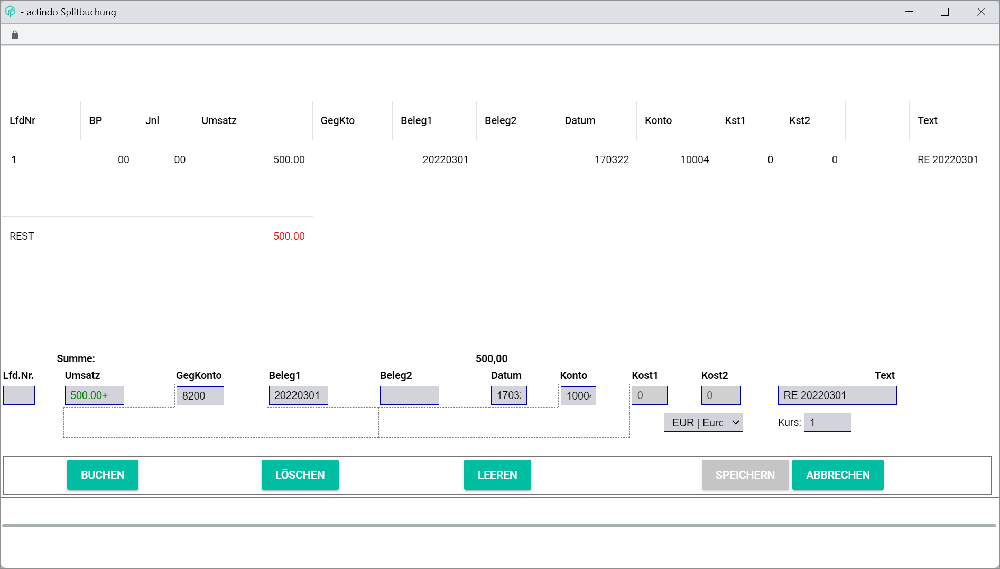

# Postings input line

*Accounting > Post*

In all tabs of the *Post* menu entry, an identical footer with the input line is displayed. The contained elements and the corresponding functions are described below.

- *Seq. no.*  
    Enter a posting number or leave the field empty. Posting numbers must be sequential. If the field is left empty, the next available number is automatically added by the system.

- *Currency code*  
    Click the drop-down menu to select the appropriate currency. All available currencies are displayed in the list. By default, the base currency is preselected.  

    > [Info] It is possible to set up accounts and post transactions in different currencies, but the *Accounting* module can only work with the base currency configured in the system. For detailed information about managing and posting exchange rate fluctuations, see [Post exchange rate fluctuations](../Operation/12_BookExchangeRateFluctuations.md).

- *Exchange rate*  
    Current exchange rate of the selected currency in the *Currency code* field. This field is automatically updated when changing the currency. It is recommended not to edit the field manually.

    > [Info] The system retrieves once a day the current foreign currency exchange rates as published by the ECB and applies them automatically, therefore always working with the most up-to-date information.

- *Turnover*  
    Enter the turnover value. Turnover values can be positive (incomes) or negative (expenses). This field is mandatory.

- *Contra account*  
    Enter the appropriate contra account. This field is mandatory.

    > [Info] After you have entered at least two numbers in the field, a list is displayed below the field with all accounts matching the entry. You can select the corresponding account in the list.

- *Receipt1*  
    Enter an appropriate reference value, such as the invoice number.

    > [Info] Even though it is not mandatory, it is highly recommended to fill in the *Receipt 1* field, as the system identifies and groups together any subsequent postings taking this field as reference, for example for an invoice settlement or a credit note in case of refund.

- *Receipt2*  
    Enter any other appropriate reference value, such as order number.

- *Date*  
    Enter the posting date. The valid date format is DDMMYY.

- *Account*   
    Enter the appropriate account number, for example a personal account number, that is, customer or supplier number. A valid range for personal account numbers (10000-69999 for customers and 70000-99999 for suppliers) is predefined in the system.

- *COST1*  
    Enter the applicable cost center number.  This field is only applicable if at least one cost center has been set up. For detailed information, see [COST ACCOUNTING](./02e_CostAccounting.md).

- *COST2*  
    Enter the applicable cost object number. This field is only applicable if at least one cost object has been set up. For detailed information, see [COST ACCOUNTING](./02e_CostAccounting.md).

- *Posting text*  
    Enter any appropriate posting text. Posting text can contain a combination of letters and numbers. The text is limited to 30 characters.

The following fields below the input line are filled in automatically when creating a manual posting or selecting a posting in the list. All fields are read-only.

- *Contra account*  
    Contra account name of the selected posting.

- *Balance*  
    Contra account balance. H stands for credit. S stands for debit.

- *Account*  
    Account name of the selected posting.

- *Balance*  
    Account balance. H stands for credit. S stands for debit.

- *Amount*  
  Total amount of all postings in the list.

    - *Amount 1*  
        Click this button to manually set an amount 1. The *Set amount 1* window is displayed, see [Set amount 1](#set-amount-1).

    - *Amount 2*  
        Click this button to manually set an amount 2. The *Set amount 2* window is displayed, see [Set amount 2](#set-amount-2).

## Set amount 1

*Accounting > Post > Button Amount 1*

- *Amount 1*  
    Click this field to manually enter an amount.

- [CANCEL]  
    Click this button to cancel any changes. The *Set amount 1* window is closed.

- [OK]  
    Click this button to set the entered amount. A confirmation window is displayed. Click the [OK] button to close the *Set amount 1* window.

## Set amount 2

*Accounting > Post > Button Amount 2*

- *Amount 2*  
    Click this field to manually enter an amount.

- [CANCEL]  
    Click this button to cancel any changes. The *Set amount 2* window is closed.

- [OK]  
    Click this button to set the entered amount. A confirmation window is displayed. Click the [OK] button to close the *Set amount 2* window.

The function buttons in the footer allow to manage the postings manually.

- [POST]    
    Click this button to post the transaction entered in the input line, see [Create a manual posting](../Operation/04_CreateManualBooking.md).

- [CANCEL]  
    Click this button to cancel the selected posting. For detailed information, see [Cancel a posting](../Operation/05_CancelBooking.md).

- [DELETE]    
    Click this button to delete the selected posting. For detailed information, see [Delete a single posting](../Operation/06_DeleteBookings.md#delete-a-single-posting).

- [CLEAR]    
    Click this button to clear all input line fields.

- [SPLIT]    
    Click this button to split a manual posting. The *Split posting* window is displayed, see [Split posting](#split-posting). For detailed information about splitting a posting, see [Split a posting](../Operation/09_SplitBooking.md).

- [ASSIGN RECEIPT]  
    Click this button to assign a receipt to the selected posting or to unassign a receipt from the selected posting. If no document is assigned to the selected posting, the *Attach document* window is displayed, see [Attach a document](#attach-document). If a document is already assigned to the selected posting, the *Attached document* window is displayed, see [Attached document](#attached-document). For detailed information, see [Retrieve a receipt](../Operation/10_ManageReceipts.md#retrieve-a-receipt).

## Split posting

*Accounting > Post > Tab POSTINGS > Button SPLIT*

**Postings list**

The list displays the selected posting and all partial postings. All fields are read-only.

- *Seq. no.*  
    Sequential number of the posting. The posting numbers must be sequential and are added by the system automatically.

- *PP*  
    Month number of the posting period. 00 is displayed.

[comment]: <> (Bug? Should the actual posting period -month/journal- be shown here?)

- *Jnl*  
    Journal number of the posting period. 00 is displayed.

[comment]: <> (Bug? Should the actual posting period -month/journal- be shown here?)

- *Turnover*  
    Turnover value.

- *Contra account*  
    Contra account number. No information is displayed. The corresponding contra accounts are assigned to each split posting.

- *Receipt1*  
    Receipt 1 value, usually the invoice number.

- *Receipt2*  
    Receipt 2 value, which can be any other reference number, such as the order number.

- *Date*  
    Posting date. The valid date format is DDMMYY.

- *Account*  
    Account number, usually a personal account number, that is, a customer or supplier account number.

- *Cost1*  
    Number of the selected cost center. This field is only applicable if at least one cost center has been set up. For detailed information, see [COST ACCOUNTING](./02e_CostAccounting.md)

- *Cost2*  
    Number of the selected cost object. This field is only applicable if at least one cost object has been set up. For more details, see [COST ACCOUNTING](./02e_CostAccounting.md).

- *Text*  
    Posting text.

[comment]: <> (There seems to be an unnamed column between Kst2 and Text, usually where B/Belege comes in. When clicking a posting with a linked receipt, the B icon does not appear here. No option to link a receipt here either, so left out from description. Bug/comment?)

- *REST*  
    Outstanding invoice amount to be split. As soon as the remaining amount equals 0, the [SAVE] button is unlocked.  

- *Amount*  
    This field displays the total invoice amount.

**Input line**

The input line allows to split the posting.

- *Seq. no.*  
    Enter the posting number or leave the field empty. Posting numbers must be sequential. If the field is left empty, the next available number is automatically added by the system.

- *Turnover*  
    Enter the turnover value for each partial posting. This field is mandatory.

- *Contra account*  
    Enter the appropriate contra account for each partial posting. This field is mandatory.

- *Receipt1*  
    Enter an appropriate reference value, such as the invoice number, for each partial posting if necessary.

- *Receipt2*  
    Enter any other appropriate reference value, such as order number, for each partial posting if necessary.

- *Date*  
    Posting date. This field cannot be modified.

- *Account*  
    Account number. This field cannot be modified.

- *Cost1*  
    Enter the applicable cost center number. This field is only applicable if at least one cost center has been set up. For detailed information, see [COST ACCOUNTING](./02e_CostAccounting.md).

- *Cost2*  
    Enter the applicable cost object number. This field is only applicable if at least one cost object has been set up. For detailed information, see [COST ACCOUNTING](./02e_CostAccounting.md).

- *Text*  
    Enter any appropriate posting text. Posting text can contain a combination of letters and numbers. The text is limited to 30 characters.

- *Currency code*  
    Click the drop-down list to select the appropriate currency if necessary. All available currencies are displayed in the list. By default, the base currency is preselected.

- *Exchange rate*  
    Current exchange rate of the selected currency in the Currency code field. This field is automatically updated when changing the currency. It is recommended not to edit the field manually.

- [POST]  
    Click this button to make each partial posting.  

- [DELETE]  
    Click this button to delete the selected partial posting.

- [CLEAR]  
    Click this button to clear all input line fields.

- [SAVE]  
    Click this button to save the partial postings and record them in the selected posting period. This button is only unlocked if the remaining amount equals 0.

- [CANCEL]  
    Click this button to cancel the split process.

## Attached document

*Accounting > Post > Tab POSTINGS > Button ASSIGN RECEIPT*

For a detailed description of the contained elements and the corresponding functions, see [Attached document](./01_Header.md#attached-document).

## Attach document

*Accounting > Post > Tab POSTINGS > Button ASSIGN RECEIPT*

**Directory tree**

All folders and sub-folders set up in the *Documents* module are displayed in this side bar. Depending on the settings, the folders and sub-folders displayed may vary. By default, the following folder and sub-folders are displayed.

- *New documents*  
    This folder contains the newly uploaded documents.

- *Registered documents*  
    This folder contains the registered documents. As soon as a new document is linked to a posting, it is moved automatically into the *Registered documents* folder and then placed in the appropriate subfolder according to the following structure:

    - 10000-69999 personal account numbers in case of a debtors'/customers' document
    - 70000-79999 personal account numbers in case of a creditors'/suppliers' document

[comment]: <> (Check ob so oder 70000-99999 personal account numbers in case of a creditors'/suppliers' document)

- *Printed documents*  
    This folder contains the printed documents.

- *New supplier receipts*  
    This folder contains the newly uploaded supplier receipts.

-  (Collapse)  
    Click this button to close the side bar.

-  (Expand)  
    Click this button to open the side bar.

- [START PAGE]  
    Click this button to go back to the top level directory on the start page of the *Attach document* window.

- [REFRESH]  
    Click this button to refresh the window.

- [PARENT DIRECTORY]  
    Click this button to go from the current folder to its parent directory.  

- [NEW DIRECTORY]  
    Click this button to create a new folder in the current directory.

- [UPLOAD]  
    Click this button to upload a new document. The *Upload file to* window is displayed, see [Upload file](#upload-file).

- [DELETE]  
    Click this button to delete a selected document or folder. When you delete a folder, all sub-folders and documents within this folder are also deleted.

**Documents**

The list displays all documents and folders in the selected directory. All fields are read-only.

- [x]  
    Select the checkbox to select the corresponding document or folder. If you click the checkbox in the header, all documents and folders in the list are selected.

- *Name*  
    Folder or document name.

- *Size*  
    Document size.

- *Type*  
    Item type (folder).

- *Changed*  
    Date when the items has been changed.

- *Owner*  
    Item's owner.

- [ATTACH DOCUMENT]  
    Click this button to assign the selected document to the posting. The *Attach document* window is closed.

- [CLOSE]  
    Click this button to close the *Attach document* window.

### Upload file

*Accounting > Post > Tab POSTINGS > Button ASSIGN RECEIPT > Button UPLOAD*

The list displays all uploaded documents. All fields are read-only.

- *Status*  
    Document status of the uploaded file.

[comment]: <> (Are there any statuses? Never displayed any status)

- *Document*  
    File path of the uploaded document.

- *Remark*  
    Remarks related to the uploaded document.

[comment]: <> (Possible that the column values of remarks and status are accidentally reversed? Possible remarks: Uploading..., OK., File x already exists!, Upload cancelled by user.)

- [ADD]  
    Click this button to add a file to be uploaded.

- [REMOVE]  
    Click this button to remove a selected file from the upload list. This button is only unlocked if a file is selected.

- [RESET]  
    Click this button to reset the upload list. This button is only unlocked if at least one file is uploaded.

- [UPLOAD]  
    This button is always locked. The upload starts automatically after adding a file. During the upload, the button is hidden and the [CANCEL] button is displayed instead.

[comment]: <> (Button ist überflüssig, da der Upload automatisch startet.-> entfernen? Oder gibt es eine Einstellung, dass der Upload nicht automatisch startet?)

- [CLOSE]  
    Click this button to close the *Upload file* window.
