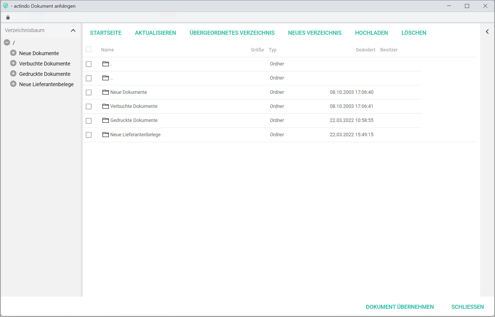
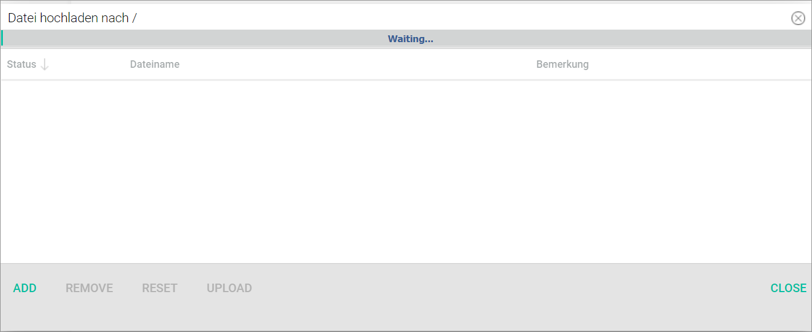

# Postings

*Accounting > Post > Tab POSTINGS*

  

The *POSTINGS* tab displays all existing postings in the selected posting period in chronological order. The posting details displayed in columns are read-only.

- *Seq. no.*  
This column displays the sequential number.

  > [Info] The posting numbers must be sequential and are added by the system automatically.

- *BP*  
This column displays the posting period (month/journal).

- *Turnover*  
This column displays the turnover value.

- *Contra account*  
This column displays the contra account number. For detailed information about the available accounts, see [Chart of accounts](../Integration/01_RunAccountingWizard.md#chart-of-accounts).

- *Receipt1*  
This column displays the receipt 1 value, usually the invoice number.

  > [Info] The information provided in the *Receipt 1* field is essential, as the system identifies and groups together any subsequent postings taking this field as reference, for example for an invoice settlement or a credit note in case of refund.

- *Receipt2*  
This column displays the receipt 2 value, which can be any other reference number, such as the order number.

- *Date*  
This column displays the posting date. Date format is DDMMYY.

- *Account*  
This column displays the account number, usually a personal account number, that is, a customer or supplier account number. A valid range for personal account numbers (10000-69999 for customers and 70000-99999 for suppliers) is predefined in the system.

  > [Info] Customer and supplier personal accounts can be created, edited and deleted. For detailed information, see [Manage the customer/supplier](../Integration/05_ManageCustomerSupplier.md).

- *Cst1*  
This column displays the cost unit number selected.

  > [Info] This is only applicable is a cost center accounting for cost 1 has been set up. For detailed information, see [COST ACCOUNTING](./02e_CostAccounting.md).

[comment]: <> (Alt-Doku: Das Feld wird beim Eingeben nur dann angesprochen, wenn eine Kostenstellenrechnung für Kost1 eingerichtet ist.)

- *Cst2*  
This column displays the cost unit number selected.

  > [Info] This is only applicable is a cost center accounting for cost 2 has been set up. For more details, see [COST ACCOUNTING](./02e_CostAccounting.md).

- *(Unnamed column)*  
This column displays a  icon if a receipt has been linked to the posting. When clicking on the icon, the linked receipt is displayed in the *Attached document* window. For detailed information, see [Attached document](#attached-document).

[comment]: <> (Comment on Bug file -> suggestion to add a name to column)

- *Text*  
This column displays the posting text, if any has been entered.

- *Fiscal year XXXX/Month X/Journal X*  
This text displays the fiscal year, month and journal currently selected. This information is read-only.

  > [Info] If the fiscal year or the posting period need to be changed, click the [FY/MONTH/JOURNAL] button to display the select fiscal year window. For detailed information, see [Fiscal year](./00a_FiscalYear.md) and [Select a fiscal year](../Operation/01_SelectFiscalYear.md).

- *Show (all/the last [XXX]) postings*    
Click the drop-down list to select the preferred display filter.

- *Amount*  
The total amount of all postings displayed.
  - *Amount 1*  
  Click this button to manually set an amount 1. A new window opens where the amount can be entered and confirmed with [OK].
  - *Amount 2*  
  Click this button to manually set an amount 2. A new window opens.  A new window opens where the amount can be entered and confirmed with [OK].

[comment]: <> (Function of Summe 1 & Summe 2??? Describe new window? It seems to change automatically sometimes, at least Summe 1, but I could not find out why! RS FH!)

The input line allows to create a posting manually. For detailed information, see [Create a manual posting](../Operation/04_CreateManualBooking.md).

- *Seq. no.*  
 Enter the posting number. Posting numbers must be sequential. The system adds the next available number automatically if the field is left empty.

- *Currency code*  
Click the drop-down menu to select the appropriate currency.  

  > [Info] It is possible to set up accounts in different currencies. However, the *Accounting* module can only work with the base currency configured in the system. For detailed information about managing and posting exchange rate fluctuations, see [Post exchange rate fluctuations](../Operation/12_BookExchangeRateFluctuations.md).

- *Exchange rate*  
This field updates automatically when changing the currency. It can also be modified manually.

  > [Info] The system retrieves once a day the current foreign currency exchange rates as published by the ECB and applies them automatically, therefore always working with the most up-to-date information.

- *Turnover*  
Enter the turnover value. Turnover values can be positive (incomes) or negative (expenses). This field is compulsory to manually create a posting.

- *Contra account*  
Enter the appropriate contra account. For detailed information about the available accounts, see [Chart of accounts](../Integration/01_RunAccountingWizard.md#chart-of-accounts). This field is compulsory to manually create a posting.

  > [Info] When you start typing in an account number, a context menu is displayed. You can also select the appropriate option from the menu.

- *Receipt1*  
Enter an appropriate reference value, such as the invoice number.

  > [Info] Even though it is not compulsory, it is highly recommended to fill in the *Receipt 1* field, as the system identifies and groups together any subsequent postings taking this field as reference, for example for an invoice settlement or a credit note in case of refund.

- *Receipt2*  
Enter any other appropriate reference value, such as order number.

- *Date*  
Enter the posting date. Date format must be DDMMYY.

- *Account*   
Enter the appropriate account number, for example a personal account number, that is, customer or supplier number. A valid range for personal account numbers (10000-69999 for customers and 70000-99999 for suppliers) is predefined in the system.

  > [Info] Customer and supplier personal accounts can be created, edited and deleted. For detailed information, see [Manage the customer/supplier](../Integration/05_ManageCustomerSupplier.md).

- *COST1*  
Enter the appropriate value.

  > [Info] This is only applicable is a cost center accounting for cost 1 has been set up. For detailed information, see [COST ACCOUNTING](./02e_CostAccounting.md).

- *COST2*  
Enter the appropriate value.

  > [Info] This is only applicable is a cost center accounting for cost 2 has been set up. For detailed information, see [COST ACCOUNTING](./02e_CostAccounting.md).

- *Posting text*  
Enter any appropriate posting text. Posting text can contain a combination of letters and numbers.

When creating a manual posting or selecting an existing posting, the account/contra account details, as well as their current balances, are displayed under the input line.

- *Contra account*  
This field displays the selected contra account. This field is read-only.

- *Account*  
This field displays the selected account. This field is read-only.

- *Balance (amount)H/S (currency)*  
This field displays the current balance of the corresponding account. H stands for credit. S stands for debit.

- [POST]    
Click this button to record the posting in the input line.

- [CANCEL]  
Click this button to cancel the selected posting. For detailed information, see [Cancel a posting](../Operation/05_CancelBooking.md).

- [DELETE]    
Click this button to delete the selected posting. For detailed information, see [Delete a single posting](../Operation/06_DeleteBookings.md#delete-a-single-posting).

- [CLEAR]    
Click this button to clear all input line fields.

- [SPLIT]    
Click this button to split a manual posting. The *Split posting* window is displayed, see [Split posting](#split-posting). For detailed information about splitting a posting, see [Split a posting](../Operation/09_SplitBooking.md).

- [ASSIGN RECEIPT]  
Click this button to assign a receipt to the selected posting. The *Attach document* window is displayed, see [Attach a document](#attach-document). For detailed information, see [Retrieve a receipt](../Operation/10_ManageReceipts.md#retrieve-a-receipt).

## Split posting

*Accounting > Post > Tab POSTINGS > Button SPLIT*

The information displayed in columns is read-only.

- *Seq. no.*  
This columns displays the sequential number.

- *BP*  
This column displays 00.

[comment]: <> (Bug? Should the actual posting period -month/journal- be shown here?)

- *Jnl*  
This column displays 00.

[comment]: <> (Bug? Should the actual posting period -month/journal- be shown here?)

- *Turnover*  
This column displays the turnover value.

- *Contra account*  
This column is displayed empty here. The corresponding contra accounts will be assigned to each split posting.

- *Receipt1*  
This column displays the receipt 1 value, usually the invoice number, if it has been entered.

- *Receipt2*  
This column displays the receipt 2 value, which can be any other reference number, such as the order number, if it has been entered.

- *Date*  
This column displays the posting date. Date format is DDMMYY.

- *Account*  
This column displays the account number, usually a personal account number, that is, a customer or supplier account number.

- *Cost1*  
This column displays the cost unit number selected, if it has been entered.

  > [Info] This is only applicable is a cost center accounting for cost 1 has been set up. For detailed information, see [COST ACCOUNTING](./02e_CostAccounting.md).

- *Cost2*  
This column displays the cost unit number selected, if it has been entered.

  > [Info] This is only applicable is a cost center accounting for cost 2 has been set up. For more details, see [COST ACCOUNTING](./02e_CostAccounting.md).

- *Text*  
This column displays the posting text, if it has been entered.

[comment]: <> (There seems to be an unnamed column between Kst2 and Text, usually where B/Belege come in. When clicking on a posting with a linked receipt, the B icon does not appear here. No option to link a receipt here either, so left out from description. Bug/comment?)

- *REMAINDER*  
This field displays the outstanding invoice amount to be split.  

- *Amount*  
This field displays the total invoice amount.

The input line allows to split the posting.

- *Seq. no.*  
Enter the posting number. Posting numbers must be sequential. The system adds the next available number automatically if the field is left empty.

- *Turnover*  
Enter the turnover amount for each partial posting.

- *Contra account*  
Enter the corresponding contra account for each partial posting.

- *Receipt1*  
Enter a receipt 1 value for each partial posting, if necessary. This field can be modified.

- *Receipt2*  
Enter a receipt 2 value for each partial posting, if necessary. This field can be modified.

- *Date*  
This field cannot be modified.

- *Account*  
This field cannot be modified.

- *Cost1*  
Enter the corresponding cost center for each partial posting, if necessary. This field can be modified.

  >[Info] This is only applicable is a cost center accounting for cost 1 has been set up. For detailed information, see [COST ACCOUNTING](./02e_CostAccounting.md).

- *Cost2*  
Enter the corresponding cost center for each partial posting, if necessary. This field can be modified.

  > [Info] This is only applicable is a cost center accounting for cost 2 has been set up. For detailed information, see [COST ACCOUNTING](./02e_CostAccounting.md).

- *Text*  
Enter a posting text for each partial posting, if necessary. This field can be modified.

- *Currency*  
Click the drop-down list to select the appropriate currency, if necessary.

- *Rate*  
This field updates automatically when changing the currency. It can also be modified manually.

- [POST]  
Click this button to record each partial posting.  

- [DELETE]  
Click this button to delete a partial posting, if necessary.

- [CLEAR]  
Click this button to clear all input line fields.

- [SAVE]  
Click this button to save the partial postings and record them in the selected posting period.

  > [Info] When the total invoice amount has been divided, the remainder will equal 0. At this point, the [SAVE] button is activated and can be selected.

- [CANCEL]  
Click this button to cancel the whole process.

## Attach document

*Accounting > Post > Tab POSTINGS > Button ASSIGN RECEIPT*

- *Directory tree*  
It displays all folders and subfolders containing documents (or receipts). This directory is linked to the *Documents* module and contains the following folder and subfolders:

  - *New documents*  
  This folder contains the newly uploaded documents.

  - *Registered documents*  
  This folder contains the registered documents. Once they are linked to a posting, they are moved automatically into the *Registered documents* folder and then placed in the appropriate subfolder according to the following structure:

    - 10000-69999 personal account numbers in case of a debtors'/customers' document
    - 70000-79999 personal account numbers in case of a creditors'/suppliers' document

  - *Printed documents*  
  This folder contains the printed documents.

  - *New supplier receipts*  
  This folder contains the newly uploaded supplier receipts.

[comment]: <> (Unsure of the number range! 10000-19999 or 69999? 70000-70999 or 70000-79999?)

[comment]: <> (Unsicher! Neue Lieferantenbelege kommt nicht standarmäßig auf, trotz Pfads in Dokumente. Lieferantenbelege Funktion greifft auch nicht dahin zu, trotz Pfads. Warum? Einstellung irgendwo? Screenshot ggf. ändern, d.h. ohne Lieferantenbelege Ordner.)

The buttons on top allow to navigate through the folders and documents.

- [START PAGE]  
Click this button to go back to the initial view of the *Attach document* window, see [Attach document](#attach-document).

- [REFRESH]  
Click this button to refresh the window, for example after making some changes.

- [PARENT DIRECTORY]  
Click this button to go directly from the current folder to its parent directory.  

- [NEW DIRECTORY]  
Click this button to create a new folder.

- [UPLOAD]  
Click this button upload a new document. The *Upload file to* window is displayed, see [Upload file](#upload-file).

- [DELETE]  
Click this button to delete a selected document or folder.

All folders and documents are displayed in a column view. The column width can be modified using the mouse. To do so, place the mouse pointer on the vertical dividing line between two columns titles. The mouse pointer changes to a double-headed arrow. Press the left mouse button and move the line using drag and drop until it has reached the required width.

When placing the cursor on a column header, three vertical points are displayed to the right of the column title. Click the  (Points) icon to display the context menu. The following menu entries are available:

-  Sort ascending  
  Click this entry to sort the rows in ascending order.
-  Sort descending  
  Click this entry to sort the rows in descending order.
-  Columns  
  Place the mouse on this entry to display the *Columns* sub-menu. Add or remove columns by marking or unmarking the corresponding checkbox.

All information provided in columns is read-only.

- [Checkbox]  
[comment]: <> (Checkbox does not seem to be working; when clicking on the checkbox in the column header, only that one and the last one are selected, not all, as it is usually. Function? Bug?)

- *Name*  
Folder or document name.

- *Size*  
Document size.

- *Type*  
Item type (folder).

- *Changed*  
Date when the items has been changed.

- *Owner*  
Item's owner.

- [SELECT DOCUMENT]  
Click this button to assign this document to a posting. The *Attached document* window is briefly displayed, see [Attached document](#attached-document).

- [CLOSE]  
Click this button to close the window.

### Upload file

*Accounting > Post > Tab POSTINGS > Button ASSIGN RECEIPT > Button UPLOAD*

The information related to the uploaded documents is displayed in column view. All fields are read-only.

- *Status*  
This columns displays the document status.

- *Document*  
This column displays the document name together with its path.

- *Remark*  
This column displays any remarks related to the uploaded document.

- [ADD]  
Click this button to add a file to be uploaded.

- [REMOVE]  
Click this button to remove a selected file from the upload list.

- [RESET]  
Click this button to reset the upload list.

- [UPLOAD]  
The upload starts automatically after adding a file. This button changes to [CANCEL] during the upload.  

- [CLOSE]  
Click this button to close the window when the upload is finished.

### Attached document

*Accounting > Post > Tab POSTINGS > Button ASSIGN RECEIPT > Button SELECT DOCUMENT*
*Accounting > Post > Tab POSTINGS > Select icon B*

-  *Document*    
These buttons do not have any function here, as there is only one document (or receipt) assigned to a posting.

[comment]: <> (These buttons do have a function in "BELEGE BUCHEN/BOOK RECEIPTS". Add info? Link?)

-   *Page [x]*   
The current page number is displayed. Click the arrow first page/previous/next buttons to scroll through the pages.

- (-) *Zoom* (+)  
Click the -/+ buttons to zoom in and out of the document view.

- *Download file*  
Click this button to download the document.

- [CANCEL ASSIGNMENT]  
Click this button to undo the receipt assignment, if necessary.

- [CLOSE]  
Click this button to close the window.
