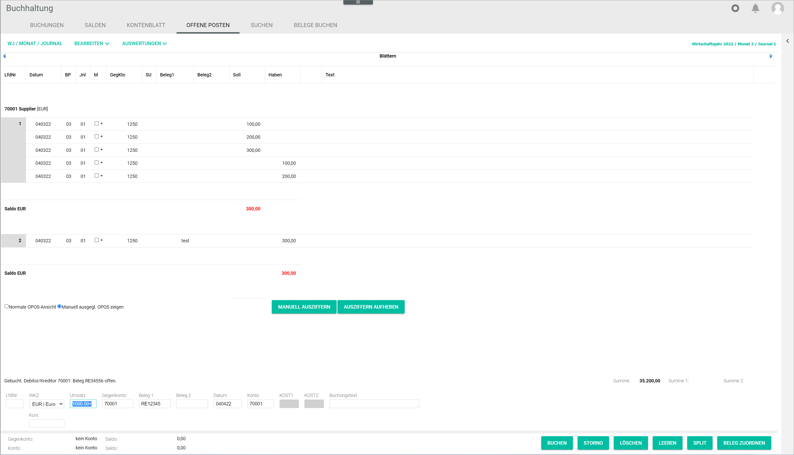

# Open items

*Accounting > Post > Tab OPEN ITEMS*

  

The *OPEN ITEMS* tab displays any open items in the system, that is, any business transactions that have not yet been completed.        

There are two view modes:

- If no account is selected, the *OPEN ITEMS* tab displays all open items in the *Accounting* module.

- If an account is selected, the *OPEN ITEMS* tab displays only the open items for the selected account.  

You can either select an account in the *POSTINGS* tab and switch to the *OPEN ITEMS* tab or directly enter an account and/or contra account number in the input line in the bottom. For detailed information about accessing open items, see [Manage the open items](../Operation/03_ManageOpenItems.md).  

If a contra account number is specified in the *Contra account* field of the input line, the open items for the corresponding contra account are displayed. If no contra account number is entered, but an account number is specified in the *Account* field of the input line, the open items for the corresponding account are displayed.    

If no open items exist for the selection, the notice *No open items exist* is displayed.

-  (Previous)   
  Click this button to display the open items of the previous available account number.

-  (Next)    
  Click this button to display the open items of the next available account number.

**Open items list**

The list displays all open items for the selected account, contra account, or for all accounts. All fields are read-only.

Above the corresponding open items in the list, the number, name and currency of the respective account are displayed. After each open item the balance of this open item is displayed.

- *Seq. no.*  
  Sequential number of the posting. The posting numbers must be sequential and are added by the system automatically.

- *Date*  
  Posting date. The valid date format is DDMMYY.

- *PP*  
  Month number of the posting period.

- *Jnl*  
  Journal number of the posting period.  

- *M*  
  Select the checkbox to select the open item for manually clearing. This column is only displayed if an account or contra account is entered in the input line.

  > [Info] Manually cleared postings are marked with an asterisk next to the checkbox.

- *Contra account*  
  Contra account number.

- *Tax key*  
  Tax key applied to the posting.

- *Receipt 1*  
  Receipt 1 value, usually the invoice number. The information provided in this field is essential, as the system identifies and groups together any subsequent postings taking this field as reference, for example for an invoice settlement or a credit note in case of refund.

- *Receipt 2*  
  Receipt 2 value, which can be any other reference number, such as the order number.

- *Cost 1*  
  Number of the selected cost center. This field is only applicable if at least one cost center has been set up. For detailed information, see [COST ACCOUNTING](./02e_CostAccounting.md).

- *Cost 2*  
  Number of the selected cost object. This field is only applicable if at least one cost object has been set up. For more details, see [COST ACCOUNTING](./02e_CostAccounting.md).

- *Debit*  
  Debit amount of the selected account.

- *Credit*  
  Credit amount of the selected account.

- *(Unnamed column)*
  Indication of whether a receipt has been linked to the posting. If a receipt has been linked to the posting, the  (B) button is displayed. Click the button to display the corresponding receipt in the *Attached document* window. For detailed information, see [Attached document](#attached-document).

- *Text*  
  Posting text.

-  *Standard open items view*  
  Select this radio button to display all open items for the selected account. This radio button is only displayed if an account or contra account is entered in the input line.

-  *Show manually cleared open items*  
  Select this radio button to display only the manually cleared open items for the selected account. This radio button is only displayed if an account or contra account is entered in the input line.

- [CLEAR MANUALLY]  
  Click this button to clear the selected open item(s) manually. This button is only displayed if an account or contra account is entered in the input line. For detailed information, see [Check the open items for an account](../Operation/03_ManageOpenItems.md#check-the-open-items-for-an-account).

- [CANCEL CLEARING]  
  Click this button to reverse the manual clearance for the selected items. This button is only displayed if the *Show manually cleared open items* radio button is selected.

[comment]: <> (Verweis auf InputLine.md. Evtl. dazu: In the *Open items* tab, the input line serves the only purpose of selecting an account if no posting is selected in the *POSTINGS* tab.)

### Attached document

[comment]: <> (HG: vgl. 01_Book
-> vielleicht reicht auch ein Verweis auf das entsprechende Kapitel)

*Accounting > Post > Tab OPEN ITEMS > Button B*

-  *Document*    
  These buttons do not have any function here, as there is only one document (or receipt) assigned to a posting.

[comment]: <> (These buttons do have a function in "BELEGE BUCHEN/BOOK RECEIPTS". Add info? Link?)

-   *Page [x]*   
  The current page number is displayed. Click the arrow first page/previous/next buttons to scroll through the pages.

- (-) *Zoom* (+)  
  Click the -/+ buttons to zoom in and out of the document view.

- *Download file*  
  Click this button to download the document.

[comment]: <> (HG: vgl. 01_Book)

- [CANCEL ASSIGNMENT]  
  Click this button to unassign the receipt from the selected posting. The *Attached document* window is closed.

- [CLOSE]  
  Click this button to close the *Attached document* window.

[comment]: <> (Verweis auf Input line muss noch rein -> ggf. input line als eigenen header in 01a_Bookings oder ebenso wie die anderen Funktionen in separatem Dokument, damit man darauf verweisen kann.)
