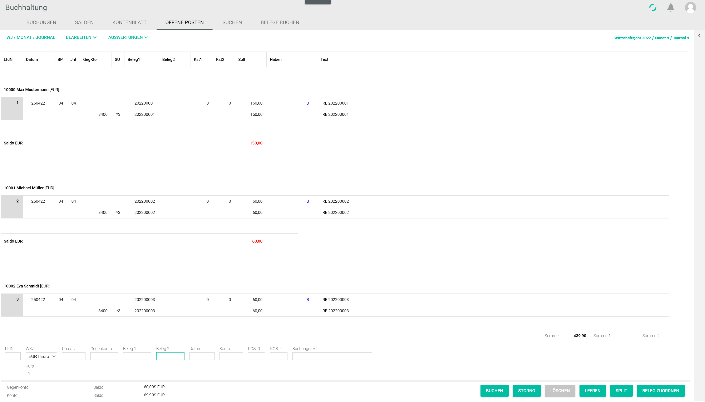
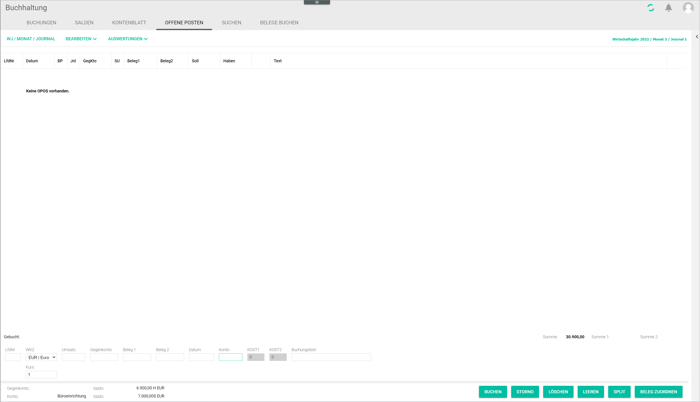

# Open items

The *OPEN ITEMS* tab displays any open items in the system, that is, any business transactions that have not yet been completed. The information displayed in the open items view is read-only.

There are two view modes:

- If no account is selected, the *OPEN ITEMS* tab displays all open items in the *Accounting* module.
- If a personal account is selected, the *OPEN ITEMS* tab displays only the open items for the selected account.

An account can be selected either by entering an account number in the *Account* or *Contra account* field, or by clicking a posting in the *POSTINGS* tab. For detailed information about accessing open items, see [Manage the open items](../Operation/03_ManageOpenItems.md).

## Open items view without account selection

*Accounting > Post > Tab OPEN ITEMS*

- *Fiscal year XXXX/Month X/Journal X*  
This text displays the fiscal year, month and journal currently selected. This information is read-only.

  > [Info] If the fiscal year or the posting period need to be changed, click the [FY/MONTH/JOURNAL] button to display the select fiscal year window. For detailed information, see [Fiscal year](./00a_FiscalYear.md) and [Select a fiscal year](../Operation/01_SelectFiscalYear.md).

-  (Left arrow)   
Click this arrow to open the *Post extras* side bar. For detailed information about searching in the *Accounting* module, see [Search in accounting](../Operation/14_SearchAccounting.md).

- *Seq. no.*  
This column displays the sequential number.

  > [Info] The posting numbers must be sequential and are added by the system automatically.

- *Date*  
This column displays the posting date. The valid date format is DDMMYY.

- *BP*  
This column displays the posting period (month).

- *Jnl*  
This column displays the journal.

- *Contra account*  
This column displays the contra account number.

- *Tax key*  
This column displays the tax key linked to the contra account.

- *Receipt1*  
This column displays the receipt 1 value, usually the invoice number.

  > [Info] The information provided in the *Receipt 1* field is essential, as the system identifies and groups together any subsequent postings taking this field as reference, for example for an invoice settlement or a credit note in case of refund.

- *Receipt2*  
This column displays the receipt 2 value, which can be any other reference number, such as the order number.

- *Cst1*  
This column displays the cost center number selected.

  > [Info] This is only applicable if at least one cost center has been set up. For detailed information, see [COST ACCOUNTING](./02e_CostAccounting.md).

- *Cst2*  
This column displays the cost unit number selected.

  > [Info] This is only applicable if at least one cost unit has been set up. For detailed information, see [COST ACCOUNTING](./02e_CostAccounting.md).

- *Debit*  
This column displays the debit amount of the selected account.

- *Credit*  
This column displays the credit amount of the selected account.

- *(Unnamed column)*  
This column displays a  icon if a receipt has been linked to the posting. When clicking the icon, the linked receipt is displayed in the *Attached document* window. For detailed information, see [Attached document](#attached-document).

- *Text*  
This column displays the posting text, if any has been entered.

- *(Account number) (account name) [currency]*  
This field introduces a list of all existing open items for this account.

- *Balance (currency)*  
This field displays the balance for each existing open item in the preceding account.  

- *Amount (Amount 1 - Amount 2)*  
The information provided in these fields refers to the postings list and is not related to the open items view. For detailed information, see [POSTINGS](./01a_Bookings.md).

In the *Open items* tab, the input line serves the only purpose of selecting an account if no posting is selected in the *POSTINGS* tab. In this case, the input line fields are empty, except for the *Currency code* and the *Date* fields, which display the module basic currency and the first day of the current month respectively.

> [Info] If a posting is selected in the *POSTINGS* tab, the posting details are displayed in the input line. The open items of the account selected in the *Account* field are displayed in the open items view, see [Open items view with account selection](#open-items-view-with-account-selection).

## Open items view with account selection

*Accounting > Post > Tab OPEN ITEMS*

- *Fiscal year XXXX/Month X/Journal X*  
This text displays the fiscal year, month and journal currently selected. This information is read-only.

  > [Info] If the fiscal year or the posting period need to be changed, click the [FY/MONTH/JOURNAL] button to display the select fiscal year window. For detailed information, see [Fiscal year](./00a_FiscalYear.md) and [Select a fiscal year](../Operation/01_SelectFiscalYear.md).

-  (Left arrow)   
Click this arrow to open the *Post extras* side bar. For detailed information about searching in the *Accounting* module, see [Search in accounting](../Operation/14_SearchAccounting.md).

-   *Scroll*   
Your can use the arrow buttons to scroll through the available accounts to search for a specific one.

- *Seq. no.*  
This column displays the sequential number.

  > [Info] The posting numbers must be sequential and are added by the system automatically.

- *Date*  
This column displays the posting date. The valid date format is DDMMYY.

- *BP*  
This column displays the posting period (month).

- *Jnl*  
This column displays the journal.

- *M*  
This column displays a checkbox to select the open items to be cleared manually if necessary.

  > [Info] Manually cleared postings are marked with an asterisk next to the checkbox.

- *Contra account*  
This column displays the contra account number.

- *Tax key*  
This column displays the tax key linked to the contra account, if any.

- *Receipt1*  
This column displays the receipt 1 value, usually the invoice number.

  > [Info] The information provided in the *Receipt 1* field is essential, as the system identifies and groups together any subsequent postings taking this field as reference, for example for an invoice settlement or a credit note in case of refund.

- *Receipt2*  
This column displays the receipt 2 value, which can be any other reference number, such as the order number.

- *Cst1*  
This column displays the cost unit number selected.

  > [Info] This is only applicable if at least one cost center has been set up. For detailed information, see [COST ACCOUNTING](./02e_CostAccounting.md).

- *Cst2*  
This column displays the cost unit number selected.

  > [Info] This is only applicable if at least one cost unit has been set up. For detailed information, see [COST ACCOUNTING](./02e_CostAccounting.md).

- *Debit*  
This column displays the debit amount of the selected account.

- *Credit*  
This column displays the credit amount of the selected account.

- *(Unnamed column)*  
This column displays a  icon if a receipt has been linked to the posting. When clicking the icon, the linked receipt is displayed in the *Attached document* window. For detailed information, see [Attached document](#attached-document).

- *Text*  
This column displays the posting text, if any has been entered.

- *(Account number) (account name) [currency]*  
This field introduces a list of all existing open items for this account.

- *Balance (currency)*  
This field displays the balance for each existing open item in the preceding account.    

- *Standard open items view*  
Click this radio button to display all open items for the selected account.

- *Show manually cleared open items*  
Click this radio button to display only the manually cleared open items for the selected account.

- [CLEAR MANUALLY]  
Click this button to clear an open item manually. For detailed information, see [Check the open items for an account](../Operation/03_ManageOpenItems.md#check-the-open-items-for-an-account).

- [CANCEL CLEARING]  
Click this button to reverse manually cleared items.

  > [Info] This button is displayed when the *Show manually cleared open items* radio button selected. It is also displayed in the Standard open items view (*Standard open items view* radio button selected), if an open item has been cleared manually).

- *Amount (Amount 1 - Amount 2)*  
The information provided in these fields refers to the postings list and is not related to the open items view. For detailed information, see [POSTINGS](./01a_Bookings.md).

In the *Open items* tab, the input line serves the only purpose of selecting an account. If a posting is selected in the *POSTINGS* tab, the posting details are displayed in the input line.

## No open items view

If there are no open items, a blank tab and the notice "No open items exist" is displayed.

 

### Attached document

*Accounting > Post > Tab OPEN ITEMS > Select icon B*

-  *Document*    
These buttons do not have any function here, as there is only one document (or receipt) assigned to a posting.

-   *Page [x]*   
 The current page number is displayed. Click the arrow first page/previous/next buttons to scroll through the pages.

- (-) *Zoom* (+)  
Click the -/+ buttons to zoom in and out of the document view.

- *Download file*  
Click this button to download the document.

- [CANCEL ASSIGNMENT]  
Click this button to undo the receipt assignment if necessary.

- [CLOSE]  
Click this button to close the window.
