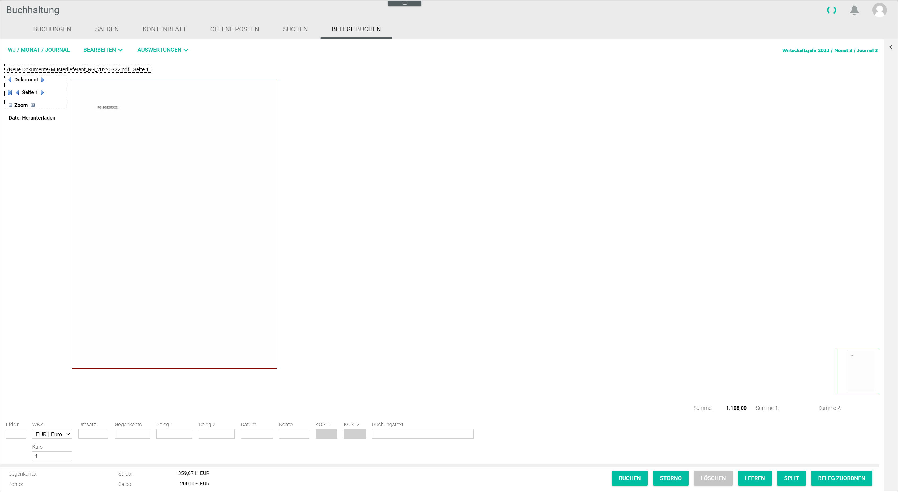
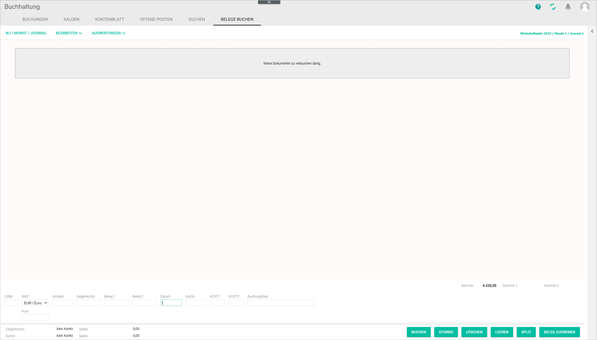

# Book receipts

*Accounting > Select fiscal year > Book > Tab BOOK RECEIPTS*

The *BOOK RECEIPTS* tab allows to assign manually external receipts uploaded in the system that have not been registered yet in the *Accounting* module. For detailed information about booking external receipts, see [Book a receipt](../Operation/10_ManageReceipts.md#book-a-receipt).

> [Info] The external receipts uploaded in the *New documents* folder in the *Documents* module are displayed here. If there are no receipts to be booked, the message *No documents left to be registered* is displayed when clicking the *BOOK RECEIPTS* tab.

- [FY/MONTH/JOURNAL]  
Click this button to display the select fiscal year window. For detailed information about this cross-tab function, see [FY/MONTH/JOURNAL](./01_Book.md#fymonthjournal).

- [EDIT]  
Click this button to display the *EDIT* context menu. For detailed information about this cross-tab function, see [EDIT](./01_Book.md#edit).

- [EVALUATIONS]  
Click this button to display the *EVALUATIONS* context menu. For detailed information about this cross-tab function, see [EVALUATIONS](./01_Book.md#evaluations).

- *Fiscal year XXXX/Month X/Journal X*  
This text displays the fiscal year, month and journal currently selected. This information is read-only.

  > [Info] If the fiscal year or the booking period needs to be changed, click the [FY/MONTH/JOURNAL] button to display the select fiscal year window. For detailed information, see [Fiscal year](./00a_FiscalYear.md) and [Select a fiscal year](../Operation/01_SelectFiscalYear.md).

- */New Documents/Document name.pdf Page [x]*  
This path displays the file location, name and page.

-  *Document*    
Click the previous/next arrow buttons to scroll through the documents.

-   *Page [x]*   
The current page number is displayed. Click the first page/previous/next arrow buttons to scroll through the pages.

- (-) *Zoom* (+)  
Click the +/- buttons to zoom in and out of the document view.

- *Download file*  
Click this button to download the document.

- *Amount (Amount 1 - Amount 2)*  
The information provided in these fields refers to the bookings list and is not related to this view. For detailed information, see [BOOKINGS](./01a_Bookings.md).

A miniature view of the currently displayed document is shown to the right of workspace.

The entry line allows to create a booking manually to assign the receipt. For detailed information, see [Book a receipt](../Operation/10_ManageReceipts.md#book-a-receipt).

[comment]: <> (Rephrase? Book/assign)

- *Seq. no.*  
 Enter the booking number. Booking numbers must be sequential. The system adds the next available number automatically if the field is left empty.

- *Currency code*  
Click the drop-down list to select the appropriate currency.  

  > [Info] It is possible to set up accounts in different currencies. However, the *Accounting* module can only work with the base currency configured in the system. For detailed information about managing and booking exchange rate fluctuations, see [Book exchange rate fluctuations](../Operation/12_BookExchangeRateFluctuations.md).

- *Exchange rate*  
This field updates automatically when changing the currency. It can also be modified manually.

  > [Info] The system retrieves once a day the current foreign currency exchange rates as published by the ECB and applies them automatically, therefore always working with the most up-to-date information.

- *Turnover*  
Enter the turnover value. Turnover values can be positive (incomes) or negative (expenses). This field is compulsory to create a booking manually.

- *Contra account*  
Enter the appropriate contra account. For detailed information about the available accounts, see [Chart of accounts](../Integration/01_RunAccountingWizard.md#chart-of-accounts). This field is compulsory to create a booking manually.

  > [Info] When you start typing in an account number, a context menu is displayed. You can also select the appropriate option from the menu.

- *Receipt 1*  
Enter an appropriate reference value, such as the invoice number.

  > [Info] Even though it is not compulsory, it is highly recommended to fill in the *Receipt 1* field, as the system identifies and groups together any subsequent bookings taking this field as reference, for example for an invoice settlement or a credit note in case of refund.

- *Receipt 2*  
Enter any other appropriate reference value, such as order number.

- *Date*  
Enter the booking date. Date format must be DDMMYY.

- *Account*   
Enter the appropriate account number, for example a personal account number, that is, customer or supplier number. A valid range for personal account numbers (10000-69999 for customers and 70000-99999 for suppliers) is predefined in the system.

  > [Info] Customer and supplier personal accounts can be created, edited and deleted. For detailed information, see [Manage the customer/supplier](../Integration/05_ManageCustomerSupplier.md).

- *COST1*  
Enter the appropriate value.

  > [Info] This is only applicable is a cost center accounting for cost 1 has been set up. For detailed information, see [COST ACCOUNTING](./02e_CostAccounting.md).

- *COST2*  
Enter the appropriate value.

  > [Info] This is only applicable is a cost center accounting for cost 2 has been set up. For detailed information, see [COST ACCOUNTING](./02e_CostAccounting.md).

- *Booking text*  
Enter an appropriate booking text. The booking text can contain a combination of letters and numbers.

When creating a manual booking, the account/contra account details, as well as their current balances, are displayed under the entry line.

- *Contra account*  
This field displays the selected contra account. This field is read-only.

- *Account*  
This field displays the selected account. This field is read-only.

- *Balance (amount)H/S (currency)*  
This field displays the current balance of the corresponding account. H stands for credit. S stands for debit. This field is read-only.

- [BOOK]    
Click this button to record the booking in the entry line.

- [CANCEL]  
Click this button to cancel a selected booking in the *Bookings* tab. This button is not relevant for this tab. For detailed information, see [Cancel a booking](../Operation/05_CancelBooking.md).

- [DELETE]    
Click this button to delete a selected booking in the *Bookings* tab. This button is not relevant for this tab. For detailed information, see [Delete a single booking](../Operation/06_DeleteBookings.md#delete-a-single-booking).

- [CLEAR]    
Click this button to clear all entry line fields.

- [SPLIT]    
Click this button to split a manual booking. The *Split booking* window is displayed, see [Split booking](./01a_Bookings.md#split-booking). For detailed information about splitting a booking, see [Split a booking](../Operation/09_SplitBooking.md).

- [ASSIGN RECEIPT]  
Click this button to assign a receipt to a selected booking in the *Bookings* tab. This button is not relevant for this tab. For detailed information, see [Retrieve a receipt](../Operation/10_ManageReceipts.md#retrieve-a-receipt).
