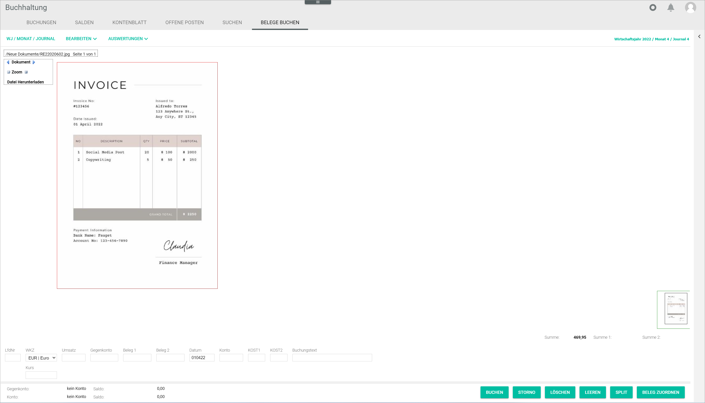

# Post receipts

*Accounting > Post > Tab POST RECEIPTS*

The *POST RECEIPTS* tab allows to assign manually external receipts uploaded in the system that have not been registered yet in the *Accounting* module. For detailed information about posting external receipts, see [Post a receipt](../Operation/10_ManageReceipts.md#post-a-receipt).

All external receipts uploaded in the *New documents* folder in the *Documents* module are displayed in the *POST RECEIPTS* tab. If there are no receipts to be posted, the notice *No documents left to be registered* is displayed.

**/New Documents/"Document file name" Page x**  
This path displays the file location, name and page.

-    
  Click this button to display the previous document.

-    
  Click this button to display the next document.

-   
  Click this button to display the first page of the selected document.

-    
  Click this button to display the previous page of the selected document.

-    
  Click this button to display the next page of the selected document.

- (-)   
  Click this button to zoom in the selected document.

- (+)     
  Click this button to zoom out the selected document.

- *Download file*  
  Click this button to download the document.

A miniature view of the selected document is displayed in the bottom right corner of the workspace.

[comment]: <> (Verweis InputLine.md)

The input line allows to create a posting manually to post the receipt. For detailed information, see [Post a receipt](../Operation/10_ManageReceipts.md#post-a-receipt).
