# Debtors/creditors

*Accounting > Settings > Tab DEBTORS/CREDITORS*

The *Debtors/creditors* tab displays a customer/supplier list and allows to create, edit and delete customers (debtors) and suppliers (creditors). For detailed information about managing customers and suppliers, see [Manage the customer/supplier](../Integration/05_ManageCustomerSupplier.md).

This tab and all corresponding sub-tabs are also contained in the *Order management* module.

The *Debtors/creditors* tab contains in turn two tabs:

  - Customer/supplier list, see [Customer/supplier list](#customersupplier-list).
  - Create customer/supplier, see [Create customer/supplier](#create-customersupplier). When selecting a customer/supplier from the customer/supplier list, the tab name changes to *Customer/supplier (number)*, see [Customer/supplier (number)](#customersupplier-number).

[comment]: <> (Es heißt eingelicht immer "Kunde xxxxx", egal ob Kunde oder Lieferant. Kommentar in Bug-Datei hinzugefügt)

## Customer/supplier list

*Accounting > Settings > Tab DEBTORS/CREDITORS > Tab Customer/supplier list*

- [EXCEL]  
Click this button to display the *EXCEL* context menu. The following options are available:  

  - *Export current page*  
  Click this option to export the customer/supplier list page currently displayed. The customer/supplier list is exported in Excel format and saved by default in the *Downloads* folder in your computer.

  - *Export all*  
  Click this option to export all customer/supplier list pages. The customer/supplier list is exported in Excel format and saved by default in the *Downloads* folder in your computer.

- [QUICK SEARCH]  
Click this button to display the *QUICK SEARCH* context menu. All search criteria are selected by default through a marked checkbox. Deselect any search criteria as necessary. The following search criteria are available:

  - *No.*  
  - *Short name*
  - *Company*  
  - *Forename*
  - *Surname*
  - *Address*
  - *Address 2*
  - *Zip*
  - *Location*
  - *Country*
  - *Content*
  - *Currency*
  - *Comments*
  - *Phone*
  - *Phone 2*
  - *Cell phone*
  - *Fax*
  - *Email*
  - *VAT ID*
  - *Type of customer*
  - *Customer number*

  [comment]: <> (in the system as No -> add point)
  [comment]: <> (in the system: Firma -> localise)
  [comment]: <> (in the system: First name)
  [comment]: <> (in the system: Name)
  [comment]: <> (in the system: City)  

- [Search bar]  
  Click the search bar to enter the search text (letters or numbers).

-  (Delete)  
  Click this button to delete the search text and to clear the search results.

-  (Search)  
  Click this button to start the search. The search can also be started by pressing ENTER.

- (x) [ACTIVE FILTERS]  
Click this button to display the context menu.

  - *ACTIVE* (checkbox)  
  Click this checkbox to activate the search criteria.

  - *FILTER BY*  
  The following filter values are available:
    - *Price group*  

  - *FILTER CRITERION*  
  Click the drop-down list to select the appropriate filter criterion. The created price groups are displayed.

  > [Info] Price groups can be created in the *Settings* menu entry of the *Material management* and the *Order management* modules. A customer can be assigned a specific price group in the *Invoicing* sub-tab of the *DEBTORS/CREDITORS* tab, see [Invoicing](#invoicing-1).

  [comment]: <> (Other "Filter by" options available depending on settings?)

- [CANCEL]  
 Click this button to cancel your selection.

- [APPLY]  
 Click this button to apply the search criteria and values.

All customer/supplier details are displayed in a column view. Depending on the settings, the displayed columns may vary. To add or delete columns, click the  (Points) icon to display the context menu. Then, hover the mouse over the  (Columns) menu entry to display all available options. Select or deselect the columns as desired.

- *No.*  
Customer/supplier number. Customer numbers range from 10000 to 69999 and supplier numbers, from 70000 to 99999.

- *Short name*  
Short name given to the customer/supplier.

- *Company*  
Company name.

- *Forename*  
Customer/supplier first name.

- *Surname*  
Customer/supplier last name.

- *Address*  
Customer/supplier address.

- *Address 2*  
Complimentary address information.

- *Zip*  
Customer/supplier zip code.

- *Location*   
Customer/supplier city or town.

- *Country*  
Customer/supplier country.

- *Content*  
Files or links added to the customer/supplier information.  

- *Currency*  
Base currency used by customer/supplier.

- *Comments*  
Comments added on the customer/supplier information.

- *Phone*  
Customer/supplier contact phone number.

- *Phone 2*  
Customer/supplier second contact phone number.    

- *Cell phone*  
Customer/supplier cell phone number.

- *Fax*  
Customer/supplier fax number.

- *Email*  
Customer/supplier email address.

- *VAT ID*  
Customer/supplier VAT identification number, if applicable.

- *Type of customer*  
Type of customer/supplier as defined by the user.

- *Customer number*  
Reference customer/supplier number as defined by the user.

By right-clicking on a row, a context menu is displayed containing the following options:

  - *Show documents of the customer/supplier*  
  Click this option to access the customer/supplier order Overview in the *Order management* module
  - *Show articles of supplier*  
  Click this option to access the supplier product list in the *Material management* module.

  [comment]: <> (Add link when available)

-  (Refresh)  
 Click this button to update the receipt list.

- [RESET]  
 Click this button to reset the receipt list view.

## Create customer/supplier

*Accounting > Settings > Tab DEBTORS/CREDITORS > Tab Create customer/supplier*

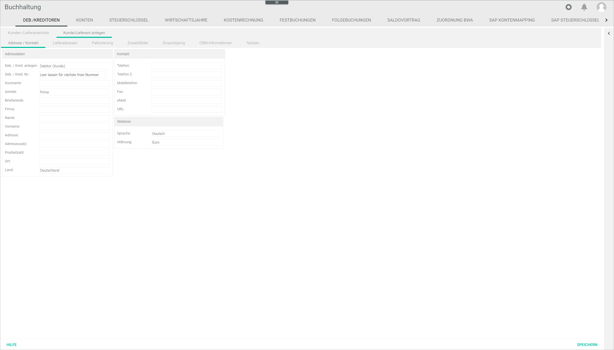

The *Create customer/supplier* tab contains in turn several sub-tabs to organize customer/supplier details:

- *Address/contact*
- *Delivery addresses*
- *Invoicing*
- *Additional fields*
- *Drop shipping*
- *CRM information*
- *Notes*

[comments]: <> (Billing statt Invoicing im System)

### Address/contact

*Accounting > Settings > Tab DEBTORS/CREDITORS > Tab Create customer/supplier > Sub-tab Address/contact*

**Address details**  

[comment]: <> (im System Address data)

- *Create debtor/creditor*  
Click the drop-down list to select the appropriate option, **Debtor (customer)** or **Creditor (supplier)**.

[comment]: <> (im System: Customer customer / Vendor supplier)

- *Debtor/creditor no.*  
Enter a customer/supplier number or leave it empty for the next available number.  

  > [Info] A valid range for personal account numbers (10000-69999 for customers and 70000-99999 for suppliers) is predefined in the system. If a number is entered out of this range, a warning message is displayed.

- *Short name*  
Enter a short name for the customer/supplier. This field is mandatory.

- *Form of address*  
Click the drop-down list to select the appropriate form of address. The following options are available:  

    - **Company**
    - **Mr**
    - **Ms**
    - **Mr and Mrs**
    - **Dr**
    - **Prof.**
    - **None**

- *Letter salutation*  
Enter the appropriate letter salutation.

- *Company*  
Enter the company name.

- *Surname*  
Enter the customer/supplier last name.  

  > [Info] To create a customer/supplier, either a company or a customer/supplier name must be entered.

- *Forename*  
Enter the customer/supplier first name.

- *Address*  
Enter the customer/supplier address.

- *Address supplement*  
Enter any other necessary address information.  

[comment]: <> (im System Address suffix)

- *Zip code*  
Enter the customer/supplier zip code.  

[comment]: <> (im System Postal code)

- *Location*  
Enter the customer/supplier location.  

[comment]: <> (im System Ort)

- *Country*  
Click the drop-down list to select the applicable country.  

[comment]: <> (Drop-down liste im System auf DE, Sortierung aber auf EN o.ä.)

**Contact**

- *Phone*  
Enter a contact phone number.

- *Phone 2*  
Enter a second contact phone number, if necessary.

- *Cell phone*  
Enter a cell phone number.

- *Fax*  
Enter a fax number, if necessary.

- *Email*  
Enter an email address.

- *URL*  
Enter the customer/supplier website, if available.

**Further**

- *Language*  
Click the drop-down list to select the appropriate language or select **No linguistic content**.

[comment]: <> (Drop-down liste im auf DE/EN gemischt)

- *Currency*  
Click the drop-down list to select the applicable currency.

- [SAVE]  
Click this button to save the newly entered customer/supplier details.

  > [Info] It is not possible to enter any further information in the other sub-tabs before saving the details entered in the *Address/contact* sub-tab. When clicking the other sub-tabs, a window with a warning message is displayed. Click [OK] to confirm the window and save the newly added customer/supplier. After saving the new customer/supplier address and contact details, the *Delivery addresses*, *Additional fields* and *Drop shipping* sub-tabs display a warning message and can only be used to add data after selecting the newly created customer/supplier in the *Customer/Supplier list* tab.

### Delivery addresses

*Accounting > Settings > Tab DEBTORS/CREDITORS > Tab Create customer/supplier > Sub-tab Delivery addresses*

The *Delivery address* sub-tab cannot be edited here. The warning message *Please save customer/supplier first* is displayed.

To add further delivery addresses, see [Further addresses](#further-addresses).

[comment]: <> (Bug/question added to Bug Notes document)

### Invoicing

*Accounting > Settings > Tab DEBTORS/CREDITORS > Tab Create customer/supplier > Sub-tab Invoicing*

**Bank details**

- *Account holder*  
Enter the account holder name.

- *Account*  
Enter the customer/supplier bank account.

- *Routing number*  
Enter the bank routing number.

- *Bank*  
The bank name is filled in automatically when entering the routing number.

- *BIC*  
Enter the BIC (Bank Identifier Code).

- *IBAN*  
Enter the IBAN (International Bank Account Number).

- *SEPA mandate reference*  
Enter the SEPA mandate reference, if available.

- *Signature date*  
Enter the signature date or click the  (Calendar) button to select the date.

**Payment options**

- *Price group*  
Click the drop-down list to select the appropriate option. All available price groups are displayed in the list.

  > [Info] Price groups can be created in the *Settings* menu entry of the *Material management* and the *Order management* modules.

- *Print gross*  
Click the drop-down list to select the print mode. The following options are available:   

  - **Net prices on receipts**
  - **Gross prices on receipts**
  - **Gross prices stating net total amount**

**Tax**

- *Tax office no.*  
Enter the tax office number, if known. Alternatively, use the [SEARCH] button to search for the competent tax office.

- [SEARCH]  
Click this button to add a tax office. The *Select tax office* window is displayed, see [Select tax office](#select-tax-office).  

- *Tax office*  
Enter the competent tax office, if known.

- *Tax no.*  
Enter the customer/supplier tax number, if applicable.

- *VAT ID*  
Enter the customer/supplier VAT identification number, if applicable.

**Posting**  

- *Standard account*  
Enter a standard account number for the postings.   

- *Standard cost 1*  
Enter a standard cost center for the postings.

- *Standard cost 2*  
Enter a standard cost unit for the postings.

**Credit card details**

[comment]: <> (im Credit card data)

- *Card type*  
Click the drop-down list to select the applicable card type.

- *Card holder*  
Enter the card holder name.

- *Card number*  
Enter the card number.

- *Valid Thru*  
Enter the card expiry date.

**Default values**

[comment]: <> (im System Standard values)

- *Method*  
Click the drop-down list to select the applicable method.

- *Payment terms*  
Click the drop-down list to select the applicable payment terms. The following options are available:  

  - **1 - 8 d 2%, 30 d net**
  - **2 - 30 d net**  

- *Only cost supplier/ordering process inactive [x]*  
Select or deselect this checkbox as necessary.

  > [Info] This option is only relevant when managing supplier receipts. Select it if the supplier is a provider delivering a service, for example an internet provider, but not goods. If the checkbox is activated, the supplier will not be taken into account in the creation of order proposals.  

[comment]: <> (DE = nur Kostenlieferant/Bestellwesen inaktiv -> Übersetzung i.O.?)

[comment]: <> (Link to Einkauf / Bestellvorschläge + Lieferantenbelege prüfen, wenn verfügbar)

- *Goods receipt required [x]*  
Select or deselect this checkbox as necessary. If the checkbox is activated, at least one item must be selected to release the invoice for payment.

  > [Info] These two functions interact with the *Purchasing* and *Payment processing* modules, and allow to check supplier receipts before posting them in the system and to automatize payment conditions.

[comment]: <> (Link to Zahlungsabwicklung / Offene Posten, wenn verfügbar)

- *Tolerance group for cash discounts [x]*  
Click the drop-down list to select the appropriate option. All available options are displayed in the list.

  > [Info] The tolerance groups can be configured in the *Settings* menu entry of the *Order management* module.

[comment]: <> (Add Link, wenn verfügbar)

**Limits / Locks**

- *Credit limit*  
Enter a credit limit for the customer/supplier, if necessary.

- *Customer block*  
Select or deselect this checkbox to activate or deactivate a customer block.

- *Dunning block*  
Select or deselect this checkbox to activate or deactivate a dunning block.

- *Dunning block, automatic*  
Select or deselect this checkbox to activate or deactivate an automatic dunning block.

  > [Info] The dunning process can be configured in the *Settings* menu entry of the *Order management* module.

[comment]: <> (Add Link, wenn verfügbar)

- *Delivery block*  
Select or deselect this checkbox to activate or deactivate a delivery block.

- *Contact block*  
Select or deselect this checkbox to activate or deactivate a contact block.

**Additional information**

[comment]: <> (Im System "Other")

- *Supplier no. for user*  
Enter the reference supplier number defined by the user, if any.

- *Freight limit*  
Enter a freight limit by the supplier, if necessary.

  > [Info] This field is only relevant for suppliers and, therefore, it is only displayed when a supplier (account number range 70000-99999) has been created.

- [SAVE]  
  Click this button to save any changes made.

### Additional fields

*Accounting > Settings > Tab DEBTORS/CREDITORS > Tab Create customer/supplier > Sub-tab Additional fields*

The *Additional fields* sub-tab cannot be edited here. The warning message *Please save customer/supplier first* is displayed.

To add additional fields, select a newly created customer/supplier in the *Customer/supplier list* tab and click the *Additional fields* sub-tab.

For detailed information, see [Additional fields](#additional-fields-2).

- [SAVE]  
Click this button to save any changes made.

### Drop shipping

*Accounting > Settings > Tab DEBTORS/CREDITORS > Tab Create customer/supplier > Sub-tab Drop shipping*

The *Drop shipping* sub-tab cannot be edited here. The warning message *Please save supplier first* is displayed.

To add further information, select a newly created supplier in the *Customer/Supplier list* tab and click the *Drop shipping* sub-tab.

For detailed information, see [Drop shipping](#drop-shipping-2).

- [SAVE]  
Click this button to save any changes made.

### CRM information

*Accounting > Settings > Tab DEBTORS/CREDITORS > Tab Create customer/supplier > Sub-tab CRM information*

**General**

  - *Customer no.*  
  Enter the appropriate customer number.

  - *Type*  
  Enter the type of customer.

  - *Date of birth*  
  Enter the date of birth or click the  (Calendar) button to select the date.

  - *Supervisor*  
  Click the drop-down list to select the person responsible for this customer/supplier.

  - *Area*  
  Enter the applicable area, if necessary.

  - *Last pers. contact*  
  Enter the date of the last personal contact or click the  (Calendar) button to select the date.

  - *Industry*  
  Enter information about the applicable industrial sector, if necessary.

  - *Industry 2*  
  Enter further information about the applicable industrial sector, if necessary.

**Credit rating**

  - *Request from*  
  Enter the request date or click the  (Calendar) button to select the date.

  - *Capital*  
  Enter the applicable capital amount.

  - *Employees*  
  Click the drop-down list to select the appropriate number of employees.

  - *Status from*  
  Enter the status date or click the  (Calendar) button to select the date.

  - *Year*  
  Enter the year of the credit rating.

  - *Sales*  
  Enter the sales value.

  - *Other information*  
  Enter any other relevant information.

**Document Dispatch Notification Settings**

> [Info] This section is only relevant for customers, not for suppliers.

- *Overwrite* [x]  
Select the checkbox to display the options below. Otherwise, the default settings are applied.

- *Dispatch method*  
Click the drop-down list to select the desired dispatch method. The following options are available:  

    - **Email**
    - **Post**
    - **Fax**
    - **APS print**  

- *Order origin*  
Click the drop-down list to select the applicable order origins(s). Multiple selection is possible.

- *Template*  
Click the drop-down list to select the applicable template.

  [comment]: <> (Drop-down list options to be translated!)

  - [SAVE]  
  Click this button to save any changes made.

### Notes

*Accounting > Settings > Tab DEBTORS/CREDITORS > Tab Create customer/supplier > Sub-tab Notes*

- *Comments*  
Enter any further relevant information in this section. The information entered here is displayed in the *Comments* column in the *Customer/supplier list* tab.

- [SAVE]  
Click this button to save any changes made.

## Customer/supplier (number)

*Accounting > Settings > Tab DEBTORS/CREDITORS > Tab Customer/supplier list > Select customer/supplier*

When selecting a customer/supplier from the list in the *Customer/supplier list* tab, the *Customer/supplier (number)* tab is displayed. Existing details can be edited and new ones can be entered in the subsequent sub-tabs.

The displayed sub-tabs and information vary slightly depending on whether a customer or a supplier has been selected.

### Address/contact

*Accounting > Settings > Tab DEBTORS/CREDITORS > Tab Customer/supplier list > Select customer/supplier > Sub-tab Address/contact*

**Address details**  

[comment]: <> (im System Address data)

- *Debtor/creditor no.*  
Customer/supplier number assigned. Enter a different customer/supplier number, if necessary.  

  > [Info] If an invalid number is entered, either out of the permitted range for personal account numbers (10000-69999 for customers and 70000-99999 for suppliers) or already in use, a warning message is displayed.

- *Short name*  
Short name provided. Enter a different short name for the customer/supplier, if necessary. This field is mandatory.

- *Form of address*  
Form of address provided, if any. Click the drop-down list to select a different form of address, if necessary. The following options are available:  

    - **Company**
    - **Mr**
    - **Ms**
    - **Mr and Mrs**
    - **Dr**
    - **Prof.**
    - **none**

- *Letter salutation*  
Letter salutation provided, if any. Enter a different letter salutation, if necessary.

- *Company*  
Company name provided, if any. Enter a different company name, if necessary.

- *Surname*  
Last name provided, if any. Enter a different customer/supplier last name, if necessary.

- *Forename*  
First name provided, if any. Enter a different customer/supplier first name, if necessary.

  > [Info] Either a company or a customer/supplier name must be provided.

- *Address*  
Address provided, if any. Enter a different customer/supplier address, if necessary.

- *Address supplement*  
Address supplement provided, if any. Enter any other necessary address information.  

[comment]: <> (im System Address suffix)

- *Zip code*  
Zip code provided, if any. Enter a different customer/supplier zip code, if necessary.  

[comment]: <> (im System Postal code)

- *Location*  
Location provided, if any, Enter a different customer/supplier location, if any.  

[comment]: <> (im System Ort)

- *Country*  
Country provided, if any. Click the drop-down list to select a different country, if necessary.  

[comment]: <> (Drop-down liste im System auf DE, Sortierung aber auf EN)

**Contact**

- *Phone*  
Phone number provided, if any. Enter a different contact phone number, if necessary.

- *Phone 2*  
Second phone number provided, if any. Enter a different second contact phone number, if necessary.

- *Cell phone*  
Cell phone provided, if any. Enter a different cell phone number, if necessary.

- *Fax*  
Fax number provided, if any. Enter a different fax number, if necessary.

- *Email*  
Email address provided, if any. Enter a different email address, if necessary.

- *URL*  
URL provided, if any. Enter a different customer/supplier website, if necessary.

**Further**

- *Language*  
Language provided, if any. Click the drop-down list to select a different language or select **No linguistic content**.

- *Currency*  
Currency provided, if any. Click the drop-down list to select a different currency.

- [NEW/RESET]  
Click this button to reset the *Customer/supplier* tab and create a new customer/supplier. The *Create customer/supplier* tab is displayed.

- [DELETE CUSTOMER 'number']/[DELETE SUPPLIER 'number']  
Click this button to delete the selected customer/supplier.

- [SAVE]  
Click this button to save all changes made in the selected customer/supplier.

### Further addresses

*Accounting > Settings > Tab DEBTORS/CREDITORS > Tab Customer/supplier list > Select customer/supplier > Sub-tab Further addresses*

When creating a customer/supplier, the address entered in the *Address details* section in the *Address/contact* sub-tab is automatically saved as standard delivery address in the system. The standard address is displayed in this sub-tab marked as *STD*. Further delivery addresses can be added in this sub-tab.

**Delivery addresses**

All delivery addresses entered are displayed in a column view. All information provided in columns is read-only.

- [Checkbox]  
Click this checkbox to select an address to be edited or deleted. The *Edit* section is displayed.

- *Addr. no.*  
This column displays the number given to every additional address. The base address is marked as **STD** (standard).

- *Address type*  
This column displays the address type selected. The following options are available:  

  - **Base address**
  - **Buyer's address**
  - **Billing address**
  - **Delivery address**
  - **Redirect address**
  - **Pick-up address**  

- *Company*  
This column displays the company name entered.

- *Zip*  
This column displays the customer/supplier zip (or postal) code entered.

- *Location*  
This column displays the customer/supplier location entered.

- *Country*  
This column displays the customer/supplier country selected.

  > [Info] The different countries are represented with the international vehicle registration codes.

- [CREATE]  
Click this button to add a further address. The *Add* section is displayed.

- [DELETE]  
Click this button to delete a selected address from the list.

-  (Refresh)    
Click this button to refresh the list after making any changes.

- *All address types*  
Click this drop-down list to select the address type to be displayed in the list. The following options are available:

  - **Buyer's address**
  - **Billing address**
  - **Delivery address**
  - **Redirect address**
  - **Pick-up address**  

**Add/Edit**

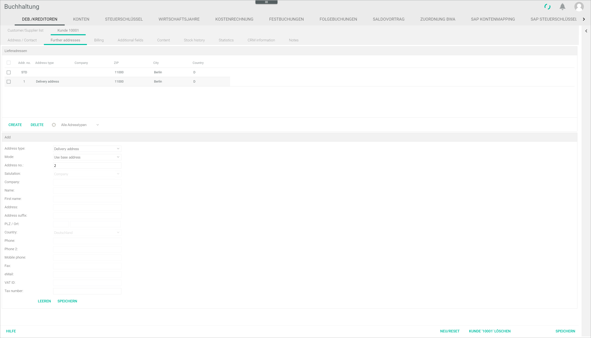

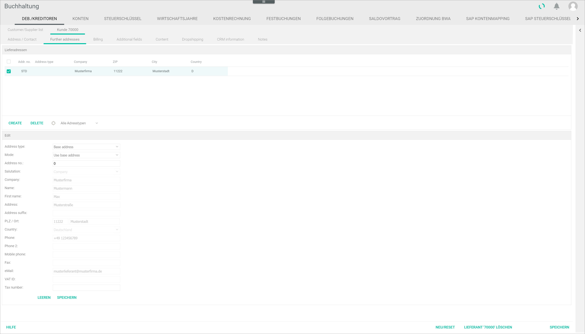

> [Info] When clicking the [CREATE] button, the *Add* section is displayed. When marking a checkbox from the delivery addresses list, the address details are displayed in the input fields, where they can be edited. The *Add* section name changes to *Edit*.

  - *Address type*  
  Click the drop-down list to select the address type. The following options are available:

    - **Base address**
    - **Buyer's address**
    - **Billing address**
    - **Delivery address**
    - **Redirect address**
    - **Pick-up address**  

  - *Mode*  
  Click the drop-down list to select the mode. The following options are available:

    - **Use base address**  
    Select this option to use the base (standard) address. The rest of fields in this section become inactive.

    - **Use different address**  
    Select this option to use a different address than the base (standard) address. The rest of fields in this section become active.

  - *Address no.*  
  The address number cannot be edited. If a new number is entered, a new address will be created.

  - *Form of address*  
  Click the drop-down list to select the appropriate customer/supplier form of address. The following options are available:  

      - **Company**
      - **Mr**
      - **Ms**
      - **Mr and Mrs**
      - **Dr**
      - **Prof.**
      - **none**  

  - *Company*  
  Enter the company name.

  - *Surname*  
  Enter the customer/supplier last name.

  - *Forename*  
  Enter the customer/supplier first name.

  - *Address*  
  Enter the customer/supplier address.

  - *Address supplement*  
  Enter any other necessary address information.  

  [comment]: <> (im System Address suffix)

  - *Zip code / Location*  
  Enter the zip code and location.

  - *Country*  
  Click the drop-down list to select the appropriate country.  

  [comment]: <> (Drop-down liste im System auf DE, Sortierung aber auf EN o.ä.)

  - *Phone*  
  Enter the contact phone number.

  - *Phone 2*  
  Enter a second contact phone number, if necessary.

  - *Cell phone*  
  Enter a cell phone number.

  - *Fax*  
  Enter a fax number, if necessary.

  - *Email*  
  Enter an email address.

  - *VAT ID*  
  Enter the customer/supplier VAT identification number, if applicable.

  - *Tax number*  
  Enter the customer/supplier tax number, if applicable.

  - [CLEAR]  
  Click this button to clear the input fields.

  - [SAVE]  
  Click this button to save the edited address.

- [NEW/RESET]  
Click this button to reset the *Customer/supplier* tab and create a new customer/supplier. The *Create customer/supplier* tab is displayed.

- [DELETE CUSTOMER 'number']/[DELETE SUPPLIER 'number']  
Click this button to delete the selected customer/supplier.

- [SAVE]  
Click this button to save all changes made in the selected customer/supplier.

### Invoicing

*Accounting > Settings > Tab DEBTORS/CREDITORS > Tab Customer/supplier list > Select customer/supplier > Sub-tab Invoicing*

**Bank details**

- *Account holder*  
Enter the account holder name.

- *Account*  
Enter the customer/supplier bank account.

- *Routing number*  
Enter the bank routing number.

- *Bank*  
The bank name is filled in automatically when entering the routing number.  

- *BIC*  
Enter the BIC (Bank Identifier Code).

- *IBAN*  
Enter the IBAN (International Bank Account Number).

- *SEPA mandate reference*  
Enter the SEPA mandate reference, if available.

- *Signature date*  
Enter the signature date or click the  (Calendar) button to select the date.

**Payment options**

- *Price group*  
Click the drop-down list to select the appropriate option. All available price groups are displayed in the list.

  > [Info] Price groups can be created in the *Settings* menu entry of the *Material management* and the *Order management* module.

- *Print gross*  
Click the drop-down list to select the print mode. The following options are available:   

  - **Net prices on receipts**
  - **Gross prices on receipts**
  - **Gross prices stating net total amount**

**Tax**

- *Tax office no.*  
Enter the tax office number, if known. Alternatively, use the [SEARCH] button to search for the tax office number.

- [SEARCH]  
Click this button to search for a tax office number. The *Select tax office* window is displayed, see [Select tax office](#select-tax-office).  

- *Tax office*  
Enter the competent tax office, if known.

- *Tax no.*  
Enter the customer/supplier tax number, if applicable.

- *VAT ID*  
Enter the customer/supplier VAT identification number, if applicable.

**Posting**  

[comment]: <> (im System Posting)

- *Standard account*  
Enter a standard account number for the postings.  

- *Standard cost 1*  
Enter a standard cost center for the postings.

- *Standard cost 2*  
Enter a standard cost unit for the postings.

**Credit card details**

[comment]: <> (im Credit card data)

- *Card type*  
Click the drop-down list to select the applicable card type.

- *Card holder*  
Enter the card holder name.

- *Card number*  
Enter the card number.

- *Valid Thru*  
Enter the card expiry date.

**Default values**

[comment]: <> (im System Standard values)

- *Method*  
Click the drop-down list to select the applicable method.

- *Payment terms*  
Click the drop-down list to select the applicable payment terms. The following options are available:  

  - **1 - 8 d 2%, 30 d net**
  - **2 - 30 d net**  

- *Only cost supplier/ordering process inactive [x]*  
Select or deselect this checkbox as necessary.

  > [Info] This option is only relevant when managing supplier receipts. Select it if the supplier is a provider delivering a service, for example an internet provider, but no goods. If the checkbox is activated, the supplier will not be taken into account in the creation of order proposals.

[comment]: <> (DE = nur Kostenlieferant/Bestellwesen inaktiv -> Übersetzung i.O.?)

[comment]: <> (Link to Einkauf / Bestellvorschläge + Lieferantenbelege prüfen, wenn verfügbar)

- *Goods receipt required [x]*  
Select or deselect this checkbox as necessary. If the checkbox is activated, at least one item must be selected to release the invoice for payment.

  > [Info] These two function interacts with the *Purchasing* and *Payment processing* modules, and allow to check supplier receipts before posting them in the system and to automatize payment conditions.

[comment]: <> (Link to Zahlungsabwicklung / Offene Posten, wenn verfügbar)

- *Tolerance group for discounts [x]*  
Click the drop-down list to select the appropriate option. All available options are displayed in the list.

  > [Info] The tolerance groups can be configured in the Settings menu entry of the Order management module.

[comment]: <> (Add Link, wenn verfügbar)

**Limits / Locks**

- *Credit limit*  
Enter a credit limit for the customer/supplier, if necessary.

- *Customer block*  
Select or deselect this checkbox to activate or deactivate a customer block.

- *Dunning block*  
Select or deselect this checkbox to activate or deactivate a dunning block.

- *Dunning block, automatic*  
Select or deselect this checkbox to activate or deactivate an automatic dunning block.

  > [Info] The dunning process can be configured in the Settings menu entry of the Order management module.

- *Delivery block*  
Select or deselect this checkbox to activate or deactivate a delivery block.

- *Contact block*  
Select or deselect this checkbox to activate or deactivate a contact block.

**Additional information**

- *Supplier no. for user*  
Enter a reference supplier number defined by the user, if necessary.

- *Freight limit*  
Enter a freight limit by the supplier, if necessary.

  > [Info] This field is only relevant for suppliers and, therefore, it is only displayed when a supplier (account number range 70000-99999) has been created.

- [SAVE]
  Click this button to save any changes made.

- [NEW/RESET]  
Click this button to reset the *Customer/supplier* tab and create a new customer/supplier. The *Create customer/supplier* tab is displayed.

- [DELETE CUSTOMER 'number']/[DELETE SUPPLIER 'number']  
Click this button to delete the selected customer/supplier.

- [SAVE]  
Click this button to save all changes made in the selected customer/supplier.

### Additional fields

*Accounting > Settings > Tab DEBTORS/CREDITORS > Tab Customer/supplier list > Select customer/supplier > Sub-tab Additional fields*

- [EDIT ADDITIONAL FIELDS]  
Click this button to edit the available additional fields or add new ones. The *Edit additional fields* window is displayed, see [Edit additional fields](#edit-additional-fields).

[comment]: <> (Edit additional fields window manchmal geschnitten/nicht vollständig angezeigt)

**Additional Fields**

The available additional fields added are displayed in a column view. Depending on the settings, the displayed columns may vary. All information provided in columns is read-only.

- [Checkbox]  
Select the checkbox delete a field or edit the field value. The field details are displayed in the *Edit* section.

- *Field name*  
This column displays the field name entered.

- *Field set*  
This column displays the field set entered.

[comment]: <> (What is field set? Not to be found in the EDIT ADDITIONAL FIELDS window)

- *Value*  
This column displays the value entered.  

[comment]: <> (FH: Unsure if it works properly! RS FH über Additional fields tab)

- [DELETE]  
Click this button to delete the selected row.

-  (Refresh)  
Click this button to refresh the list after making any changes.

**Edit**

- *Field ID*  
Field identification number entered.

  > [Info] This field is inactive and cannot be edited here. To edit it, click the [EDIT ADDITIONAL FIELDS] button. The *Edit additional fields* window is displayed, see [Edit additional fields](#edit-additional-fields).

- *Field name*  
Field name entered.  

  > [Info] This field is inactive and cannot be edited here. To edit it, click the [EDIT ADDITIONAL FIELDS] button. The *Edit additional fields* window is displayed, see [Edit additional fields](#edit-additional-fields).

- *Value*  
Enter a new value if desired.

- [SAVE]  
Click this button to save any changes made.

- [CLEAR]  
Click this button to clear the fields.

### Content

*Accounting > Settings > Tab DEBTORS/CREDITORS > Tab Customer/supplier list > Select customer/supplier > Sub-tab Content*

**Content**

The existing content data are displayed in a column view. Depending on the settings, the displayed columns may vary. All information provided in columns is read-only.

- [Checkbox]  
Click a checkbox to select a row. The *Edit* section is displayed.

- *ID*  
Content identification number. This value is assigned automatically by the system.

- *Language*  
Content language. The languages are represented with the ISO 639-1 language codes, that is, "en" for English, "de" for German and so on.

- *Type*  
Type of content. The following options are available:  

  - *Link*
  - *File*
  - *HTLM*

- *Name*  
Name given to content.

- *File/Link*  
File or link where the content is located.

- [CREATE]  
Click this button to add new content. The *Add* section is displayed.

- [DELETE]  
Click this button to delete a selected content from the list.

- [SHOW ALL]  
Click this button to show all content.

-   (Refresh)  
Click this button to refresh the list after making any changes.

**Add/Edit**

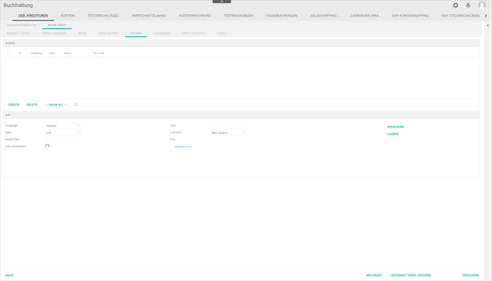

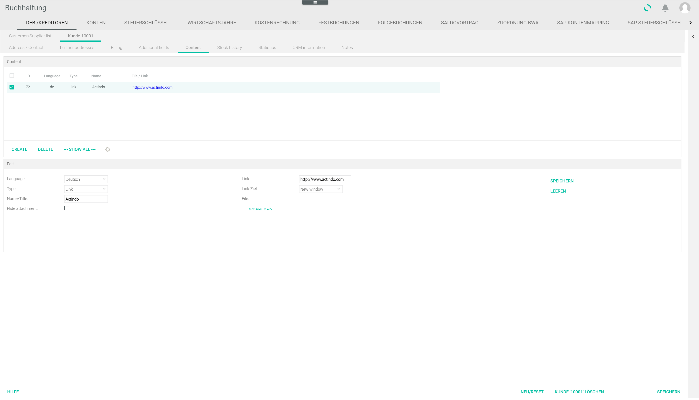

[comment]: <> (Edit section geschnitten/nicht vollständig angezeigt)

- *Language*  
Click the drop-down list to select the appropriate content language.

[comment]: <> (Sprachliste auf DE/EN gemischt)

- *Type*  
Click the drop-down list to select the appropriate content type. Depending on the content type selected, the active fields vary. The following options are available:  

  - **Link**
  - **File**
  - **HTML**

- *Name/Title*  
Enter the content name or title.

- *Hide attachment* [checkbox]  
Select the checkbox to hide an attachment.

- *Link*  
Enter the link to the content.

- *Link target*  
Click the drop-down list to select the appropriate option. The following options are available:  

  - **New window**
  Select this option to open the content in a new window.
  - **Same window**  
  Select this option to open the content in the same window.

- *File*  
Click the [SELECT FILE] button to upload a file. When a file is uploaded, the file name is displayed.  

- [DOWNLOAD]  
Click this button to download the uploaded file.

- (Text editor)  
When selecting HTML type, a text editor is displayed. Click it to enter the desired HTLM content.

- [SAVE]  
Click this button to save any changes made.

- [CLEAR]  
Click this button to clear the input fields.

  > [Info] Make sure to clear all input fields before adding new content. Otherwise, the newly entered content will replace the selected content from the list.

- [NEW/RESET]  
Click this button to reset the *Customer/supplier* tab and create a new customer/supplier. The *Create customer/supplier* tab is displayed.

- [DELETE CUSTOMER 'number']/[DELETE SUPPLIER 'number']  
Click this button to delete the selected customer/supplier.

- [SAVE]  
Click this button to save all changes made in the selected customer/supplier.

### Stock history

*Accounting > Settings > Tab DEBTORS/CREDITORS > Tab Customer/supplier list > Select customer > Sub-tab Stock history*

> [Info] This sub-tab is only displayed when selecting a customer in the *Customer/supplier* list and the customer has already placed at least one order.

- [EXCEL]  
Click this button to display the *EXCEL* context menu. The following options are available:  

  - *Export current page*
  - *Export all*

- *Cust. no.*  
Customer number assigned in the system.

- *Customer name*  
Customer name entered in the system.

- *Document no.*  
Document identification number. The abbreviations indicate the type of document, for example, LI stands for delivery note or AB for order confirmation. The following document types are available:  

  - *AN*: Offer
  - *AB*: Order confirmation
  - *RE*: Invoice
  - *RB*: Cash invoice
  - *AR*: Partial invoice
  - *GU*: Correction invoice
  - *WG*: Credit note
  - *LI*: Delivery note
  - *MA*: Dunning notice
  - *BE*: Purchase order
  - *LB*: Loan receipt
  - *PR*: Pro-forma invoice
  - *ST*: Cancellation document
  - *LD*: Dropship delivery note
  - ??: Return
  - ??: Reshipment to customer

[comment]: <> (Check Terminologie, z.B. Fakturierun/Detail/Create drop-down menu oder Settings, und Abkürzungen!)

- *SKU*  
Stock Keeping Unit. Product identification code.

- *Product name*  
Name of the product.

- *Quantity*  
Amount of products.

- *Price*  
Net price of product.

- *Total price*  
Total price of product.

- *Date*  
Date in which the operation has taken place.

- *Posting type*  
Type of operation. The following operations are available:  

  - *Manual posting*
  - *Reservation*
  - *Waiting for picking*
  - *Sale*
  - *Order*
  - *Purchase*
  - *Back to the supplier*
  - *Stocktaking entry*
  - *Stock transfer*
  - *Return*
  - *Drop shipment*
  - *Problem*
  - *Pre-reserve*

[comment]: <> (List aus Lager/Buchungshistorie)

- *Warehouse*  
Warehouse where the product is stored.

- *Storage shelf at the time of posting*  
Storage shelf where the product is located at the time of the operation.

- *Storage shelf*  
Storage shelf where the product is usually located.

- *Movement*  
Stock movement.

- *Total stock*  
Total stock of the product.

- *Total available*  
Total stock available.

- *Comment*  
Operation-related comment entered in the system, if any. By default, the document number is displayed.

[commnet]: <> (Wo kommt dieses Kommentar her? Lager? Warehouse? Add Link, wenn verfübar?)

-  (Refresh)  
 Click this button to update the receipt list.

- [RESET]  
 Click this button to reset the receipt list view.

- [NEW/RESET]  
Click this button to reset the *Customer/supplier* tab and create a new customer/supplier. The *Create customer/supplier* tab is displayed.

- [DELETE CUSTOMER 'number']/[DELETE SUPPLIER 'number']  
Click this button to delete the selected customer/supplier.

- [SAVE]  
Click this button to save all changes made in the selected customer/supplier.

### Statistics

*Accounting > Settings > Tab DEBTORS/CREDITORS > Tab Customer/supplier list > Select customer > Sub-tab Statistics*

> [Info] This sub-tab is only displayed when selecting a customer in the *Customer/supplier* list and the customer has already placed at least one order.

- *Statistic type*  
Click the drop-down list to select the statistics to be displayed. The following options are available:

  - **General turnover**  
  - **Turnover per product**
  - **Number of units sold per product**

  > [Info] The fields displayed vary depending on the option selected. When selecting an option, the *Statistics extras* side bar opens automatically.

-  (Open)  
Click this arrow to open the *Statistics extras* side bar if necessary.

**General turnover**  

- *Period*  
Period selected in the *Statistics extras* side bar.

- *Turnover*  
Turnover for the selected period.

**Statistics extra**

 (Close)  
Click this arrow to close the *Statistics extras* side bar.

*Period selection*

- (Year drop-down list)  
Click the drop-down list to select the year for the statistics.

- (Period drop-down list)  
Click the drop-down list to select the period for the statistics. The following options are available:  

  - *Year*  
  Select this option to display the turnover for the selected year.

  - *Quarter*  
  Select this option to display the turnover for a specific quarter. An additional drop-down list to choose the quarter is displayed.

  - *Month*  
  Select this option to display the turnover for a specific month. An additional drop-down list to choose the month is displayed.

  - *Calendar week*  
  Select this option to display the turnover for a specific month. An additional drop-down list to choose the calendar week is displayed.

  - *Free selection*  
  Select this option to determine a period freely. The additional *from - to* fields and the  (Calendar) button are displayed.

  - *From - to*  
  Enter the start and end date of a specific period for the statistics. Alternatively, use the  (Calendar) button to select the desired dates.

  - *Product group*  
  Click the drop-down list to select a specific product group. All available product groups are displayed in the list.

  - *Customer*  
  Click the drop-down list to select a specific customer. All available customers are displayed in the list.

- [+ COMPARISON PERIOD]  
Click this button to add a comparison period in the statistics. Additional year and period selection drop-down lists are displayed to specify the comparison period.

- [SHOW]  
Click this button to display the statistics in the list.

- [PRINT]  
Click this button to print the statistics displayed. The *Print view* window is displayed.

[comment]: <> (HG: Fenster beschreiben?)

- [EXCEL]  
Click this button to download the statistics displayed in Excel format. By default, the downloaded export file is saved in the *Downloads* folder of your device.

**Turnover per product**

- *Product group*  
Product group which the product belongs to, if any.

- *Product*  
Product name.

- *Product number*  
Product identification number.

- *Quantity sold*  
Quantity of products sold in the selected period.  

- *Quantity credited*  
Quantity of products credited in the selected period.

- *Sales price*  
Product sales price in the selected period.

- *Turnover*  
Turnover generated in the selected period.

- *TOTAL AMOUNT/AVERAGE*  
Total amount/average values for the selected period.

**Statistics extra**

 (Close)  
Click this arrow to close the *Statistics extras* side bar.

*Period selection*

- (Top value drop-down list)  
Click this drop-down list to select the values to be displayed. The following options are available:

  - **Top 20**  
  Select this option to display the 20 best vales.

  - **Flop 20**  
  Select this option to displays the 20 worst values.

  - **All**  
  Select this option to display all values.

- (Year drop-down list)  
Click the drop-down list to select the year for the statistics.

- (Period drop-down list)  
Click the drop-down list to select the period for the statistics. The following options are available:  

  - *Year*  
  Select this option to display the turnover for the selected year.

  - *Quarter*  
  Select this option to display the turnover for a specific quarter. An additional drop-down list to choose the quarter is displayed.

  - *Month*  
  Select this option to display the turnover for a specific month. An additional drop-down list to choose the month is displayed.

  - *Calendar week*  
  Select this option to display the turnover for a specific month. An additional drop-down list to choose the calendar week is displayed.

  - *Free selection*  
  Select this option to determine a period freely. The additional *from - to* fields and the  (Calendar) button are displayed.

  - *From - to*  
  Enter the start and end date of a specific period for the statistics. Alternatively, use the  (Calendar) button to select the desired dates.

  - *Product group*  
  Click the drop-down list to select a specific product group.

  - *Customer*  
  Click the drop-down list to select a specific customer.

- [+ COMPARISON PERIOD]  
Click this button to add a comparison period in the statistics. Additional year and period selection drop-down lists are displayed to specify the comparison period..

- [SHOW]  
Click this button to display the statistics in the list.

- [PRINT]  
Click this button to print the statistics displayed. The *Print view* window is displayed.

[comment]: <> (Fenster beschreiben?)

- [EXCEL]  
Click this button to download the statistics displayed in Excel format. By default, the downloaded export file is saved in the
*Downloads* folder of your device.

**Number of units sold per product**

- *Product group*  
Product group which the product belongs to, if any.

- *Product*  
Product name.

- *Product number*  
Product identification number.

- *Quantity sold*  
Quantity of products sold in the selected period.  

- *Turnover*  
Turnover generated in the selected period.

- *TOTAL AMOUNT/AVERAGE*  
Total amount/average values for the selected period.

**Statistics extra**

 (Close)  
Click this arrow to close the *Statistics extras* side bar.

*Period selection*

- (Top value drop-down list)  
Click this drop-down list to select the values to be displayed. The following options are available:

  - **Top 20**  
  Select this option to display the 20 best values.

  - **Flop 20**  
  Select this option to displays the 20 worst values.

  - **All**  
  Select this option to display all values.

- (Year drop-down list)  
Click the drop-down list to select the year for the statistics.

- (Period drop-down list)  
Click the drop-down list to select the period for the statistics. The following options are available:  

  - *Year*  
  Select this option to display the turnover for the selected year.

  - *Quarter*  
  Select this option to display the turnover for a specific quarter. An additional drop-down list to choose the quarter is displayed.

  - *Month*  
  Select this option to display the turnover for a specific month. An additional drop-down list to choose the month is displayed.

  - *Calendar week*  
  Select this option to display the turnover for a specific month. An additional drop-down list to choose the calendar week is displayed.

  - *Free selection*  
  Select this option to determine a period freely. The additional *from - to* fields and the  (Calendar) button are displayed.

  - *From - to*  
  Enter the start and end date of a specific period for the statistics. Alternatively, use the  (Calendar) button to select the desired dates.

  - *Product group*  
  Click the drop-down list to select a specific product group.

  - *Customer*  
  Click the drop-down list to select a specific customer.

- [+ COMPARISON PERIOD]  
Click this button to add a comparison period in the statistics. Additional year and period selection drop-down lists are displayed to specify the comparison period.

- [SHOW]  
Click this button to display the statistics in the list.

- [PRINT]  
Click this button to print the statistics displayed. The *Print view* window is displayed.

[comment]: <> (Fenster beschreiben?)

- [EXCEL]  
Click this button to download the statistics displayed in Excel format. By default, the downloaded export file is saved in the *Downloads* folder of your device.

- [NEW/RESET]  
Click this button to reset the *Customer/supplier* tab and create a new customer/supplier. The *Create customer/supplier* tab is displayed.

- [DELETE CUSTOMER 'number']/[DELETE SUPPLIER 'number']  
Click this button to delete the selected customer/supplier.

- [SAVE]  
Click this button to save all changes in the selected customer/supplier.

### Drop shipping

*Accounting > Settings > Tab DEBTORS/CREDITORS > Tab Customer/supplier list > Select supplier > Sub-tab Drop shipping*

> [Info] This sub-tab is only displayed when selecting a supplier in the *Customer/supplier* list.

[comment]: <> (HG: Fenster geschnitten)

**Settings**

- *Drop shipping*  
The left side menu displays the drop shipping setting options. The following menu entries are available:

  - *Shipper*  
  Click this menu entry to display the *Shipping* settings.

  - *Export*  
  Click this menu entry to display the *Export* settings.

  - *Receipt export*  
  Click this menu entry to display the *Receipt export* settings.

  - *Reimport*  
  Click this menu entry to display the *Reimport* settings.

*Shipper*

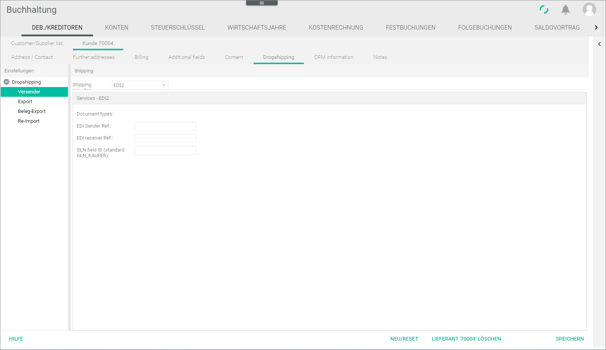

**Shipping**

- *Shipping provider*  
Click the drop-down list to select a shipping provider. All available shipping providers are displayed in the list. Depending on the shipping provider selected, the fields displayed in the *Services* section vary.  

  > [Info] The shipping provider can be configured in the *Shipping provider* tab of the *Settings* menu entry in the *Order management* module.

**Services - (shipping provider name)**  
Configure the services as agreed with the shipping provider. Depending on the shipping provider selected, the services, and therefore the displayed fields, vary.

[comment]: <> (Info kommt aus Fakturierung/Settings/Shipping provider/Shipping -> Link hinzufügen, wenn verfügbar.)

[comment]: <> (Frage FH: Was wird by default angezeigt? Wonach richtet sich, was angezeigt wird? Kundeneinstellungen?)

*Export*

  

**Export**

- *Export via*  
Click the drop-down list to select the appropriate export method. The following options are available:  

  - **csv**
  - **No export**

[comment]: <> (FH: Andere Optionen? Wovon hängt es ab?)

- *Number of data records per file*  
Enter the desired number of data records per file.

- *Export definition*  
Click the drop-down list to select the export definition. The following options are available:  

  - **DHL Easylog**
  - **DPD Shipping**
  - **GLS Gepard**

[comment]: <> (FH: Andere Optionen? Wovon hängt es ab?)

- [EDIT]  
Click this button to edit the export definition. The *Import/export definitions* window is displayed, see [Import/export definitions](#import-export-definitions).

- *Export file name*  
Enter the export file name.

[comment]: <> (FH: versand-%p.csv -> Default value? Muss man es so beibehalten und dann % ersetzt? Oder egal?)

**Export specifications**

- *Minimum weight*  
Enter the desired minimum weight.

[comment]: <> (HF: File weight? Better file size? Minimum oder maximum?)

**Export to ECM**  

- *Export to ECM*  
Click the drop-down menu to select the appropriate option (**Yes/No**).

- *Export path*  
Enter the appropriate export path. Alternatively, click the [SEARCH] button to determine the export path.

- [SEARCH]  
Click this button to determine the export path. The *Select file* window is displayed, see [Select file](#select-file). Select the folder where the file is to be exported.

**Export to an external SFTP server**  

- *Export to SFTP server*  
Click the drop-down menu to select the appropriate option (**Yes/No**).

**Send export by email**

- *Send by email*  
Click the drop-down menu to select the appropriate option (**Yes/No**).

*Receipt export*

    

**Document export**  

- *Export from invoice*  
Click the drop-down menu to select the appropriate option (**Yes/No**).

- *Export from delivery note*  
Click the drop-down menu to select the appropriate option (**Yes/No**).

- *Export from dropship delivery note*  
Click the drop-down menu to select the appropriate option (**Yes/No**).

- *Export from proforma order*  
Click the drop-down menu to select the appropriate option (**Yes/No**).

- *File name invoice*  
Enter the file name for the invoice.

- *File name delivery note*  
Enter the file name for the delivery note.

- *File name dropship delivery note*  
Enter the file name for the dropship delivery note.

- *File name proforma order*  
Enter the file name for the proforma order.

**Export to ECM**  

- *Export to ECM*  
Click the drop-down menu to select the appropriate option (**Yes/No**).

- *Export path*  
Enter the appropriate export path. Alternatively, click the [SEARCH] button to determine the export path.

- [SEARCH]  
Click this button to determine the export path. The *Select file* window is displayed, see [Select file](#select-file). Select the folder where the file is to be exported.

**Export to an external SFTP server**  

- *Export to SFTP server*  
Click the drop-down menu to select the appropriate option (**Yes/No**).

**Send receipts by email**

- *Send by email*  
Click the drop-down menu to select the appropriate option (**Yes/No**).

*Reimport*  

   

> [Info] Depending on the supplier selected, the sections and fields displayed vary.

**Reimport**

- *Active*  
Click the drop-down menu to select the appropriate option (**Yes/No**).

- *Import via*  
Click the drop-down list to select the appropriate export method. The following options are available:  

  - **csv**
  - **No export**

[comment]: <> (FH: Andere Optionen? Wovon abhängig?)

- *Import definition*  
Click the drop-down list to select the export definition. The following options are available:  

  - **DHL Easylog**

[comment]: <> (Andere Optionen, abhängig von Shipping provider?)

- [EDIT]  
Click this button to edit the import definition. The *Import/export definitions* window is displayed, see [Import/export definitions](#import-export-definitions).

- *Import file name*  
Enter the import file name.

[comment]: <> (import*.csv -> Default value? Muss man es so beibehalten und dann * ersetzt? Oder egal?)

**Import from the ECM**

- *Import from the ECM*  
Click the drop-down menu to select the appropriate option (**Yes/No**).

- *Import path*  
Enter the appropriate import path. Alternatively, click the [SEARCH] button to determine the import path.

- [SEARCH]  
Click this button to determine the import path. The *Select file* window is displayed, see [Select file](#select-file). Select the folder where the file must be imported.

- *Action after import*  
Click the drop-down menu to select the appropriate option. The following options are available:

  - **Delete**  
  Select this option to delete the file after import. The field *Path to move* and the [SEARCH] button become inactive.

  - **Move**  
  Select this option to move the file after import. The field *Path to move* and the [SEARCH] button become active.

- *Path to move*  
Enter the appropriate path to move the file. Alternatively, click the [SEARCH] button to determine the path to move the file.

- [SEARCH]  
Click this button to determine the path to move the file. The *Select file* window is displayed, see [Select file](#select-file). Select the folder where the file must be moved.

**Import from an external SFTP server**

- *Import from SFTP server*  
Click the drop-down menu to select the appropriate option (**Yes/No**).

### CRM information

*Accounting > Settings > Tab DEBTORS/CREDITORS > Tab Customer/supplier list > Select customer/supplier > Sub-tab CRM information*

> [Info] When selecting a supplier (customer 70000 onwards) in the *Customer/supplier list*, only the *General* and *Credit rating* sections are displayed. Moreover, the *General* section contains only the *Supervisor*, *Area*, *Last pers. contact*, *Industry* and *Industry 2* fields.

**General**

  - *Customer no.*  
  Enter the appropriate customer number.

  - *Type*  
  Enter the type of customer.

  - *Date of birth*  
  Enter the date of birth or click the  (Calendar) button to select the date.

  - *Supervisor*  
  Click the drop-down list to select the person responsible for this customer/supplier.

  - *Area*  
  Enter the applicable area, if necessary.

  - *Last pers. contact*  
  Enter the date of the last personal contact or click the  (Calendar) button to select the date.

  - *Industry*  
  Enter information about the applicable industrial sector, if necessary.

  - *Industry 2*  
  Enter further information about the applicable industrial sector, if necessary.

**Credit rating**

  - *Request from*  
  Enter the request date or click the  (Calendar) button to select the date.

  - *Capital*  
  Enter the applicable capital amount.

  - *Employees*  
  Click the drop-down list to select the appropriate number of employees.

  - *Status from*  
  Enter the status date or click the  (Calendar) button to select the date.

  - *Year*  
  Enter the year of the credit rating.

  - *Turnover*  
  Enter the turnover value.

  [comment]: <> (Im System "Sales")

  - *Other information*  
  Enter any other relevant information.

**Document Dispatch Notification Settings**

> [Info] This section is only relevant for customers, not for suppliers.

- *Overwrite* [x]  
Select the checkbox to display the options below. Otherwise, the default settings are applied.

- *Dispatch method*  
Click the drop-down list to select the dispatch method. The following options are available:  

    - **Email**
    - **Post**
    - **Fax**
    - **APS print**  

[comment]: <> (Im System Shipping method)

- *Order origin*  
Click the drop-down list to select the applicable order origins(s). Multiple selection is possible.

- *Template*  
Click the drop-down list to select the applicable template.

[comment]: <> (Drop-down list options to be localised)

- [NEW/RESET]
Click this button to reset the Customer/supplier tab and create a new customer/supplier. The Create customer/supplier tab is displayed.

- [DELETE CUSTOMER 'number']/[DELETE SUPPLIER 'number']
Click this button to delete the selected customer/supplier.

- [SAVE]
Click this button to save all changes made in the selected customer/supplier.

### Notes

*Accounting > Settings > Tab DEBTORS/CREDITORS > Tab Customer/supplier list > Select customer/supplier > Sub-tab Notes*

- *Comments*  
Enter any further relevant information in the box. The information entered here is displayed in the *Comments* column in the *Customer/supplier* tab.

- [NEW/RESET]  
Click this button to reset the *Customer/supplier* tab and create a new customer/supplier. The *Create customer/supplier* tab is displayed.

- [DELETE CUSTOMER (XXXXX)]/[DELETE SUPPLIER (XXXXX)]  
Click this button to delete the selected customer/supplier.

- [SAVE]  
Click this button to save all changes in the selected customer/supplier.

#### Select tax office

*Accounting > Settings > Tab DEBTORS/CREDITORS > Tab Create customer/supplier > Sub-tab Invoicing > Button SUCHEN*

*Accounting > Settings > Tab DEBTORS/CREDITORS > Tab Customer/supplier list > Select customer/supplier > Sub-tab Invoicing > Button SUCHEN*

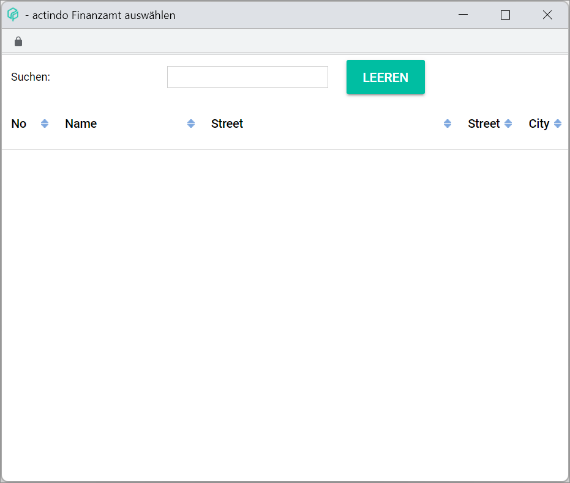

- *Search*  [Search bar]  
Enter here the text to be searched for. Press ENTER to start the search.

- [CLEAR]  
Click this button to clear the search text.

The search results are displayed in a column view. The information displayed in columns is read-only.

- *No.*  
This column displays the tax office number.

- *Name*  
This column displays the tax office name.

- *Street*  
This column displays the tax office street.

- *Street*  
This column displays additional address details.

[comment]: <> (Or Zip code? Rename column. Bug in OneNote)

- *City*  
This column displays the tax office location.

[comment]: <> (FH: Fenster funktioniert nicht? -> Wenn man versucht zu suchen, Fehlermeldung. Plugin fehlt?)

#### Edit additional fields

*Accounting > Settings > Tab DEBTORS/CREDITORS > Tab Customer/supplier list > Select customer/supplier > Sub-tab Additional fields > Button EDIT ADDITIONAL FIELDS*

- [EXCEL]  
Click this button to display the *EXCEL* context menu. The following options are available:  

  - *Export current page*

The existing additional fields are displayed in a column view. Depending on the settings, the displayed columns may vary. All information provided in columns is read-only.

- [Checkbox]  
Click this checkbox to select a field to be edited or deleted. The *Edit* section is displayed.

- *Field ID*  
This column displays the field ID entered.

- *Field name*  
This column displays the field name entered.

- *Field groups*  
This column displays the field groups selected.

- *Type*  
This column displays the type of field selected.

- *Printing on document type(s)*  
This column displays the document selected for printing.

- [CREATE]  
Click this button to create new additional fields. The *Add* section is displayed.

- [DELETE]  
Click this button to delete a selected address from the list.

-   (Refresh)  
Click this button to refresh the list after making any changes.

**Add/Edit**

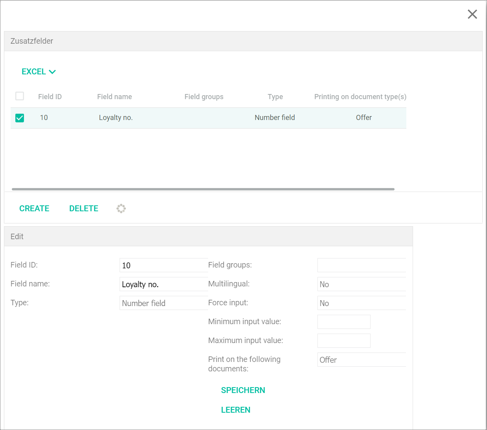

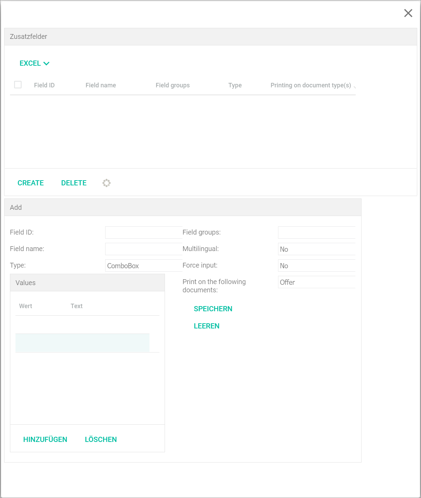

> [Info] When clicking the [CREATE] button, the *Add* section is displayed. When marking a checkbox from the delivery addresses list, the address details are displayed in the input fields, where they can be edited. The *Add* section name changes to *Edit*.

[comment]: <> (Bilder ändern sich nach Type? Alle abgebildet? Mehrere Bilder Grouppieren? -> Snagit RS HG)

- *Field ID*  
Enter the field ID. The field ID must contain at least two characters. Only a-z und 0-9 can be used.

- *Field name*  
Enter a field name.

- *Type*  
Click the drop-down list to select the appropriate type. The following options are available:

  - **Text field**
  - **Number field**
  - **Text field, multiline**
  - **Checkbox**
  - **ComboBox**
  - **Date**
  - **Time**  

  > [Info] Depending on the type selected, the fields displayed vary slightly.

- *Field groups*  
Click the drop-down list to select the appropriate option.

[comment]: <> (FH: Field groups leer? Meaning? Options? Where should it be preconfigured for the drop-down list options to be displayed?)

- *Multilingual*  
Click the drop-down list to select the appropriate option (**No/Yes**).

- *Force input*  
Click the drop-down list to select the appropriate option (**No/Yes**).

[comment]: <> (Meaning? mandatory input? DE = Auswahl / Eingabe erzwingen)

- *Minimum input length/value*  
Enter a number to determine the minimum input length/value.

- *Maximum input length/value*  
Enter a number to determine the maximum input length/value.

- *Print on the following documents*  
Click the drop-down list to select the applicable document. The following options are available:

  - **Offer**
  - **Order confirmation**
  - **Invoice**
  - **Cash invoice**
  - **Partial invoice**
  - **Correction invoice**
  - **Credit note**
  - **Delivery note**
  - **Dunning notice**
  - **Purchase order**
  - **Loan receipt**
  - **Pro-forma invoice**
  - **Cancellation document**
  - **Dropship delivery note**
  - **Return**
  - **Reshipment to customer**

  [comment]: <> (Alle Dokumentennamen vereinheitlichen! Terminologie prüfen!)

- *Values*  
When selecting the **ComboBox** option, an input box is displayed. Click the *Value* and *Text* table cells to enter data.

- [ADD]  
Click this button to add a row in the input box.

- [DELETE]  
Click this button to delete.

- [SAVE]  
Click this button to save any changes made.

- [CLEAR]  
Click this button to clear the input lines.

## Loyalty cards

*Accounting > Settings > Tab DEBTORS/CREDITORS > Button Back*

**Loyalty card printing**

> [Info] Select the customer(s) whose loyalty cards must be printed by dragging and dropping them from the customer list into the *Loyalty card printing* tab with the mouse.

- *Customer no.*  
Customer identification number as assigned in the system.

- *Short name*  
Short name as provided in the system.

- *No.*  
Card number.

- [PRINT CUSTOMER CARD]  
Click this button to display a preview of the printable customer card.

#### Import/export definitions

**Name**

- (Drop-down list)  
Click the drop-down list to select a preconfigured import/export definition type. If there are any available, the second drop-down list displays the preconfigured definitions of the selected type.

[comment]: <> (Bedeutung von Asterisk neben Namen?)

- (Drop-down list)  
 Click the drop-down list to select the desired preconfigured import/export definition.

- [ADD]  
Click this button to create an import/export definition. The *New import/export definition* window is displayed, see [New import/export definition](#new-import-export-definition).

- [EDIT]  
Click this button to rename an import/export definition. The *Rename import/export definition* is displayed, see [Rename import/export definition](#rename-import-export-definition).

- [DELETE]  
Click this button to delete an import/export definition. A confirmation window is displayed.

**Fields in the definition**  
This list displays all fields contained in the selected import/export definition. Use the arrow buttons to modify the fields in the list:

  -  (Up)  
Use this button to move a selected field up in the list.

  -  (Down)  
Use this button to move a selected field down in the list.

  - 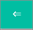 (Left)  
Use this button to move a selected field left, from the *Possible fields* list to the *Fields in the definition* list.

  -  (Right)  
Use this button to move a selected field right, from the *Fields in the definition* list to the *Possible fields* list.

**Column**  
The letter and number in brackets indicate the column where a selected field is placed.

**Possible fields**  
This list displays all fields available for the selected import/export definition.

[INSERT IGNORE FIELD]  
Click this button to enter an "ignore field", that is, to indicate that the field in that position does not need to be exported or imported, in the *Fields in the definition* list.

**CSV format definition**

- *Field separating character*  
Enter the character to be used to separate fields. This value may be set up by default to comma or semicolon.

- *Escape character*  
Enter the character to be used to escape. This value may be set up by default to backslash.

[comment]: <> (Further info needed! RS HG)

- *Column name*  
Click the drop-down list to select the appropriate option (**Yes/No**) to include or not the column name in the export/import.

- *Date format*  
Click the drop-down list to select the desired date and time format.

- *Example data set*  
An example of a data set with the current field definition is displayed. This field is read-only.

[comment]: <> (Unsure! Check!)

- *Field delimiting character*  
Enter the character to be used to separate fields. This value may be set up by default to quotation mark.

- *Row end character*  
Click the drop-down list to select the appropriate option, either **Automatic** or the applicable operating system.

- *Character set*  
Click the drop-down list to select the appropriate option, either **Automatic** or the applicable encoding.

- *Incorrect tow end character*  
Click the drop-down list to select the appropriate option (**Ignore/Repair**).

- *Number format*  
Click the drop-down list to select the desired number format.

- [SAVE]  
Click this button to save the changes.

#### New import/export definition  

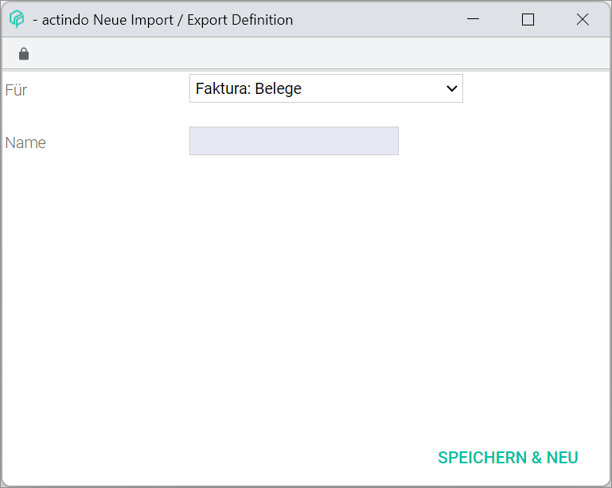

- *For*  
Click the drop-down list to select the import/export definition type where the new definition will be added.  

- *Name*  
Enter a name for the new import/export definition to be created.

- [SAVE & NEW]  
Click this button to create a new import/export definition.  

#### Rename import/export definition  

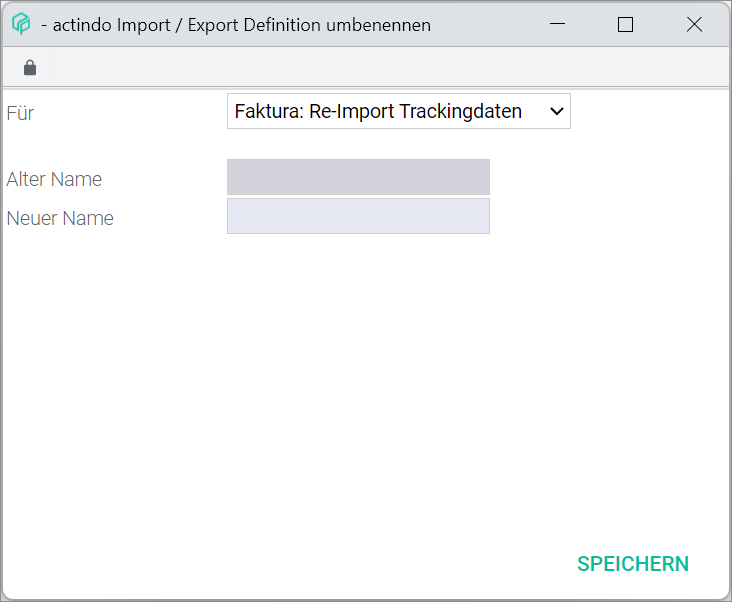

- *For*  
Click the drop-down list to select the import/export definition type where the new definition will be renamed.  

- *Old name*  
The previously given name is displayed. This field is read-only.

- *New name*  
Enter a new name for the selected import/export.

- [SAVE]  
Click this button to rename the selected import/export definition.  

#### Select file

- *New documents*  
The new uploaded documents are contained in this folder.

- *Registered documents*  
The documents that have been registered in the system are contained in this folder.

- *Printed documents*  
The documents that have been printed are contained in this folder.

  > [Info] Further folders can be created in the *Documents* module.

- *Name*  
Name of folder or file.

- *Size*  
Size of folder or file.

- *Type*  
Type of item.

- *Changed*  
Date and time when the folder or file were modified.

- *Owner*  
Person owning the folder or file.

- [CLOSE]  
Click this button to close the window.

- [OPEN]  
Click this button to open the selected folder.
