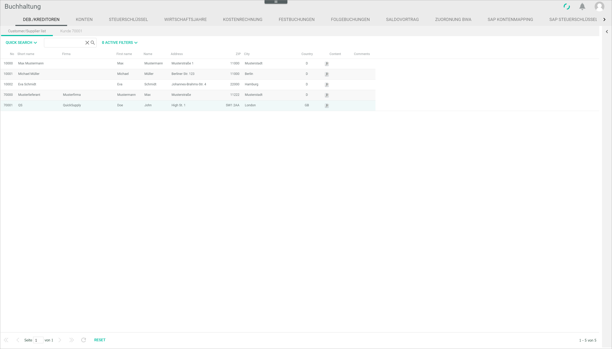
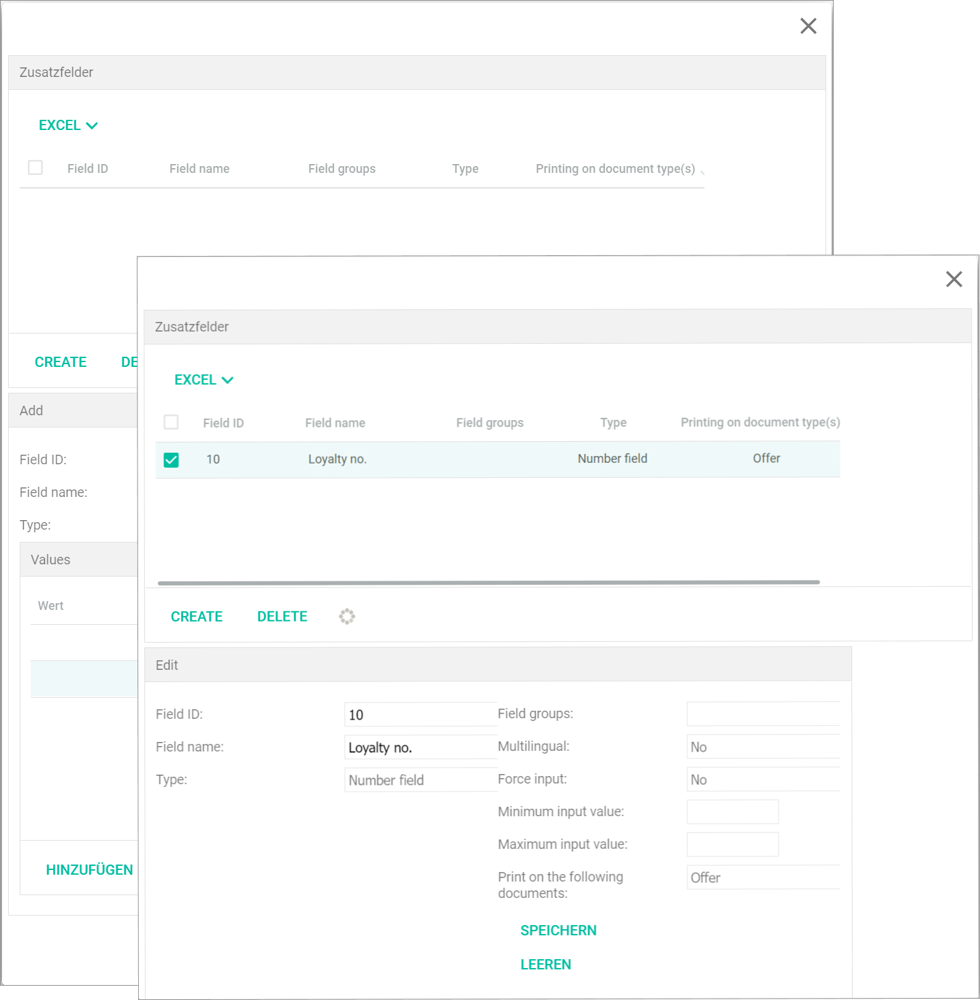

# Debtors/creditors

*Accounting > Settings > Tab DEBTORS/CREDITORS*

The *DEBTORS/CREDITORS* tab displays a customer/supplier list and allows to create, edit and delete customers (debtors) and suppliers (creditors). For detailed information about managing customers and suppliers, see [Manage the customer/supplier](../Integration/05_ManageCustomerSupplier.md).

The *DEBTORS/CREDITORS* tab contains in turn two tabs:

  - Customer/supplier list, see [Customer/supplier list](#customersupplier-list).
  - Create customer/supplier, see [Create customer/supplier](#create-customersupplier). When selecting a customer/supplier from the customer/supplier list, the tab name changes to *Customer/supplier "Number"*, see [Customer/supplier "Number"](#customersupplier-number).

The identical customer/supplier list is available in the *Order management* module: *Order management > Customers/suppliers*. The list is synchronized between the two modules so that the same data can be accessed.

[comment]: <> (Es heißt eingelicht immer "Kunde xxxxx", egal ob Kunde oder Lieferant. Kommentar in Bug-Datei hinzugefügt)

## Customer/supplier list

*Accounting > Settings > Tab DEBTORS/CREDITORS > Tab Customer/supplier list*

This tab can also be accessed in the *Select address* window from the COST ACCOUNTING tab in the user interface, see [Select address](02e_CostAccounting.md#select-address).

- [EXCEL]  
    Click this button to display the *EXCEL* context menu. The following options are available:  

    - *Export current page*  
        Click this option to export the customer/supplier list page currently displayed. The customer/supplier list is exported in Excel format and saved by default in the *Downloads* folder in your computer.

    - *Export all*  
        Click this option to export all customer/supplier list pages. The customer/supplier list is exported in Excel format and saved by default in the *Downloads* folder in your computer.

        > [Info] The [EXCEL] button is only displayed if the *Statistics* module is installed.

  [comment]: <> (Stimmt das so?)

- [QUICK SEARCH]  
    Click this button to display the *QUICK SEARCH* filter list. By default, all search criteria checkboxes are selected. Deselect a search criterion to exclude it from the search. The following search criteria are available:

    - *No.*  
    - *Short name*
    - *Company*  
    - *Forename*
    - *Surname*
    - *Address*
    - *Address 2*
    - *Zip*
    - *City*
    - *Country*
    - *Content*
    - *Currency*
    - *Comments*
    - *Phone*
    - *Phone 2*
    - *Mobile phone*
    - *Fax*
    - *Email*
    - *VAT ID*
    - *Type of customer*
    - *Customer number*

- [Search bar]  
    Enter the search text (letters or numbers). The criteria selected in the *QUICK SEARCH* filter list are applied to the search.

-  (Cross)  
    Click this button to clear the search bar.

-  (Search)  
    Click this button to start the search. Alternatively, you can press the **ENTER** key.

- [ACTIVE FILTERS]  
    Click this button to display the filter menu.

    - [x] *ACTIVE*  
        Select the checkbox to activate the corresponding search criteria.

    - *FILTER BY*  
        The following filter values are available:
        - *Price group*   
            Click the drop-down list to select the applicable filter criterion. All available price groups are displayed in the list.

            > [Info] Price groups can be created in the *Settings* menu entry of the *Material management* and the *Order management* modules. A customer can be assigned to a specific price group in the *Invoicing* sub-tab of the *DEBTORS/CREDITORS* tab, see [Invoicing](#invoicing).

    - *FILTER CRITERION*  
        Click the drop-down list to select the appropriate option for the corresponding filter criterion.

    - [CANCEL]  
        Click this button to cancel the filter selection. The filter menu is closed.

    - [APPLY]  
        Click this button to apply the filter criteria. The filter menu is closed.

The list displays all customer/supplier details. Depending on the settings, the displayed columns may vary. All fields are read-only.

> [Info] To add or delete columns, click the  (Points) button to display the context menu. Then, hover the mouse over the  (Columns) menu entry to display all available options. Select or deselect the columns as desired.

- *No.*  
    Customer/supplier number. Customer numbers range from 10000 to 69999 and supplier numbers, from 70000 to 99999.

- *Short name*  
    Short name given to the customer/supplier.

- *Company*  
    Company name.

- *Forename*  
    Customer/supplier first name.

- *Surname*  
    Customer/supplier last name.

- *Address*  
    Customer/supplier address.

- *Address 2*  
    Complimentary address information.

- *Zip*  
    Customer/supplier zip code.

- *City*   
    Customer/supplier city or town.

- *Country*  
    Customer/supplier country.

- *Content*  
    Number of files and/or links added to the customer/supplier information.  A document icon is displayed indicating the number of attached files and/or links.  

- *Currency*  
    Base currency used by customer/supplier.

- *Comments*  
    Indication of whether comments have been added to the customer/supplier information. If comments exist, a blue info icon is displayed.

- *Phone*  
    Customer/supplier contact phone number.

- *Phone 2*  
    Customer/supplier second contact phone number.    

- *Mobile phone*  
    Customer/supplier mobile phone number.

- *Fax*  
    Customer/supplier fax number.

- *Email*  
    Customer/supplier email address.

- *VAT ID*  
    Customer/supplier VAT identification number, if applicable.

- *Type of customer*  
    Type of customer/supplier as defined by the user.

- *Customer number*  
    Reference customer/supplier number as defined by the user.

### Customer/supplier context menu
*Accounting > Settings > Tab DEBTORS/CREDITORS > Tab Customer/supplier list > Right-click on customer/supplier*

- *Show documents of the customer/supplier*  
    Click this option to access all orders of the customer/supplier in the *Order management* module. The *OVERVIEW* tab is displayed: *Order management > Overview > Tab OVERVIEW*.

- *Show articles of supplier*  
    Click this option to access the supplier product list in the *Material management* module. The *ARTICLE* tab is displayed: *Material management > Article > Tab ARTICLE*.

[comment]: <> (rename when material management is updated)

-  (Refresh)  
    Click this button to update the receipt list.

- [RESET]  
    Click this button to reset the receipt list view.

## Create customer/supplier

*Accounting > Settings > Tab DEBTORS/CREDITORS > Tab Create customer/supplier*

The *Create customer/supplier* tab contains the following sub-tabs to organize customer/supplier details:
- *[Address/contact](#addresscontact)*
- *[Delivery addresses](#delivery-addresses)*
- *[Invoicing](#invoicing)*
- *[Additional fields](#additional-fields)*
- *[Drop shipping](#drop-shipping)*
- *[CRM information](#crm-information)*
- *[Notes](#notes)*

### Address/contact

*Accounting > Settings > Tab DEBTORS/CREDITORS > Tab Create customer/supplier > Sub-tab Address/contact*

**Address details**  

[comment]: <> (im System Address data)

- *Create debtor/creditor*  
    Click the drop-down list to select the appropriate option. The following options are available:
    - **Debtor (customer)**
    - **Creditor (supplier)**

    > [Info] This drop-down list is only displayed when creating a customer/supplier.

[comment]: <> (im System: Customer customer / Vendor supplier)

- *Debtor/creditor no.*  
    Enter a customer/supplier number or leave this field empty. The system adds the next available number automatically. Customer numbers range from 10000 to 69999 and supplier numbers, from 70000 to 99999.  

    > [Info] If a number is entered out of the valid range for personal numbers (10000-69999 for customers and 70000-99999 for suppliers), a warning message is displayed.

- *Short name*  
    Enter a short name for the customer/supplier. This field is mandatory.

- *Title*  
    Click the drop-down list to select the appropriate title. The following options are available:  
    - **Company**
    - **Mr**
    - **Ms**
    - **Mr and Mrs**
    - **Dr**
    - **Prof.**
    - **None**

- *Letter salutation*  
    Enter the appropriate letter salutation.

- *Company*  
    Enter the company name.

- *Surname*  
    Enter the customer/supplier last name.  

    > [Info] To create a customer/supplier, either a company or a customer/supplier name must be entered.

- *Forename*  
    Enter the customer/supplier first name.

- *Address*  
    Enter the customer/supplier address.

- *Address supplement*  
    Enter any other necessary address information.  

[comment]: <> (im System Address suffix)

- *Zip code*  
    Enter the customer/supplier zip code.  

[comment]: <> (im System Postal code)

- *City*  
    Enter the customer/supplier city or town.  

[comment]: <> (im System Ort)

- *Country*  
    Click the drop-down list to select the applicable country.  

[comment]: <> (Drop-down liste im System auf DE, Sortierung aber auf EN o.ä.)

**Contact**

- *Phone*  
    Enter a contact phone number.

- *Phone 2*  
    Enter a second contact phone number.

- *Mobile phone*  
    Enter a mobile phone number.

- *Fax*  
    Enter a fax number.

- *Email*  
    Enter an email address.

- *URL*  
    Enter the customer/supplier URL.

**Further**

- *Language*  
    Click the drop-down list to select the appropriate language. All available languages are displayed in the list. If you want no language to be selected, select the **No linguistic content** option.

[comment]: <> (Drop-down liste im auf DE/EN gemischt)

- *Currency*  
    Click the drop-down list to select the applicable currency. All available currencies are displayed in the list.

- [SAVE]  
    Click this button to save the new customer/supplier details.

    > [Info] It is not possible to enter any further information in the other sub-tabs before saving the details entered in the *Address/contact* sub-tab. When clicking the other sub-tabs, a window with the prompt to save is displayed. Click the [OK] button to save the new customer/supplier. Even after saving, the *Delivery addresses*, *Additional fields* and *Drop shipping* sub-tabs display a notice and cannot be accessed. To access these sub-tabs to add data, select the corresponding customer/supplier in the *Customer/Supplier list* tab.

### Delivery addresses

*Accounting > Settings > Tab DEBTORS/CREDITORS > Tab Create customer/supplier > Sub-tab Delivery addresses*

The *Delivery address* sub-tab cannot be edited here. The notice *Please save customer/supplier first* is displayed.

To add further delivery addresses, see [Further addresses](#further-addresses).

[comment]: <> (Bug/question added to Bug Notes document)

- [SAVE]  
    No data can be saved at this point in this sub-tab. To access this sub-tab to add data, select the corresponding customer/supplier in the *Customer/Supplier list* tab.

### Invoicing

*Accounting > Settings > Tab DEBTORS/CREDITORS > Tab Create customer/supplier > Sub-tab Invoicing*

**Bank details**

- *Account holder*  
    Enter the account holder name.

- *Account*  
    Enter the customer/supplier bank account.

- *Routing number*  
    Enter the bank routing number.

- *Bank*  
    The bank name is filled in automatically when entering the routing number.

- *BIC*  
    Enter the BIC (Bank Identifier Code).

- *IBAN*  
    Enter the IBAN (International Bank Account Number).

- *SEPA mandate reference*  
    Enter the SEPA mandate reference.

- *Signature date*  
    Click the  (Calendar) button to select the signature date. Alternatively, you can enter the date manually. The valid date format is *DD.MM.YYYY*.

**Payment options**

- *Price group*  
    Click the drop-down list to select the appropriate option. All available price groups are displayed in the list.

    > [Info] Price groups can be created in the *Settings* menu entry of the *Material management* and the *Order management* modules.

- *Print gross/net*  
    Click the drop-down list to select how prices are indicated on receipts when printed. The following options are available:   
    - **Net prices on receipts**
    - **Gross prices on receipts**
    - **Gross prices stating net total amount**

**Tax**

- *Tax office no.*  
    Enter the tax office number. If the number is unknown, click the [SEARCH] button to search for the competent tax office.

- [SEARCH]  
    Click this button to search for a tax office. The *Select tax office* window is displayed, see [Select tax office](#select-tax-office). This function is currently not available.

- *Tax office*  
    Enter the competent tax office name.

- *Tax no.*  
    Enter the customer/supplier tax number.

- *VAT ID*  
    Enter the customer/supplier VAT identification number.

[comment]: <> (Tax office function funktioniert nicht.)

**Posting**  

- *Standard account*  
    Enter a standard account number for the postings.   

- *Standard cost 1*  
    Enter a standard cost center for the postings.

- *Standard cost 2*  
    Enter a standard cost unit for the postings.

**Credit card details**

[comment]: <> (im Credit card data)

- *Card type*  
    Click the drop-down list to select the applicable card type. The following options are available:
    - *American Express*
    - *Diners Club*
    - *MasterCard / EuroCard*
    - *Visa*

- *Card holder*  
    Enter the card holder name.

- *Card number*  
    Enter the card number.

- *Valid Thru*  
    Enter the card expiry date. The valid date format is MM/YYYY.

**Default values**

[comment]: <> (im System Standard values)

-  *Payment method*  
    Click the drop-down list to select the applicable payment method. All available payment methods are displayed.

- *Payment terms*  
    Click the drop-down list to select the applicable payment terms. The following options are available:  
    - **1 - 8 d 2%, 30 d net**
    - **2 - 30 d net**  

- [x] *Only cost supplier/ordering process inactive*    
    Select this checkbox if the supplier is a provider delivering a service, for example an internet provider, but not goods. Otherwise, deselect the checkbox. If this checkbox is selected, the supplier will not be taken into account in the creation of order proposals. Besides, when this checkbox is selected, the *Goods receipt required* checkbox is locked.

    > [Info] This option is only relevant when managing supplier receipts.

[comment]: <> (DE = nur Kostenlieferant/Bestellwesen inaktiv -> Übersetzung i.O.?)

[comment]: <> (Link to Einkauf / Bestellvorschläge + Lieferantenbelege prüfen, wenn verfügbar)

- [x] *Goods receipt required*  
    Select this checkbox to make a goods receipt mandatory.  Otherwise, deselect the checkbox. If the checkbox is selected, at least one item must be selected to release the invoice for payment.

    > [Info] These two functions interact with the *Purchasing* and *Payment processing* modules, and allow to check supplier receipts before posting them in the system and to automatize payment conditions.

[comment]: <> (Link to Zahlungsabwicklung / Offene Posten, wenn verfügbar)

- *Tolerance group for cash discounts*  
    Click the drop-down list to select the appropriate groups. All available options are displayed in the list. By default, the *Standard* option is displayed.

    > [Info] The tolerance groups can be configured in the *Settings* menu entry of the *Order management* module.

[comment]: <> (Link hinzufügen, wenn verfügbar.)

**Limits / Locks**

- *Credit limit*  
    Enter a credit limit for the customer/supplier.

- *Customer block*  
    Select or deselect this checkbox to activate or deactivate a customer block.

- *Dunning block*  
    Select or deselect this checkbox to activate or deactivate a dunning block.

- *Dunning block, automatic*  
    Select or deselect this checkbox to activate or deactivate an automatic dunning block.

    > [Info] The dunning process can be configured in the *Settings* menu entry of the *Order management* module.

[comment]: <> (Link hinzufügen, wenn verfügbar.)

- *Delivery block*  
    Select or deselect this checkbox to activate or deactivate a delivery block.

- *Contact block*  
    Select or deselect this checkbox to activate or deactivate a contact block.

**Additional information**

[comment]: <> (Im System "Other")

- *Supplier no. for user*  
    Enter the reference supplier number defined by the user.

- *Freight limit*  
    Enter a freight limit by the supplier. This field is only displayed when a supplier (account number range 70000-99999) has been created/selected.

- [SAVE]  
    Click this button to save any changes made.

### Additional fields

*Accounting > Settings > Tab DEBTORS/CREDITORS > Tab Create customer/supplier > Sub-tab Additional fields*

The *Additional fields* sub-tab cannot be edited here. The notice *Please save customer/supplier first* is displayed.

To add additional fields, select the corresponding customer/supplier in the *Customer/supplier list* tab and click the *Additional fields* sub-tab. For detailed information, see [Additional fields](#additional-fields-1).

- [SAVE]  
    No data can be saved at this point in this sub-tab. To access this sub-tab to add data, select the corresponding customer/supplier in the *Customer/Supplier list* tab.

### Drop shipping

*Accounting > Settings > Tab DEBTORS/CREDITORS > Tab Create customer/supplier > Sub-tab Drop shipping*

The *Drop shipping* sub-tab cannot be edited here. The notice *Please save supplier first* is displayed.   

To add further information, select the corresponding supplier in the *Customer/Supplier list* tab and click the *Drop shipping* sub-tab. For detailed information, see [Drop shipping](#drop-shipping-1).

- [SAVE]  
    No data can be saved at this point in this sub-tab. To access this sub-tab to add data, select the corresponding customer/supplier in the *Customer/Supplier list* tab.

### CRM information

*Accounting > Settings > Tab DEBTORS/CREDITORS > Tab Create customer/supplier > Sub-tab CRM information*

**General**

- *Customer no.*  
    Enter the appropriate customer number.

- *Type*  
    Enter the type of customer.

- *Date of birth*  
    Click the  (Calendar) button to select the date of birth. Alternatively, you can enter the date of birth. The valid date format is *DD.MM.YYYY*.

- *Supervisor*  
    Click the drop-down list to select the responsible supervisor for this customer/supplier. All users registered to the account are displayed in the list. If you do not want to assign a supervisor, select the **None** option.

- *Area*  
    Enter the applicable area, if necessary.

- *Last pers. contact*  
    Click the  (Calendar) button to select the date of the last personal contact. Alternatively you can enter the date. The valid date format is *DD.MM.YYYY*.

- *Industry*  
    Enter information about the applicable industrial sector.

- *Industry 2*  
    Enter further information about the applicable industrial sector.

**Credit rating**

- *Request from*  
    Click the  (Calendar) button to select the request date. Alternatively, you can enter the date. The valid date format is *DD.MM.YYYY*.

- *Capital*  
    Enter the applicable capital amount.

- *Employees*  
    Click the drop-down list to select the appropriate number range of employees. The following options are available:
    - **1-10**
    - **11-30**
    - **31-50**
    - **51-100**
    - **101-250**
    - **251-500**

- *Status from*  
    Click the  (Calendar) button to select the status date. Alternatively, you can enter the date. The valid date format is *DD.MM.YYYY*.

- *Year*  
    Enter the year of the credit rating.

- *Sales*  
    Enter the sales value.

- *Other information*  
    Enter any other relevant information.

**Document Dispatch Notification Settings**

> [Info] This section is only relevant for customers, not for suppliers.

- [x] *Overwrite*     
    Select this checkbox to overwrite the options below. Otherwise, the default settings are applied.

- *Dispatch method*  
    Click the drop-down list to select the desired dispatch method. The following options are available:  
    - **Email**
    - **Post**
    - **Fax**
    - **APS print**  

- *Order origin*  
    Click the drop-down list to select the applicable order origin(s). Multiple selection is possible. All available order origins are displayed in the list.

- *Template*    
    Click the drop-down list to select the applicable template. All available templates are displayed in the list.

  [comment]: <> (Drop-down list options to be translated!)

- [SAVE]  
    Click this button to save any changes made.

### Notes

*Accounting > Settings > Tab DEBTORS/CREDITORS > Tab Create customer/supplier > Sub-tab Notes*

- *Comments*  
    Enter any further relevant information in this section. If any information is entered, a blue info icon is displayed in the *Comments* column in the *Customer/supplier list* tab for the corresponding customer/supplier.

- [SAVE]  
    Click this button to save any changes made.

## Customer/supplier "Number"

*Accounting > Settings > Tab DEBTORS/CREDITORS > Tab Customer/supplier list > Select customer/supplier*

In the *Customer/supplier "Number"* tab, you can add and/or edit the customer/supplier data in the following sub-tabs:  

- *[Address/contact](#addresscontact-1)*
- *[Further addresses](#further-addresses)*
- *[Invoicing](#invoicing-1)*
- *[Additional fields](#additional-fields-1)*
- *[Content](#content)*
- *[Stock history](#stock-history)*
- *[Statistics](#statistics)*
- *[Drop shipping](#drop-shipping-1)*
- *[CRM information](#crm-information-1)*
- *[Notes](#notes-1)*

The displayed sub-tabs and information may vary depending on whether a customer or a supplier has been selected.

### Address/contact

*Accounting > Settings > Tab DEBTORS/CREDITORS > Tab Customer/supplier list > Select customer/supplier > Sub-tab Address/contact*

This sub-tab is identical to the one displayed when creating a customer/supplier. For a detailed description, see [Address/contact](#addresscontact).

- [NEW/RESET]  
    Click this button to reset the *Customer/supplier "Number"* tab and create a new customer/supplier. The *Customer/supplier "Number"* tab is closed and changes automatically to the *Create customer/supplier* tab.

- [DELETE CUSTOMER "Number"]/[DELETE SUPPLIER "Number"]  
    Click this button to delete the selected customer/supplier.

- [SAVE]  
    Click this button to save all changes made to the selected customer/supplier.

### Further addresses

*Accounting > Settings > Tab DEBTORS/CREDITORS > Tab Customer/supplier list > Select customer/supplier > Sub-tab Further addresses*

When creating a customer/supplier, the address entered in the *Address details* section in the *Address/contact* sub-tab is automatically saved as default delivery address in the system. The default address is displayed in this sub-tab marked as *DEF*. Further delivery addresses can be added in this sub-tab.

**Delivery addresses**

The list displays all delivery addresses of the selected customer/supplier. Depending on the settings, the displayed columns may vary. All fields are read-only.

- [x]  
    Select the checkbox to display the *Edit* section.

- *Addr. no.*  
    Sequential number of the address. The base address has no number but is marked as **DEF** (default).

- *Address type*  
    Address type selected. The following options are available:  

    - **Base address**
    - **Buyer's address**
    - **Billing address**
    - **Delivery address**
    - **Redirect address**
    - **Pick-up address**  

- *Company*  
    Company name entered.

- *Zip*  
    Customer/supplier zip (or postal) code entered.

- *City*  
    Customer/supplier city or town entered.

- *Country*  
    Customer/supplier country of the corresponding address. The country is represented with the international vehicle registration code.

- [CREATE]  
    Click this button to add a further address. The *Add* section is displayed.

- [DELETE]  
    Click this button to delete a selected address from the list.

-  (Refresh)    
    Click this button to update the list.

- Address type  
    Click this drop-down list to select the address type to be filtered for in the list. The following options are available:
    - **All address types**
    - **Buyer's address**
    - **Billing address**
    - **Delivery address**
    - **Redirect address**
    - **Pick-up address**

**Add/Edit**

Click the [CREATE] button to display the *Add* section or select the checkbox of an address to display the *Edit* section. The fields in the *Add* and the *Edit* section are identical.

- *Address type*  
    Click the drop-down list to select the address type. The following options are available:
    - **Base address**
    - **Buyer's address**
    - **Billing address**
    - **Delivery address**
    - **Redirect address**
    - **Pick-up address**  

- *Mode*  
    Click the drop-down list to select the applicable address mode. The following options are available:
    - **Use base address**  
        Select this option to use the base (default) address. By default, this option is preselected. All fields in the section except for the *Address type*, *Address no.* and *Tax number* field are locked.
    - **Use different address**  
        Select this option to use a different address than the base (default) address. All fields in the section are unlocked.

- *Address no.*  
    When creating an address, the next available address number is preselected by default. You can manually enter a different number. The address number cannot be edited after saving. If a new number is entered, a new address will be created.

- *Title*  
    Click the drop-down list to select the appropriate customer/supplier title. The following options are available:  
    - **Company**
    - **Mr**
    - **Ms**
    - **Mr and Mrs**
    - **Dr**
    - **Prof.**
    - **none**  

- *Company*  
    Enter the company name.

- *Surname*  
    Enter the customer/supplier last name.

- *Forename*  
    Enter the customer/supplier first name.

- *Address*  
    Enter the customer/supplier address.

- *Address supplement*  
    Enter any other necessary address information.  

[comment]: <> (im System Address suffix)

- *Zip code / City*  
    Enter the zip code and city.

- *Country*  
    Click the drop-down list to select the appropriate country.  

[comment]: <> (Drop-down liste im System auf DE, Sortierung aber auf EN o.ä.)

- *Phone*  
    Enter the contact phone number.

- *Phone 2*  
    Enter a second contact phone number.

- *Mobile phone*  
    Enter a mobile phone number.

- *Fax*  
    Enter a fax number.

- *Email*  
    Enter an email address.

- *VAT ID*  
    Enter the customer/supplier VAT identification number.

- *Tax number*  
    Enter the customer/supplier tax number.

- [CLEAR]  
    Click this button to clear the input fields.

- [SAVE]  
    Click this button to save the address.

- [NEW/RESET]  
    Click this button to reset the *Customer/supplier "Number"* tab and create a new customer/supplier. The *Customer/supplier "Number"* tab is closed and changes automatically to the *Create customer/supplier* tab.

- [DELETE CUSTOMER "Number"]/[DELETE SUPPLIER "Number"]  
    Click this button to delete the selected customer/supplier.

- [SAVE]  
    Click this button to save all changes made to the selected customer/supplier.

### Invoicing

*Accounting > Settings > Tab DEBTORS/CREDITORS > Tab Customer/supplier list > Select customer/supplier > Sub-tab Invoicing*

This sub-tab is identical to the one displayed when creating a customer/supplier. For a detailed description, see [Invoicing](#invoicing).

- [NEW/RESET]  
    Click this button to reset the *Customer/supplier "Number"* tab and create a new customer/supplier. The *Customer/supplier "Number"* tab is closed and changes automatically to the *Create customer/supplier* tab.

- [DELETE CUSTOMER "Number"]/[DELETE SUPPLIER "Number"]  
    Click this button to delete the selected customer/supplier.

- [SAVE]  
    Click this button to save all changes made to the selected customer/supplier.

### Additional fields

*Accounting > Settings > Tab DEBTORS/CREDITORS > Tab Customer/supplier list > Select customer/supplier > Sub-tab Additional fields*

- [EDIT ADDITIONAL FIELDS...]  
    Click this button to edit the available additional fields or add new ones. The *Edit additional fields* window is displayed, see [Edit additional fields](#edit-additional-fields).

[comment]: <> (Edit additional fields window manchmal geschnitten/nicht vollständig angezeigt)

**Additional Fields**

The list displays all available additional fields. Depending on the settings, the displayed columns may vary. All fields are read-only.

- [x]   
    Select the checkbox to delete a field or edit the field value. The field details are displayed in the *Edit* section.

- *Field name*  
    Field name entered.

- *Field set*  
    Field set entered.

[comment]: <> (What is field set? Not to be found in the EDIT ADDITIONAL FIELDS window)

- *Value*  
    Value entered.  

[comment]: <> (Unsure if it works properly!)

- [DELETE]  
    Click this button to delete the selected row.

[comment]: <> (DELETE funktioniert nicht)

-  (Refresh)  
    Click this button to update the list.

**Edit**

- *Field ID*  
    Field identification number entered.

    > [Info] This field is locked and cannot be edited here. To edit it, click the [EDIT ADDITIONAL FIELDS] button. The *Edit additional fields* window is displayed, see [Edit additional fields](#edit-additional-fields).

- *Field name*  
    Field name entered.  

    > [Info] This field is locked and cannot be edited here. To edit it, click the [EDIT ADDITIONAL FIELDS] button. The *Edit additional fields* window is displayed, see [Edit additional fields](#edit-additional-fields).

- *Value*  
    Enter the desired value manually or click the drop-down list to select one of the available values. The valid values vary depending on the field selected.

- [SAVE]  
    Click this button to save any changes made.

- [CLEAR]  
    Click this button to clear the fields.

### Content

*Accounting > Settings > Tab DEBTORS/CREDITORS > Tab Customer/supplier list > Select customer/supplier > Sub-tab Content*

**Content**

The list displays all attached content, for instance files and links. Depending on the settings, the displayed columns may vary. All fields are read-only.

- [x]   
    Select the checkbox to display the *Edit* section.

- *ID*  
    Content identification number. This value is assigned automatically by the system.

- *Language*  
    Content language. The languages are represented with the ISO 639-1 language codes, for instance *en* for English and *de* for German.

- *Type*  
    Type of content. The following options are available:  
    - **Link**
    - **File**
    - **HTML**

- *Name*  
    Content name.

- *File/Link*  
    Name and size of the attached file or URL of the attached link.

- [CREATE]  
    Click this button to add new content. The *Add* section is displayed.

- [DELETE]  
    Click this button to delete a selected content from the list.

- [SHOW ALL]  
    Click this button to show all content, also the hidden attachments. If all content is displayed and you click the button again, all attachments marked as hidden are hidden again.

[comment]: <> (HG: button should change name after clicking to show which view is currently displayed -> Bug added)

-   (Refresh)  
    Click this button to update the list.

**Add/Edit**

[comment]: <> (Edit section geschnitten/nicht vollständig angezeigt)

Click the [CREATE] button to display the *Add* section or select the checkbox of an attachment to display the *Edit* section. The fields in the *Add* and the *Edit* section are identical.

- *Language*  
    Click the drop-down list to select the appropriate content language. All available languages are displayed in the list. If you want no language to be selected, select the **No linguistic content** option.

[comment]: <> (Sprachliste auf DE/EN gemischt)

- *Type*  
    Click the drop-down list to select the appropriate content type. Depending on the content type selected, different fields are displayed. The following options are available:  
    - **Link**   
        Attach a link to a website. The *Link* and the *Link target* fields are displayed.
    - **File**   
        Attach a file. The *File* field is displayed.
    - **HTML**
        Attach an HTML document. An HTML editor is displayed.

- *Name/Title*  
    Enter the content name or title.

- [x] *Hide attachment*    
    Select the checkbox to hide the attachment in the list. Click the [SHOW ALL] button to display a hidden attachment in the list.

- *Link*  
    Enter the URL of the website you want to link to. This field is only displayed if the **Link** option in the *Type* drop-down list has been selected.

- *Link target*  
    Click the drop-down list to select the appropriate option. This drop-down list is only displayed if the **Link** option in the *Type* drop-down list has been selected. The following options are available:  
    - **New window**
        The website is displayed in a new window.
    - **Same window**  
        The website is displayed in the same window.

- *File*  
    Click the [SELECT FILE] button to upload a file. When a file has been uploaded, the file name is displayed in the field. This field is only displayed if the **File** option in the *Type* drop-down list has been selected.  

- [DOWNLOAD]  
    Click this button to download the uploaded file, the HTML file or to open the related link in a new window.

- HTML editor  
    Enter the desired HTLM content. The editor field is only displayed if the **HTML** option in the *Type* drop-down list has been selected.

- [SAVE]  
    Click this button to save any changes made.

- [CLEAR]  
    Click this button to clear the input fields.

    > [Info] Make sure to clear all input fields before adding new content. Otherwise, the newly entered content will replace the selected content from the list.

- [NEW/RESET]  
    Click this button to reset the *Customer/supplier "Number"* tab and create a new customer/supplier. The *Customer/supplier "Number"* tab is closed and changes automatically to the *Create customer/supplier* tab.

- [DELETE CUSTOMER "Number"]/[DELETE SUPPLIER "Number"]  
    Click this button to delete the selected customer/supplier.

- [SAVE]  
    Click this button to save all changes made to the selected customer/supplier.

### Stock history

*Accounting > Settings > Tab DEBTORS/CREDITORS > Tab Customer/supplier list > Select customer > Sub-tab Stock history*

This sub-tab is only displayed when the selected customer has already placed at least one order.

- [EXCEL]  
    Click this button to display the *EXCEL* context menu. The following options are available:  

    - *Export current page*
    - *Export all*

    > [Info] The [EXCEL] button is only displayed if the *Statistics* module is installed.

[comment]: <> (Stimmt das so?)

The list displays all documents of the selected customer. Depending on the settings, the displayed columns may vary. All fields are read-only.

- *Cust. no.*  
    Customer number assigned in the system.

- *Customer name*  
    Customer name entered in the system.

- *Document no.*  
    Document identification number. The abbreviations indicate the type of document. The following document types are available:  
    - *AN*: Offer
    - *AB*: Order confirmation
    - *RE*: Invoice
    - *RB*: Cash invoice
    - *AR*: Partial invoice
    - *GU*: Correction invoice
    - *WG*: Credit note
    - *LI*: Delivery note
    - *MA*: Dunning notice
    - *BE*: Purchase order
    - *LB*: Loan receipt
    - *PR*: Pro-forma invoice
    - *ST*: Cancellation document
    - *LD*: Dropship delivery note
    - ??: Return
    - ??: Reshipment to customer

[comment]: <> (Check Terminologie, z.B. Fakturierung/Detail/Create drop-down menu oder Settings, und Abkürzungen!)

- *SKU*  
    Stock Keeping Unit. Product identification code.

- *Product name*  
    Name of the product.

- *Quantity*  
    Amount of products.

- *Price*  
    Net price of a single product.

- *Total price*  
    Total price of all products.

- *Date*  
    Creation date of the document.

- *Posting type*  
    Type of operation. The following operations are available:  
    - *Manual posting*
    - *Reservation*
    - *Waiting for picking*
    - *Sale*
    - *Order*
    - *Purchase*
    - *Back to the supplier*
    - *Stocktaking entry*
    - *Stock transfer*
    - *Return*
    - *Drop shipment*
    - *Problem*
    - *Pre-reserve*

[comment]: <> (List aus Lager/Buchungshistorie)

- *Warehouse*  
    Warehouse where the product is stored.

- *Storage shelf at the time of posting*  
    Storage shelf where the product is located at the time of the posting.

- *Storage shelf*  
    Storage shelf where the product is located by default.

- *Movement*  
    Number of products moved.

- *Total stock*  
    Total stock of the product.

- *Total available*  
    Total stock available.

- *Comment*  
    Related comment entered in the system. By default, the document number is displayed.

[comment]: <> (Wo kommt dieses Kommentar her? Lager? Warehouse? Link hinzufügen, wenn verfübar.)

-  (Refresh)  
    Click this button to update the receipt list.

- [RESET]  
    Click this button to reset the receipt list view.

- [NEW/RESET]  
    Click this button to reset the *Customer/supplier "Number"* tab and create a new customer/supplier. The *Customer/supplier "Number"* tab is closed and changes automatically to the *Create customer/supplier* tab.

- [DELETE CUSTOMER "Number"]/[DELETE SUPPLIER "Number"]  
    Click this button to delete the selected customer/supplier.

- [SAVE]  
    Click this button to save all changes made to the selected customer/supplier.

### Statistics

*Accounting > Settings > Tab DEBTORS/CREDITORS > Tab Customer/supplier list > Select customer > Sub-tab Statistics*

This sub-tab is only displayed when the selected customer has already placed at least one order.

- *Statistic type*  
    Click this drop-down list to select the statistic type to be filtered for in the list. The following options are available:  
    - **General turnover**  
    - **Turnover per product**
    - **Number of units sold per product**  

  The *Statistics extras* side bar is expanded. Depending on the selected option, the fields in the *Statistics extras* side bar as well as the columns displayed in the list of statistics vary.

-  (Open)  
    Click this arrow to expand the *Statistics extras* side bar.

#### Statistics extras

**Statistic type - General turnover**

*Accounting > Settings > Tab DEBTORS/CREDITORS > Tab Customer/supplier list > Select customer > Sub-tab Statistics > Statistic type General turnover*

-  (Close)  
    Click this arrow to collapse the *Statistics extras* side bar.

*Period selection*

- Year   
    Click the drop-down list to select the year for the statistics.
- Period drop-down list   
    Click the drop-down list to select the period for the statistics. The following options are available:  
    - **Year**   
        Select this option to display the turnover for the selected year.
    - **Quarter**  
        Select this option to display the turnover for a specific quarter. An additional drop-down list to choose the quarter is displayed.
    - **Month**  
        Select this option to display the turnover for a specific month. An additional drop-down list to choose the month is displayed.
    - **Calendar week**  
        Select this option to display the turnover for a specific month. An additional drop-down list to choose the calendar week is displayed.
    - **Free selection**  
        Select this option to determine a period freely. The additional *from - to* fields and the  (Calendar) button are displayed.
        - *From - to*  
            Enter the start and end date of a specific period for the statistics. Alternatively, use the  (Calendar) button to select the desired dates.
- *Product group*  
    Click the drop-down list to select a specific product group. All available product groups are displayed in the list.
- *Customer*  
    Click the drop-down list to select a specific customer. All available customers are displayed in the list.

- [+ COMPARISON PERIOD]  
    Click this button to add a comparison period to the statistics. An additional year and period selection drop-down list is displayed to specify the desired comparison period. An unlimited number of comparison periods can be added.

- [SHOW]  
    Click this button to display the statistics in the list.

**Statistic type - Turnover per product**

*Accounting > Settings > Tab DEBTORS/CREDITORS > Tab Customer/supplier list > Select customer > Sub-tab Statistics > Statistic type Turnover per product*

This *Statistics extras* window is identical to the one displayed when selecting the **Number of units sold per product** option in the *Statistic type* drop-down list.

-  (Close)  
    Click this arrow to collapse the *Statistics extras* side bar.

*Period selection*

[comment]: <> (Hannahs Kommentar: Einleitungssatz -> vgl. General turnover -> Check mit Hannah, was sie meint)

- Value     
    Click this drop-down list to select the values to be displayed. The following options are available:
    - **Top 20**  
        Select this option to display the 20 best values.
    - **Flop 20**  
        Select this option to displays the 20 worst values.
    - **All**  
        Select this option to display all values.

- Year   
    Click the drop-down list to select the year for the statistics.
- Period drop-down list   
    Click the drop-down list to select the period for the statistics. The following options are available:  
    - **Year**   
        Select this option to display the turnover for the selected year.
    - **Quarter**  
        Select this option to display the turnover for a specific quarter. An additional drop-down list to choose the quarter is displayed.
    - **Month**  
        Select this option to display the turnover for a specific month. An additional drop-down list to choose the month is displayed.
    - **Calendar week**  
        Select this option to display the turnover for a specific month. An additional drop-down list to choose the calendar week is displayed.
    - **Free selection**  
        Select this option to determine a period freely. The additional *from - to* fields and the  (Calendar) button are displayed.
        - *From - to*  
            Enter the start and end date of a specific period for the statistics. Alternatively, use the  (Calendar) button to select the desired dates.
- *Product group*  
    Click the drop-down list to select a specific product group. All available product groups are displayed in the list.
- *Customer*  
    Click the drop-down list to select a specific customer. All available customers are displayed in the list.

- [+ COMPARISON PERIOD]  
    Click this button to add a comparison period to the statistics. An additional year and period selection drop-down list is displayed to specify the desired comparison period. An unlimited number of comparison periods can be added.

- [SHOW]  
    Click this button to display the statistics in the list.

**Statistic type - Number of units sold per product**

*Accounting > Settings > Tab DEBTORS/CREDITORS > Tab Customer/supplier list > Select customer > Sub-tab Statistics > Statistic type Number of units sold per product*

This *Statistics extras* window is identical to the one displayed when selecting the **Turnover per product** option in the *Statistic type* drop-down list.

-  (Close)  
    Click this arrow to collapse the *Statistics extras* side bar.

*Period selection*

- Value     
    Click this drop-down list to select the values to be displayed. The following options are available:
    - **Top 20**  
        Select this option to display the 20 best values.
    - **Flop 20**  
        Select this option to displays the 20 worst values.
    - **All**  
        Select this option to display all values.

- Year   
    Click the drop-down list to select the year for the statistics.
- Period drop-down list   
    Click the drop-down list to select the period for the statistics. The following options are available:  
    - **Year**   
        Select this option to display the turnover for the selected year.
    - **Quarter**  
        Select this option to display the turnover for a specific quarter. An additional drop-down list to choose the quarter is displayed.
    - **Month**  
        Select this option to display the turnover for a specific month. An additional drop-down list to choose the month is displayed.
    - **Calendar week**  
        Select this option to display the turnover for a specific month. An additional drop-down list to choose the calendar week is displayed.
    - **Free selection**  
        Select this option to determine a period freely. The additional *from - to* fields and the  (Calendar) button are displayed.
        - *From - to*  
            Enter the start and end date of a specific period for the statistics. Alternatively, use the  (Calendar) button to select the desired dates.
- *Product group*  
    Click the drop-down list to select a specific product group. All available product groups are displayed in the list.
- *Customer*  
    Click the drop-down list to select a specific customer. All available customers are displayed in the list.

- [+ COMPARISON PERIOD]  
    Click this button to add a comparison period to the statistics. An additional year and period selection drop-down list is displayed to specify the desired comparison period. An unlimited number of comparison periods can be added.

- [SHOW]  
    Click this button to display the statistics in the list.

The list displays the statistics according to the filter settings selected in the *Statistics extras* side bar. All fields are read-only.

**Statistic type - General turnover**  

*Accounting > Settings > Tab DEBTORS/CREDITORS > Tab Customer/supplier list > Select customer > Sub-tab Statistics > Statistic type General turnover > Statistics extras > Button SHOW*

- *Period*  
    Period selected in the *Statistics extras* side bar.

- *Turnover*  
    Turnover for the selected period.

- [PRINT]  
    Click this button to print the statistics displayed. The *Print view* window is displayed, see [Print view](#print-view).

- [EXCEL]  
    Click this button to download the statistics displayed in Excel format. By default, the downloaded export file is saved in the *Downloads* folder of your device.

    > [Info] The [EXCEL] button is only displayed if the *Statistics* module is installed.

[comment]: <> (Stimmt das so?)

**Statistic type - Turnover per product**  

*Accounting > Settings > Tab DEBTORS/CREDITORS > Tab Customer/supplier list > Select customer > Sub-tab Statistics > Statistic type Turnover per product > Statistics extras > Button SHOW*

[comment]: <> (Hanahs Kommentar: Einleitungssatz vgl. oben)

- *Product group*  
    Product group to which the product is assigned.

- *Product*  
    Product name.

- *Product number*  
    Product identification number.

- *Quantity sold*  
    Quantity of products sold in the selected period.  

- *Quantity credited*  
    Quantity of products credited in the selected period.

- *Sales price*  
    Product sales price in the selected period.

- *Turnover*  
    Turnover generated in the selected period.

- *TOTAL AMOUNT/AVERAGE*  
    Total amount/average values for the selected period.

- [PRINT]  
    Click this button to print the statistics displayed. The *Print view* window is displayed, see [Print view](#print-view).

- [EXCEL]  
    Click this button to download the statistics displayed in Excel format. By default, the downloaded export file is saved in the *Downloads* folder of your device.

    > [Info] The [EXCEL] button is only displayed if the *Statistics* module is installed.

[comment]: <> (Stimmt das so?)

**Statistic typ - Number of units sold per product**

*Accounting > Settings > Tab DEBTORS/CREDITORS > Tab Customer/supplier list > Select customer > Sub-tab Statistics > Statistic type Number of units sold per product > Statistics extras > Button SHOW*

- *Product group*  
    Product group to which the product is assigned.

- *Product*  
    Product name.

- *Product number*  
    Product identification number.

- *Quantity sold*  
    Quantity of products sold in the selected period.  

- *Turnover*  
    Turnover generated in the selected period.

- *TOTAL AMOUNT/AVERAGE*  
    Total amount/average values for the selected period.

- [PRINT]  
    Click this button to print the statistics displayed. The *Print view* window is displayed, see [Print view](#print-view).

- [EXCEL]  
    Click this button to download the statistics displayed in Excel format. By default, the downloaded export file is saved in the *Downloads* folder of your device.

    > [Info] The [EXCEL] button is only displayed if the *Statistics* module is installed.

[comment]: <> (Stimmt das so?)

- [NEW/RESET]  
    Click this button to reset the *Customer/supplier "Number"* tab and create a new customer/supplier. The *Customer/supplier "Number"* tab is closed and changes automatically to the *Create customer/supplier* tab.

- [DELETE CUSTOMER "Number"]/[DELETE SUPPLIER "Number"]  
    Click this button to delete the selected customer/supplier.

- [SAVE]  
    Click this button to save all changes in the selected customer/supplier.

#### Print view

*Accounting > Settings > Tab DEBTORS/CREDITORS > Tab Customer/supplier list > Select supplier > Sub-tab Statistics > Button PRINT*

The information displayed in the print view is identical to the one displayed in the *Statistics* sub-tab. The fields displayed vary according to the options selected in the *Statistic type* drop-down list and the *Statistic extras* section.

- *Customer number*  
    Number of selected customer.

- *Name*
    Name of selected customer.

- [Print]  
    Click this button to generate a document in printable format. The document preview is displayed in a new window.

### Drop shipping

*Accounting > Settings > Tab DEBTORS/CREDITORS > Tab Customer/supplier list > Select supplier > Sub-tab Drop shipping*

This sub-tab is only displayed when selecting a supplier in the *Customer/supplier* list.

**Settings**

- *Drop shipping*  
    The left side menu displays the drop shipping setting options. The following menu entries are available:

    - *Shipper*  
        Click this menu entry to display the *Shipping* settings.

    - *Export*  
        Click this menu entry to display the *Export* settings.

    - *Receipt export*  
        Click this menu entry to display the *Receipt export* settings.

    - *Reimport*  
        Click this menu entry to display the *Reimport* settings.

#### Shipper
*Accounting > Settings > Tab DEBTORS/CREDITORS > Tab Customer/supplier list > Select supplier > Sub-tab Drop shipping > Drop shipping settings side menu > Menu entry Shipper*

**Shipping**

- *Shipping provider*  
    Click the drop-down list to select a shipping provider. All available shipping providers are displayed in the list. Depending on the shipping provider selected, the fields displayed in the *Services* section vary.  

    > [Info] The shipping provider can be configured in the *Shipping provider* tab of the *Settings* menu entry in the *Order management* module.

**Services**  
Depending on the shipping provider selected, the fields displayed in this section vary.

[comment]: <> (Info kommt aus Fakturierung/Settings/Shipping provider/Shipping -> Link hinzufügen, wenn verfügbar.)

#### Export
*Accounting > Settings > Tab DEBTORS/CREDITORS > Tab Customer/supplier list > Select supplier > Sub-tab Drop shipping > Drop shipping settings side menu > Menu entry Export*

  

Depending on the supplier selected, the sections and fields displayed may slightly vary.  

**Export**

- *Export via*  
    Click the drop-down list to select the appropriate export method. By default, the following options are available:  
    - **csv**
    - **No export**

- *Number of data records per file*  
    Enter the desired number of data records per file.

[comment]: <> (Gibt es eine Begrenzung?)

- *Export definition*  
    Click the drop-down list to select the export definition. By default, the following options are available:  
    - **DHL Easylog**
    - **DPD Shipping**
    - **GLS Gepard**

- [EDIT]  
    Click this button to edit the export definition or add a new one. The *Import/export definitions* window is displayed, see [Import/export definitions](#importexport-definitions).

- *Export file name*  
    Enter the export file name.

[comment]: <> (versand-%p.csv -> Muss man es so beibehalten und dann % ersetzen? Oder kann die Datei beliebig genannt werden?)

**Export specifications**

- *Minimum weight*  
    Enter the desired minimum weight.

**Export to ECM**  

- *Export to ECM*  
    Click the drop-down menu to select the appropriate option. The following options are available:
    - **Yes**
    - **No**

- *Export path*  
    Enter the appropriate export path. Alternatively, click the [SEARCH] button to determine the export path.

- [SEARCH]  
    Click this button to determine the export path. The *Select file* window is displayed, see [Select file](#select-file). Select the folder where the file is to be exported.

**Export to an external SFTP server**  

- *Export to SFTP server*  
    Click the drop-down menu to select the appropriate option. The following options are available:
    - **Yes**
    - **No**

**Send export by email**

- *Send by email*  
    Click the drop-down menu to select the appropriate option. The following options are available:
    - **Yes**
    - **No**

#### Receipt export
*Accounting > Settings > Tab DEBTORS/CREDITORS > Tab Customer/supplier list > Select supplier > Sub-tab Drop shipping > Drop shipping settings side menu > Menu entry Receipt export*

    

Depending on the supplier selected, the sections and fields displayed may slightly vary.  

**Document export**  

- *Export from invoice*  
    Click the drop-down menu to select the appropriate option. The following options are available:
    - **Yes**
    - **No**

- *Export from delivery note*  
    Click the drop-down menu to select the appropriate option. The following options are available:
    - **Yes**
    - **No**

- *Export from dropship delivery note*  
    Click the drop-down menu to select the appropriate option. The following options are available:
    - **Yes**
    - **No**

- *Export from proforma order*  
    Click the drop-down menu to select the appropriate option. The following options are available:
    - **Yes**
    - **No**

- *File name invoice*  
    Enter the file name for the invoice.

- *File name delivery note*  
    Enter the file name for the delivery note.

- *File name dropship delivery note*  
    Enter the file name for the dropship delivery note.

- *File name proforma order*  
    Enter the file name for the proforma order.

**Export to ECM**  

- *Export to ECM*  
    Click the drop-down menu to select the appropriate option. The following options are available:
    - **Yes**
    - **No**

- *Export path*  
    Enter the appropriate export path. Alternatively, click the [SEARCH] button to determine the export path.

- [SEARCH]  
    Click this button to determine the export path. The *Select file* window is displayed, see [Select file](#select-file). Select the folder where the file is to be exported.

**Export to an external SFTP server**  

- *Export to SFTP server*  
    Click the drop-down menu to select the appropriate option. The following options are available:
    - **Yes**
    - **No**

**Send receipts by email**

- *Send by email*  
    Click the drop-down menu to select the appropriate option. The following options are available:
    - **Yes**
    - **No**

#### Reimport  
*Accounting > Settings > Tab DEBTORS/CREDITORS > Tab Customer/supplier list > Select supplier > Sub-tab Drop shipping > Drop shipping settings side menu > Menu entry Reimport*

   

Depending on the supplier selected, the sections and fields displayed may slightly vary.  

**Reimport**

- *Active*  
    Click the drop-down menu to select the appropriate option. The following options are available:
    - **Yes**
    - **No**

- *Import via*  
    Click the drop-down list to select the appropriate export method. By default, the following options are available:  
    - **csv**
    - **No export**

- *Import definition*  
    Click the drop-down list to select the export definition. By default, the following options are available:  
    - **DHL Easylog**

- [EDIT]  
    Click this button to edit the import definition or add a new one. The *Import/export definitions* window is displayed, see [Import/export definitions](#importexport-definitions).

- *Import file name*  
    Enter the import file name.

[comment]: <> (import*.csv -> Default value? Muss man es so beibehalten und dann * ersetzt? Oder egal?)

**Import from the ECM**

- *Import from the ECM*  
    Click the drop-down menu to select the appropriate option. The following options are available:
    - **Yes**
    - **No**

- *Import path*  
    Enter the appropriate import path. Alternatively, click the [SEARCH] button to determine the import path.

- [SEARCH]  
    Click this button to determine the import path. The *Select file* window is displayed, see [Select file](#select-file). Select the folder where the file must be imported.

- *Action after import*  
    Click the drop-down menu to select the appropriate option. The following options are available:

    - **Delete**  
        Select this option to delete the file after import. The field *Path to move* and the [SEARCH] button become inactive.

    - **Move**  
        Select this option to move the file after import. The field *Path to move* and the [SEARCH] button become active.

- *Path to move*  
    Enter the appropriate path to move the file. Alternatively, click the [SEARCH] button to determine the path to move the file.

- [SEARCH]  
    Click this button to determine the path to move the file. The *Select file* window is displayed, see [Select file](#select-file). Select the folder where the file must be moved.

**Import from an external SFTP server**

- *Import from SFTP server*  
    Click the drop-down menu to select the appropriate option. The following options are available:
    - **Yes**
    - **No**

### CRM information

[comment]: <> (Hannahs Kommentar: Unterschied zu CRM oben? Wenn kein Unterschied -> Satz mit Verweis!)

*Accounting > Settings > Tab DEBTORS/CREDITORS > Tab Customer/supplier list > Select customer/supplier > Sub-tab CRM information*

This sub-tab is identical to the one displayed when creating a customer/supplier. For a detailed description, see [CRM information](#crm-information).

> [Info] When selecting a supplier (account number range 70000-99999) in the *Customer/supplier list*, only the *General* and *Credit rating* sections are displayed. Moreover, the *General* section contains only the *Supervisor*, *Area*, *Last pers. contact*, *Industry* and *Industry 2* fields.

- [NEW/RESET]
    Click this button to reset the *Customer/supplier "Number"* tab and create a new customer/supplier. The *Customer/supplier "Number"* tab is closed and changes automatically to the *Create customer/supplier* tab.

- [DELETE CUSTOMER "Number"]/[DELETE SUPPLIER "Number"]
    Click this button to delete the selected customer/supplier.

- [SAVE]
    Click this button to save all changes made to the selected customer/supplier.

### Notes

[comment]: <> (Hannahs Kommentar: Unterschied zu Notes oben? Wenn kein Unterschied -> Satz mit Verweis!)

*Accounting > Settings > Tab DEBTORS/CREDITORS > Tab Customer/supplier list > Select customer/supplier > Sub-tab Notes*

This sub-tab is identical to the one displayed when creating a customer/supplier. For a detailed description, see [Notes](#notes).

- [NEW/RESET]  
    Click this button to reset the *Customer/supplier "Number"* tab and create a new customer/supplier. The *Customer/supplier "Number"* tab is closed and changes automatically to the *Create customer/supplier* tab.

- [DELETE CUSTOMER "Number"]/[DELETE SUPPLIER "Number"]  
    Click this button to delete the selected customer/supplier.

- [SAVE]  
    Click this button to save all changes in the selected customer/supplier.

#### Select tax office

> [Info] This function is currently not available.

[comment]: <> (Fenster funktioniert nicht. Wenn man versucht zu suchen, Fehlermeldung. Bug? Plugin fehlt?)

#### Edit additional fields

*Accounting > Settings > Tab DEBTORS/CREDITORS > Tab Customer/supplier list > Select customer/supplier > Sub-tab Additional fields > Button EDIT ADDITIONAL FIELDS*

- [EXCEL]  
    Click this button to display the *EXCEL* context menu. The following options are available:  

    - *Export current page*
    - *Export all*

    > [Info] The [EXCEL] button is only displayed if the *Statistics* module is installed.

[comment]: <> (Stimmt das so?)

The list displays all additional fields. Depending on the settings, the displayed columns may vary. All fields are read-only.

- [x]  
    Select the checkbox to display the *Edit* section.

- *Field ID*  
    Field ID entered.

- *Field name*  
    Field name entered.

- *Field groups*  
    Field groups selected.

- *Type*  
    Type of field selected.

- *Printing on document type(s)*  
    Document selected for printing.

- [CREATE]  
    Click this button to create one or multiple additional fields. The *Add* section is displayed.

- [DELETE]  
    Click this button to delete the selected additional field from the list.

-   (Refresh)  
    Click this button to update the list.

**Add/Edit**

Click the [CREATE] button to display the *Add* section or select the checkbox of an additional field to display the *Edit* section. The fields in the *Add* and the *Edit* section are identical.

- *Field ID*  
    Enter the field ID. The field ID must contain at least two characters. Only a-z und 0-9 can be used.

- *Field name*  
    Enter a field name.

- *Type*  
    Click the drop-down list to select the appropriate field type. The following options are available:
    - **Text field**
    - **Number field**
    - **Text field, multiline**
    - **Checkbox**
    - **ComboBox**
    - **Date**
    - **Time**  

Depending on the selected field type, different fields are displayed.

- *Field groups*  
    Click the drop-down list to select the appropriate option.

[comment]: <> (FH: Field groups leer? Meaning? Options? Where should it be preconfigured for the drop-down list options to be displayed?)

- *Multilingual*  
    Click the drop-down list to select the appropriate option. The following options are available:
    - **Yes**
    - **No**

- *Force input*  
    Click the drop-down list to select the appropriate option. The following options are available:
    - **Yes**
    - **No**

[comment]: <> (Meaning? mandatory input? DE = Auswahl / Eingabe erzwingen)

- *Minimum input length/value*  
    Enter a number to determine the minimum input length/value. This field is only displayed for the *Text field* and the *Number field* field types.

- *Maximum input length/value*  
    Enter a number to determine the maximum input length/value. This field is only displayed for the *Text field* and the *Number field* field types.

- *Print on the following documents*  
    Click the drop-down list to select the applicable document. The following options are available:
    - **Offer**
    - **Order confirmation**
    - **Invoice**
    - **Cash invoice**
    - **Partial invoice**
    - **Correction invoice**
    - **Credit note**
    - **Delivery note**
    - **Dunning notice**
    - **Purchase order**
    - **Loan receipt**
    - **Pro-forma invoice**
    - **Cancellation document**
    - **Dropship delivery note**
    - **Return**
    - **Reshipment to customer**

  [comment]: <> (Alle Dokumentennamen vereinheitlichen! Terminologie prüfen!)

- *Values*  
    Click the *Value* and *Text* fields in the input box to enter data. If no input line exists, click the [ADD] button. The input box is only displayed for the *Combo box* field type.

- [ADD]  
    Click this button to add an input line for the values of the combo box.

- [DELETE]  
    Click this button to delete an input line.

- [SAVE]  
    Click this button to save any changes made.

- [CLEAR]  
    Click this button to clear all input lines.

## Loyalty cards

*Accounting > Settings > Tab DEBTORS/CREDITORS > Button Back*

**Loyalty card printing**

> [Info] Select the customer(s) whose loyalty cards must be printed by dragging and dropping them from the customer list into the *Loyalty card printing* tab with the mouse.

- *Customer no.*  
    Customer identification number as assigned in the system.

- *Short name*  
    Short name as provided in the system.

- *No.*  
    Card number.

- [PRINT CUSTOMER CARD]  
    Click this button to display a preview of the printable customer card.

#### Import/export definitions  

*Accounting > Settings > Tab DEBTORS/CREDITORS > Tab Customer/supplier list > Select supplier > Sub-tab Drop shipping > Drop shipping settings side menu > Menu entry Export > Button EDIT*  
*Accounting > Settings > Tab DEBTORS/CREDITORS > Tab Customer/supplier list > Select supplier > Sub-tab Drop shipping > Drop shipping settings side menu > Menu entry Reimport > Button EDIT*

For a detailed description of this window and the corresponding functions, see [CSV format definitions](./03c_CSVFormatDef.md).

#### Select file

*Accounting > Settings > Tab DEBTORS/CREDITORS > Tab Customer/supplier list > Select supplier > Sub-tab Drop shipping > Drop shipping settings side menu > Menu entry Export > Button SEARCH*  
*Accounting > Settings > Tab DEBTORS/CREDITORS > Tab Customer/supplier list > Select supplier > Sub-tab Drop shipping > Drop shipping settings side menu > Menu entry Receipt export > Button SEARCH*  
*Accounting > Settings > Tab DEBTORS/CREDITORS > Tab Customer/supplier list > Select supplier > Sub-tab Drop shipping > Drop shipping settings side menu > Menu entry Reimport > Button SEARCH*  

For a detailed description of this window and the corresponding functions, see [Select file](./03a_Import.md#select-file).
