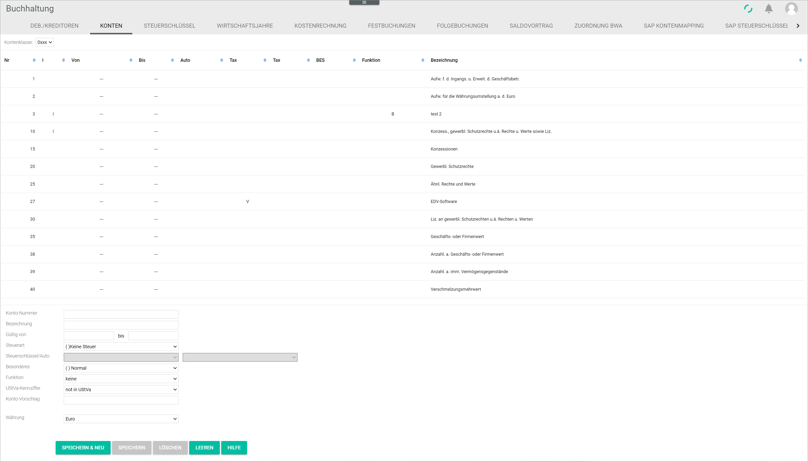

# Accounts

*Accounting > Settings > Tab ACCOUNTS*

- *Account class*  
Click the drop-down list to select an account class. Depending on the Chart of accounts set up in the system, the available account classes may vary. For detailed information about the available charts of accounts, see [Chart of accounts](../Integration/01_RunAccountingWizard.md#chart-of-accounts).

  > [Info] Individual accounts within each account class can also be created, edited or deleted. For detailed information, see [Manage the accounts](../Integration/03_ManageAccounts.md).

The accounts are displayed in a column view. All information provided in columns is read-only.

-  (Sort)  
Click this button to sort in ascending or descending order the displayed accounts.

- *No.*  
Account number.

- *I*  
A mark (|) is displayed if the account has been created or edited by the user.

- *From*  
Validity start date of the account.

- *To*  
Validity end date of the account.  

- *Automatic*  
The letter A is displayed if the automatic tax key function has been set up for the account.

- *Tax type*   
Abbreviation of the tax type configured for the account. The following options are available:  

  - (None): No tax
  - *V*: Input tax
  - *M*: VAT
  - *VM*: Input tax and VAT
  - *KU*: No VAT possible

[comment]: <> (Werden zukünftig Abkürzungen übersetzt? Wie?)

- *Tax key*  
Tax key number configured for the account. Tax keys are set up together with the Chart of accounts.

  > [Info] Tax keys can also be created, edited or deleted. For detailed information, see [Manage the tax keys](../Integration/02_ManageTaxKeys.md).

- *Spec. feat.*  
Abbreviation of a special feature configured for the account. The following options are available:   

  - (None): Normal
  - *G*: Locked
  - *VD*: Debtor collective account
  - *VD*: Creditor collective account
  - *GT*: Money transit account

[comment]: <> (Werden zukünftig Abkürzungen übersetzt? Wie? VD zweimal! Prüfen im neuen UI!)

- *Function*  
Abbreviation of a specific function configured for the account. The following options are available:

  - (None): No specific function
  - *B*: Bank account
  - *K*: Checkout
  - *E*: Revenue account
  - *EM*: Revenue account, only manual
  - *V*: Debit/credit card settlement
  - *S*: Discount debtors (granted)
  - *SK*: Discount creditors (obtained)
  - *WE*: Goods receipt
  - *VKV*: Presettlement account
  - *KA*: Expenses from exchange rate differences
  - *KE*: Income from exchange rate differences

[comment]: <> (Werden zukünftig Abkürzungen übersetzt? Wie?)

- *Description*  
Account description.

The input fields allow to create, edit or delete accounts. For detailed information about creating, editing or deleting accounts, see [Manage the accounts](../Integration/03_ManageAccounts.md).

- *Account number*  
Enter or modify the account number.

- *Description*  
Enter or modify the account description. Letters, numbers or a combination of both can be used.

- *Valid from - to*  
Enter or modify the account validity period.

- *Tax type*  
Click the drop-down list to select the appropriate tax type for the account. The tax type determines how the tax paid or collected in the account is to be registered in the system. The following options are available:

  - **( )No tax**  
  No tax defined for the account.  
  - **(I)Input tax**  
  Input tax configured for the account.
  - **(V)VAT**  
  VAT (value added tax) configured for the account.
  - **(IV)Input tax and VAT**  
  Input tax and VAT (value added tax) configured for the account.
  - **(NV)No VAT possible**  
  It is not possible to configure a VAT (value added tax) for the account.

- *Tax key/auto*    
  Click the first drop-down list to select the appropriate tax key for the account. If desired, click the second drop-down list and select **Automatic** to deduct the applicable tax rate from the gross invoice amount and post the tax amount automatically to the corresponding tax account.

  > [Info] Tax keys are set up once together with the Chart of accounts and are no longer updated. Therefore, the tax rate linked to the tax key must be checked for validity and updated if necessary, see [Edit a tax keys](../Integration/02_ManageTaxKeys.md#edit-a-tax-key).

- *Special features*  

  - **( )Normal**  
  No special features configured for the account.
  - **(L)Locked**  
  An impersonal account can be locked and therefore is not available for postings.
  - **(DA)Debtor collective account**  
  All debtor's transactions are registered in this account in addition to the regular individual personal accounts.
  - **(CA)Creditor collective account**  
  All creditor's transactions are registered in this account in addition to the regular individual personal accounts.
  - **(MT)Money transit account**
  This account is used to register card payments temporarily until they are processed in the *Payment processing* module and then transferred to the corresponding bank account.

- *Function*  
Click the drop-down list to select a specific function for this account. The following options are available:

  - **none**  
  No specific function defined for the account.
  - **Bank account**  
  Bank account transactions.
  - **Checkout**  
  Cash account transactions.
  - **Revenue account**  
  Income received as a result of business activities.
  - **Revenue account, only manual**  
  Income received as a result of business activities, posted manually.
  - **Debit/credit card settlement**  
  Funds being moved from the debit/credit card holder's account to the seller's account following a debit/credit card payment.  
  - **Discount debtors (granted)**  
  Discounts granted to customers (debtors).
  - **Discount creditors (obtained)**  
  Discounts obtained from suppliers (creditors).
  - **Goods receipt**  
  Costs of goods received.
  - **Presettlement account**  
  - **Expenses from exchange rate differences**  
  Expenses incurred as a result of transactions in foreign currencies and exchange rate differences.
  - **Income from exchange rate differences**  
  Income received as a result of transactions in foreign currencies and exchange rate differences.

[comment]: <> (FS: Bitte Inhalt der Funktionen prüfen! Info fehlt: Vorverrechnungskonto)

- *Advance VAT return code*  
Click the drop-down list to select the appropriate option or **Not in advance VAT return**, if the Advance VAT return is not applicable.

[comment]: <> (Soll komplett rausfliegen? Bestätigen!)

- *Account suggestion*  
You can enter an account number in this field to be displayed by default in the *Contra Account* field of the input line in the *POSTINGS* tab when the current account is selected, thereby saving time in manual posting.

- *Currency*  
Click the drop-down list to select the appropriate currency for the account.  

  > [Info] Be aware that the system can only post transactions with the same currency. That means, that the currency selected in customer/supplier accounts and the corresponding impersonal (contra) accounts must coincide, as it would be the case, for instance, of a customer based in Switzerland buying a product from a Germany-based company.

- *Payment method*
Click the drop-down list to select the appropriate payment method. This field is only displayed in revenue accounts.

- *Country*  
Click the drop-down list and select the appropriate delivery country, which determines the applicable taxation.

- [SAVE & NEW]  
Click this button to save a newly created account. For detailed information about creating an account, see [Create an account](../Integration/03_ManageAccounts.md#create-an-account).

- [SAVE]  
Click this button to save any changes made to an existing account. For detailed information about editing an account, see [Edit an account](../Integration/03_ManageAccounts.md#edit-an-account).

  > [Info] Be aware that the saved changes will overwrite the account existing details. To prevent this, make sure that the input fields are empty by clicking the [CLEAR] button. The [SAVE & NEW] button becomes then active.

- [DELETE]  
Click this button to delete the selected account. For detailed information, see [Delete an account](../Integration/03_ManageAccounts.md#delete-an-account).

  > [Warning] Be aware that the selected account will be deleted permanently.

- [CLEAR]  
Click this button to clear all input fields. The [SAVE & NEW] button becomes active.

- [HELP]  
Click this button to open the help function.

[comment]: <> (Raus damit?)
