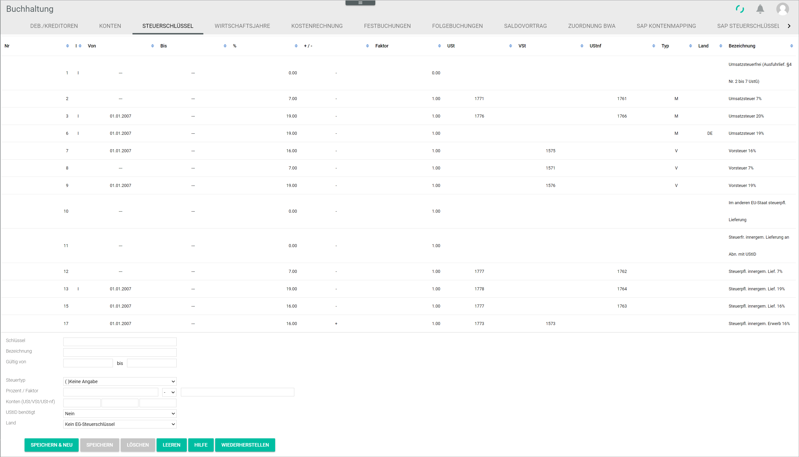

# Tax keys

*Accounting > Settings > Tab TAX KEYS*

-  (Sort)  
Click this button to sort in ascending or descending order the displayed tax keys.

- *No.*  
Tax key number.

- *I*  
A mark (|) is displayed if the tax key has been created or edited by the user.

- *From*  
Validity start date of the tax key.

- *To*  
Validity end date of the tax key.  

- *%*  
Applicable tax rate.

- *+/-*  
If the posting is a gross amount, the tax must be deducted from it, and therefore a minus sign is displayed. If the posting is a net amount, the tax must be added to it, and therefore a plus sign is displayed.

- *Factor*  
Factor applicable to the selected tax rate.

- *VAT*  
Account where the VAT is to be posted.

- *Input tax*  
Account where the input tax is to be posted.

- *VAT not due*  
Account where the VAT not due is to be posted.

- *Type*  
Abbreviation of the tax type configured for the tax key. The following options are available:  

  - (None): Not specified
  - *V*: Input tax
  - *M*: VAT
  - *VM*: Input tax and VAT

[comment]: <> (Abkürzungen im System nicht übersetzt. Auf DE lassen? Wenn ja, durchgängig, also, auch in Integration und Operation)

- *Country*  
Country code. The ISO 3166-1 country codes are used.

- *Description*  
Tax key description.

The input fields allow to create, edit or delete tax keys. For detailed information about creating, editing or deleting tax keys, see [Manage the tax keys](../Integration/02_ManageTaxKeys.md).

- *Key*  
Enter or modify the tax key.

- *Description*  
Enter or modify the tax key description. Letters, numbers or a combination of both can be used.

- *Valid from - to*  
Enter or modify the tax key validity period.

- *Tax type*  
Click the drop-down list to select the appropriate tax type for the tax key. The tax type determines how the tax paid or collected in relation to the tax key is to be registered in the system. The following options are available:

  - **( )Not specified**  
No tax defined for the tax key.  
  - **(I)Input tax**  
Input tax configured for the tax key.
  - **(V)VAT**  
VAT (value added tax) configured for the tax key.
  - **(IV)Input tax and VAT**  
Input tax and VAT (value added tax) configured for the tax key.

- *Percent / factor*  
Enter the applicable tax rate and factor in the corresponding fields. Click the drop-down list to select **+** or **-** if the posting is a net or a gross amount respectively.  

- *Accounts (VAT/input tax/VAT not due)*  
Enter the accounts where the applicable tax amounts are to be posted in the corresponding fields.

- *VAT-ID needed*  
Click the drop-down list to select the appropriate option (**Yes/No**), depending on whether the transaction involves private individuals or companies.

- *Country*  
Click the drop-down list to select the applicable EU country or **No EU tax key**.

- [SAVE & NEW]  
Click this button to save a newly created tax key. For detailed information about creating a tax key, see [Create a tax key](../Integration/02_ManageTaxKeys.md#create-a-tax-key).

- [SAVE]  
Click this button to save any changes made to an existing tax key. For detailed information about editing a tax key, see [Edit a tax key](../Integration/02_ManageTaxKeys.md#edit-a-tax-key).

  > [Info] Be aware that the saved changes will overwrite the tax key existing details. To prevent this, make sure that the input fields are empty by clicking the [CLEAR] button. The [SAVE & NEW] button becomes then active.

- [DELETE]  
Click this button to delete the selected tax key. For detailed information, see [Delete a tax key](../Integration/02_ManageTaxKeys.md#delete-a-tax-key).

- [CLEAR]  
Click this button to clear all input fields. The [SAVE & NEW] button becomes active.

- [HELP]  
Click this button to open the help function.

[comment]: <> (Raus damit?)

- [RESTORE]  
Click this button to restore the tax key to its original state.

[comment]: <> (Was macht der WIEDERHERSTELLEN/RESTORE Button? Beim Klicken, Fenster mit Warnung "Möchten Sie die Steuerschlüssel in deren Ursprungs-Zustand zurückversetzen? Alle von Ihnen gemachten Änderungen werden dadurch gelöscht." Bei OK scheint es aber nichts zu passieren... Das System leert die Eingabemaske, aber nach Speichern kann man nicht wiederherstellen.)
