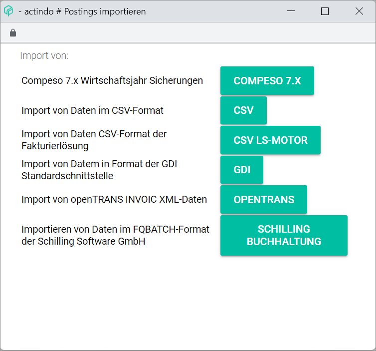
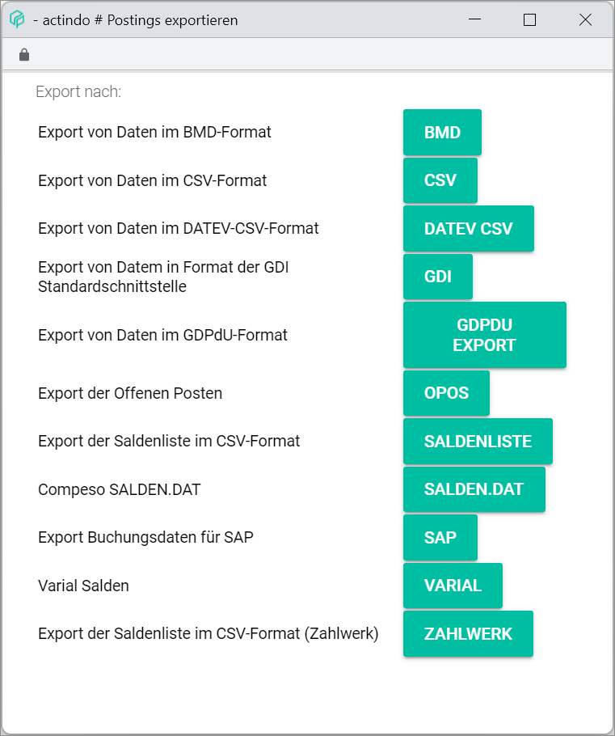

# Fiscal years

*Accounting > Settings > Tab FISCAL YEARS*

- *Description*  
Fiscal year description. It may consist of letters, numbers or a combination of characters.

- *Planning*  
If the fiscal year has been set up for planning purposes, the word *PLANNING* is displayed. Otherwise, the column is empty.

[comment]: <> (Im System noch auf Deutsch: PLANUNG)

- *From*  
Fiscal year start date.

- *To*  
Fiscal year end date.

- *Currency*  
Currency selected for the fiscal year.

- *Cash accounting*  
If cash accounting has been selected, the word *CASH* is displayed. Otherwise, the column is empty.

[comment]: <> (Im System noch auf Deutsch: IST)

The input fields allow to create, edit or delete fiscal years. For detailed information about creating, editing or deleting fiscal years, see [Manage the fiscal year](../Integration/04_ManageFiscalYear.md).

- *Description*  
Enter or modify the fiscal year. Letters, numbers or a combination of characters can be used. The number of characters is limited to 10.

- *From - to*  
Enter or modify the fiscal year start and end date. The fiscal year must consist of 12 months. However, it does not have to be a calendar year, but can be, for example from April 1 to March 31.

  > [Info] Fiscal years cannot overlap in time, for example, fiscal years 2022 and 2022-2023 cannot coexist. If two fiscal years overlap, an error message will be displayed. A fiscal year for planning purposes, on the other hand, can overlap in time with actual fiscal years.

- *Currency*  
Click the drop-down list to select the appropriate currency. The drop-down list displays all currencies configured in the system. However, the accounting module works with the base currency only.

 > [Info] The base currency is the currency used by a company for accounting purposes, usually the currency of the country where the business is primarily based, even if it operates in other countries and currencies.

- *Cash accounting*  
Click the drop-down list to select the appropriate option. The following options are available:

  - **Yes**  
  Select this option for the cash accounting method, where receipts are recorded during the period they are received, and expenses are recorded in the period in which they are actually paid.
  - **No**  
  Select this option for the accrual accounting method, where revenue is recognized when earned rather than when collected, and expenses are recognized when incurred rather than when paid.

  > [Info] This option has fundamental implications for the system automatic recording of taxes. In case of doubt, please check with your tax advisor.

- *Planning FY*  
Click the drop-down list to select the appropriate option (**No/Fiscal year for planning purposes only**).

  > [Info] Note that a fiscal year can be set up for planning purposes only. However, the fiscal year for planning purposes will not be recognized as an actual fiscal year by the system, and therefore the automatic functions in the interaction with other modules will not apply.

- [SAVE & NEW]  
Click this button to save a newly created fiscal year. For detailed information about creating a new fiscal year, see [Create a fiscal year](../Integration/04_ManageFiscalYear.md#create-a-fiscal-year).

- [SAVE]  
Click this button to save any changes made to an existing fiscal year. For detailed information about editing a fiscal year, see [Edit a fiscal year](../Integration/04_ManageFiscalYear.md#edit-a-fiscal-year).

  > [Info] Be aware that the saved changes will overwrite the fiscal existing details. To prevent this, make sure that the input fields are empty by clicking the [CLEAR] button. The [SAVE & NEW] button becomes then active.

- [DELETE]  
Click this button to delete the selected fiscal year. For detailed information, see [Delete a fiscal year](../Integration/04_ManageFiscalYear.md#delete-a-fiscal-year).

  > [Warning] Be aware that the selected fiscal year will be deleted permanently.

- [CLEAR]
Click this button to clear all input fields. The [SAVE & NEW] button becomes active.

- [HELP]  
Click this button to open the help function.

[comment]: <> (Raus damit?)

- [IMPORT]  
Click this button to import postings from a file. The *Import postings* window is displayed, see [Import postings](#import-postings).

- [EXPORT]
Click this button to export postings into a file. The *Export postings* window is displayed, see [Export postings](#export-postings).

## Import postings

*Accounting > Settings > Tab FISCAL YEARS > Button IMPORT*

> [Info] The import function is also available in the *Extras* menu entry. For detailed information about the different import options, see [Import](./03a_Import.md).

- *Import from:*  
A list of the available import options is displayed:

  - *Compeso 7.x fiscal year backups*
  - *Import of data in CVS format*
  - *Import of data in CVS format from invoicing solution*
  - *Import of data in GDI standard interface format*
  - *Import of openTRANS INVOIC XLM data*
  - *Import of data in FQBATCH format from Schilling Software GmbH*

[comment]: <> (Links zu Import oder alle Infos hier reinkopieren?)

- [COMPESO 7.X]  
Click this button to import data in Compeso proprietary format. For detailed information, see [COMPESO 7.x](./03a_Import.md#compeso-7x).

- [CSV]  
Click this button to import data in CSV format. For detailed information, see [CSV](./03a_Import.md#csv).

- [CSV LS-MOTOR]  
Click this button to import data in CSV format from an invoicing solution. For detailed information, see [CSV LS-MOTOR](./03a_Import.md#csv-ls-motor).

[comment]: <> (FH: Was ist das? Wie sollte es auf Englisch heißen? LS ENGINE?)

- [GDI]  
Click this button to import data in GDI standard interface format. For detailed information, see [GDI](./03a_Import.md#gdi).

- [OPENTRANS]  
Click this button to import data in openTRANS INVOIC XML format. For detailed information, see [OPENTRANS](./03a_Import.md#opentrans).

- [SCHILLING BUCHHALTUNG]  
Click this button to import data in Schilling Software proprietary FQBATCH format. For detailed information, see [SCHILLING BUCHHALTUNG](./03a_Import.md#schilling-accounting).

## Export postings

*Accounting > Settings > Tab FISCAL YEARS > Button EXPORT*

> [Info] The export function is also available in the *Extras* menu entry. For detailed information about the different export options, see [Export](./03b_Export.md).

- *Export to*  
A list of the available import options is displayed:

  - *Export of data in BMD format*
  - *Export of data in CSV format*
  - *Export of data in DATEV CSV format*
  - *Export of data in GDI standard interface format*
  - *Export of data in GDPdU format*
  - *Export of open items*
  - *Export of balance lists in CSV format*
  - *Compeso SALDEN.DAT*
  - *Export postings for SAP*
  - *Varial balances*
  - *Export of balance lists in CSV format (Zahlwerk)*

[comment]: <> (Links zu Export oder alle Infos hier reinkopieren?)

- [BMD]  
Click this button to export data in BMD format. For detailed information, see [BMD](./03b_Export.md#bmd).

- [CSV]  
Click this button to export data in CSV format. For detailed information, see [CSV](./03b_Export.md#csv).

- [DATEV CSV]  
Click this button to export data in DATEV compatible CSV format. For detailed information, see [DATEV CSV](./03b_Export.md#datev-csv).

- [GDI]  
Click this button to export data in GDI format. For detailed information, see [GDI](./03b_Export.md#gdi).

- [GDPDU EXPORT]  
Click this button to export data in GDPdU-compliant audit file format. For detailed information, see [GDPDU EXPORT](./03b_Export.md#gdpdu-export).

- [OPEN ITEMS]  
Click this button to export open items. For detailed information, see [OPEN ITEMS](./03b_Export.md#open-items).

- [BALANCE LISTS]  
Click this button to export balance lists in CSV format. For detailed information, see [BALANCE LISTS](./03b_Export.md#balance-lists).

- [SALDEN.DAT]  
Click this button to export data in Compeso SALDEN.DAT proprietary format. For detailed information, see [SALDEN.DAT](./03b_Export.md#saldendat).

- [SAP]  
Click this button to export data in SAP compatible format. For detailed information, see [SAP](./03b_Export.md#sap).

- [VARIAL]  
Click this button to export data in VARIAL compatible format. For detailed information, see [VARIAL](./03b_Export.md#varial).

- [ZAHLWERK]  
Click this button to export balance lists in Zahlwerk compatible CSV format. For detailed information, see [ZAHLWERK](./03b_Export.md#zahlwerk).
