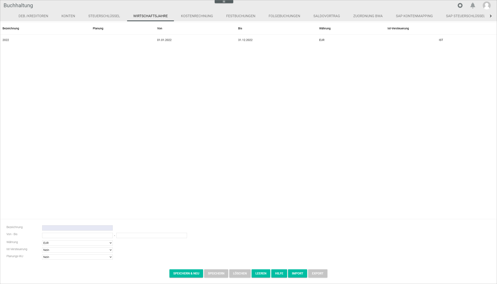

[!!User interface Import](./03a_Import.md)
[!!User interface Export](./03b_Export.md)
[!!Manage the fiscal year](../Integration/04_ManageFiscalYear.md)

# Fiscal years

*Accounting > Settings > Tab FISCAL YEARS*

The list displays all available fiscal years. All fields are read-only.

- *Description*  
    Descriptive name of the fiscal year.

- *Planning*  
    Indication of whether the fiscal year is for planning purposes only. The word **PLANNING** is displayed if the fiscal year has been set up for planning purposes.

[comment]: <> (Im System noch auf Deutsch: PLANUNG)

- *From*  
    Fiscal year start date.

- *To*  
    Fiscal year end date.

- *Currency*  
    Currency selected for the fiscal year.

- *Tax on payment*  
    Indication of whether tax on payment is necessary in the fiscal year. The word **ON PAYMENT** is displayed if tax on payment has been configured for the selected fiscal year.

[comment]: <> (Im System noch auf Deutsch: IST)

The input fields below allow to create, edit or delete fiscal years. For detailed information about creating, editing or deleting fiscal years, see [Manage the fiscal year](../Integration/04_ManageFiscalYear.md).

- *Description*  
    Enter or modify a descriptive fiscal year name. The number of characters is limited to 10.

- *From - to*  
    Enter or modify the fiscal year start and end date. The fiscal year must consist of 12 months. However, it does not have to be a calendar year, but can be, for example from April 1 to March 31.

    > [Info] Fiscal years cannot overlap in time, for   example, fiscal years 2022 and 2022-2023 cannot coexist. If two fiscal years overlap, an error message will be displayed. A fiscal year for planning purposes, on the other hand, can overlap in time with actual fiscal years.

- *Currency*  
    Click the drop-down list to select the appropriate currency. All available currencies are displayed in the list. However, the accounting module works with the base currency only.

    > [Info] The base currency is the currency used by a company for accounting purposes, usually the currency of the country where the business is primarily based, even if it operates in other countries and currencies.

- *Tax on payment*  
    Click the drop-down list to select the appropriate option. The following options are available:
    - **Yes**  
        Select this option in case VAT is due when revenue is effectively received.
    - **No**  
        Select this option in case VAT is due when revenue is invoiced.

    > [Info] This option has fundamental implications for the system automatic recording of taxes. In case of doubt, please check with your tax advisor.

- *Planning FY*  
    Click the drop-down list to select the appropriate option. The following options are available:
    - **No**  
        The fiscal year is not for planning purposes.
    - **Fiscal year for planning purposes only**   
        The fiscal year is for planning purposes.

    > [Info] Note that a fiscal year that has been set up for planning purposes will not be recognized as an actual fiscal year by the system, and therefore the automatic functions in the interaction with other modules will not apply.

- [SAVE & NEW]  
    Click this button to save a new fiscal year. The button is locked if a fiscal year has been selected. For detailed information about creating a new fiscal year, see [Create a fiscal year](../Integration/04_ManageFiscalYear.md#create-a-fiscal-year).

- [SAVE]  
    Click this button to save any changes made to an existing fiscal year. The button is only unlocked if a fiscal year has been selected. For detailed information about editing a fiscal year, see [Edit a fiscal year](../Integration/04_ManageFiscalYear.md#edit-a-fiscal-year).

    > [Info] Be aware that all saved changes will overwrite the existing fiscal year data.

- [DELETE]  
    Click this button to delete the selected fiscal year. The button is only unlocked if a fiscal year has been selected. For detailed information, see [Delete a fiscal year](../Integration/04_ManageFiscalYear.md#delete-a-fiscal-year).

    > [Caution] **Loss of data**   
    Deleting will permanently remove the selected data. The deletion cannot be undone and the deleted data cannot be restored.       
    Problems may occur due to unresolved dependencies.   
    Make sure you really want to delete the selected data.

- [CLEAR]
    Click this button to clear all fields.

- [HELP]  
    This function is currently not available.

- [IMPORT]  
    Click this button to import postings from a file. The *Import postings* window is displayed, see [Import postings](#import-postings).

- [EXPORT]
    Click this button to export postings into a file. The *Export postings* window is displayed, see [Export postings](#export-postings).

## Import postings

*Accounting > Settings > Tab FISCAL YEARS > Button IMPORT*

For a detailed description of this window and the corresponding functions, see [Import](./03a_Import.md).

## Export postings

*Accounting > Settings > Tab FISCAL YEARS > Button EXPORT*

For a detailed description of this window and the corresponding functions, see [Export](./03b_Export.md).
