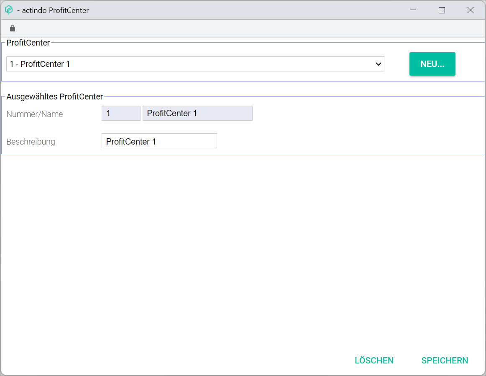
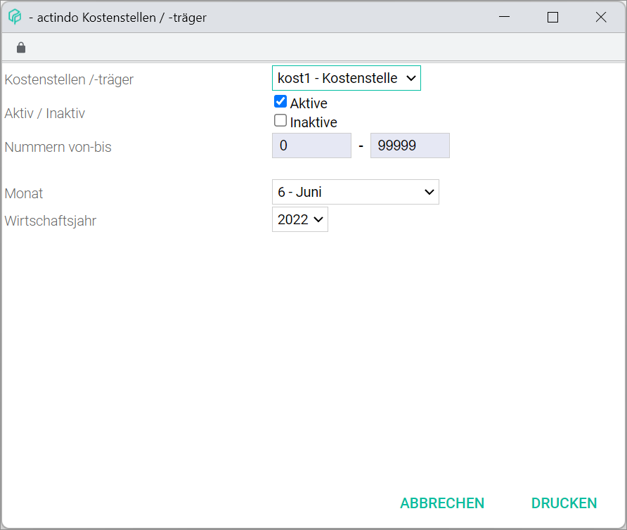

# Cost accounting

*Accounting > Settings > Tab COST ACCOUNTING*

> [Info] If no cost center has been created yet, the message "No cost centers defined" is displayed.

- *Cost accounting*  
Click the corresponding drop-down list to select the relevant posting period and the cost center/unit:

  - (Fiscal year drop-down list)  
  Click the drop-down list to select the relevant fiscal year. The fiscal years already configured in the system are displayed in the drop-down list.  

  - (Month drop-down list)  
  Click the drop-down list to select the relevant month. The following options are available:  

    - **0 - Balances carried forward**
    - **1 - 12 - (months)**
    - **13 - 15 - Subsequent postings**  

  - (Cost accounting drop-down list)  
Click the drop-down list to select the corresponding cost accounting. The following options are available:  

    - **Cost 1 - Cost center**
    - **Cost 2 - Cost unit**

[comment]: <> (Fehlen 16 - 25 - Closing postings und 99 - General month?)

Depending on the option chosen in the cost accounting drop-down list (**Cost 1 - Cost center** or **Cost 2 - Cost unit**), the entry fields and the information displayed vary.

## Cost center

*Accounting > Settings > Tab COST ACCOUNTING > Drop-down option Cost1 - Cost center*

The cost centers created, if any, are displayed in a column view. All information displayed in columns is read-only.

- *Cost.*  
Cost center number.

- *Description*  
Cost center description.

- *Inactive*  
If the cost center has been set to inactive, the word *Inactive* is displayed. Otherwise, the column is empty.

- *Active from*  
Validity start date.

[comment]: <> (Info fehlt!)

The entry fields allow to enter or modify cost center details.

-  *Active/Inactive* (radio button)  
Click the corresponding radio button to select the appropriate option. The *Active* radio button is selected by default.

- *Cost center*  
Enter the cost center number. It is possible to enter up to 4 digits.

- *Description*  
Enter a short description for the cost center.

- *Text*  
Enter a longer text description for the cost center, if desired.

- *Allocation to cost unit*  
It is possible to allocate costs to individual cost units. To do so, click the [ALLOCATION TABLE] button.

- [ALLOCATION TABLE]  
Click this button to display the *Allocation table* window, see [Allocation table](#allocation-table).

- [SAVE & NEW]  
Click this button to create a new cost center.  

- [SAVE]  
Click this button to edit an existing cost center.

- [DELETE]  
Click this button to delete a selected cost center.

- [CLEAR]  
Click this button to clear all entry fields.

- [PRINT]  
Click this button to print the cost center/unit. The *Cost center/unit* window is displayed.

[comment]: <> (Wir haben keine Prozedur über "Create/Edit/Delete cost center/cost unit". Hinzufügen?)

## Cost unit

*Accounting > Settings > Tab COST ACCOUNTING > Drop-down option Cost2 - Cost unit*

The cost units created, if any, are displayed in a column view. All information displayed in columns is read-only.

- *Cost.*  
Cost unit number.

- *Description*  
Cost unit description.

- *Inactive*  
If the cost unit has been set to inactive, the word *Inactive* is displayed. Otherwise, the column is empty.

- *Active from*  
Validity start date.

[comment]: <> (Info fehlt!)

- ProfitCenter  
Assigned ProfitCenter.

-  *Active/Inactive* (radio button)  
Click the corresponding radio button to select the appropriate option. The *Active* radio button is selected by default.

- *Cost unit*  
Enter the cost unit number. It is possible to enter up to 5 digits.

- *Description*  
Enter a short description for the cost unit.

- *Text*  
Enter a longer text description for the cost unit, if desired.

- *Debtor*  
Enter the debtor or customer number, if necessary. Alternatively, click the [SEARCH] button to search for a debtor or customer.

- [SEARCH]  
Click this button to display the *Select address* window, see [Select address](#select-address).

- *ProfitCenter*  
Click the drop-down list to select the appropriate ProfitCenter. If no ProfitCenter has been created yet, **0 - No group** is displayed.

[comment]: <> (Unsicher, check!)

- [EDIT]  
Click this button to edit or add a ProfitCenter. The *ProfitCenter* window is displayed, see [ProfitCenter](#profitcenter).

- [SAVE & NEW]  
Click this button to create a new cost unit.  

- [SAVE]  
Click this button to edit an existing cost unit.

- [DELETE]  
Click this button to delete a selected cost unit.

- [CLEAR]  
Click this button to clear all entry fields.

- [PRINT]  
Click this button to print the cost center/unit. The *Cost center/unit* window is displayed.

### Allocation table

*Accounting > Settings > Tab COST ACCOUNTING > Drop-down option Cost1 - Cost center > Button ALLOCATION TABLE*

- *Select ProfitCenter*  
Click the drop-down list to select a specific ProfitCenter or choose **All ProfitCenters** to include them all.

- [UPDATE]  
Click this button to update the table after making any changes.

  > [Info] Bear in mind that the changes must be saved first clicking the [SAVE] button at the bottom. Otherwise, the changes will be rejected.

- [CHANGE PERIOD]  
Click this button to change the period. The *Select period* window is displayed, see [Select period](#select-period).

- [EXCEL]  
Click this button to display the *EXCEL* context menu. The following option is available:  

  - *Export current page*  

The allocation table displays the distribution of costs among cost centers and units. The information displayed is read-only.

- *Cost center*  
Cost center(s) created.

- (Cost units)  
Cost unit(s) created. Double click in the corresponding table cell to activate the entry field. The following options are available:

  - If the *Allocation* column is set to *Percentage*, enter a percentage value.
  - If the *Allocation* column is set to *Formula*, click the drop-down list to select **Active/inactive**.

- (Sigma sign %)  
The cell content changes automatically depending on the allocation method and percentage values entered. The individual percentages entered must equal 100 %. That means that all costs are allocated to the individual cost units. The cell turns then green. Otherwise, an error message is displayed when trying to save the table.

[comment]: <> (Check!)

- *Allocation*   
Doble click the corresponding table cell to activate the drop-down list. Click the drop-down list to choose the allocation method. The following options are available:  

  - **Percentage**  
  Select this option to allocate costs based on individual percentages per unit.
  - **Formula**  
  Select this option to allocate costs based on a formula.

- *Formula*  
Double click the corresponding table cell to enter an Excel formula.

[comment]: <> (Unsicher, wie die Formel funktioniert! Check!)

- [CLOSE]  
Click this button to close the window.

- [PRINT]  
Click this button to print the allocation table. A new window to select the month(s) and fiscal year to be printed is displayed.

[comment]: <> (Fenster beschreiben?)

- [SAVE]  
Click this button to save the allocation table after making any changes. A pop-up window confirms the process.

####  Select period

*Accounting > Settings > Tab COST ACCOUNTING > Drop-down option Cost1 - Cost center > Button ALLOCATION TABLE > Button CHANGE PERIOD*

- *FY*    
Click the drop-down list to select the desired fiscal year.

- *Month*  
Click the drop-down list to select the desired month.  

### Select address  

[comment]: <> (Fenster/Unterkapitel umbenennen zu Search debtor?)

*Accounting > Settings > Tab COST ACCOUNTING > Drop-down option Cost2 - Cost unit > Button SEARCH*

> [Info] The *Customer/supplier list* tab is also available in the *DEBTORS/CREDITORS* tab, see [Customer/supplier list](./02a_DebtorsCreditors.md#customer-supplier-list).

- [EXCEL]  
Click this button to display the *EXCEL* context menu. The following options are available:  

  - *Export current page*
  - *Export all*

- [QUICK SEARCH]  
Click this button to display the *QUICK SEARCH* context menu. All search criteria are selected by default through a marked checkbox. Deselect any search criteria as necessary. The following search criteria are available:

  - *No.*  
  - *Short name*
  - *Company*  
  - *Forename*
  - *Surname*
  - *Address*
  - *Address 2*
  - *ZIP*
  - *Location*
  - *Country*
  - *Content*
  - *Currency*
  - *Comments*
  - *Phone*
  - *Phone 2*
  - *Cell phone*
  - *Fax*
  - *Email*
  - *VAT ID*
  - *Type of customer*
  - *Customer number*

  [comment]: <> (in the system as No -> add point)
  [comment]: <> (in the system: Firma -> localise)
  [comment]: <> (in the system: First name)
  [comment]: <> (in the system: Name)
  [comment]: <> (in the system: City)  

- [Search bar]  
  Click on the search bar to enter the search text (letters or numbers).

-  (Delete)  
  Click this button to delete the search text and to clear the search results.

-  (Search)  
  Click this button to start the search. The search can also be started by pressing ENTER.

- (x) [ACTIVE FILTERS]  
Click this button to display the context menu.

  - *ACTIVE* (checkbox)  
  Mark this checkbox to activate the search criteria.

  - *FILTER BY*  
  The following filter values are available:
    - Price group  

  - *FILTER CRITERION*  
  Click the drop-down list to select the appropriate filter criterion. The created price groups are displayed.

  > [Info] Price groups can be created in the *Settings* menu entry of the *Material management* and the *Invoicing* module. A customer can be assigned a specific price group in the *Invoicing* sub-tab of the *DEBTORS/CREDITORS* tab, see [Invoicing](./02a_DebtorsCreditors.md#invoicing-1).

  [comment]: <> (Check module names in English. No more "filter by" options available or depends on the settings?)

- [CANCEL]  
 Click this button to cancel your selection.

- [APPLY]  
 Click this button to apply the search criteria and values.

All customer/supplier details are displayed in a column view. The column width can be modified using the mouse. To do so, place the mouse pointer on the vertical dividing line between two columns titles. The mouse pointer changes to a double-headed arrow. Press the left mouse button and move the line using drag and drop until it has reached the required width.

[comment]: <> (Check wording with HG, see Workflows, PIM: The list displays... Durchgängig ändern?)

When placing the cursor on a column header, three vertical points are displayed to the right of the column title. Click the  (Points) button to display the context menu. The following menu entries are available:

-  Sort ascending  
  Click this entry to sort the rows in ascending order.
-  Sort descending  
  Click this entry to sort the rows in descending order.
-  Columns  
  Place the mouse on this entry to display the *Columns* sub-menu. Add or remove columns by marking or unmarking the corresponding checkbox.

  [comment]: <> (Standard Plattform-Info. Notwendig? Durchgängig ändern/löschen?)

Depending on the settings, the displayed columns may vary.

- *No.*  
Customer/supplier number. This number is given automatically by the system if left empty. Customer numbers range from 10000 to 69999 and supplier numbers, from 70000 to 99999.

- *Short name*  
Short name given to the customer/supplier. This field is compulsory.

- *Company*  
Company name.

- *Forename*  
Customer/supplier first name.

- *Surname*  
Customer/supplier last name.

- *Address*  
Customer/supplier address.

- *Address 2*  
Complimentary address information.

- *ZIP*  
Customer/supplier ZIP code.

- *Location*   
Customer/supplier city or town.

- *Country*  
Customer/supplier country.

- *Content*  
Files or links added to the customer/supplier information.  

- *Currency*  
Base currency used by customer/supplier.

- *Comments*  
Comments added on the customer/supplier information.

- *Phone*  
Customer/supplier contact phone number.

- *Phone 2*  
Customer/supplier second contact phone number.    

- *Cell phone*  
Customer/supplier cell phone number.

- *Fax*  
Customer/supplier fax number.

- *Email*  
Customer/supplier email address.

- *VAT ID*  
Customer/supplier VAT identification number, if applicable.

- *Type of customer*  

[comment]: <> (FH: Was kann hier vorkommen? Supplier/customer?)

- *Customer number*  
Reference customer/supplier number as defined by the user.

[comment]: <> (By right-clicking on a row, context menu appears with two options -> Show documents of the customer / supplier -> to Overview in Fakturierung module, and Show articles of supplier -> to Artikelliste in Artikelverwaltung module. Add info and link when available?)

-  -  (First page) - (Last page)  
  -  (Previous page) - (Next page)  
Click these buttons to navigate the customer/supplier list.

- *Page [x] of [x]*  
Enter a page number to go to a specific page.

-  (Refresh)  
 Click this button to update the receipt list.

- [RESET]  
 Click this button to reset the receipt list view.

- *Displaying X - X of X*  
This text displays the number of customers and suppliers currently displayed and the total number of customers and suppliers in the list. This text is read-only.

### ProfitCenter  

[comment]: <> (Fenster/Unterkapitel umbenennen zu Edit ProfitCenter?)

*Accounting > Settings > Tab COST ACCOUNTING > Drop-down option Cost2 - Cost unit > Button EDIT*

**ProfitCenter**

- (ProfitCenter drop-down list)  
Click the drop-down list to edit an existing ProfitCenter. The ProfitCenter details are displayed in the *Selected ProfitCenter* section.

- [NEW]  
Click this button to add a ProfitCenter. The entry fields in *Selected ProfitCenter* section are cleared.

**Selected ProfitCenter**
- *Number/name*  
Enter or modify the ProfitCenter number and/or name.

- *Description*  
Enter or modify the ProfitCenter description.

- [DELETE]  
Click this button to delete the selected ProfitCenter.

- [SAVE]  
Click this button to save the newly created ProfitCenter or any other changes made.

#### Cost center/unit

[comment]: <> (Fenster/Unterkapitel umbenennen zu Print cost center/unit? -> Evtl. zu H2 ändern und in TOC mit aufnehmen?)

*Accounting > Settings > Tab COST ACCOUNTING > Drop-down option Cost2 - Cost unit > Button PRINT*

- *Cost center/unit*  
Click the drop-down list to select whether the cost center(s) or cost unit(s) are to be printed.

- *Active/inactive*  
Click the checkbox to select one of the options, or both, to be printed.

- *Numbers from-to*  
Enter a cost center/unit number range to be printed.

- *Month*  
Click the drop-down list to select the desired month to be printed.

- *Fiscal year*  
Click the drop-down list to select the desired fiscal year to be printed.

- [CANCEL]  
Click this button to cancel the process. The window is closed.

- [PRINT]  
Click this button to print out the cost center/unit with the selected settings.
