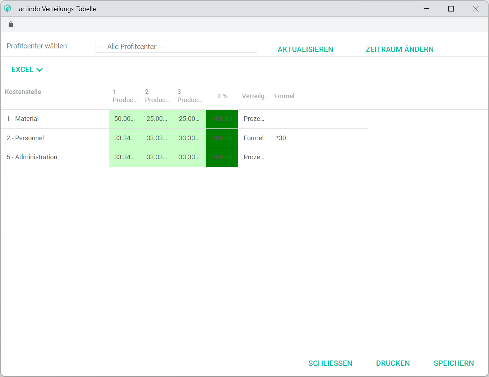

# Cost accounting

*Accounting > Settings > Tab COST ACCOUNTING*

- *Cost accounting*  
  Click the corresponding drop-down list to select the relevant accounting period (fiscal year and month) and the cost center/unit. The following drop-down lists are displayed:
  - Fiscal year drop-down list  
    Click the drop-down list to select the relevant fiscal year. All available fiscal years are displayed in the list.  
  - Month drop-down list  
    Click the drop-down list to select the relevant month. The following options are available:  
    - **0 - Balances carried forward**
    - **1 - 12 - (months)**
    - **13 - 15 - Subsequent postings**  
  - Cost accounting drop-down list  
    Click the drop-down list to select the cost type. The following options are available:  
    - **Cost 1 - Cost center**  
      Select this option to display the available cost centers in the selected accounting period or to create a new one.
    - **Cost 2 - Cost object**  
      Select this option to display the available cost objects in the selected accounting period or to create a new one.   

  All available cost centers or objects in the selected accounting period are displayed in the list. Depending on the selected cost type in the cost accounting drop-down list, the list and the input fields vary:
  - [Cost center](#cost-center)
  - [Cost object](#cost-object)
[comment]: <> (Monat drop-down list: es fehlt 16-19 Abschlussbuchungen und 99 Allgemeiner Monat?)

## Cost center

*Accounting > Settings > Tab COST ACCOUNTING > Drop-down option Cost1 - Cost center*

The list displays all available cost centers in the selected accounting period. All fields are read-only. If no cost center has been created in the selected accounting period, the notice *No cost centers defined* is displayed.

- *Cost.*  
  Cost center number.

- *Description*  
  Descriptive cost center name.

- *Inactive*  
  Cost center status. The word **Inactive** is displayed if the cost center has been deactivated.

- *Active from*  
  Validity start date.

[comment]: <> (Allgemeine Info fehlt! Wann kommt das Datum vor?)

The input fields below allow to enter or modify the cost center details.

-  *Active*   
  Select this radio button to activate the cost center after saving.

-  *Inactive*    
  Select this radio button to deactivate the cost center after saving.

- *Cost center*  
  Enter the cost center number. Only numbers are allowed. The number of digits is limited to 4.

- *Description*  
  Enter a descriptive name for the cost center.

- *Text*  
  Enter a longer description or comments to the cost center. The text is not displayed in the list.

- *Allocation to cost objects*  
  Specify how to allocate costs from different cost centers to individual cost objects. This field is only displayed if at least one cost object has been created. The following button is displayed:
  - [ALLOCATION TABLE]   
    Click this button to display the *Allocation table* window, see [Allocation table](#allocation-table).

- [SAVE & NEW]  
  Click this button to save the new cost center. The button is locked if a cost center has been selected. For detailed information about creating a cost center, see [Create a cost center](../Integration/08_ManageCostAccounting.md#create-a-cost-center).

- [SAVE]  
  Click this button to save any changes made to the selected cost center. The button is only unlocked if a cost center has been selected. For detailed information about editing a cost center, see [Edit a cost center](../Integration/08_ManageCostAccounting.md#edit-a-cost-center).

  > [Info] Be aware that all saved changes will overwrite the existing cost center data.

- [DELETE]  
  Click this button to delete the selected cost center. The button is only unlocked if a cost center has been selected. For detailed information about deleting a cost center, see [Delete a cost center](../Integration/08_ManageCostAccounting.md#delete-a-cost-center).

  > [Warning] **Loss of data**   
  Deleting will permanently remove the selected data. The deletion cannot be undone and the deleted data cannot be restored.       
  Problems may occur due to unresolved dependencies.   
  Make sure you really want to delete the selected data.

- [CLEAR]  
  Click this button to clear all fields.

- [PRINT]  
  Click this button to print the cost center or object. The *Print cost center/object* window is displayed, see [Print cost center/object](#print-cost-centerobject).

[comment]: <> (Eigentlich heißt das Fenster Cost center/unit, aber ich habe zu Print cost center/unit umbenannt hier.)

## Cost object

*Accounting > Settings > Tab COST ACCOUNTING > Drop-down option Cost2 - Cost object*

The list displays all available cost objects in the selected accounting period. All fields are read-only. If no cost object has been created in the selected accounting period, the notice *No cost objects defined* is displayed.

- *Cost.*  
  Cost object number.

- *Description*  
  Descriptive cost object name.

- *Inactive*  
  Cost object status. The word **Inactive** is displayed if the cost object has been deactivated.

- *Active from*  
  Validity start date.

[comment]: <> (Allgemeine Info fehlt! Wann kommt das Datum vor?)

- *ProfitCenter*  
  Assigned profit center.

The input fields below allow to enter or modify the cost object details.

-  *Active*   
  Select this radio button to activate the cost object after saving.

-  *Inactive*    
  Select this radio button to deactivate the cost object after saving.

- *Cost object*  
  Enter the cost object number. Only numbers are allowed. The number of digits is limited to 5.

- *Description*   
  Enter a descriptive name for the cost object.

- *Text*  
  Enter a longer description or comments to the cost object. The text is not displayed in the list.

- *Debtor*  
  Enter the debtor or customer number, if necessary. Alternatively, click the [SEARCH] button to search for a debtor or customer.
  - [SEARCH]  
    Click this button to select a customer or debtor for the *Debtor* field. Th *Select address* window is displayed, see [Select address](#select-address).  

- *ProfitCenter*  
  Click the drop-down list to select the appropriate profit center. All available profit centers are displayed in the list. If no profit center must be assigned to the cost object, select the **No ProfitCenter** option. If no profit center has been created, the **0 - No group** option is displayed. Click the [EDIT...] button to edit or create a profit center.
  - [EDIT...]  
    Click this button to edit or create a profit center. The *ProfitCenter* window is displayed, see [ProfitCenter](#profitcenter).

[comment]: <> (Unsicher, check mit FH!)

- [SAVE & NEW]  
  Click this button to save the new cost object. The button is locked if a cost object has been selected. For detailed information about creating a cost object, see [Create a cost object](../Integration/08_ManageCostAccounting.md#create-a-cost-object).

- [SAVE]  
  Click this button to save any changes made to the selected cost object. The button is only unlocked if a cost object has been selected. For detailed information about editing a cost object, see [Edit a cost object](../Integration/08_ManageCostAccounting.md#edit-a-cost-object).

  > [Info] Be aware that all saved changes will overwrite the existing cost object data.

- [DELETE]  
  Click this button to delete the selected cost object. The button is only unlocked if a cost object has been selected. A cost object can only be deleted if no costs from any cost center are assigned to it. For detailed information about deleting a cost object, see [Delete a cost object](../Integration/08_ManageCostAccounting.md#delete-a-cost-object).

  > [Warning] **Loss of data**   
  Deleting will permanently remove the selected data. The deletion cannot be undone and the deleted data cannot be restored.       
  Problems may occur due to unresolved dependencies.   
  Make sure you really want to delete the selected data.

- [CLEAR]  
  Click this button to clear all fields.

- [PRINT]  
  Click this button to print the cost center or object. The *Print cost center/object* window is displayed, see [Print cost center/object](#print-cost-centerobject).

[comment]: <> (Eigentlich heißt das Fenster Cost center/unit, aber ich habe zu Print cost center/unit umbenannt hier.)

## Print cost center/object

*Accounting > Settings > Tab COST ACCOUNTING > Button PRINT*  

- *Cost center/object*  
  Click the drop-down list to select whether the cost centers or cost objects are to be printed. The following options are available:
  - **cost1 - cost center**   
    The cost centers within this list will be printed according to the settings specified in the following.
  - **cost2 - cost object**    
    The cost objects within this list will be printed according to the settings specified in the following.

- [x] *Active*   
  Select the checkbox to include all active cost centers/objects for printing.

- [x] *Inactive*   
  Select the checkbox to include all inactive cost centers/objects for printing.

- *Numbers from-to*  
  Enter the cost centers/objects number range to be printed.

- *Month*  
  Click the drop-down list to select the desired month to be printed. All available months are dispalyed in the list.

- *Fiscal year*  
  Click the drop-down list to select the desired fiscal year to be printed. All available fiscal years are dispalyed in the list.

- [CANCEL]  
  Click this button to cancel the printing process. The *Print cost center/object* window is closed.

- [PRINT]  
  Click this button to print the cost centers/objects according to the selected settings. A print preview is displayed in the window.

### Allocation table

*Accounting > Settings > Tab COST ACCOUNTING > Drop-down option Cost1 - Cost center > Button ALLOCATION TABLE*

- *Select ProfitCenter*  
  Click the drop-down list to select a profit center. All available profit centers are displayed in the list. Additionally, the following options are available:
  - **All ProfitCenters**   
    All available profit centers will be included.
  - **0 - No group**   
    No profit center will be included.   

  The columns in the allocation list change according to the selected profit center option.

- [UPDATE]  
  Click this button to update the table.

  > [Info] Note that any changes made must be saved first by clicking the [SAVE] button at the bottom. Otherwise, all changes will be rejected when updating the list.

- [CHANGE PERIOD]  
  Click this button to change the period. The *Select period* window is displayed, see [Select period](#select-period).

- [EXCEL]  
  Click this button to display the *EXCEL* context menu. The following options are available:  
  - **Export current page**  
    Click this option to export the allocation table currently displayed. The allocation table is exported in Excel format and saved by default in the Downloads folder in your computer.
  - **Export all**  
    Click this option to export all available allocation tables. The allocation tables are exported in Excel format and saved by default in the Downloads folder in your computer.

    > [Info] The [EXCEL] button is only displayed if the *Statistics* module is installed.

[comment]: <> (Check! One file, several files, one excel with several tabs?)

The list displays the allocation of costs among the cost centers and objects. Depending on the selected profit center option, the displayed columns may vary.

- *Cost center*  
  Cost center name. This field is read-only.

- Cost object  
  Double-click a cost object field to activate the field and define the cost allocation. The following options are available:
  - If the **Percentage** option is selected in the drop-down list in the *Allocation* column, enter a percentage value in the field.
  - If the **Formula** option is selected in the drop-down list in the *Allocation* column, click the drop-down list and select the appropriate option:
    - **Active**   
      Select this option to apply the formula specified in the *Formula* column to the selected cost object.
    - **Inactive**   
      Select this option to ignore the formula for the selected cost object.   

  For each available cost object, a single column is displayed in the list.

- *&#931; %*  
  Total sum or total percentage of all cost objects. The displayed number changes automatically. The total must equal 100 to be saved. That means that all costs must be allocated to the individual cost objects. Otherwise, an error message is displayed when clicking the [SAVE] button.

[comment]: <> (Check mit FH! Generell mehr Info gebraucht für dieses Kapitel. Evtl. Prozedur in Integration.)

- *Allocation*   
  Double-click this field to activate it. Click the drop-down list to select the allocation method. The following options are available:  
  - **Percentage**   
    Select this option to allocate costs based on individual percentages per cost object.
  - **Formula**  
    Select this option to allocate costs based on a formula defined in the *Formula* field.

- *Formula*  
  Double-click this field to activate it and enter an excel formula. The basic calculating operations (+, -, *, /) are permitted.

[comment]: <> (Unsicher, wie die Formel funktioniert! Check! The basic calculating operations +, -, *, / are permitted. -> stimmt so? Ggf. Beispiel ergänzen. Formelaufbau ist unklar.)

- [CLOSE]  
  Click this button to close the *Allocation table* window.

- [PRINT]  
  Click this button to print the allocation table. The *Allocation table* window is displayed, see [Print allocation table](#print-allocation-table).

- [SAVE]  
  Click this button to save any changes made to the allocation table. The *Saving...* pop-up window is displayed.

####  Select period

*Accounting > Settings > Tab COST ACCOUNTING > Drop-down option Cost1 - Cost center > Button ALLOCATION TABLE > Button CHANGE PERIOD*

-  (Cancel)   
  Click this button to cancel changing the period. All changes are rejected. The *Select period* window is closed.

[comment]: <> (ggf. Cancel button anpassen)

- *FY*    
  Click the drop-down list to select the desired fiscal year. All available fiscal years are displayed in the list.

- *Month*  
  Click the drop-down list to select the desired month. All available months are displayed in the list.

- [OK]  
  Click this button to confirm the selected period. The *Select period* window is closed. The *Allocation table* window is displayed for the selected period.

#### Print allocation table

*Accounting > Settings > Tab COST ACCOUNTING > Drop-down option Cost1 - Cost center > Button ALLOCATION TABLE > Button PRINT*

- *Month from - to*   
  Click the drop-down lists to select the desired month range. If you want to select only a single month, select the same month in both drop-down lists. The drop-down lists display all available months in the system. The following options are available:  
  - **0 - Balances carried forward**
  - **1 - 12 - (calendar month)**
  - **13 - 15 - Subsequent postings**
  - **16 - 25 - Closing postings**
  - **99 - General month**

- *Fiscal year*  
  Click the drop-down list to select the desired fiscal year. All available fiscal years are displayed.

- [CANCEL]  
  Click this button to cancel the print process. The *Print allocation table* window is closed.

- [PRINT]  
  Click this button to print the allocation table according to the selected settings. A print preview is displayed in the window.

### Select address

*Accounting > Settings > Tab COST ACCOUNTING > Drop-down option Cost2 - Cost object > Button SEARCH*

For a detailed description of this window and the corresponding functions, see [Customer/supplier list](./02a_DebtorsCreditors.md#customersupplier-list).

### ProfitCenter  

*Accounting > Settings > Tab COST ACCOUNTING > Drop-down option Cost2 - Cost object > Button EDIT*

**ProfitCenter**

- ProfitCenter  
  Click the drop-down list to select a profit center. All available profit centers are displayed in the list. By default, the first profit center is preselected. The details to the selected profit center are displayed in the *Selected ProfitCenter* section and can be edited.

- [NEW...]  
  Click this button to create a profit center. The input fields in *Selected ProfitCenter* section are cleared.

**Selected ProfitCenter**

- *Number/name*  
  Enter or modify the profit center number in the first field. Only numbers greater than 0 are allowed. The number of digits is limited to 3.   
  Enter or modify the profit center name in the second field.

- *Description*  
  Enter or modify a description to the profit center.

- [DELETE]  
  Click this button to delete the selected profit center.

- [SAVE]  
  Click this button to save the new profit center or any changes made.
