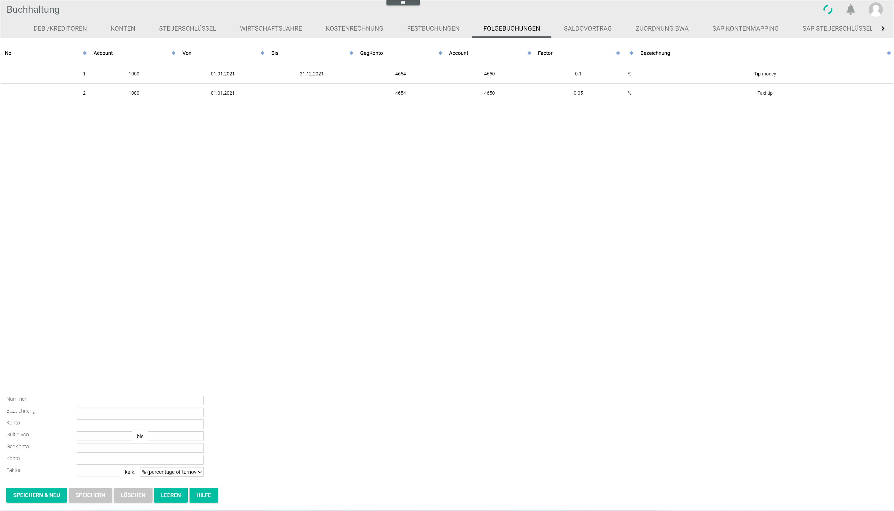

# Follow-on postings

*Accounting > Settings > Tab FOLLOW-ON POSTINGS*

-  (Sort)  
Click this button to sort in ascending or descending order the displayed follow-on postings.

- *No.*  
Follow-on posting number. The follow-on posting numbers must be sequential and are added by the system automatically.

- *Account*  
Account number that triggers the automatic follow-on posting function.

- *From*  
Validity start date.

- *To*  
Validity end date.

- *Contra account*  
Contra account number where the follow-on posting is to be registered.

- *Account*  
Account number where the follow-on posting is to be registered.

- *Factor*  
Factor applied to the initial posting amount.

- *Description*  
Follow-on posting description.

The input fields allow to create, edit and delete follow-on postings.

- *Number*  
Leave the field empty. The follow-on posting numbers must be sequential and are added by the system automatically.

- *Description*  
Enter a description for the follow-on posting.

- *Account*  
Enter the account number to trigger the automatic follow-on posting function. If the account number is not known, use the account search function, see [Search for an account](../Operation/14_SearchAccounting.md#search-for-an-account).

- *Valid from - to*  
Enter the validity start and end date for the follow-on posting.

- *Contra account*  
Enter the contra account number to register the follow-on posting. If the account number is not known, use the account search function, see [Search for an account](../Operation/14_SearchAccounting.md#search-for-an-account).

- *Account*  
Enter the contra account number to register the follow-on posting. If the account number is not known, use the account search function, see [Search for an account](../Operation/14_SearchAccounting.md#search-for-an-account).

- *Factor*  - *calc.*  
Enter a factor value to be applied to the initial posting amount and click the drop-down list to select the appropriate calculating method. The following options are available:  

  - **% percentage of turnover**
  - *** turnover times factor**
  - **/ turnover divided by factor**

  - [SAVE & NEW]  
  Click this button to save a newly created follow-on posting.  

  - [SAVE]  
  Click this button to edit an existing follow-on posting.

  - [DELETE]  
  Click this button to delete a selected follow-on posting.

  - [CLEAR]  
  Click this button to clear all input fields. The [SAVE & NEW] button becomes active.

  - [HELP]  
  Click this button open the help function.

  [comment]: <> (Vermutlich komplett raus)
