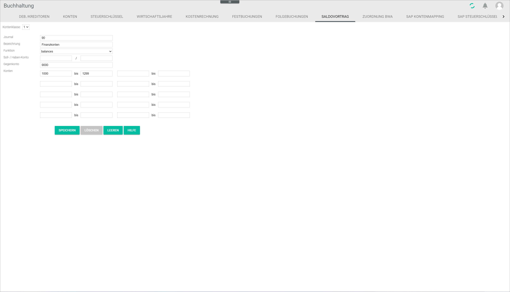

# Balance carried forward

*Accounting > Settings > Tab BALANCE CARRIED FORWARD*

This tab displays the special journals predefined in the system to carry balances and open items forward. Besides, it allows to customize the predefined journals as well as to create new ones. For detailed information about creating a balance carried forward, see [Create a balance carried forward](../Operation/11_CreateBalanceCarriedForward.md).

- *Account class*  
    Click the drop-down list to select the desired account class. Each account class is linked to a special journal. By default, the following account classes are predefined in the system:

    | Account class  | Journal      | Description          |
    |:--------------:|:------------:|:--------------------:|
    | 1              | 90           | Financial accounts   |
    | 2              | 91           | Impersonal accounts  |
    | 3              | 92           | Input tax + VAT      |
    | 4              | 93           | P&L                  |
    | 8              | 98           | Open items debtors   |
    | 9              | 99           | Open items creditors |

    These predefined account classes can be edited, if necessary. By default, the account classes 5 to 7 are available and can be individually configured.

Depending on whether a free or an already configured account class has been selected, either new values can be entered in the following fields, or the existing values can be edited.

- *Journal*  
    Enter or modify the journal number of the selected account class.

- *Description*  
    Enter or modify the description to the selected account class.

- *Function*  
    Click the drop-down list to select the appropriate function for the selected account class. The following options are available:
    - **Balances**  
        This function is used to transfer outstanding account balances from one fiscal year to the next one.   
        The option is preselected for the account classes 1 to 4.
    - **Open items**  
        This function is used to transfer open items from one fiscal year to the next one.   
        The option is preselected for the account classes 8 and 9, that is, personal accounts (debtors and creditors).

- *Debit/credit account*  
    Enter the applicable debit account number in the left field and the applicable /credit account number in the right field for the selected account class.

- *Contra account*  
    Enter the applicable contra account number for the selected account class.

- *Accounts from - to*  
    Enter the applicable account number ranges for the selected account class.

- [SAVE]  
    Click this button to save any changes made.

- [DELETE]  
    Click this button to delete the selected account class.

    > [Info] The predefined account classes cannot be deleted. Therefore, the [DELETE] button is inactive when these account classes are selected.

[comment]: <> (Stimmt das so oder Bug?)

- [CLEAR]  
    Click this button to clear all input fields.  

[comment]: <> (Button scheint nicht zu funktionieren. Bug?)

- [HELP]  
    This function is currently not available.
