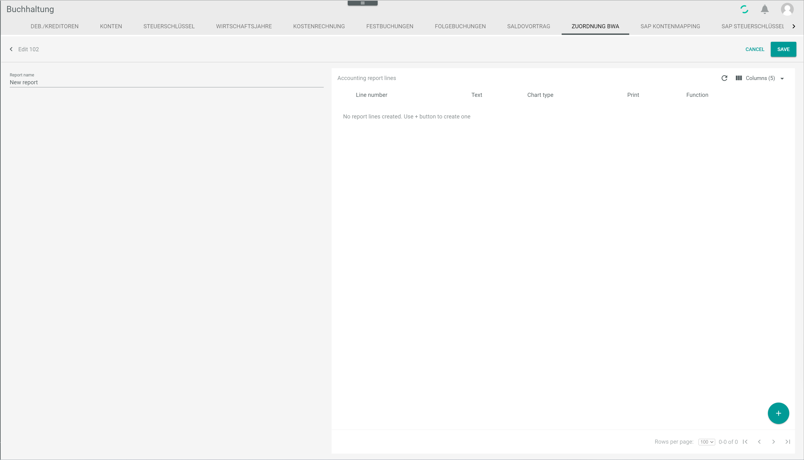
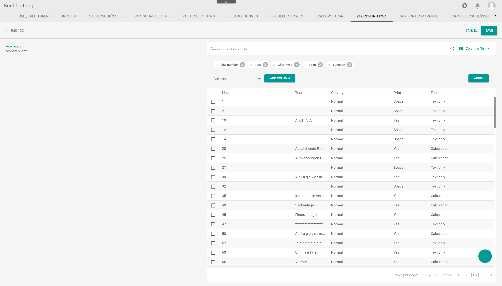

# BWA assignment

*Accounting > Settings > Tab BWA ASSIGNMENT*

**Accounting reports**

-  (Copy) Button  
Click this button to copy a predefined system report. The *Copy from predefined system report* window is displayed, see [Copy from predefined system report](#copy-from-predefined-system-report).

-  (Refresh) Button  
Click this button to refresh the *Accounting reports* view.

-  (Columns) Button  
Click this button to display the column bar.

- *Report number*  
Accounting report number as predefined in the system. The report number cannot be edited.

- *Report name*  
Accounting report name. The report name can be edited. The following accounting reports are preconfigured in the system:

  - *Profit and loss account*    
  - *Cash basis accounting*  
  - *Liquidity statement*  
  - *Liquidity*  
  - *Monthly balance*  

- (Checkbox)  
Mark the checkbox button to select an accounting report. The toolbar is displayed:

  -  (Edit) Button  
Click this button to edit the selected accounting report. The *Edit* view is displayed, see [Edit BWA](#edit-bwa).

  -  (Copy) Button  
Click this button to copy the selected accounting report. A copy of the selected accounting report is displayed in the accounting reports list.

  -  (Delete) Button  
Click this button to delete the selected accounting report. For detailed information about deleting a BWA report, see [Delete a BWA report](../Integration/07_ManageBWAReports.md#delete-a-bwa-report).

    > [Warning] Be aware that the selected BWA report will be deleted permanently.

-  (Add) Button  
Click this button to create an accounting report. The *Create* view is displayed, see [Create BWA](#create-bwa).

- *Rows per page*   
Click the drop-down list to select the number of rows to be displayed per page.

- *[x-x] of [x]*  
This text displays the number of accounting reports currently displayed and the total number of accounting reports in the list. This text is read-only.

-  -  (First page) - (Last page)  
  -  (Previous page) - (Next page)  
Click these buttons to navigate the accounting reports list.

## Copy from predefined system report

*Accounting > Select fiscal year > Settings > Tab BWA ASSIGNMENT > Button Copy*

- *Report name*  
Click the drop-down list to select the predefined system report to be copied. The following options are available:

  - **Profit and loss account**    
  - **Cash basis accounting**  
  - **Liquidity statement**  
  - **Liquidity**
  - **Monthly balance**  

- [CANCEL]  
Click this button to cancel the process. The window is closed.

- [COPY]  
Click this button to copy the selected system report. A copy of the selected accounting report is displayed in the accounting reports list.  

## Create BWA

*Accounting > Select fiscal year > Settings > Tab BWA ASSIGNMENT > Button Add*

-  (Back) *Create*   
Click this button to close the *Create* view and return to the *Accounting reports* view.

- *Report name*  
Enter a report name.

- [CANCEL]  
Click this button to cancel the process. The *Create* view is closed and the *Accounting reports* view is displayed again.

- [SAVE]  
Click this button to save the accounting report. The newly created accounting report is displayed in the accounting reports list. For detailed information about creating a BWA report, see [Create a BWA report](../Integration/07_ManageBWAReports.md#create-a-bwa-report).

## Edit BWA

*Accounting > Select fiscal year > Settings > Tab BWA ASSIGNMENT > Select accounting report*

-  (Back) *Edit*  
Click this button to close the *Edit* view and return to the *Accounting reports* view.

- *Report name*  
Edit the report name if necessary.

- [CANCEL]  
Click this button to cancel the process. The *Edit* view is closed and the *Accounting reports* view is displayed again.

- [SAVE]  
Click this button to save the changes made in the accounting report. For detailed information about editing a BWA report, see [Edit a BWA report](../Integration/07_ManageBWAReports.md#edit-a-bwa-report).

**Accounting report lines**

- **Newly created report**

  

  > [Info] If the accounting report has been newly created, that means, it is not a copy of a predefined BWA report, the *Accounting report lines* section is empty. The notice *No report lines created. Use + button to create one* is displayed. Click the  (Add) button to add accounting report lines. The *Create* section is displayed, see [Create report lines](#create-report-lines).

- **Report copied from a predefined system report**

  

  

  > [Info] If the accounting report is a copy of a predefined system report, the *Accounting report lines* section contains a number of lines. These lines can be edited or deleted.

[comment]: <> (Beide Screenshots? Nur oberes? Beide Bilder in einem -> Snagit crash course!)

  -  (Refresh) Button  
  Click this button to refresh the *Accounting report lines* view.

  -  (Columns) Button  
  Click this button to display the column bar.

  - (Checkbox)  
  Click this button to select an accounting report line. The toolbar is displayed:

    -  (Edit) Button  
  Click this button to edit the selected accounting report line. The *Edit* view is displayed, see [Edit report lines](edit-report-lines).

    -  (Delete) Button  
  Click this button to delete the selected accounting report line.

      > [Warning] Be aware that the selected accounting report line will be deleted permanently.

  The accounting report lines are displayed in column view. These fields are read-only. Select a checkbox to the left of an accounting report line and click the  (Edit) button to edit it. Alternatively, click a report line to display the *Edit* view, see [Edit report lines](#edit-report-lines).

  - *Line number*  
    Line number as predefined in the system report.

  - *Text*  
    Report line description.

  - *Chart type*  
  Chart type predefined for the line. The following options are available:  

    - *Normal*
    - *Sum*
    - *Don't show*

  - *Print*  
  Value predefined for the line in the output file. The following options are available:  

    - *No*
    - *Yes*
    - *Space*
    - *New page*

  - *Function*  
  Function predefined for the line. The following options are available:  

    - *Text only*  
    - *Calculation*  
    - *Assessment*  

  - *ID*  
  Report line identification number. This value is automatically defined by the system.

  -  (Add) Button  
  Click this button to create an accounting report line. The *Create* view is displayed, see [Create report lines](#create-report-lines).

  - *Rows per page*   
  Click the drop-down list to select the number of rows to be displayed per page.

  - *[x-x] of [x]*  
  This text displays the number of accounting reports currently displayed and the total number of accounting reports in the list. This text is read-only.

  -  -  (First page) - (Last page)  
    -  (Previous page) - (Next page)  
  Click these buttons to navigate the accounting reports list.

## Create report lines

*Accounting > Select fiscal year > Settings > Tab BWA ASSIGNMENT > Select accounting report > Button Add*

**Create**

-  (Back) *Create*   
Click this button to close the *Create* view and return to the *Accounting report lines* view.

- *Line number*  
Enter the line number or use the arrows to increase or decrease the line number. If a line number entered is already in use, an error message is displayed.

- *Output*  
Click the drop-down list to select the desired output for the current line. The following options are available:  

  - **No**  
  Select this option to exclude the content in the current line from the output file.

  - **Yes**  
  Select this option to include the content in the current line in the output file.

  - **Space**  
  Select this option to include an blank line in the output file.

  - **New page**  
  Select this option to start a new page from the current line in the output file.

- *Chart type*  
Click the drop-down list to select the desired chart type for the current line. The following options are available:  

  - **Normal**
  - **Sum**
  - **Don't show**

[comment]: <> (Besser "Do not display"? Wie unterscheiden sich die drei Optionen?)

- *Text*  
Enter a description for the current line.

- *Function*  
Click the drop-down list to select the desired function for the current line. The following options are available:  

  - **Text only**  
  Select this option to enter text only.
  - **Calculation**  
  Select this option to enter a calculation formula. When selecting this option, the *Formula* field becomes active.
  - **Assessment**  

[comment]: <> (Was ist mit Assessment gemeint? Was ist die Funktion? Auf DE: Umlagen -> Quelle: alte Doku-Webseite. EN = Levies/charges?)

- *Formula*  
Enter the applicable formula. This field becomes active when selecting **Calculation** in the *Function* field. The basic calculating operations (+, -, *, /) are permitted.

- *Percent / Columns*

  -  (Toggle) Button  
  Active this toggle to apply a specific formula in a column. Up to 4 percent/columns can be added per line.

  - *Formula*  
  Enter the applicable formula for the percentage calculation in the selected column. The basic calculating operations (+, -, *, /) are permitted.

[comment]: <> (Alte-Doku-Webseite: Für jede BWA können Sie max. 4 Prozent-Spalten einfügen. Der Prozentsatz bezieht sich auf den Gesamtumsatz. Wählen Sie eine Spalte an und klicken Sie auf Formel, um die Formel einzugeben. Stimmt? Wie funktioniert es?)

[comment]: <> (Weitere Information benötigt! Sind die Formel-Funktionen aus alter Doku-Seite aktuell und ok zu verwenden?)

- [CANCEL]  
Click this button to cancel the process. The *Create* view is closed. The *Accounting report lines* view is displayed again.

- [SAVE]  
Click this button to save the created report lines. The newly creaed accounting report lines are displayed in the *Accounting report lines* view.

## Edit report lines

*Accounting > Select fiscal year > Settings > Tab BWA ASSIGNMENT > Select accounting report > Select accounting report line > Button Edit*

**Edit**

-  (Back) *Edit*   
Click this button to close the *Edit* view and return to the *Accounting report lines* view.

- *Line number*  
Enter a different line number or use the arrows to increase or decrease the line number. If a line number entered is already in use, an error message is displayed.

- *Output*  
Click the drop-down list to select the desired output for the current line. The following options are available:  

  - **No**  
  Select this option to exclude the content in the current line from the output file.

  - **Yes**  
  Select this option to include the content in the current line in the output file.

  - **Space**  
  Select this option to include an blank line in the output file.

  - **New page**  
  Select this option to start a new page from the current line in the output file.

- *Chart type*  
Click the drop-down list to select the desired chart type for the current line. The following options are available:  

  - **Normal**
  - **Sum**
  - **Don't show**

[comment]: <> (Besser "Do not display"? Wie unterscheiden sich die drei Optionen?)

- *Text*  
Enter a different description for the current line, if necessary.

- *Function*  
Click the drop-down list to select the desired function for the current line. The following options are available:  

  - **Text only**  
  Select this option to enter text only.
  - **Calculation**  
  Select this option to enter a calculation formula. When selecting this option, the *Formula* field becomes active.
  - **Assessment**  

[comment]: <> (Was ist mit Assessment gemeint? Was ist die Funktion? Auf DE: Umlagen -> Quelle: alte Doku-Webseite. EN = Levies/charges?)

- *Formula*  
Modify the applicable formula, if necessary. This field becomes active when selecting **Calculation** in the *Function* field. The basic calculating operations (+,-,*,/) are permitted.

- *Percent / Columns*

  -  (Toggle) Button  
  Activate or deactivate this toggle as necessary to apply or not a specific formula in a column. Up to 4 percent/columns can be added per line.

  - *Formula*  
  Modify the applicable formula for the percentage calculation in the selected column. The basic calculating operations (+,-,*,/) are permitted.

[comment]: <> (Alte-Doku-Webseite: Für jede BWA können Sie max. 4 Prozent-Spalten einfügen. Der Prozentsatz bezieht sich auf den Gesamtumsatz. Wählen Sie eine Spalte an und klicken Sie auf Formel, um die Formel einzugeben. Stimmt? Wie funktioniert es?)

[comment]: <> (Weitere Information benötigt! Sind die Formel-Funktionen aus alter Doku-Seite aktuell und ok zu verwenden?)

- [CANCEL]  
Click this button to cancel the process. The *Edit* view is closed. The *Accounting report lines* view is displayed again.

- [SAVE]  
Click this button to save any changes made. The edited accounting report lines are displayed in the *Accounting report lines* view.
