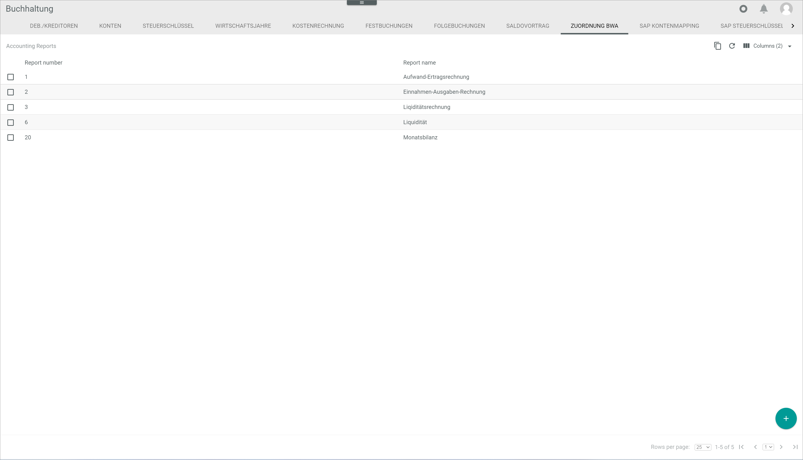
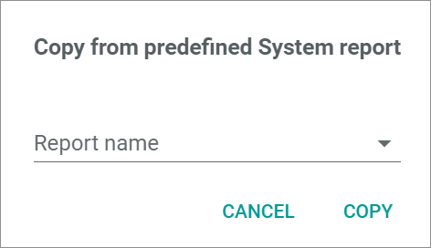
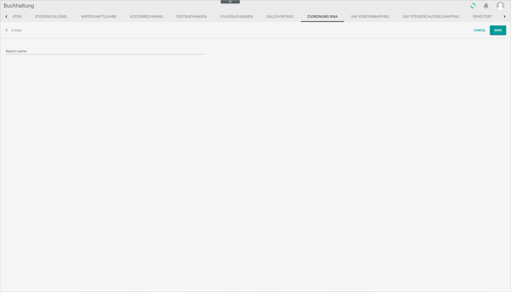
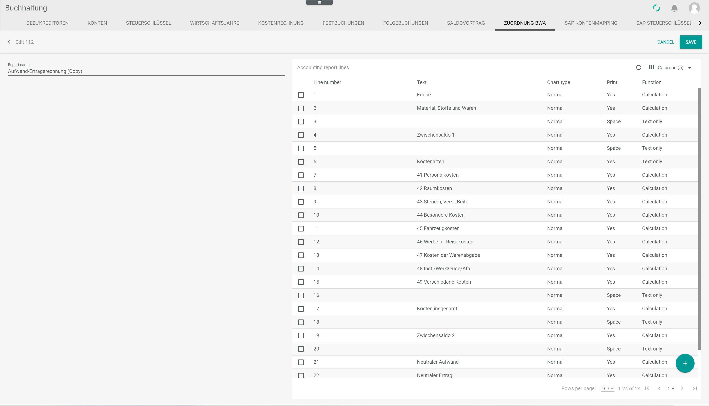
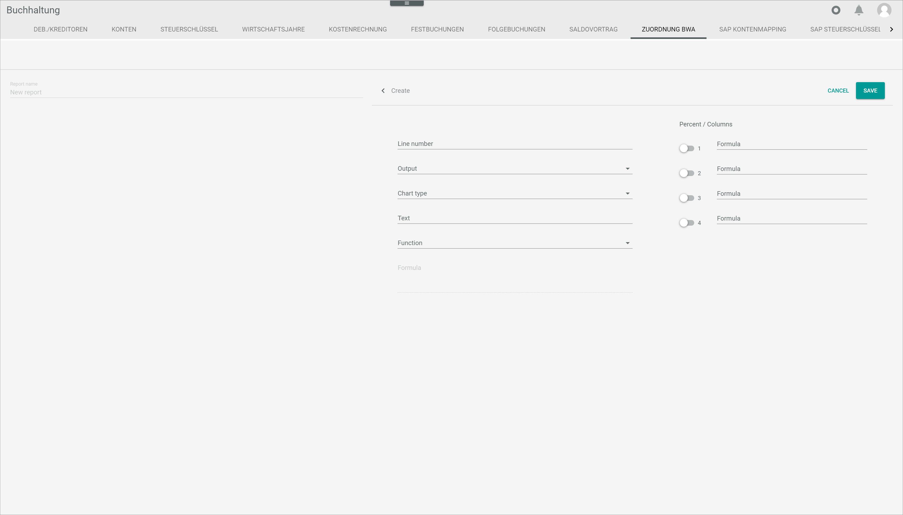
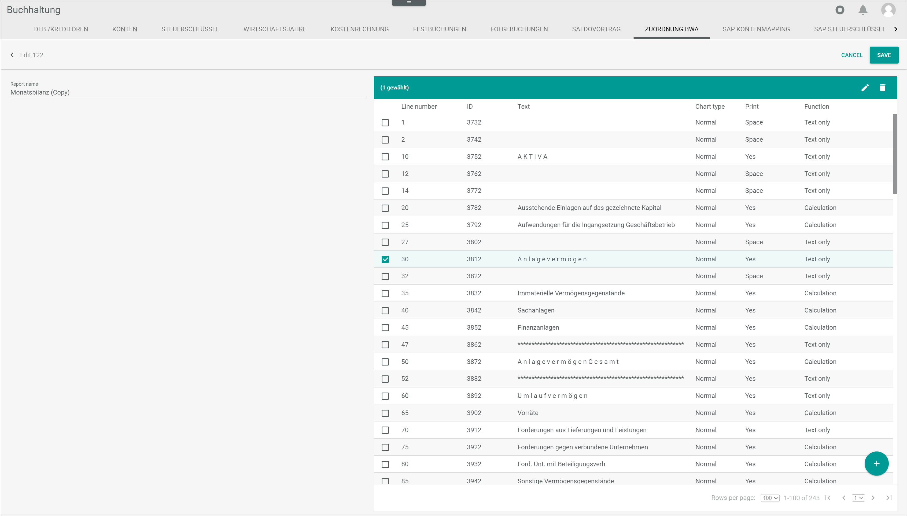

[Manage the BWA reports](../Integration/07_ManageBWAReports.md) 

# BWA assignment

*Accounting > Settings > Tab BWA ASSIGNMENT*

**Accounting reports**

-  (Copy)  
    Click this button to copy a predefined system report. The *Copy from predefined system report* window is displayed, see [Copy from predefined system report](#copy-from-predefined-system-report).

-  (Refresh)    
    Click this button to update the list of accounting reports.

-  Columns (x)   
    Click this button to display the columns bar and customize the displayed columns and the order of columns in the list. The *x* indicates the number of columns that are currently displayed in the list.

- [x]     
    Select the checkbox to display the editing toolbar.

-  (Edit)   
    Click this button to edit the selected accounting report. The *Edit "Report ID"* view is displayed, see [Edit "Report ID"](#edit-report-id).

-  (Copy)   
    Click this button to copy the selected accounting report. A copy of the selected accounting report is displayed in the list of accounting reports.

-  (Delete)   
    Click this button to delete the selected accounting report.    
    For detailed information about deleting a BWA report, see [Delete a BWA report](../Integration/07_ManageBWAReports.md#delete-a-bwa-report).  

The list displays all available accounting reports. Depending on the settings, the displayed columns may vary. All fields are read-only.

- *Report number*  
    Accounting report number.

- *Report name*  
    Accounting report name. The following accounting reports are predefined in the system:
    - *Profit and loss account*    
    - *Cash basis accounting*  
    - *Liquidity statement*  
    - *Liquidity*  
    - *Monthly balance*  

- *ID*  
    Accounting report identification number. The ID number is automatically assigned by the system when the report is created.

-  (Add)     
    Click this button to create an accounting report. The *Create* view is displayed, see [Create report](#create-report).

## Copy from predefined system report

*Accounting > Settings > Tab BWA ASSIGNMENT > Button Copy*

- *Report name*  
    Click the drop-down list to select the predefined system report to be copied. The following options are available:
    - **Profit and loss account**    
    - **Cash basis accounting**  
    - **Liquidity statement**  
    - **Liquidity**
    - **Monthly balance**  

- [CANCEL]  
    Click this button to cancel the process. The *Copy from predefined system report* window is closed.

- [COPY]  
    Click this button to copy the selected system report. The *Copy from predefined system report* window is closed. A copy of the selected accounting report is displayed at the end of the accounting reports list.

## Create report

*Accounting > Settings > Tab BWA ASSIGNMENT > Button Add*

-  (Back)     
    Click this button to close the *Create* view and return to the accounting reports list. All changes are rejected.

- *Report name*  
    Enter a report name.

- [CANCEL]  
    Click this button to cancel the report creation. The *Create* view is closed and the accounting reports list is displayed again.

- [SAVE]  
    Click this button to save the accounting report. The *Create* view is closed and the accounting reports list is displayed again. The new accounting report is displayed in the accounting reports list.   
    For detailed information about creating a BWA report, see [Create a BWA report](../Integration/07_ManageBWAReports.md#create-a-bwa-report).

## Edit report

*Accounting > Settings > Tab BWA ASSIGNMENT > Select accounting report*

-  (Back)    
    Click this button to close the *Edit "Report ID"* view and return to the accounting reports list. All changes are rejected.

- [CANCEL]  
    Click this button to cancel editing the report. The *Edit "Report ID"* view is closed and the accounting reports list is displayed again.

- [SAVE]  
    Click this button to save any changes made to the accounting report.   
    For detailed information about editing a BWA report, see [Edit a BWA report](../Integration/07_ManageBWAReports.md#edit-a-bwa-report).

- *Report name*  
    Click this field to edit the report name.

**Accounting report lines**

-  (Refresh)   
    Click this button to update the list of accounting report lines.

-  Columns (x)   
    Click this button to display the columns bar and customize the displayed columns and the order of columns in the list. The *x* indicates the number of columns that are currently displayed in the list.

- [x]     
    Select the checkbox to display the editing toolbar.

-  (Edit)   
    Click this button to edit the selected accounting report line. Alternatively, you can click directly a row in the list of accounting report lines. The *Edit "Report line ID"* view is displayed, see [Edit "Report line ID"](#edit-report-line-id).

-  (Delete)   
    Click this button to delete the selected accounting report line.
    For detailed information about deleting a BWA report, see [Delete a BWA report](../Integration/07_ManageBWAReports.md#delete-a-bwa-report).  

The list displays all available accounting report lines of the selected report. Depending on the settings, the displayed columns may vary. All fields are read-only.   
If no report line has been yet added, the notice *No report lines created. Use + button to create one* is displayed.

- *Line number*  
    Line number.

- *Text*  
    Report line description.

- *Chart type*  
    Chart type predefined for the line. The following options are available:  
    - **Normal**
    - **Sum**
    - **Don't show**

[comment]: <> (Warte auf Feedback von Patrick)

- *Print*  
    Value predefined for the line in the output file. The following options are available:  
    - **Yes**  
        This line is to be printed.  
    - **No**  
        This line is not to be printed.   
    - **Space**  
        This line is a blank line between two lines.
    - **New page**  
        This line inserts a page break.

- *Function*  
    Function predefined for the line. The following options are available:  
    - **Text only**  
        Text only entered.  
    - **Calculation**  
        Calculation formula entered.  
    - **Assessment**  
        This option is currently not supported.

[comment]: <> (Info fehlt! Feedback von Patrick. DE: Umlagen -> Quelle: alte Doku-Webseite)

- *ID*  
    Report line identification number. The ID number is automatically assigned by the system when the report line is created.

-  (Add)   
    Click this button to create an accounting report line. The *Create* view is displayed, see [Create report line](#create-report-line).

## Create report line

*Accounting > Settings > Tab BWA ASSIGNMENT > Select accounting report > Button Add*

-  (Back)    
    Click this button to close the *Create* view and return to the list of accounting report lines. All changes are rejected.

- [CANCEL]  
    Click this button to cancel the report line creation. The *Create* view is closed and the list of accounting report lines is displayed again.

- [SAVE]  
    Click this button to save any changes made to the accounting report line.   

- *Line number*  
    Enter the line number or use the arrows to increase or decrease the line number. If a line number entered is already in use, an error message will be displayed when saving. This field is mandatory.

- *Output*  
    Click the drop-down list to select the desired output for the current line. This drop-down list is mandatory. The following options are available:  
    - **No**  
        Select this option to exclude the content of the current line from the output file.
    - **Yes**  
        Select this option to include the content of the current line in the output file.
    - **Space**  
        Select this option to include a blank line in the output file.
    - **New page**  
        Select this option to start a new page in the output file.

[comment]: <> (Output heißt Print im Bericht/Report. Verwirrend.)

- *Chart type*  
    Click the drop-down list to select the desired chart type for the current line. This drop-down list is mandatory. The following options are available:  
    - **Normal**
    - **Sum**
    - **Don't show**

[comment]: <> (Warte auf Feedback von Patrick)

- *Text*  
    Enter a description to the current line.

- *Function*  
    Click the drop-down list to select the desired function for the current line. The following options are available:  
    - **Text only**  
        Select this option to enter text only.
    - **Calculation**  
        Select this option to enter a calculation formula. When selecting this option, the *Formula* field is unlocked.
    - **Assessment**  
        This option is currently not supported.

[comment]: <> (Info fehlt! Feedback von Patrick. DE: Umlagen -> Quelle: alte Doku-Webseite)

- *Formula*  
    Enter the applicable formula. This field is only unlocked when the **Calculation** option in the *Function* drop-down list is selected. The basic calculating operations (+, -, *, /) are permitted.

    > [Info] For a table including the most usual formulas and functions see [Add report lines to a BWA report](../Integration/07_ManageBWAReports.md#add-report-lines).

**Percent / Columns**

-  x  
    Enable the toggle *1* to apply a specific formula in an additional column in the BWA report. This function is used to calculate the percentage of the value expressed in the current line in relation to the overall turnover. The corresponding formula must be defined in the *Formula* field on the right. Disable the toggle to not apply the formula.

- *Formula*  
    Enter the applicable formula for the percentage calculation of the corresponding column. The basic calculating operations (+, -, *, /) are permitted.

[comment]: <> (Spalten 2-4 nicht definiert bzw. weiterentwickelt, da nicht in Gebrauch, bestätigt in RS mit Teamlead Finance)

## Edit report line

*Accounting > Settings > Tab BWA ASSIGNMENT > Select accounting report > Select accounting report line > Button Edit*

-  (Back)    
    Click this button to close the *Edit "Report line ID"* view and return to the list of accounting report lines. All changes are rejected.

- [CANCEL]  
    Click this button to cancel editing the report line. The *Edit "Report line ID"* view is closed and the list of accounting report lines is displayed again.

- [SAVE]  
    Click this button to save any changes made to the accounting report line.   

- *Line number*  
    Click the field to edit the line number or use the arrows to increase or decrease the line number. If a line number entered is already in use, an error message will be displayed when saving. This field is mandatory.

- *Output*  
    Click the drop-down list to select the desired output for the current line. This drop-down list is mandatory. The following options are available:  
    - **No**  
        Select this option to exclude the content of the current line from the output file.
    - **Yes**  
        Select this option to include the content of the current line in the output file.
    - **Space**  
        Select this option to include a blank line in the output file.
    - **New page**  
        Select this option to start a new page in the output file.

- *Chart type*  
    Click the drop-down list to select the desired chart type for the current line. This drop-down list is mandatory. The following options are available:  
    - **Normal**
    - **Sum**
    - **Don't show**

[comment]: <> (Warte auf Feedback von Patrick)

- *Text*  
    Click this field to edit the description to the current line.

- *Function*  
    Click the drop-down list to select the desired function for the current line. The following options are available:  
    - **Text only**  
        Select this option to enter text only.
    - **Calculation**  
        Select this option to enter a calculation formula. When selecting this option, the *Formula* field is unlocked.
    - **Assessment**  
        This option is currently not supported.

[comment]: <> (Info fehlt! Feedback von Patrick. DE: Umlagen -> Quelle: alte Doku-Webseite)

- *Formula*  
    Click this field to edit the applicable formula. This field is only unlocked when the **Calculation** option in the *Function* drop-down list is selected. The basic calculating operations (+, -, *, /) are permitted.

**Percent / Columns**

-  x  
    Enable the toggle *1* to apply a specific formula in an additional column in the BWA report. This function is used to calculate the percentage of the value expressed in the current line in relation to the overall turnover. The corresponding formula must be defined in the *Formula* field on the right. Disable the toggle to not apply the formula.

- *Formula*  
    Click this field to edit the applicable formula for the percentage calculation of the corresponding column. The basic calculating operations (+, -, *, /) are permitted.

[comment]: <> (Spalten 2-4 nicht definiert bzw. weiterentwickelt, da nicht in Gebrauch, bestätigt in RS mit Teamlead Finance)

