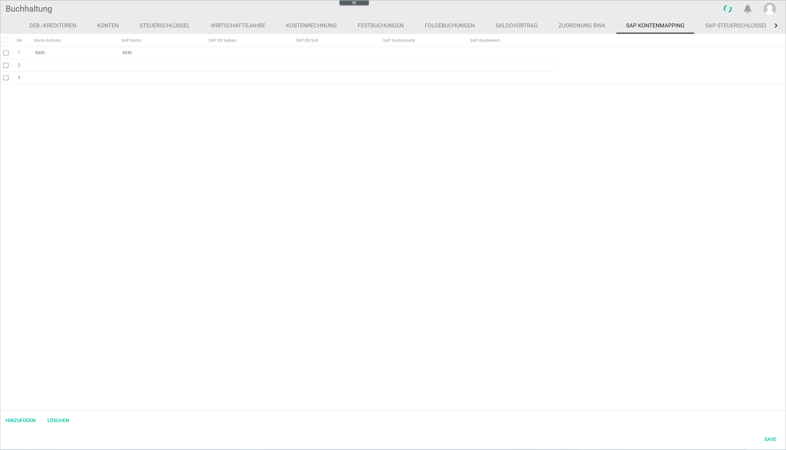

# SAP account mapping

*Accounting > Settings > Tab SAP ACCOUNT MAPPING*

- [x]       
  Select the checkbox to select the corresponding account mapping. If you select the checkbox in the header, all mappings in the list are selected.

The list displays all available account mappings. Depending on the settings, the displayed columns may vary.

- *No.*  
  Row number. This number is assigned automatically by the system. This field is read-only

- *Actindo account*  
  Click this field to edit the Actindo account number. This field is mandatory.

- *SAP account*  
  Click this field to edit the SAP account number. This field is mandatory.

- *SAP PK credit*  
  Click this field to edit the SAP posting key for credit account types.

- *SAP PK debit*  
  Click this field to edit the SAP posting key for debit account types.

- *SAP cost center*  
  Click this field to edit the SAP cost center.

- *SAP business area*  
  Click this field to edit the SAP business area.

[comment]: <> (BS Soll/Haben = Basic Set oder Büchungsschlüssel, EN = Posting key? RS Fachreviewer!)

- [ADD]  
  Click this button to add a new mapping.

- [DELETE]  
  Click this button to delete the selected mapping(s).

- [SAVE]  
  Click this button to save any changes made to the account mappings. All unsaved changes are marked with a small red triangle on the top left corner of the corresponding field.
