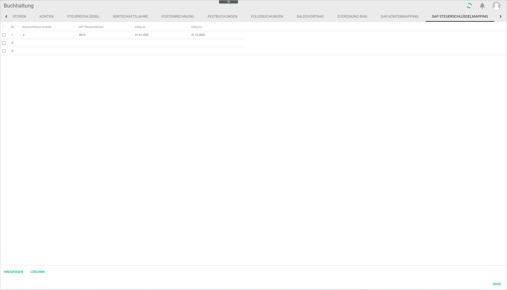

# SAP tax key mapping

*Accounting > Settings > Tab TAX KEY MAPPING*

- [x]       
    Select the checkbox to select the corresponding tax key mapping. If you select the checkbox in the header, all mappings in the list are selected.

The list displays all available tax key mappings. Depending on the settings, the displayed columns may vary.

- *No.*  
    Row number. This number is assigned automatically by the system. This field is read-only

- *Actindo tax key*  
    Click this field to edit the Actindo tax key. This field is mandatory.

- *SAP tax key*  
    Click this field to edit the SAP tax key (also called tax code). This field is mandatory.

- *Valid from*  
    Click this field to edit the validity start date. Click the  (Calendar) button to select the validity start date. Alternatively, you can directly enter the validity start date in the format YYYY-MM-DD.

- *Valid until*  
    Click this field to edit the validity end date. Click the  (Calendar) button to select the validity end date. Alternatively, you can directly enter the validity end date in the format YYYY-MM-DD.

- [ADD]  
    Click this button to add a new mapping.

- [DELETE]  
    Click this button to delete the selected mapping(s).

- [SAVE]  
    Click this button to save any changes made to the tax key mappings. Unsaved changes are marked with a small red triangle on the top left corner of the corresponding field.
