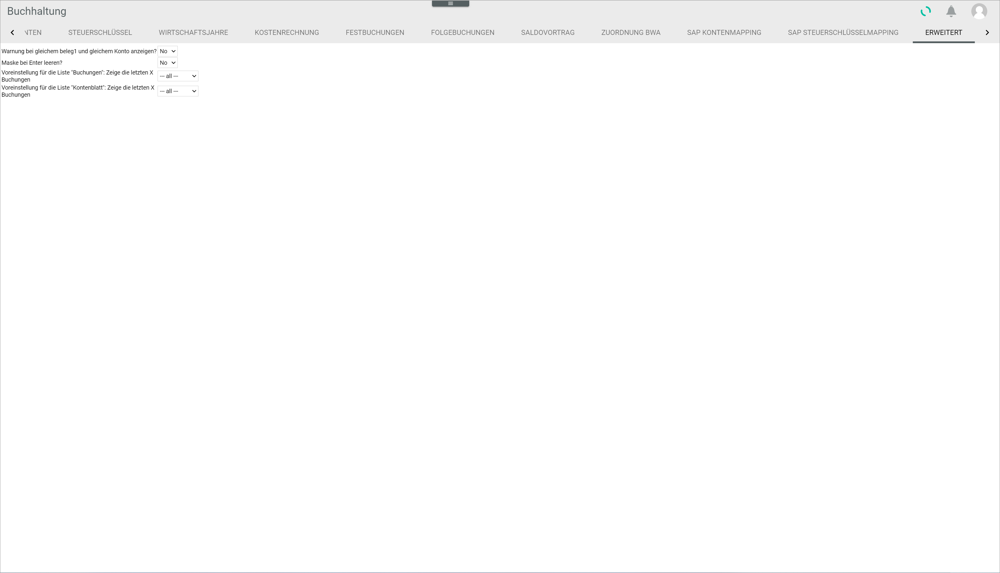

# ADVANCED

*Accounting > Select fiscal year > Settings > Tab ADVANCED*

- *Display warning if Receipt 1 and Account values identical?*  
Select **Yes** for the system to display a warning if the values entered in *Receipt 1* and *Account* in the entry line are already registered in the system. The default setting is **No**.

  > [Info] This setting is meant to warn about a double booking, but does not prevent the user from doing it.

- *Empty entry line with Enter?*  
Select **Yes** to empty the entry line by pressing Enter after doing a booking. The default setting is **No**.

- *Default setting for "Bookings" list: show the last X bookings*  
Click the drop-down list to select the appropriate display setting for the *BOOKINGS* tab. The following options are available:  

    - **All**  
    Select this option to display all bookings available.

    - **The last (10, 25, 50, 100, 250, 500)**  
    Select the desired number of bookings to be displayed.

  > [Info] This setting is meant to improve the system performance, as the time needed to display the desired bookings can be reduced. This function is also available in the *BOOKINGS* tab for the current view clicking the corresponding drop-down list, see [BOOKINGS](./01a_Bookings.md).  

- *Default setting for "Account sheet" list: show the last X bookings*  
Click the drop-down list to select the appropriate display setting for the *ACCOUNT SHEET* tab. The following options are available:  

    - **All**  
    Select this option to display all bookings available.

    - **The last (10, 25, 50, 100, 250, 500)**  
    Select the desired number of bookings to be displayed.

  > [Info] This setting is meant to improve the system performance, as the time needed to display the desired bookings can be reduced. This function is also available in the *ACCOUNT SHEET* tab for the current view clicking the corresponding drop-down list, see [ACCOUNT SHEET](./01c_AccountSheet.md).  
