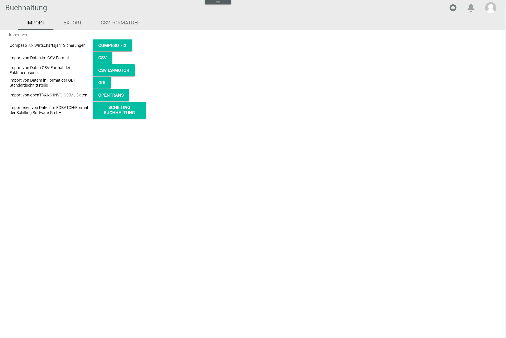
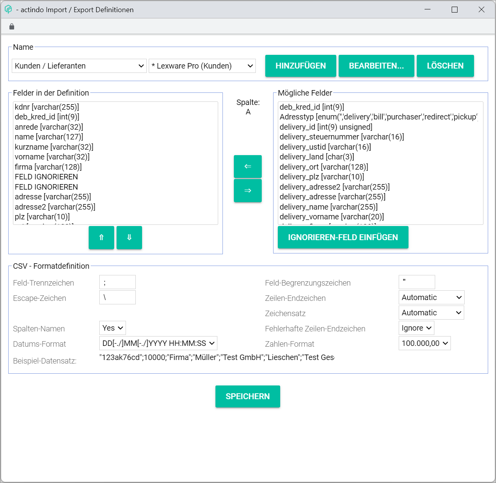

[!!User interface Debtors/creditors](./02a_DebtorsCreditors.md)
[!!User interface Fiscal years](./02d_FiscalYears.md)
[!!User interface CSV format definitions](./03c_CSVFormatDef.md)

# Import

*Accounting > Extras > Tab IMPORT*

> [Info] This tab can also be accessed via the *Import postings* window from the [FISCAL YEARS](./02d_FiscalYears.md#import-postings) tab in the user interface.

**Import from:**

The following import options are available in the tab:
  - *Compeso 7.x fiscal year backups*
  - *Import of data in CVS format*
  - *Import of data in CVS format from invoicing solution*
  - *Import of data in GDI standard interface format*
  - *Import of openTRANS INVOIC XLM data*
  - *Import of data in FQBATCH format from Schilling Software GmbH*

- [COMPESO 7.X]  
    Click this button to import data in Compeso proprietary format. The *Compeso 7.X* window is displayed, see [Compeso 7.X](#compeso-7x).

- [CSV]  
    Click this button to import data in CSV format. The *CSV* window is displayed, [CSV](#csv).

- [CSV LS-MOTOR]  
    Click this button to import data in CSV format from an invoicing solution. The *CSV LS-MOTOR* window is displayed, see [CSV LS-Motor](#csv-ls-motor).

[comment]: <> (LS ENGINE?)

- [GDI]  
    Click this button to import data in GDI standard interface format. The *GDI* window is displayed, see [GDI](#gdi).

- [OPENTRANS]  
    Click this button to import data in openTRANS INVOIC XML format. The *OPENTRANS* window is displayed, see [openTRANS](#opentrans).

- [SCHILLING ACCOUNTING]  
    Click this button to import data in Schilling Software proprietary FQBATCH format. The *SCHILLING ACCOUNTING* window is displayed, see [Schilling accounting](#schilling-accounting).

## Compeso 7.X

*Accounting > Extras > Tab IMPORT > Button COMPESO 7.X*

### Compeso 7.X: Step 1

**Files**

- *backup.ctl*  
    Select the corresponding file for upload in the ctl-format.  
    - [Choose file]  
        Click this button to select a file from your device to be uploaded. The explorer is displayed in a new window. If no file has been selected yet, the notice *No file chosen* is displayed to the right of the button.

- *backup.dat*  
    Select the corresponding file for upload in the dat-format.
    - [Choose file]  
        Click this button to select a file from your device to be uploaded. The explorer is displayed in a new window. If no file has been selected yet, the notice *No file chosen* is displayed to the right of the button.

- *abrzr.dat*  
    Select the corresponding file for upload in the dat-format.
    - [Choose file]  
        Click this button to select a file from your device to be uploaded. The explorer is displayed in a new window. If no file has been selected yet, the notice *No file chosen* is displayed to the right of the button.

- [UPLOAD]  
    Click this button to upload the selected file(s). The *Compeso 7.x: Step 2* window is displayed. The *Converting...* notice is displayed during the conversion process.

- [CONTINUE]  
    Click this button to proceed to the next step. This button is locked until at least one file has been uploaded.

### Compeso 7.X: Step 2

**Converting...**

- [CANCEL]  
    Click this button to cancel the process. This button is only displayed during the conversion process.

    > [Info] The *Converting...* notice is displayed during the conversion process. As soon as the conversion is completed, the *File imported!* confirmation window is displayed. Click the [OK] button to continue. The *Compeso 7.x: Step 3* window is displayed.

[comment]: <> (Der Prozess geht nicht weiter, System hängt. Ich habe versucht eine exportierte DAT-Datei - via Reiter EXPORT- zu importieren, aber es scheint nicht zu funktionieren. Bug oder keine richtige Datei importiert?)

## CSV

*Accounting > Extras > Tab IMPORT > Button CSV*

### CSV: Step 1

**Files**

- *xxxx.CSV*    
    Select the CSV file to be imported.
    -  *Local file*  
        Select this radio button to select a local file from your device to be uploaded. The [Choose file] button is displayed in the box.
        - [Choose file]  
            Click this button to select a file from your device to be uploaded. If no file has been selected yet, the notice *No file chosen* is displayed o the right of the button.
    -  *DMS*  
        Select this radio button to select a file in the *Documents* module to be uploaded. A search bar and the [SEARCH] button are displayed in the box. This radio button is only displayed when the *Documents* module is installed.
        - Search field   
            Enter the file path of the file to be uploaded. It is recommended to use the [SEARCH] button to select a file. The file path is automatically entered in the field.

- [SEARCH]  
    Click this button to search for a file to be uploaded. The *Select file* window is displayed, see [Select file](#select-file).

- [UPLOAD]  
    Click this button to upload the selected file. The *Files accepted!* confirmation window is displayed. Click the [OK] button to continue. The selected file is uploaded and the button is locked until the import is completed.

- *File content*  
    Click the drop-down list to select to appropriate file content. The following options are available:
    - **Customers/suppliers**	 
    - **Chart of accounts**	  
    - **# Postings**  
    - **eBay sales history**

Depending on the selected option, the following displayed fields and options vary.

[comment]: <> (eBay sales history ist relevant für alle Kunden? Weglassen? Andere Optionen je nach Einstellungen/Module/Plugins?)

- *Import def.*  
    Click the drop-down list to select the appropriate import definition. The options displayed vary depending on the option selected in the *File content* drop-down list. All available import definitions are displayed in the list. If the **Customers/suppliers** option is selected in the *File content* drop-down list, the following options are predefined:
    - **\* Lexware Pro (Customers)**	 
    - **\* Lexware Pro (Suppliers)**

For the other options in the *File content* drop-down list, no import definitions are predefined. The import definitions can be defined or edited by clicking the [Edit] button to the right of the drop-down list.

- [Edit]  
    Click this button to edit the selected import definition or to create a new one. The *Import/export definitions* window is displayed, see [Import/export definitions](#importexport-definitions).

- *eBay debtor*   
    Enter the debtor number. This field is only displayed when the **eBay sales history** option is selected in the *File content* drop-down list.

- *eBay revenue accounts*   
    eBay revenue accounts assigned to the selected debtor. The eBay revenue accounts are automatically added by the system. The notice *Revenue accounts are automatically searched in the chart of accounts based on the [revenue account] function, the tax rate and the word "ebay" in the name.* is displayed.    
    This field is only displayed when the **eBay sales history** option is selected in the *File content* drop-down list.

- *Split postings*  
    Click the drop-down list to select the appropriate import setting for split postings. The following options are available:
    - **With different tax rates**
    - **For more than one product**
    - **Always**

- [CONTINUE]  
    Click this button to proceed to the next step. The *Converted* confirmation window is displayed. Click the [OK] button to continue. The *CSV: Step 2* window is displayed. This button is locked until at least one file has been uploaded.

### CSV: Step 2

**Log file**  

- [VIEW]  
    Click this button to display the import log file. The log file is displayed in a new window.

- [CONTINUE]  
    Click this button to proceed to the next step. The *Please click Finalize to import the file* confirmation window is displayed. Click the [OK] button to continue. The *CSV: Step 3* window is displayed.

### CSV: Step 3

> [Info] Depending on the imported data, the information displayed may vary.

- *Postings*  
    Define how to handle the postings to be imported. If the import file contained no postings, the notice *No postings in the import file* is displayed.
    - *Take over postings?*  
        Click the drop-down list and select the applicable option. The following options are displayed:
        - **Yes**   
            The system will take over all postings from the import file. By default, this setting is preselected.
        - **No**   
            No postings from the import file are taken over.
    - *Overwrite existing ones?*  
            Click the drop-down list and select the applicable option. The following options are displayed:
        - **Yes**   
            The system will overwrite the existing postings with the postings from the import file. By default, this setting is preselected.
        - **No**   
            No existing postings will be overwritten.

- *Impersonal accounts*  
    Define how to handle the impersonal accounts to be imported. If the import file contained no impersonal accounts, the notice *No impersonal accounts in the import file* is displayed.
    - *Take over impersonal accounts?*  
        Click the drop-down list and select the applicable option. The following options are displayed:
        - **Yes**   
            The system will take over all impersonal accounts from the import file. By default, this setting is preselected.
        - **No**   
            No impersonal accounts from the import file are taken over.
    - *Overwrite existing ones?*  
        Click the drop-down list and select the applicable option. The following options are displayed:
        - **Yes**   
            The system will overwrite the existing impersonal accounts with the impersonal accounts from the import file. By default, this setting is preselected.
        - **No**   
            No existing impersonal accounts will be overwritten.

- *Personal accounts*    
    Define how to handle the personal accounts to be imported. If the import file contained no personal accounts, the notice *No personal accounts in the import file* is displayed.
    - *Take over personal accounts?*  
        Click the drop-down list and select the applicable option. The following options are displayed:
        - **Yes**   
            The system will take over all personal accounts from the import file. By default, this setting is preselected.
        - **No**   
            No personal accounts from the import file are taken over.
    - *Overwrite existing ones?*  
        Click the drop-down list and select the applicable option. The following options are displayed:
        - **Yes**   
            The system will overwrite the existing personal accounts with the personal accounts from the import file. By default, this setting is preselected.
        - **No**   
            No existing personal accounts will be overwritten.

- [FINALIZE]  
    Click this button to complete the import process. The *CSV: Step 4* window is displayed.

### CSV: Step 4

**Import...**

- [CANCEL]  
    Click this button to cancel the import process. This button is only displayed during the import process.

> [Info] The *Import...* notice is displayed during the import process. As soon as the import is completed, the *File imported!* confirmation window is displayed. Click the [OK] button to continue. The *CSV: Step 5* window is displayed.

### CSV: Step 5

[comment]: <> (Leeres Fenster. Kommentar in OneNote Bugs-Datei.)

## CSV LS-Motor

*Accounting > Extras > Tab IMPORT > Button CSV LS-MOTOR*

### CSV LS-Motor: Step 1

**Files**

[comment]: <> (txt oder X.txt? Unterschied oder X gehört zum Namen? Ich kann keine txt Datei hochladen. Fehlermeldung: No such file or directory)

- *customersX.txt*    
    Select the customers text file to be imported.
    -  *Local file*  
        Select this radio button to select a local file from your device to be uploaded. The [Choose file] button is displayed in the box.
        - [Choose file]  
            Click this button to select a file from your device to be uploaded. If no file has been selected yet, the notice *No file chosen* is displayed o the right of the button.
    -  *DMS*  
        Select this radio button to select a file in the *Documents* module to be uploaded. A search bar and the [SEARCH] button are displayed in the box. This radio button is only displayed when the *Documents* module is installed.
        - Search field   
            Enter the file path of the file to be uploaded. It is recommended to use the [SEARCH] button to select a file. The file path is automatically entered in the field.
        - [SEARCH]  
            Click this button to search for a file to be uploaded. The *Select file* window is displayed, see [Select file](#select-file).

- *ordersX.txt*   
    Select the orders text file to be imported.
    -  *Local file*  
        Select this radio button to select a local file from your device to be uploaded. The [Choose file] button is displayed in the box.
        - [Choose file]  
            Click this button to select a file from your device to be uploaded. If no file has been selected yet, the notice *No file chosen* is displayed o the right of the button.
    -  *DMS*  
        Select this radio button to select a file in the *Documents* module to be uploaded. A search bar and the [SEARCH] button are displayed in the box. This radio button is only displayed when the *Documents* module is installed.
        - Search field   
            Enter the file path of the file to be uploaded. It is recommended to use the [SEARCH] button to select a file. The file path is automatically entered in the field.
        - [SEARCH]  
            Click this button to search for a file to be uploaded. The *Select file* window is displayed, see [Select file](#select-file).

- [UPLOAD]  
    Click this button to upload the selected file. The *Files accepted!* confirmation window is displayed. Click the [OK] button to continue. The selected file is uploaded and the button is locked until the import is completed.

- *CustomerX.txt*  
    Click the drop-down list to select the appropriate import definition. All available import definitions are displayed in the list. The following options are predefined:
    - **\* AfterBuy CSV**
    - **\* Auction Master CSV**

- *OrdersX.txt*  
    Click the drop-down list to select the appropriate import definition. All available import definitions are displayed in the list. The following options are predefined:
    - **\* AfterBuy CSV**
    - **\* Auction Master CSV**

The import definitions can be defined or edited by clicking the [Edit] button to the right of the drop-down list.

- [Edit]  
    Click this button to edit the selected import definition or to create a new one. The *Import/export definitions* window is displayed, see [Import/export definitions](#importexport-definitions).

[comment]: <> (Andere Optionen abhängig von Einstellungen/Kunden/Plugins usw.? Faktura: Belege neu/Invoicing: new receipts weglassen?)

- [CONTINUE]  
    Click this button to proceed to the next step. The *Converted* confirmation window is displayed. Click the [OK] button to continue. The *CSV LS-Motor: Step 2* window is displayed. This button is locked until at least one file has been uploaded.

### CSV LS-Motor: Step 2

[comment]: <> (Ich komme nicht zum Step 2 - Probleme mit Hochladen der txt-Datei!)

## GDI

*Accounting > Extras > Tab IMPORT > Button GDI*

### GDI: Step 1

**Files**

- *GDIFIBU.STD*  
    Select the corresponding file for upload in the STD-format.
    -  *Local file*  
        Select this radio button to select a local file from your device to be uploaded. The [Choose file] button is displayed in the box.
        - [Choose file]  
            Click this button to select a file from your device to be uploaded. If no file has been selected yet, the notice *No file chosen* is displayed o the right of the button.
    -  *DMS*  
        Select this radio button to select a file in the *Documents* module to be uploaded. A search bar and the [SEARCH] button are displayed in the box. This radio button is only displayed when the *Documents* module is installed.
        - Search field   
            Enter the file path of the file to be uploaded. It is recommended to use the [SEARCH] button to select a file. The file path is automatically entered in the field.
        - [SEARCH]  
            Click this button to search for a file to be uploaded. The *Select file* window is displayed, see [Select file](#select-file).

- [UPLOAD]  
    Click this button to upload the selected file. The *Files accepted!* confirmation window is displayed. Click the [OK] button to continue. The selected file is uploaded and the button is locked until the import is completed.

- [CONTINUE]  
    Click this button to proceed to the next step. The *Converted* confirmation window is displayed. Click the [OK] button to continue. The *GDI: Step 2* window is displayed. This button is locked until at least one file has been uploaded.

### GDI: Step 2

**Log file**  

- [VIEW]  
    Click this button to display the import log file. The log file is displayed in a new window.

- [CONTINUE]  
    Click this button to proceed to the next step. The *Please click Finalize to import the file* confirmation window is displayed. Click the [OK] button to continue. The *GDI: Step 3* window is displayed.

### GDI: Step 3

> [Info] Depending on the imported data, the information displayed may vary.

-  *Create new fiscal year*   
    Select this radio button to create a new fiscal year for the imported postings.
    - *FY name*  
        Enter the description of the new fiscal year.
    - *From - to*  
        Enter the start date of the fiscal year in the left field and the end date of the fiscal year in the right field. The valid date format is *DD.MM.YYYY*.
-  *Add postings to FY*   
    Select this radio button to add the imported postings to an existing fiscal year.
    - *Import into FY*  
        Click the drop-down list to select whether to import the postings to the fiscal year. The following options are available:
        - **Yes**  
            The postings will be imported to the fiscal year.
        - **No**   
            No postings will be imported.
    - *From - to*  
        Enter the start date of the period from which the postings are to be imported in the left field and the end date of the period from which the postings are to be imported in the right field. The valid date format is *DD.MM.YYYY*.

- *Impersonal accounts*  
    Define how to handle the impersonal accounts to be imported. If the import file contained no impersonal accounts, the notice *No impersonal accounts in the import file* is displayed.
    - *Take over impersonal accounts?*  
        Click the drop-down list and select the applicable option. The following options are displayed:
        - **Yes**   
            The system will take over all impersonal accounts from the import file. By default, this setting is preselected.
        - **No**   
            No impersonal accounts from the import file are taken over.
    - *Overwrite existing ones?*  
        Click the drop-down list and select the applicable option. The following options are displayed:
        - **Yes**   
            The system will overwrite the existing impersonal accounts with the impersonal accounts from the import file. By default, this setting is preselected.
        - **No**   
            No existing impersonal accounts will be overwritten.

- *Personal accounts*  
    Define how to handle the personal accounts to be imported. If the import file contained no personal accounts, the notice *No personal accounts in the import file* is displayed.
    - *Take over personal accounts?*  
        Click the drop-down list and select the applicable option. The following options are displayed:
        - **Yes**   
            The system will take over all personal accounts from the import file. By default, this setting is preselected.
        - **No**   
            No personal accounts from the import file are taken over.
    - *Overwrite existing ones?*  
        Click the drop-down list and select the applicable option. The following options are displayed:
        - **Yes**   
            The system will overwrite the existing personal accounts with the personal accounts from the import file. By default, this setting is preselected.
        - **No**   
            No existing personal accounts will be overwritten.

- [FINALIZE]  
    Click this button to complete the import process. The *GDI: Step 4* window is displayed.

### GDI: Step 4

**Import...**

- [CANCEL]  
    Click this button to cancel the import process. This button is only displayed during the import process.

> [Info] The *Import...* notice is displayed during the import process. As soon as the import is completed, the *File imported!* confirmation window is displayed. Click the [OK] button to continue. The *GDI: Step 5* window is displayed.

### GDI: Step 5

[comment]: <> (Leeres Fenster. Comment in OneNote Bugs-Datei.)

## openTRANS

*Accounting > Extras > Tab IMPORT > Button openTRANS*

### openTRANS: Step 1

**Files**

- *xxxx.XML*    
    Select the XML file to be imported.
    -  *Local file*  
        Select this radio button to select a local file from your device to be uploaded. The [Choose file] button is displayed in the box.
        - [Choose file]  
            Click this button to select a file from your device to be uploaded. If no file has been selected yet, the notice *No file chosen* is displayed o the right of the button.
    -  *DMS*  
        Select this radio button to select a file in the *Documents* module to be uploaded. A search bar and the [SEARCH] button are displayed in the box. This radio button is only displayed when the *Documents* module is installed.
        - Search field   
            Enter the file path of the file to be uploaded. It is recommended to use the [SEARCH] button to select a file. The file path is automatically entered in the field.
        - [SEARCH]  
            Click this button to search for a file to be uploaded. The *Select file* window is displayed, see [Select file](#select-file).

- [UPLOAD]  
    Click this button to upload the selected file. The *Files accepted!* confirmation window is displayed. Click the [OK] button to continue. The selected file is uploaded and the button is locked until the import is completed.

- *Creditor/supplier number*  
    Enter the creditor/supplier number.  

- [CONTINUE]  
    Click this button to proceed to the next step. The *Converted* confirmation window is displayed. Click the [OK] button to continue. The *openTRANS: Step 2* window is displayed. This button is locked until at least one file has been uploaded.

### openTRANS: Step 2

**Log file**  

- [VIEW]  
    Click this button to display the import log file. The log file is displayed in a new window.

- [CONTINUE]  
    Click this button to proceed to the next step. The *Please click Finalize to import the file* confirmation window is displayed. Click the [OK] button to continue. The *openTRANS: Step 3* window is displayed.

[comment]: <> (Fehlermeldung " Konnte kein passendes Wareneingangskonto finden, bzw. kein Konto ist als Wareneingangskonto markiert Steuerschlüssel 0, Datum 2009-05-13..." Keine KOMM_NO! in Logdatei. WEITER Schaltfläche ausgegraut / nicht klickbar)

## Schilling Accounting

*Accounting > Extras > Tab IMPORT > Button Schilling Accounting*

### Schilling Accounting: Step 1

**Files**

- *FQBATCH(.txt)*    
    Select the corresponding batch file for upload in the txt-format.
    -  *Local file*  
        Select this radio button to select a local file from your device to be uploaded. The [Choose file] button is displayed in the box.
        - [Choose file]  
            Click this button to select a file from your device to be uploaded. If no file has been selected yet, the notice *No file chosen* is displayed o the right of the button.
    -  *DMS*  
        Select this radio button to select a file in the *Documents* module to be uploaded. A search bar and the [SEARCH] button are displayed in the box. This radio button is only displayed when the *Documents* module is installed.
        - Search field   
            Enter the file path of the file to be uploaded. It is recommended to use the [SEARCH] button to select a file. The file path is automatically entered in the field.
        - [SEARCH]  
            Click this button to search for a file to be uploaded. The *Select file* window is displayed, see [Select file](#select-file).

- [UPLOAD]  
    Click this button to upload the selected file. The *Files accepted!* confirmation window is displayed. Click the [OK] button to continue. The selected file is uploaded and the button is locked until the import is completed.

- [CONTINUE]  
    Click this button to proceed to the next step. The *Converted* confirmation window is displayed. Click the [OK] button to continue. The *Schilling Accounting: Step 2* window is displayed. This button is locked until at least one file has been uploaded.

### Schilling Accounting: Step 2

**Converting...**

- [CANCEL]  
    Click this button to cancel the process. This button is only displayed during the conversion process.

> [Info] The *Converting...* notice is displayed during the conversion process. As soon as the conversion is completed, the *File imported!* confirmation window is displayed. Click the [OK] button to continue. The *Schilling Accounting: Step 3* window is displayed.

[comment]: <> (Der Prozess geht nicht weiter, System hängt. Ich habe versucht eine exportierte txt Datei -Reiter EXPORT- zu importieren, aber es scheint nicht zu funktionieren. Bug oder falsche Datei importiert?)

### Import/export definitions

*Accounting > Extras > Tab IMPORT > Button CSV > Button Edit*  
*Accounting > Extras > Tab IMPORT > Button CSV LS-MOTOR > Button Edit*  

For a detailed description of this window and the corresponding functions, see [CSV format definitions](./03c_CSVFormatDef.md).

### Select file

*Accounting > Extras > Tab IMPORT > Button CSV > Radio button DMS > Button SEARCH*  
*Accounting > Extras > Tab IMPORT > Button CSV LS-MOTOR > Radio button DMS > Button SEARCH*  
*Accounting > Extras > Tab IMPORT > Button GDI > Radio button DMS > Button SEARCH*  
*Accounting > Extras > Tab IMPORT > Button OPENTRANS > Radio button DMS > Button SEARCH*  
*Accounting > Extras > Tab IMPORT > Button SCHILLING ACCOUNTING > Radio button DMS > Button SEARCH*  

> [Info] This window can also be accessed via the [DEBTORS/CREDITORS](./02a_DebtorsCreditors.md#select-file) tab in the user interface.

- *Name*  
    Name of the folder or file. Double-click a folder to access it. By default, the following folders are predefined:
    - **.**   
        The next higher folder level is displayed.
    - **..**   
        The top level folder is displayed.
    - **New documents**  
        All new uploaded documents are contained in this folder.
    - **Registered documents**  
        All documents that have been registered in the system are contained in this folder.
    - **Printed documents**  
        All documents that have been printed are contained in this folder.

    > [Info] Further folders can be created in the *Documents* module.

[comment]: <> (check mit . und .. Ordnern. Klappt nicht so, wie ich es erwarte: . = 1 Ebene höher, .. = zwei Ebenen höher. Bug?)

- *Size*  
    Size of the file. The size is only displayed for files.

- *Type*  
    Type of item. Currently, only the **Folder** type is displayed.

- *Changed*  
    Date and time of the last modification. This information is only displayed for files.

- *Owner*  
    Username of the owner.

- [CLOSE]  
    Click this button to close the *Select file* window.

- [OPEN]  
    Click this button to open the selected file.

[comment]: <> (Sobald das Documents Modul beschrieben ist, auf dieses verweisen und das hier raus)
