# Export

*Accounting > Extras > Tab EXPORT*

> [Info] This tab can also be accessed in the *Export postings* window from the [FISCAL YEARS](./02d_FiscalYears.md#export-postings) tab in the user interface.

**Export to:**  

The following export options are displayed in the tab:
  - *Export of data in BMD format*
  - *Export of data in CSV format*
  - *Export of data in DATEV CSV format*
  - *Export of data in GDI standard interface format*
  - *Export of data in GDPdU format*
  - *Export of open items*
- *Export of balance list in CSV format*
  - *Compeso SALDEN.DAT*
  - *Export postings for SAP*
  - *Varial balances*
  - *Export of balance lists in CSV format (Zahlwerk)*

- [BMD]  
  Click this button to export data in BMD format. The *BMD* window is displayed, see [BMD](#bmd).

- [CSV]  
  Click this button to export data in CSV format. The *CSV* window is displayed, see [CSV](#csv).

- [DATEV CSV]  
  Click this button to export data in DATEV compatible CSV format. The *DATEV CSV* window is displayed, see [DATEV CSV](#datev-csv) .   
  For detailed information about exporting data in DATEV compatible CSV format, see [Export the data for DATEV](../Operation/15_ProvideAccountingData.md#export-the-data-for-DATEV).

- [GDI]  
  Click this button to export data in GDI format. The *GDI* window is displayed, see [GDI](#gdi).

- [GDPDU EXPORT]  
  Click this button to export data in GDPdU-compliant audit file format. The *GDPDU export* window is displayed, see [GDPDU export](#gdpdu-export) .   
  For detailed information about exporting data in GDPdU-compliant audit file format, see [Export the data GDPdU-compliant](../Operation/15_ProvideAccountingData.md#export-the-data-GDPdU-compliant).

- [OPEN ITEMS]  
  Click this button to export open items. The *Open items* window is displayed, see [Open items](#open-items).

- [BALANCE LISTS]  
  Click this button to export balance lists in CSV format. The *Balance lists* window is displayed, see [Balance lists](#balance-lists).

- [SALDEN.DAT]  
  Click this button to export data in Compeso SALDEN.DAT proprietary format. The *SALDEN.DAT* window is displayed,see [SALDEN.DAT](#saldendat).

- [SAP]  
  Click this button to export data in SAP compatible format. The *SAP* window is displayed, see [SAP](#sap).

- [VARIAL]  
  Click this button to export data in VARIAL compatible format. The *Varial* window is displayed, see [Varial](#varial).

- [ZAHLWERK]  
  Click this button to export balance lists in Zahlwerk compatible CSV format. The *Zahlwerk* window is displayed, see [Zahlwerk](#zahlwerk).

## BMD

*Accounting > Extras > Tab EXPORT > Button BMD*

### BMD: Step 1

- *Fiscal year*  
  Click the drop-down list to select the fiscal year to be exported. All available fiscal years are displayed in the list.

- *Period*  
Specify the period to be exported.  
  - *Months*  
    Enter the month range to be exported. If you want to select only a single month, select the same month in both fields.
  - *Journals*  
    Enter the journal range to be exported. If you want to select only a single journal, select the same journal in both fields.

- *Tax mapping*  
  The tax mapping is predefined in the system. The mappings can be defined or edited by clicking the [Edit] button.
- [Edit]  
Click this button to edit the tax mapping. The *BMD tax mapping* window is displayed, see [BMD tax mapping](#bmd-tax-mapping).

- [CONTINUE]  
  Click this button to proceed to the next step. The *BMD: Step 2* window is displayed. The *Export...* notice is displayed during the conversion process.

### BMD: Step 2

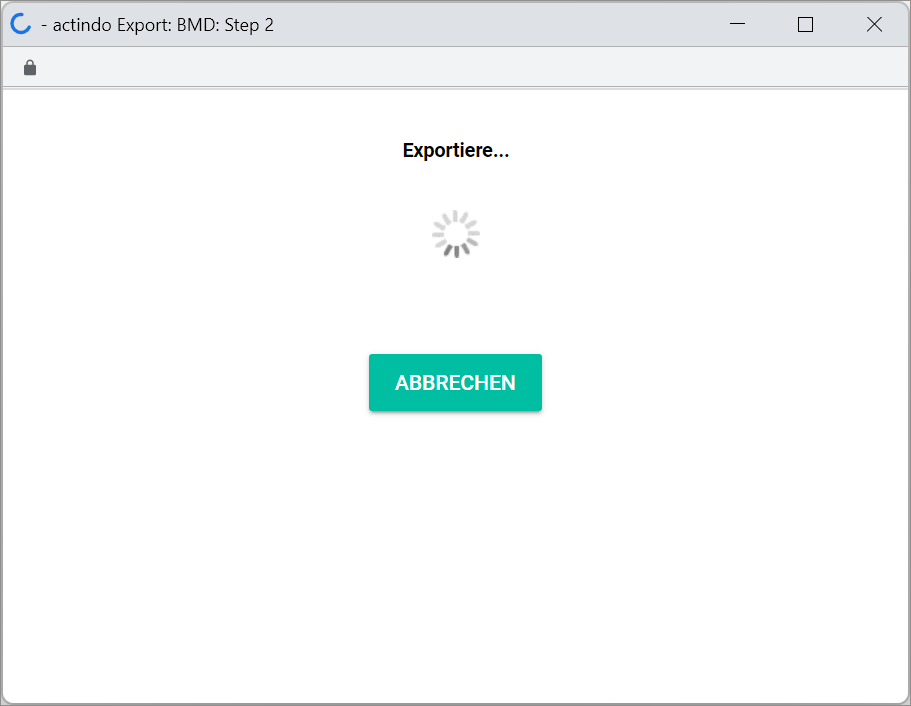

**Export...**

- [CANCEL]  
  Click this button to cancel the export process. This button is only displayed during the conversion process. button.  

> [Info] The *Export...* notice is displayed during the export process. As soon as the export is completed, the *Exported without error.* confirmation window is displayed. Click the [OK] button to continue. The *BMD: Step 3* window is displayed.

[comment]: <> (Nach einiger Sekunden bzw. kurz vor dem Step 3 ABBRECHEN Button ändert sich zu SCHLIESSEN, was nicht wirklich Sinn macht, denn man schließt tatsächlich das Fenster, also man bricht der Export ab.)

### BMD: Step 3

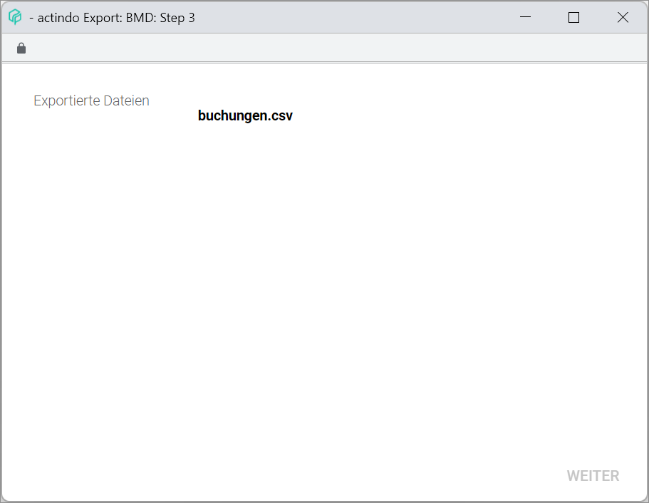

- *Exported files*  
  The exported file(s) are displayed. Click a file name to download the corresponding file. By default, the downloaded exported file is saved in the *Downloads* folder of your device.

- [CONTINUE]  
  Click this button to close the window.

[comment]: <> (WEITER/CONTINUE Button bei allen Exporten ausgegraut > CLOSE Button? --> Bug)

### BMD tax mapping

*Accounting > Extras > Tab EXPORT > Button BMD > Button Edit*

**Tax mapping**

The list displays all available BMD tax mappings. Depending on the settings, the displayed columns may vary. All fields are read-only.

- *Actindo tax control key*  
  Tax key as mapped in the Actindo system.

- *BMD tax code*  
  Tax key as mapped in the BMD system.

- *ID*   
  Tax mapping identification number. The ID number is automatically assigned by the system when the mapping is created.

[comment]: <> (Steuercode ist ein zweideutiger Term. Reden wir hier von "tax key" oder "control key"? Im System "tax control key" und "Steuercode". Vorsicht / RS FH dazu.)

- [x]   
  Select the checkbox of a tax mapping to edit or delete it. The *Edit* section is displayed in the bottom part of the window. If you select the checkbox in the header, all mappings in the list are selected.

[comment]: <> (not working. Only the last checkbox and the checkbox in the header are selected.)

- [CREATE]  
  Click this button to create a tax mapping. The *Add* section is displayed in the bottom part of the window.

- [DELETE]  
  Click this button to delete the selected tax mapping from the list.

-  (Refresh)  
  Click this button to update the list of tax mappings.

**Add/Edit**  

> [Info] When clicking the [CREATE] button, the *Add* section is displayed in the bottom part of the window.   
  When selecting a checkbox in the tax mapping list, the *Edit * section is displayed in the bottom part of the window and the corresponding tax mapping details are displayed in the drop-down lists.   
  The elements and the corresponding functions in the *Add* and the *Edit* section are identical.

- *Actindo*  
  Click the drop-down list to select the applicable tax control key in the Actindo system. All available tax control keys are displayed in the list.

- *BMD*  
  Click the drop-down list to select the applicable tax code in the BMD system. All available tax codes are displayed in the list.

- [SAVE]  
  Click this button to save any changes made. The tax mapping is displayed in the list of tax mappings in the upper part of the window.

- [CLEAR]  
  Click this button to reset both fields to their initial status.

## CSV

*Accounting > Extras > Tab EXPORT > Button CSV*

### CSV: Step 1

- *Fiscal year*  
Click the drop-down list to select the fiscal year to be exported.

- *Period*  
Specify the period to be exported.  

  - *Months*  
  Enter the month range to be exported.

  - *Journals*  
  Enter the journal range to be exported.

- *Selection*  
Click the applicable radio button to select the appropriate option:
  -  *Export all*
  -  *All from last export on (if last export exists, otherwise all)*
  - [x] *Set marker to export time*  
  Click the checkbox if time is to be exported.

[comment]: <> (Unsicher, RS mit FH)

- *File content*  
Click the drop-down list to select the applicable file content. The following options are available by default:

  - **Customers/suppliers**
  - **Chart of accounts**
  - **Postings**  

- *Export def.*  
Click the drop-down list to select the appropriate export definition. The options displayed vary depending on the option selected in the *File content* drop-down list. All available option-related export definitions are displayed in the list. The export definitions are preconfigured in the system but they can be edited.

- [Edit]  
Click this button to add, edit or delete an export definition. The *Import/export definitions* window is displayed, see [Import/export definitions](#importexport-definitions).

- *Export*  
Click the drop-down list to select the specific data to be exported. The following options are available:  

  - **Customer/suppliers**
  - **Customers only**
  - **Suppliers only**
  - **Custom**  
  When selecting this option, the *Selection from - to* fields are displayed.

- *Selection from - to*  
Enter the account number range to be exported. You can enter the account numbers manually with the keyboard or use the increase/decrease arrows.

- [CONTINUE]  
Click this button to proceed to the next step.

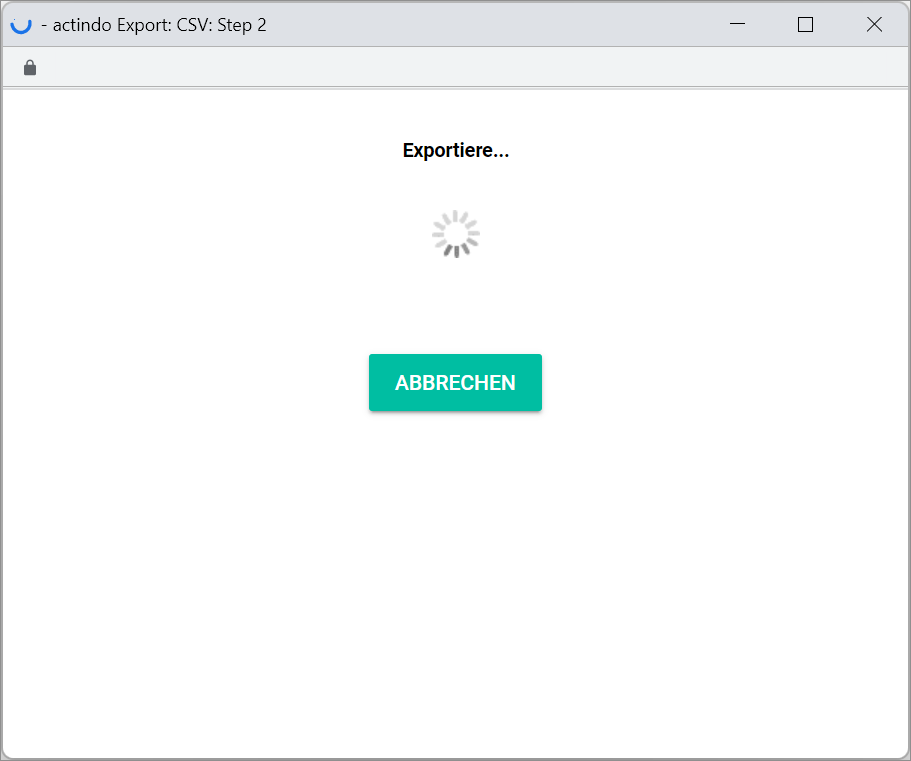

**Step 2**

- *Exporting*  
This notice is displayed during the export process.  

- [CANCEL]  
Click this button to cancel the process. After a few seconds, the [CANCEL] button changes to a [CLOSE] button.  

- [CLOSE]  
Click this button to close the window. This will cancel the export.    

A pop-up window confirms that the selected data have been exported correctly. Click the [OK] button to proceed to the next step.

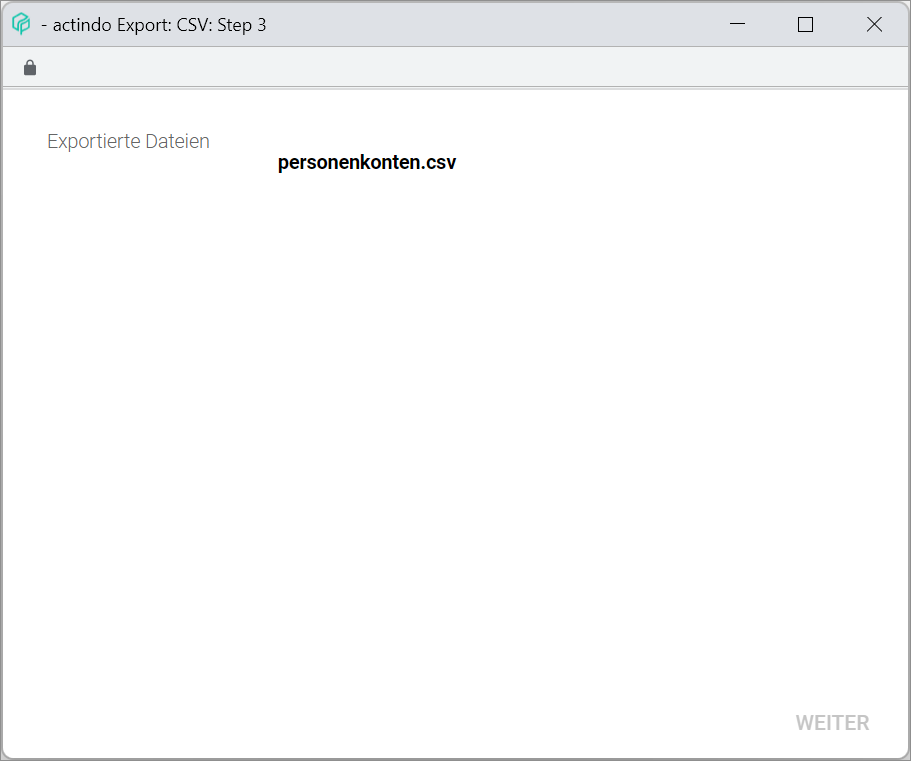

**Step 3**

- *Exported files*  
The exported file(s) are displayed and can be downloaded by clicking the file name(s). By default, the downloaded exported file(s) is saved in the *Downloads* folder of your device.

- [CONTINUE]  

[comment]: <> (WEITER/CONTINUE Button bei allen Exporten ausgegraut > CLOSE Button? --> Bug)

## DATEV CSV

*Accounting > Extras > Tab EXPORT > Button DATEV CSV*

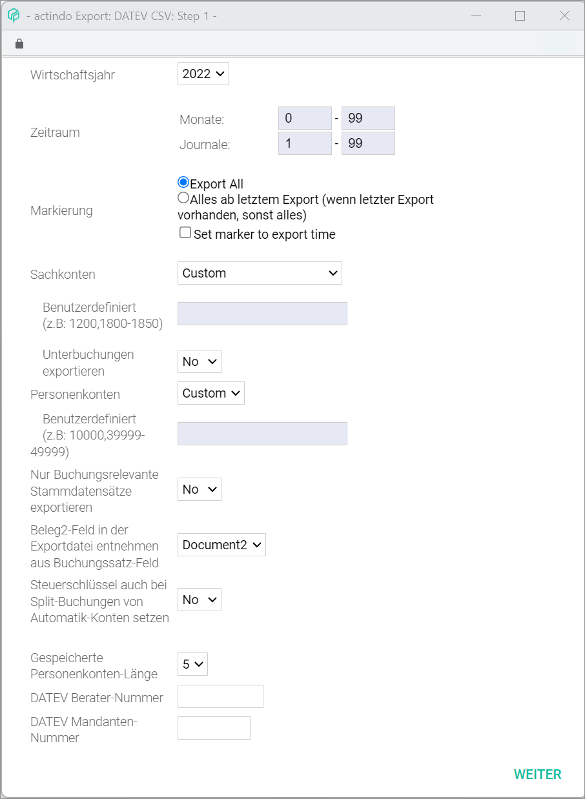

[comment]: <> (Screenshots zusammenfügen? RS HG)

For detailed information about exporting data for DATEV, see [Export the data for DATEV](../Operation/15_ProvideAccountingData.md#export-the-data-for-datev).

**Step 1**

- *Fiscal year*  
Click the drop-down list to select the fiscal year to be exported.

- *Period*  
Specify the period to be exported.  

  - *Months*  
  Enter the month range to be exported.

  - *Journals*  
  Enter the journal range to be exported.

- *Selection*  
Click the applicable radio button to select the appropriate option:
  -  *Export all*
  -  *All from last export on (if last export exists, otherwise all)*
  - [x] *Set marker to export time*  
  Click the checkbox if time is to be exported.

- *Impersonal accounts*  
Click the drop-down list to select the impersonal accounts to be exported. The following options are available:  

  - **Only individually changed**  
  - **All**  
  - **Custom**  
  When selecting this option, the *Custom (e.g. 1200, 1800-1850)* field is displayed.
  - **No**  

- *Custom (e.g. 1200, 1800-1850)*  
Enter an account number or an account number range to be exported.

- *Export subpostings*  
Click the drop-down list to select the appropriate option (**Yes/No**).

[comment]: <> (FH - Check was Unterbuchungen sind)

- *Personal accounts*  
Click the drop-down list to select the personal accounts to be exported. The following options are available:  

  - **Yes**  
  - **Custom**   
  When selecting this option, the *Custom (e.g. 10000, 39999-49999)* field is displayed.
  - **No**  

- *Custom (e.g. 10000, 39999-49999)*    
Enter an account number or an account number range to be exported.

- *Export only posting-relevant master data records*  
 Click the drop-down list to select the appropriate option (**Yes/No**).

- *Take Receipt 2 field in the export document from posting record field*  
Click the drop-down list to select the appropriate option. The following options are available:  

  - **Receipt 1**
  - **Receipt 2**
  - **Receipt 3**
  - **Receipt 4**

- *Add tax keys from automatic accounts also in split postings*  
Click the drop-down list to select the appropriate option (**Yes/No**).

- *Saved personal accounts length*  
Click the drop-down list to select the appropriate option. The account length refers to the number of character used to define personal accounts (5-9) and intends to avoid exporting incomplete account numbers.

- *DATEV advisor number*  
Enter the DATEV advisor number, if applicable.

- *DATEV client number*  
Enter the DATEV client  number, if applicable.

- [CONTINUE]  
Click this button to proceed to the next step.

**Step 2**

- *Exporting*  
This notice is displayed during the export process.  

- [CANCEL]  
Click this button to cancel the process. After a few seconds, the [CANCEL] button changes to a [CLOSE] button.  

- [CLOSE]  
Click this button to close the window. This will cancel the export.   

A pop-up window confirms that the selected data have been exported correctly. Click the [OK] button to proceed to the next step.

**Step 3**

- *Exported files*  
The exported file(s) are displayed and can be downloaded by clicking the file name(s). By default, the downloaded exported file(s) is saved in the *Downloads* folder of your device.

- [CONTINUE]  

[comment]: <> (WEITER/CONTINUE Button bei allen Exporten ausgegraut > CLOSE Button? --> Bug)

## GDI

*Accounting > Extras > Tab EXPORT > Button GDI*

**Step 1**

- *Fiscal year*  
Click the drop-down list to select the fiscal year to be exported.

- *Period*  
Specify the period to be exported.  

  - *Months*  
  Enter the month range to be exported.

  - *Journals*  
  Enter the journal range to be exported.

- *Impersonal accounts*  
Click the drop-down list to select the impersonal accounts to be exported. The following options are available:  

  - **Only individually changed**  
  - **All**  
  - **No**  

- *Personal accounts*  
Click the drop-down list and select the appropriate option (**Yes/No**).

- [CONTINUE]  
Click this button to proceed to the next step.

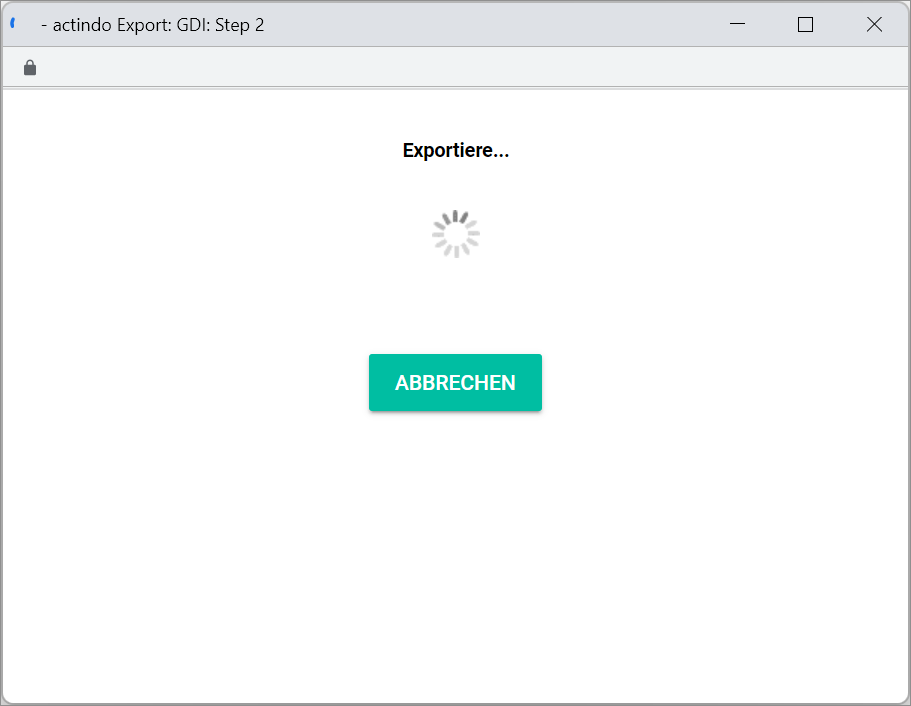

**Step 2**

- *Exporting*  
This notice is displayed during the export process.  

- [CANCEL]  
Click this button to cancel the process. After a few seconds, the [CANCEL] button changes to a [CLOSE] button.  

- [CLOSE]  
Click this button to close the window. This will cancel the export.   

A pop-up window confirms that the selected data have been exported correctly. Click the [OK] button to proceed to the next step.

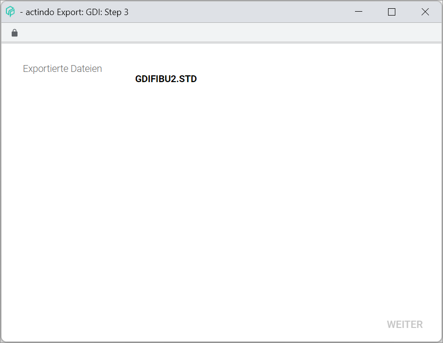

**Step 3**

- *Exported files*  
The exported file(s) are displayed and can be downloaded by clicking the file name(s). By default, the downloaded exported file(s) is saved in the *Downloads* folder of your device.

- [CONTINUE]  

[comment]: <> (WEITER/CONTINUE Button bei allen Exporten ausgegraut > CLOSE Button? --> Bug)

## GDPdU export

*Accounting > Extras > Tab EXPORT > Button GDPDU EXPORT*

 For detailed information about exporting data in GDPdU-compliant audit file format, see [Export the data GDPdU-compliant](../Operation/15_ProvideAccountingData.md#export-the-data-GDPdU-compliant).

**Step 1**

- *Fiscal year*  
Click the drop-down list to select the fiscal year to be exported.

- *Period*  
Specify the period to be exported.  

  - *Months*  
  Enter the month range to be exported.

  - *Journals*  
  Enter the journal range to be exported.

- *Personal accounts*  
Click the drop-down list and select the appropriate option (**Yes/No**).

- *Export only posting-relevant master data records*  
 Click the drop-down list to select the appropriate option (**Yes/No**).

- *Saved personal accounts length*  
Click the drop-down list to select the appropriate option. The account length refers to the number of character used to define personal accounts (5-9) and intends to avoid exporting incomplete account numbers.

- *DATEV advisor number*  
Enter the DATEV advisor number, if applicable.

- *DATEV client number*  
Enter the DATEV client  number, if applicable.

- [CONTINUE]  
Click this button to proceed to the next step.

**Step 2**

- *Exporting*  
This notice is displayed during the export process.  

- [CANCEL]  
Click this button to cancel the process. After a few seconds, the [CANCEL] button changes to a [CLOSE] button.  

- [CLOSE]  
Click this button to close the window. This will cancel the export.   

A pop-up window confirms that the selected data have been exported correctly. Click the [OK] button to proceed to the next step.

**Step 3**

- *Exported files*  
The exported file(s) are displayed and can be downloaded by clicking the file name(s). By default, the downloaded exported file(s) is saved in the *Downloads* folder of your device.

- [CONTINUE]  

[comment]: <> (WEITER/CONTINUE Button bei allen Exporten ausgegraut > CLOSE Button? --> Bug)

## Open items

*Accounting > Extras > Tab EXPORT > Button OPEN ITEMS*

**Step 1**

- *Fiscal year*  
Click the drop-down list to select the fiscal year to be exported.

- *Period*  
Specify the period to be exported.  

  - *Months*  
  Enter the month range to be exported.

  - *Journals*  
  Enter the journal range to be exported.

- *Selection*  
Click the applicable radio button to select the appropriate option:
  -  *Export all*
  -  *All from last export on (if last export exists, otherwise all)*
  - [x] *Set marker to export time*  
  Click the checkbox if time is to be exported.

- *Items*  
Click the drop-down list to select the items to be exported. The following options are available:

  - **Open items**
  - **Paid items**
  - **Open and paid items**

- *File content*  
Click the drop-down list to select the applicable file content. The following options are available:

  - **Customers/suppliers**
  - **Chart of accounts**
  - **Postings**  

- *Export def.*  
Click the drop-down list to select the appropriate export definition. The export definitions are preconfigured in the system but can be edited. All created export definitions are displayed in the drop-down list.

- [Edit]  
Click this button to add, edit or delete an export definition. The *Import/export definitions* window is displayed, see [Import/export definitions](#importexport-definitions).

- [CONTINUE]  
Click this button to proceed to the next step.

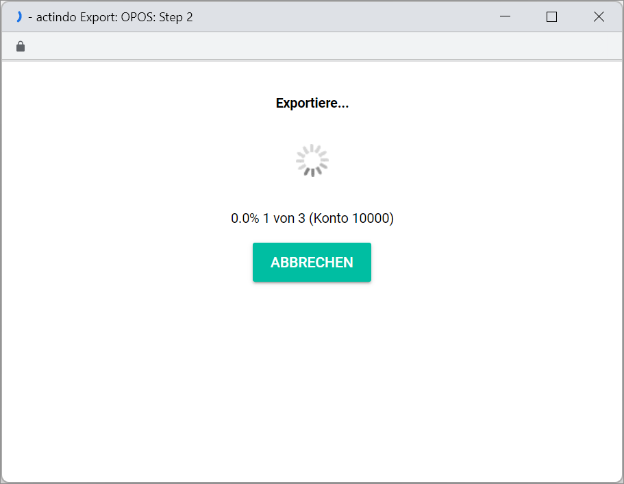

**Step 2**

- *Exporting*  
This notice is displayed during the export process.  

- [CANCEL]  
Click this button to cancel the process. After a few seconds, the [CANCEL] button changes to a [CLOSE] button.  

- [CLOSE]  
Click this button to close the window. This will cancel the export.   

A pop-up window confirms that the selected data have been exported correctly. Click the [OK] button to proceed to the next step.

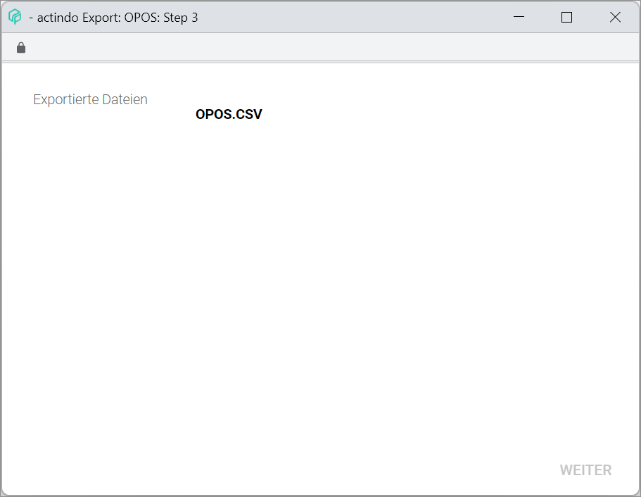

**Step 3**

- *Exported files*  
The exported file(s) are displayed and can be downloaded by clicking the file name(s). By default, the downloaded exported file(s) is saved in the *Downloads* folder of your device.

- [CONTINUE]  

[comment]: <> (WEITER/CONTINUE Button bei allen Exporten ausgegraut > CLOSE Button? --> Bug)

## Balance lists

*Accounting > Extras > Tab EXPORT > Button BALANCE LISTS*

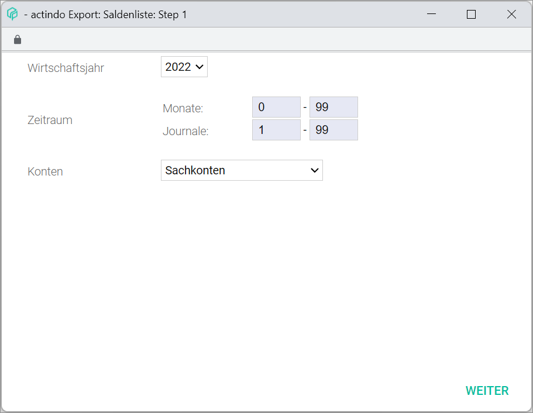

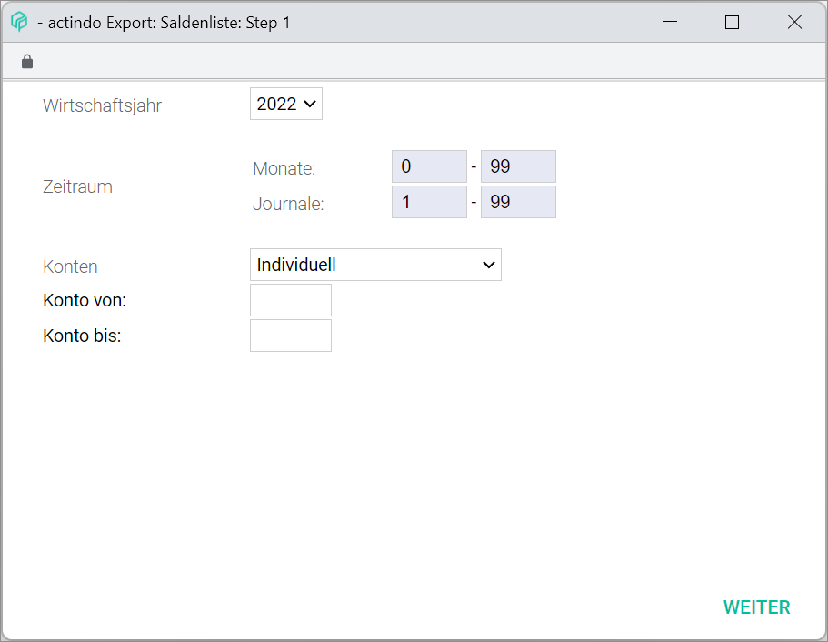

**Step 1**

- *Fiscal year*  
Click the drop-down list to select the fiscal year to be exported.

- *Period*  
Specify the period to be exported.  

  - *Months*  
  Enter the month range to be exported.

  - *Journals*  
  Enter the journal range to be exported.

- *Accounts*  
Click the drop-down list to select the accounts to be exported. The following options are available:  
  - **Impersonal accounts**  
  - **Customers (10000-69999)**  
  - **Suppliers (70000-99999)**  
  - **Custom**  
    When selecting this option, the *Account from* and *Account to* fields are displayed.

- *Account from*  - *Account to*  
Enter the account number range to be exported.

- [CONTINUE]  
Click this button to proceed to the next step.

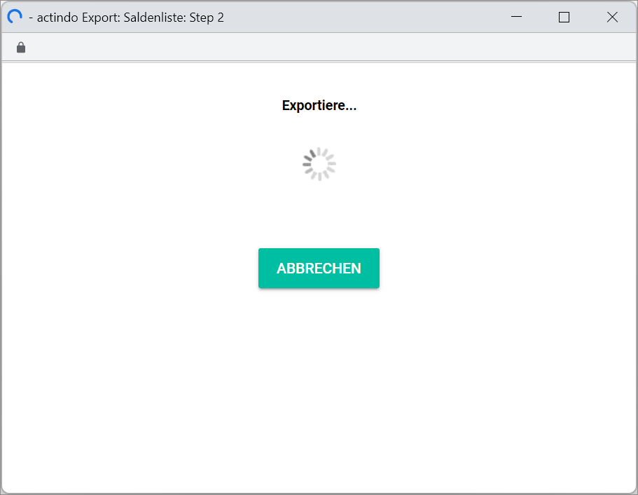

**Step 2**

- *Exporting*  
This notice is displayed during the export process.  

- [CANCEL]  
Click this button to cancel the process. After a few seconds, the [CANCEL] button changes to a [CLOSE] button.  

- [CLOSE]  
Click this button to close the window. This will cancel the export.   

A pop-up window confirms that the selected data have been exported correctly. Click the [OK] button to proceed to the next step.

**Step 3**

- *Exported files*  
The exported file(s) are displayed and can be downloaded by clicking the file name(s). By default, the downloaded exported file(s) is saved in the *Downloads* folder of your device.

- [CONTINUE]  

[comment]: <> (WEITER/CONTINUE Button bei allen Exporten ausgegraut > CLOSE Button? --> Bug)

## SALDEN.DAT

*Accounting > Extras > Tab EXPORT > Button SALDEN.DAT*

**Step 1**

- *Fiscal year*  
Click the drop-down list to select the fiscal year to be exported.

- *Period*  
Specify the period to be exported.  

  - *Months*  
  Enter the month range to be exported.

  - *Journals*  
  Enter the journal range to be exported.

- *Impersonal accounts*  
Click the drop-down list to select the impersonal accounts to be exported. The following options are available:  

  - **Only individually changed**  
  - **All**  
  - **No**  

- *Personal accounts*  
Click the drop-down list to select the appropriate option (**Yes/No**).

- [CONTINUE]  
Click this button to proceed to the next step.

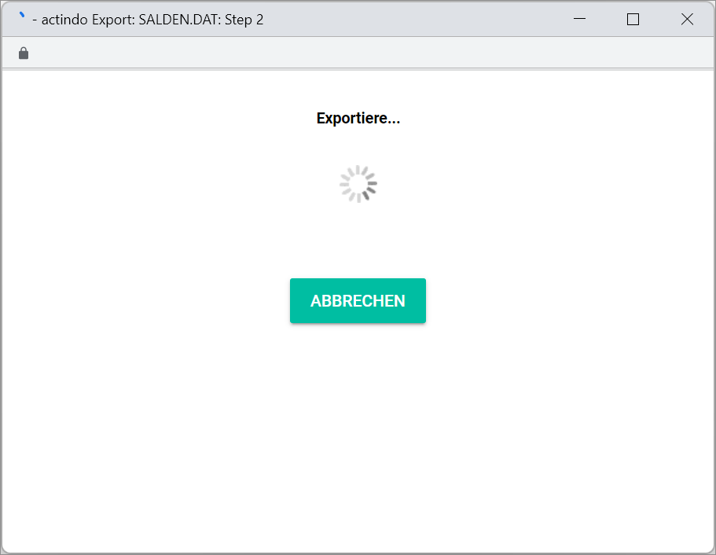

**Step 2**

- *Exporting*  
This notice is displayed during the export process.  

- [CANCEL]  
Click this button to cancel the process. After a few seconds, the [CANCEL] button changes to a [CLOSE] button.  

- [CLOSE]  
Click this button to close the window. This will cancel the export.   

A pop-up window confirms that the selected data have been exported correctly. Click the [OK] button to proceed to the next step.

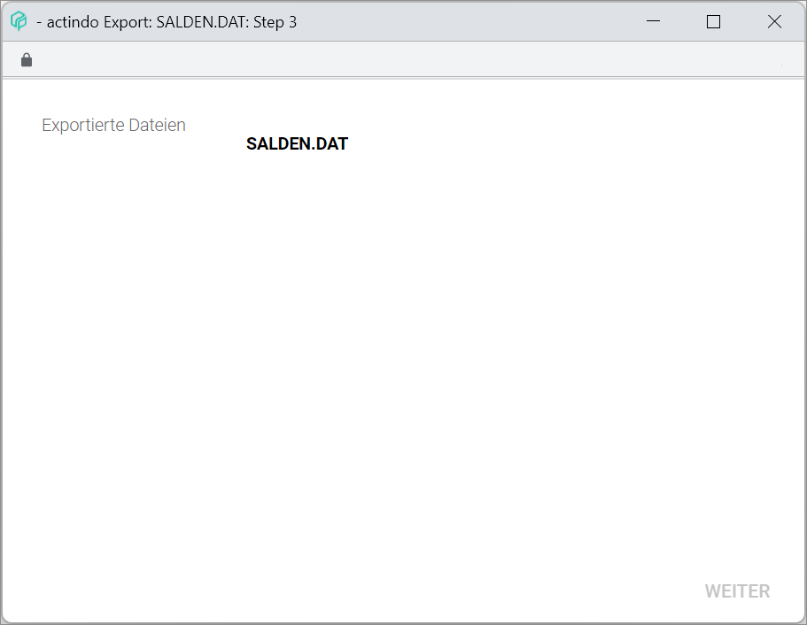

**Step 3**

- *Exported files*  
The exported file(s) are displayed and can be downloaded by clicking the file name(s). By default, the downloaded exported file(s) is saved in the *Downloads* folder of your device.

- [CONTINUE]  

[comment]: <> (WEITER/CONTINUE Button bei allen Exporten ausgegraut > CLOSE Button? --> Bug)

## SAP

*Accounting > Extras > Tab EXPORT > Button SAP*

**Step 1**

- *Fiscal year*  
Click the drop-down list to select the fiscal year to be exported.

- *Period*  
Specify the period to be exported.  

  - *Months*  
  Enter the month range to be exported.

  - *Journals*  
  Enter the journal range to be exported.

- *Selection*  
Click the applicable radio button to select the appropriate option:
  -  *Export all*
  -  *All from last export on (if last export exists, otherwise all)*
  - [x] *Set marker to export time*  
  Click the checkbox if time is to be exported.

- *Creation from*  
Enter a start creation date for the postings to be exported.

- *Creation to*  
Enter an end creation date for the postings to be exported.

- [CONTINUE]  
Click this button to proceed to the next step.

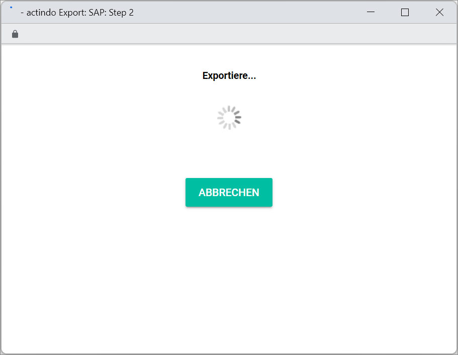

**Step 2**

- *Exporting*  
This notice is displayed during the export process.  

- [CANCEL]  
Click this button to cancel the process. After a few seconds, the [CANCEL] button changes to a [CLOSE] button.  

- [CLOSE]  
Click this button to close the window. This will cancel the export.   

A pop-up window confirms that the selected data have been exported correctly. Click the [OK] button to proceed to the next step.

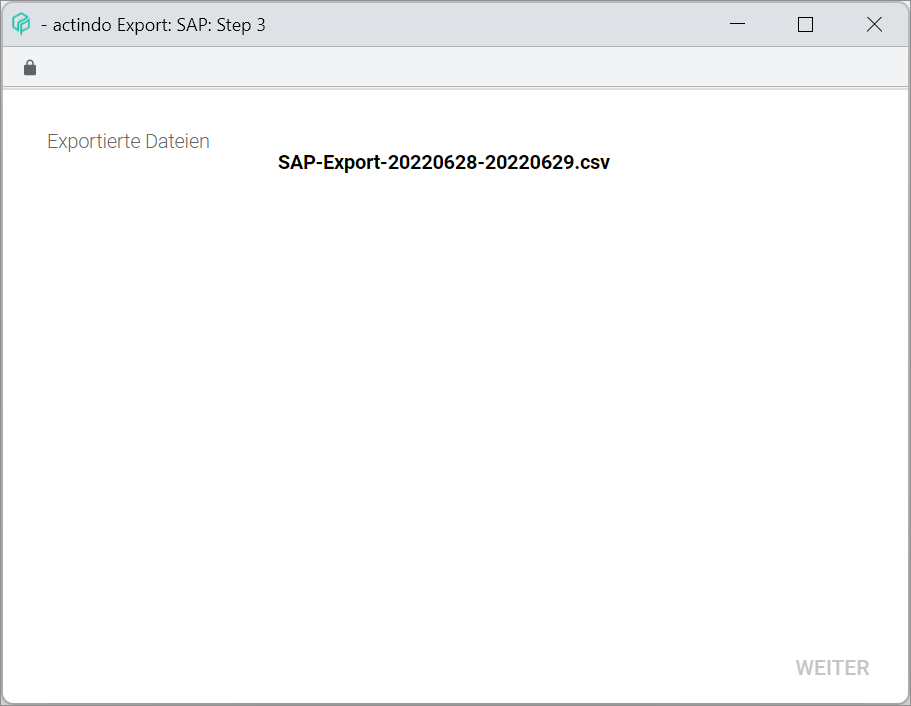

**Step 3**

- *Exported files*  
The exported file(s) are displayed and can be downloaded by clicking the file name(s). By default, the downloaded exported file(s) is saved in the *Downloads* folder of your device.

- [CONTINUE]  

[comment]: <> (WEITER/CONTINUE Button bei allen Exporten ausgegraut > CLOSE Button? --> Bug)

## Varial

*Accounting > Extras > Tab EXPORT > Button VARIAL*

**Step 1**

- *Fiscal year*  
Click the drop-down list to select the fiscal year to be exported.

- *Period*  
Specify the period to be exported.  

  - *Months*  
  Enter the month range to be exported.

  - *Journals*  
  Enter the journal range to be exported.

- *Date from*   
Enter a start date for the postings to be exported.

- *Date to*  
Enter an end date for the postings to be exported.

- *File suffix*  
Enter a file suffix, if applicable. Only numbers can be used.

[comment]: <> (FH Info fehlt über VARIAL Datei-Suffix. Nichts gefunden.)

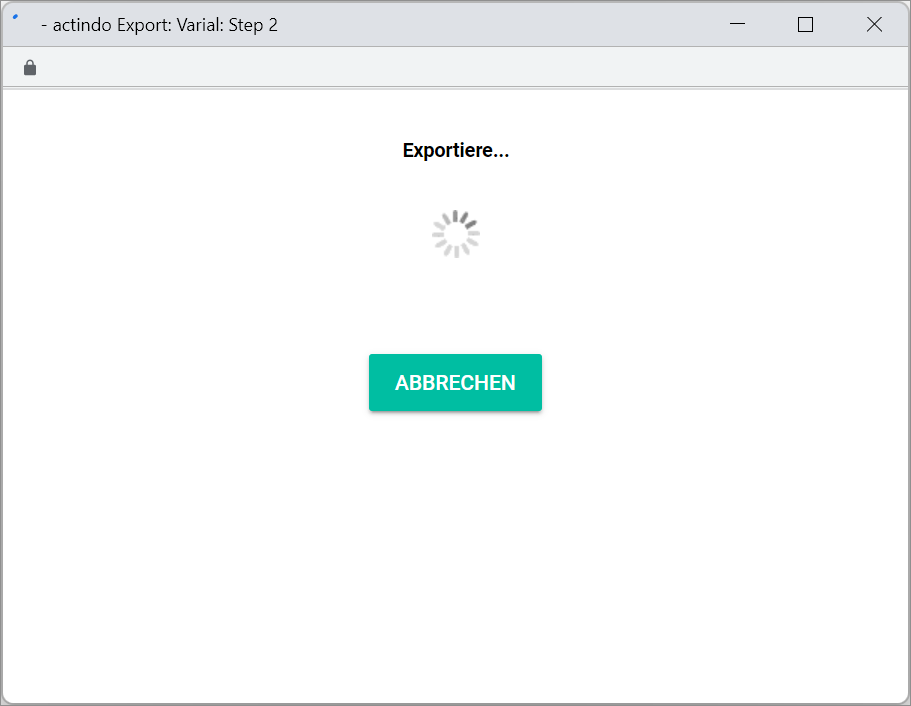

**Step 2**

- *Exporting*  
This notice is displayed during the export process.  

- [CANCEL]  
Click this button to cancel the process. After a few seconds, the [CANCEL] button changes to a [CLOSE] button.  

- [CLOSE]  
Click this button to close the window. This will cancel the export.   

A pop-up window confirms that the selected data have been exported correctly. Click the [OK] button to proceed to the next step.

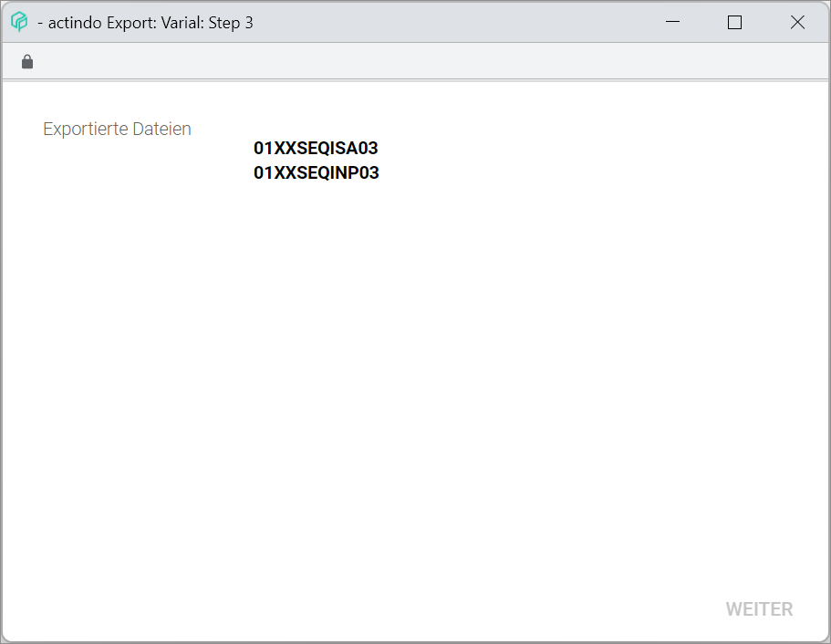

**Step 3**

- *Exported files*  
The exported file(s) are displayed and can be downloaded by clicking the file name(s). By default, the downloaded exported file(s) is saved in the *Downloads* folder of your device.

- [CONTINUE]  

[comment]: <> (WEITER/CONTINUE Button bei allen Exporten ausgegraut > CLOSE Button? --> Bug)

## Zahlwerk

*Accounting > Extras > Tab EXPORT > Button ZAHLWERK*

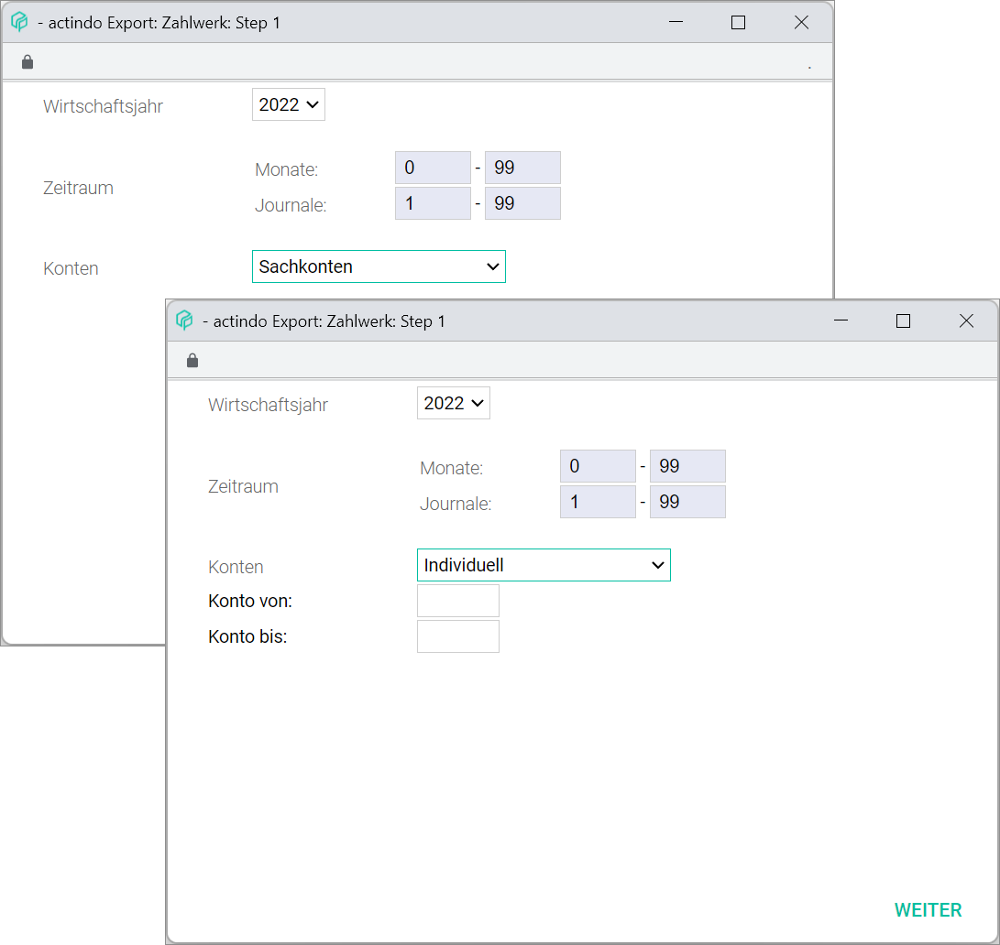

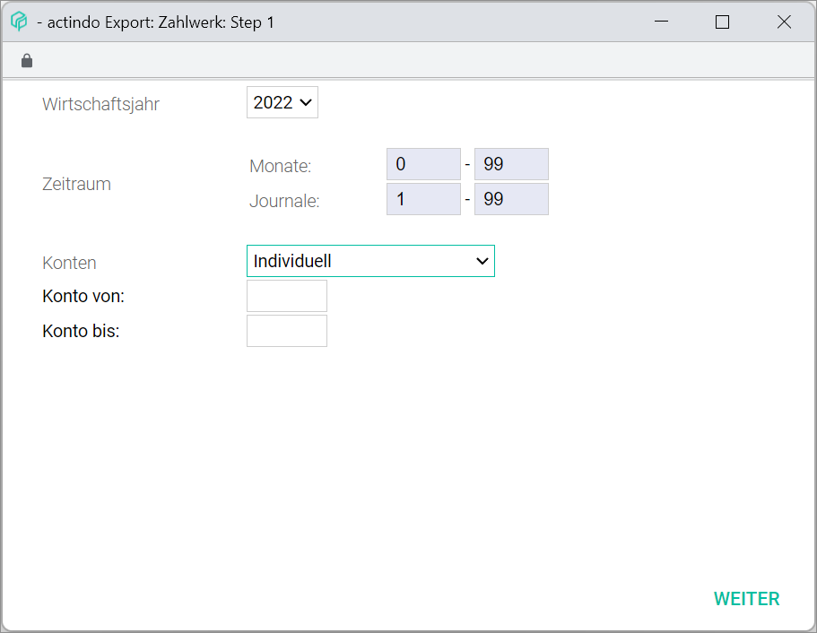

**Step 1**

- *Fiscal year*  
Click the drop-down list to select the fiscal year to be exported.

- *Period*  
Specify the period to be exported.  

  - *Months*  
  Enter the month range to be exported.

  - *Journals*  
  Enter the journal range to be exported.

- *Accounts*  
Click the drop-down list to select the accounts to be exported. The following options are available:  
  - **Impersonal accounts**  
  - **Customers (10000-69999)**  
  - **Suppliers (70000-99999)**  
  - **Custom**  
    When selecting this option, the *Account from* and *Account to* fields are displayed.

- *Account from*  - *Account to*  
Enter the account number range to be exported.

- [CONTINUE]  
Click this button to proceed to the next step.

**Step 2**

- *Exporting*  
This notice is displayed during the export process.  

- [CANCEL]  
Click this button to cancel the process. After a few seconds, the [CANCEL] button changes to a [CLOSE] button.  

- [CLOSE]  
Click this button to close the window. This will cancel the export.   

A pop-up window confirms that the selected data have been exported correctly. Click the [OK] button to proceed to the next step.

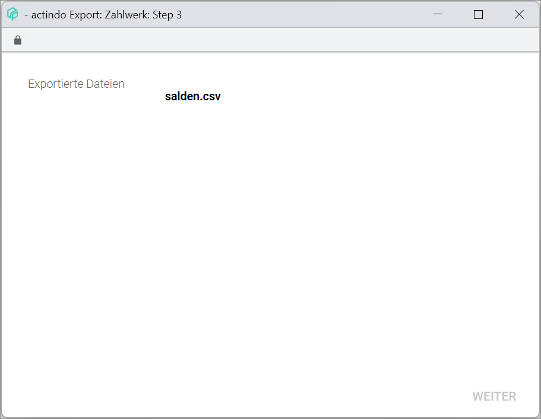

**Step 3**

- *Exported files*  
The exported file(s) are displayed and can be downloaded by clicking the file name(s). By default, the downloaded exported file(s) is saved in the *Downloads* folder of your device.

- [CONTINUE]  

[comment]: <> (WEITER/CONTINUE Button bei allen Exporten ausgegraut > CLOSE Button? --> Bug)

### BMD tax mapping

*Accounting > Extras > Tab EXPORT > Select BMD > Button Edit*

**Tax mapping**

- *Actindo tax key*  
Tax key as mapped in the Actindo system.

- *BMD tax key*  
Tax key as mapped in the BMD system.

[comment]: <> (Steuercode ist ein zweideutiger Term. Reden wir hier von "tax key" oder "control key"? Im System "tax control key" und "Steuercode". Vorsicht / RS FH dazu.)

- [Checkbox]  
Select the checkbox to edit or delete a tax key. The *Edit* section is displayed.

- [CREATE]  
Click this button to create a tax key. The *Add* section is displayed.

- [DELETE]  
Click this button to delete a selected tax key from the list.

-  (Refresh)  
Click this button to refresh the list after making any changes.

**Add/Edit**  

> [Info] When clicking the [CREATE] button, the *Add* section is displayed. When marking a checkbox from the tax key list, the tax key details are displayed in the entry fields, where they can be edited. The *Add* section name changes to *Edit*.

- *Actindo*  
Click the drop-down list to select the applicable tax sort in the Actindo system.

- *BMD*  
Click the drop-down list to select the applicable tax sort in the BMD system.

- [SAVE]  
Click this button to save any changes made.

- [CLEAR]  
Click this button to reset both fields to their initial status.

### Import/export definitions

*Accounting > Extras > Tab EXPORT > Select export > Select Export-Def. > Button Edit*

**Name**

- (Drop-down list)  
Click the drop-down list to select a preconfigured import/export definition type. If there are any available, the second drop-down list displays the preconfigured definitions of the selected type.

[comment]: <> (FH Bedeutung von Asterisk neben Namen?)

- (Drop-down list)  
Click the drop-down list to select the desired preconfigured import/export definition.

- [ADD]  
Click this button to create an import/export definition. The *New import/export definition* window is displayed, see [New import/export definition](#new-importexport-definition).

- [EDIT]  
Click this button to rename an import/export definition. The *Rename import/export definition* window is displayed, see [Rename import/export definition](#rename-importexport-definition).

- [DELETE]  
Click this button to delete an import/export definition. A confirmation window is displayed.

**Fields in the definition**  
This list displays all fields contained in the selected import/export definition. Use the arrow buttons to modify the fields in the list:

  -  (Up)  
  Use this button to move a selected field up in the list.

  -  (Down)  
  Use this button to move a selected field down in the list.

  -  (Left)  
  Use this button to move a selected field left, from the *Possible fields* list to the *Fields in the definition* list.

  -  (Right)  
  Use this button to move a selected field right, from the *Fields in the definition* list to the *Possible fields* list.

**Column**  
The letter and number in parentheses indicate the column where a selected field is placed.

**Possible fields**  
This list displays all fields available for the selected import/export definition.

[INSERT IGNORE FIELD]  
Click this button to add an "ignore field" command, that is, to indicate that the field in that position does not need to be exported or imported, in the *Fields in the definition* list.

**CSV format definition**

- *Field separating character*  
Enter the character to be used to separate fields. This value may be set by default to comma or semicolon.

- *Escape character*  
Enter the character to be used in escape sequences, that is, combinations of characters used to represent non-printable and special characters, such as tabs or new lines. This value may be set by default to backslash.

- *Column name*  
Click the drop-down list to select the appropriate option (**Yes/No**) to include or not the column name in the export/import.

- *Date format*  
Click the drop-down list to select the desired date and time format.

- *Example data set*  
An example of a data set with the current field definition is displayed. This field is read-only.

- *Field delimiting character*  
Enter the character to be used to separate fields. This value may be set by default to quotation mark.

- *Row end character*  
Click the drop-down list to select the applicable encoding. This field is set by default to **Automatic**.

- *Character set*  
Click the drop-down list to select the applicable encoding. This field is set by default to **Automatic**.

- *Incorrect row end character*  
Click the drop-down list to select the appropriate option (**Ignore/Repair**).

- *Number format*  
Click the drop-down list to select the desired number format.

- [SAVE]  
Click this button to save the changes.

#### New import/export definition  

*Accounting > Extras > Tab EXPORT > Select export > Select Export-Def. > Button Edit > Button Add*

- *For*  
Click the drop-down list to select the import/export definition type where the new definition will be added.  

- *Name*  
Enter a name for the new import/export definition to be created.

- [SAVE & NEW]  
Click this button to create a new import/export definition.  

#### Rename import/export definition  

*Accounting > Extras > Tab EXPORT > Select export > Select Export-Def. > Button Edit > Button Edit*

- *For*  
Click the drop-down list to select the import/export definition type where the new definition will be renamed.  

- *Old name*  
The previously given name is displayed. This field is read-only.

- *New name*  
Enter a new name for the selected import/export definition.

- [SAVE]  
Click this button to rename the selected import/export definition.  
