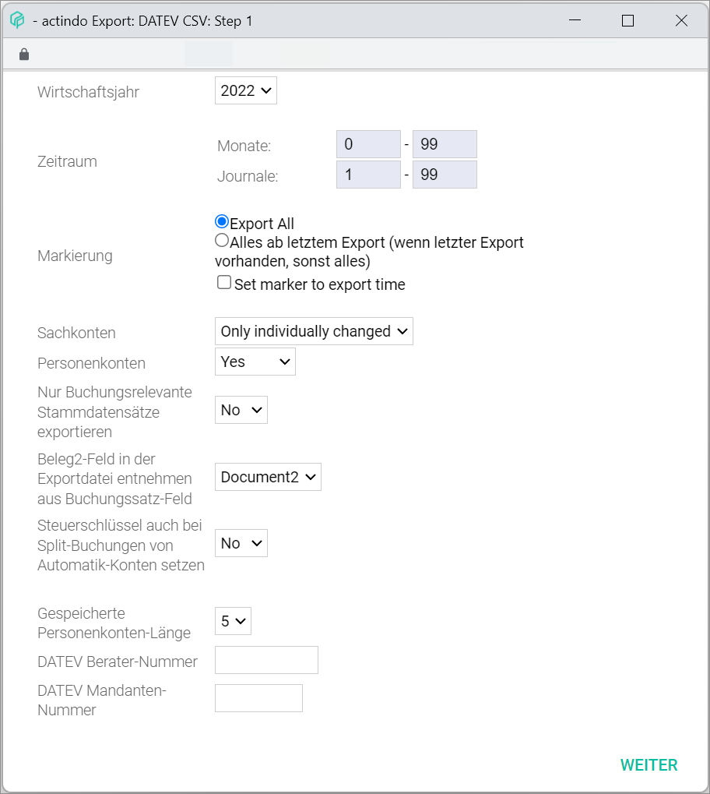
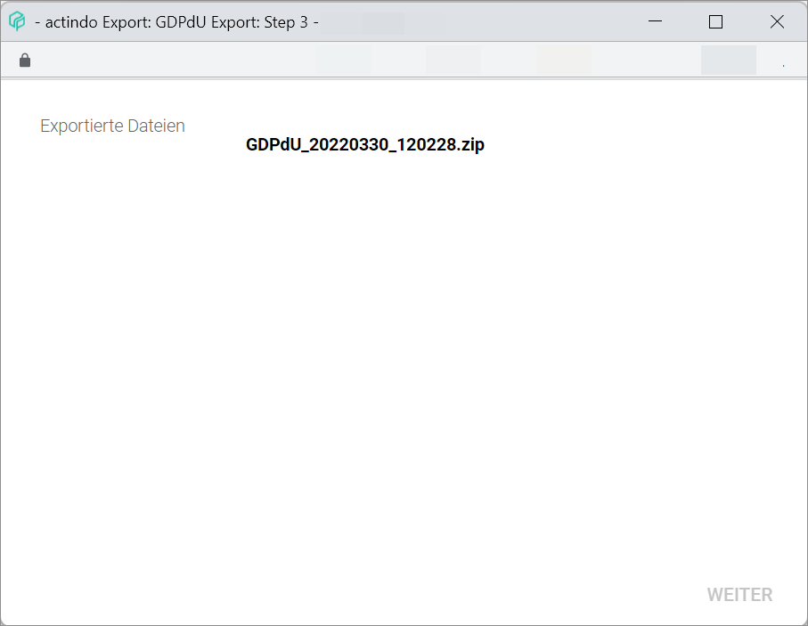

[!!User interface Fiscal years](./02d_FiscalYears.md)
[!!User interface CSV format definitions](./03c_CSVFormatDef.md)
[!!Provide the accounting data](../Operation/15_ProvideAccountingData.md)

# Export

*Accounting > Extras > Tab EXPORT*

> [Info] This tab can also be accessed via the *Export postings* window from the [FISCAL YEARS](./02d_FiscalYears.md#export-postings) tab in the user interface.

**Export to:**  

The following export options are displayed in the tab:
  - *Export of data in BMD format*
  - *Export of data in CSV format*
  - *Export of data in DATEV CSV format*
  - *Export of data in GDI standard interface format*
  - *Export of data in GDPdU format*
  - *Export of open items*
  - *Export of balance list in CSV format*
  - *Compeso SALDEN.DAT*
  - *Export postings for SAP*
  - *Varial balances*
  - *Export of balance list in CSV format (Zahlwerk)*

- [BMD]  
    Click this button to export data in BMD format. The *BMD* window is displayed, see [BMD](#bmd).

- [CSV]  
    Click this button to export data in CSV format. The *CSV* window is displayed, see [CSV](#csv).

- [DATEV CSV]  
    Click this button to export data in DATEV compatible CSV format. The *DATEV CSV* window is displayed, see [DATEV CSV](#datev-csv) .   
    For detailed information about exporting data in DATEV compatible CSV format, see [Export the data for DATEV](../Operation/15_ProvideAccountingData.md#export-the-data-for-DATEV).

- [GDI]  
    Click this button to export data in GDI format. The *GDI* window is displayed, see [GDI](#gdi).

- [GDPDU EXPORT]  
    Click this button to export data in GDPdU-compliant audit file format. The *GDPDU export* window is displayed, see [GDPDU export](#gdpdu-export) .   
    For detailed information about exporting data in GDPdU-compliant audit file format, see [Export the data GDPdU-compliant](../Operation/15_ProvideAccountingData.md#export-the-data-GDPdU-compliant).

- [OPEN ITEMS]  
    Click this button to export open items. The *Open items* window is displayed, see [Open items](#open-items).

- [BALANCE LIST]  
    Click this button to export balance list in CSV format. The *Balance list* window is displayed, see [Balance list](#balance-list).

- [SALDEN.DAT]  
    Click this button to export data in Compeso SALDEN.DAT proprietary format. The *SALDEN.DAT* window is displayed,see [SALDEN.DAT](#saldendat).

- [SAP]  
    Click this button to export data in SAP compatible format. The *SAP* window is displayed, see [SAP](#sap).

- [VARIAL]  
    Click this button to export data in VARIAL compatible format. The *Varial* window is displayed, see [Varial](#varial).

- [ZAHLWERK]  
    Click this button to export balance list in Zahlwerk compatible CSV format. The *Zahlwerk* window is displayed, see [Zahlwerk](#zahlwerk).

## BMD

*Accounting > Extras > Tab EXPORT > Button BMD*

### BMD: Step 1

- *Fiscal year*  
    Click the drop-down list to select the fiscal year to be exported. All available fiscal years are displayed in the list.

- *Period*  
    Specify the period to be exported.  
    - *Months*  
        Enter the month range to be exported. If you want to select only a single month, select the same month in both fields.
    - *Journals*  
        Enter the journal range to be exported. If you want to select only a single journal, select the same journal in both fields.

- *Tax mapping*  
    The tax mapping is predefined in the system. The mappings can be defined or edited by clicking the [Edit] button.

- [Edit]  
    Click this button to edit the tax mapping. The *BMD tax mapping* window is displayed, see [BMD tax mapping](#bmd-tax-mapping).

- [CONTINUE]  
    Click this button to proceed to the next step. The *BMD: Step 2* window is displayed. The *Export...* notice is displayed during the export process.

### BMD: Step 2

**Export...**

- [CANCEL]  
    Click this button to cancel the export process. This button is only displayed during the export process.  

> [Info] The *Export...* notice is displayed during the export process. As soon as the export is completed, the *Exported without error.* confirmation window is displayed. Click the [OK] button to continue. The *BMD: Step 3* window is displayed.

[comment]: <> (Nach einiger Sekunden bzw. kurz vor dem Step 3 ABBRECHEN Button ändert sich zu SCHLIESSEN, was nicht wirklich Sinn macht, denn man schließt tatsächlich das Fenster, also man bricht der Export ab.)

### BMD: Step 3

- *Exported files*  
    The exported file(s) are displayed. Click a file name to download the corresponding file. By default, the downloaded exported file is saved in the *Downloads* folder of your device.

- [CONTINUE]  
    Click this button to close the window.

[comment]: <> (WEITER/CONTINUE Button bei allen Exporten ausgegraut > CLOSE Button? --> Bug)

### BMD tax mapping

*Accounting > Extras > Tab EXPORT > Button BMD > Button Edit*

**Tax mapping**

The list displays all available BMD tax mappings. Depending on the settings, the displayed columns may vary. All fields are read-only.

- *Actindo tax control key*  
    Tax key as mapped in the Actindo system.

- *BMD tax code*  
    Tax key as mapped in the BMD system.

- *ID*   
    Tax mapping identification number. The ID number is automatically assigned by the system when the mapping is created.

[comment]: <> (Steuercode ist ein zweideutiger Term. Reden wir hier von "tax key" oder "control key"? Im System "tax control key" und "Steuercode".)

- [x]   
    Select the checkbox of a tax mapping to edit or delete it. The *Edit* section is displayed in the bottom part of the window. If you select the checkbox in the header, all mappings in the list are selected.

[comment]: <> (not working. Only the last checkbox and the checkbox in the header are selected.)

- [CREATE]  
    Click this button to create a tax mapping. The *Add* section is displayed in the bottom part of the window.

- [DELETE]  
    Click this button to delete the selected tax mapping from the list.

-  (Refresh)  
    Click this button to update the list of tax mappings.

**Add/Edit**  

> [Info] When clicking the [CREATE] button, the *Add* section is displayed in the bottom part of the window. When selecting a checkbox in the tax mapping list, the *Edit * section is displayed in the bottom part of the window and the corresponding tax mapping details are displayed in the drop-down lists. The elements and the corresponding functions in the *Add* and the *Edit* section are identical.

- *Actindo*  
    Click the drop-down list to select the applicable tax control key in the Actindo system. All available tax control keys are displayed in the list.

- *BMD*  
    Click the drop-down list to select the applicable tax code in the BMD system. All available tax codes are displayed in the list.

- [SAVE]  
    Click this button to save any changes made. The tax mapping is displayed in the list of tax mappings in the upper part of the window.

- [CLEAR]  
    Click this button to reset both fields to their initial status.

## CSV

*Accounting > Extras > Tab EXPORT > Button CSV*

### CSV: Step 1

- *Fiscal year*  
    Click the drop-down list to select the fiscal year to be exported. All available fiscal years are displayed in the list.

- *Period*  
    Specify the period to be exported.  
    - *Months*  
        Enter the month range to be exported. If you want to select only a single month, select the same month in both fields.
    - *Journals*  
        Enter the journal range to be exported. If you want to select only a single journal, select the same journal in both fields.

- *Selection*  
    Select the applicable export options:
    -  *Export all*   
        Select this radio button to export all data.
    -  *All from last export on (if last export exists, otherwise all)*   
        Select this radio button to export only the data since the last export. If no export exists, all data will be exported.
    - [x] *Set marker to export time*  
        Select the checkbox to export the time.

- *File content*  
    Click the drop-down list to select the applicable file content. The following options are available:
    - **Customers/suppliers**
    - **Chart of accounts**
    - **# Postings**  

    Depending on the selected option, the following displayed fields and options vary.

- *Export def.*  
    Click the drop-down list to select the appropriate export definition. The options displayed vary depending on the option selected in the *File content* drop-down list. All available export definitions are displayed in the list. If the **Customers/suppliers** option is selected in the *File content* drop-down list, the following options are predefined:
    - **\* Lexware Pro (Customers)**	 
    - **\* Lexware Pro (Suppliers)**

    For the other options in the *File content* drop-down list, no export definitions are predefined. The export definitions can be defined or edited by clicking the [Edit] button to the right of the drop-down list.

- [Edit]  
    Click this button to edit the selected export definition or to create a new one. The *Import/export definitions* window is displayed, see [Import/export definitions](#import/export-definitions).

- *Export*  
    Click the drop-down list to select the specific data to be exported. The drop-down list is only displayed when the**Customers/suppliers** option is selected in the *File content* drop-down list. The following options are available:  
    - **Customer/suppliers**
    - **Customers only**
    - **Suppliers only**
    - **Custom**  
    When selecting this option, the *Selection* fields are displayed.

- *Selection*     
    Enter the account number range to be exported.
    - *From:*   
        Enter the start account number or use the increase/decrease arrows.
    - *To:*     
        Enter the end account number or use the increase/decrease arrows.

- [CONTINUE]  
    Click this button to proceed to the next step. The *CSV: Step 2* window is displayed. The *Export...* notice is displayed during the export process.

### CSV: Step 2

**Export...**

- [CANCEL]  
    Click this button to cancel the export process. This button is only displayed during the export process.  

> [Info] The *Export...* notice is displayed during the export process. As soon as the export is completed, the *Exported without error.* confirmation window is displayed. Click the [OK] button to continue. The *CSV: Step 3* window is displayed.

### CSV: Step 3

- *Exported files*  
    The exported file(s) are displayed. Click a file name to download the corresponding file. By default, the downloaded exported file is saved in the *Downloads* folder of your device.

- [CONTINUE]  
    Click this button to close the window.

[comment]: <> (WEITER/CONTINUE Button bei allen Exporten ausgegraut > CLOSE Button? --> Bug)

## DATEV CSV

*Accounting > Extras > Tab EXPORT > Button DATEV CSV*

### DATEV CSV: Step 1

> [Info] For detailed information about exporting data for DATEV, see [Export the data for DATEV](../Operation/15_ProvideAccountingData.md#export-the-data-for-datev).

- *Fiscal year*  
    Click the drop-down list to select the fiscal year to be exported. All available fiscal years are displayed in the list.

- *Period*  
  Specify the period to be exported.  
    - *Months*  
        Enter the month range to be exported. If you want to select only a single month, select the same month in both fields.
    - *Journals*  
        Enter the journal range to be exported. If you want to select only a single journal, select the same journal in both fields.

- *Selection*  
    Select the applicable export options:
    -  *Export all*   
        Select this radio button to export all data.
    -  *All from last export on (if last export exists, otherwise all)*   
        Select this radio button to export only the data since the last export. If no export exists, all data will be exported.
    - [x] *Set marker to export time*  
        Select the checkbox to export the time.

- *Impersonal accounts*  
    Click the drop-down list to select the impersonal accounts to be exported. The following options are available:  
    - **Only individually changed**  
    - **All**  
    - **Custom**  
        When selecting this option, the *Custom (e.g. 1200, 1800-1850)* and the *Export sub-postings* fields are displayed below.
    - **No**  

- *Custom (e.g. 1200, 1800-1850)*  
    Enter an account number or an account number range to be exported. This field is only displayed when the **Custom** option is selected in the *Impersonal accounts* drop-down list.

- *Export sub-postings*  
    Click the drop-down list to define the export settings for sub-postings. This field is only displayed when the **Custom** option is selected in the *Impersonal accounts* drop-down list. The following options are available:
    - **Yes**   
        The sub-postings are exported.
    - **No**   
        No sub-postings will be exported.

- *Personal accounts*  
    Click the drop-down list to select the personal accounts to be exported. The following options are available:  
    - **Yes**  
    - **Custom**   
        When selecting this option, the *Custom (e.g. 10000, 39999-49999)* field is displayed below.
    - **No**  

- *Custom (e.g. 10000, 39999-49999)*    
    Enter an account number or an account number range to be exported. This field is only displayed when the **Custom** option is selected in the *Personal accounts* drop-down list.

- *Export only posting-relevant master data records*  
    Click the drop-down list to select the appropriate option. The following options are available:
    - **Yes**   
        Only posting-relevant master data records are exported.
    - **No**   
        All data will be exported.

- *Take Receipt 2 field in the export document from posting record field*  
    Click the drop-down list to select the appropriate option. The following options are available:  
    - **Receipt 1**
    - **Receipt 2**
    - **Receipt 3**
    - **Receipt 4**

- *Add tax keys from automatic accounts also in split postings*  
    Click the drop-down list to select the appropriate option. The following options are available:
    - **Yes**   
        The tax keys from automatic accounts are added to split postings.
    - **No**   
        No tax key from automatic accounts will be added to split postings.

- *Saved personal accounts length*  
    Click the drop-down list to select the appropriate option. The account length refers to the number of characters used to define personal accounts and intends to avoid exporting incomplete account numbers. A account number length between 5 and 9 characters can be selected.

- *DATEV advisor number*  
    Enter the DATEV advisor number.

- *DATEV client number*  
    Enter the DATEV client number.

- [CONTINUE]  
    Click this button to proceed to the next step. The *DATEV CSV: Step 2* window is displayed. The *Export...* notice is displayed during the export process.

### DATEV CSV: Step 2

**Export...**

- [CANCEL]  
    Click this button to cancel the export process. This button is only displayed during the export process.  

> [Info] The *Export...* notice is displayed during the export process. As soon as the export is completed, the *Exported without error.* confirmation window is displayed. Click the [OK] button to continue. The *DATEV CSV: Step 3* window is displayed.

### DATEV CSV: Step 3

- *Exported files*  
    The exported file(s) are displayed. Click a file name to download the corresponding file. By default, the downloaded exported file is saved in the *Downloads* folder of your device.

- [CONTINUE]  
    Click this button to close the window.

[comment]: <> (WEITER/CONTINUE Button bei allen Exporten ausgegraut > CLOSE Button? --> Bug)

## GDI

*Accounting > Extras > Tab EXPORT > Button GDI*

### GDI: Step 1

- *Fiscal year*  
    Click the drop-down list to select the fiscal year to be exported. All available fiscal years are displayed in the list.

- *Period*  
    Specify the period to be exported.  
    - *Months*  
        Enter the month range to be exported. If you want to select only a single month, select the same month in both fields.
    - *Journals*  
        Enter the journal range to be exported. If you want to select only a single journal, select the same journal in both fields.

- *Impersonal accounts*  
    Click the drop-down list to select the impersonal accounts to be exported. The following options are available:  
    - **Only individually changed**  
    - **All**  
    - **No**  

- *Personal accounts*  
    Click the drop-down list to select the personal accounts to be exported. The following options are available:  
    - **Yes**  
    - **No**

- [CONTINUE]  
    Click this button to proceed to the next step. The *GDI: Step 2* window is displayed. The *Export...* notice is displayed during the export process.

### GDI: Step 2

**Export...**

- [CANCEL]  
    Click this button to cancel the export process. This button is only displayed during the export process.  

> [Info] The *Export...* notice is displayed during the export process. As soon as the export is completed, the *Exported without error.* confirmation window is displayed. Click the [OK] button to continue. The *GDI: Step 3* window is displayed.

### GDI: Step 3

- *Exported files*  
    The exported file(s) are displayed. Click a file name to download the corresponding file. By default, the downloaded exported file is saved in the *Downloads* folder of your device.

- [CONTINUE]  
    Click this button to close the window.

[comment]: <> (WEITER/CONTINUE Button bei allen Exporten ausgegraut > CLOSE Button? --> Bug)

## GDPdU export

*Accounting > Extras > Tab EXPORT > Button GDPDU EXPORT*

### GDPdU export: Step 1

 > [Info] For detailed information about exporting data in GDPdU-compliant audit file format, see [Export the data GDPdU-compliant](../Operation/15_ProvideAccountingData.md#export-the-data-GDPdU-compliant).

- *Fiscal year*  
    Click the drop-down list to select the fiscal year to be exported. All available fiscal years are displayed in the list.

- *Period*  
    Specify the period to be exported.  
    - *Months*  
        Enter the month range to be exported. If you want to select only a single month, select the same month in both fields.
  - *Journals*  
        Enter the journal range to be exported. If you want to select only a single journal, select the same journal in both fields.

- *Personal accounts*  
    Click the drop-down list to select the personal accounts to be exported. The following options are available:  
    - **Yes**  
    - **No**

- *Export only posting-relevant master data records*  
    Click the drop-down list to select the appropriate option. The following options are available:
    - **Yes**   
        Only posting-relevant master data records are exported.
    - **No**   
        All data will be exported.

- *Saved personal accounts length*  
    Click the drop-down list to select the appropriate option. The account length refers to the number of characters used to define personal accounts and intends to avoid exporting incomplete account numbers. A account number length between 5 and 9 characters can be selected.

- *DATEV advisor number*  
    Enter the DATEV advisor number.

- *DATEV client number*  
    Enter the DATEV client number.

- [CONTINUE]  
    Click this button to proceed to the next step. The *GDPdU export: Step 2* window is displayed. The *Export...* notice is displayed during the export process.

### GDPdU export: Step 2

**Export...**

- [CANCEL]  
    Click this button to cancel the export process. This button is only displayed during the export process.  

> [Info] The *Export...* notice is displayed during the export process. As soon as the export is completed, the *Exported without error.* confirmation window is displayed. Click the [OK] button to continue. The *GDPdU export: Step 3* window is displayed.

### GDPdU export: Step 3

- *Exported files*  
    The exported file(s) are displayed. Click a file name to download the corresponding file. By default, the downloaded exported file is saved in the *Downloads* folder of your device.

- [CONTINUE]  
    Click this button to close the window.

[comment]: <> (WEITER/CONTINUE Button bei allen Exporten ausgegraut > CLOSE Button? --> Bug)

## Open items

*Accounting > Extras > Tab EXPORT > Button OPEN ITEMS*

### Open items: Step 1

- *Fiscal year*  
    Click the drop-down list to select the fiscal year to be exported. All available fiscal years are displayed in the list.

- *Period*  
    Specify the period to be exported.  
    - *Months*  
        Enter the month range to be exported. If you want to select only a single month, select the same month in both fields.
    - *Journals*  
        Enter the journal range to be exported. If you want to select only a single journal, select the same journal in both fields.

- *Selection*  
    Select the applicable export options:
    -  *Export all*   
        Select this radio button to export all data.
    -  *All from last export on (if last export exists, otherwise all)*   
        Select this radio button to export only the data since the last export. If no export exists, all data will be exported.
    - [x] *Set marker to export time*  
        Select the checkbox to export the time.

- *Items*  
    Click the drop-down list to select the items to be exported. The following options are available:
    - **Open items**
    - **Paid items**
    - **Open and paid items**

- *File content*  
    Click the drop-down list to select the applicable file content. The following options are available:
    - **Customers/suppliers**
    - **Chart of accounts**
    - **# Postings**  

- *Export def.*  
    Click the drop-down list to select the appropriate export definition. All available export definitions are displayed in the list.   
    The export definitions can be defined or edited by clicking the [Edit] button to the right of the drop-down list.
- [Edit]  
    Click this button to edit the selected export definition or to create a new one. The *Import/export definitions* window is displayed, see [Import/export definitions](#import/export-definitions).

- [CONTINUE]  
    Click this button to proceed to the next step. The *Open items: Step 2* window is displayed. The *Export...* notice is displayed during the export process.

### Open items: Step 2

**Export...**

- [CANCEL]  
    Click this button to cancel the export process. This button is only displayed during the export process.  

> [Info] The *Export...* notice is displayed during the export process. As soon as the export is completed, the *Exported without error.* confirmation window is displayed. Click the [OK] button to continue. The *Open items: Step 3* window is displayed.

### Open items: Step 3

- *Exported files*  
    The exported file(s) are displayed. Click a file name to download the corresponding file. By default, the downloaded exported file is saved in the *Downloads* folder of your device.

- [CONTINUE]  
    Click this button to close the window.

[comment]: <> (WEITER/CONTINUE Button bei allen Exporten ausgegraut > CLOSE Button? --> Bug)

## Balance list

*Accounting > Extras > Tab EXPORT > Button BALANCE LIST*

### Balance list: Step 1

- *Fiscal year*  
    Click the drop-down list to select the fiscal year to be exported. All available fiscal years are displayed in the list.

- *Period*  
    Specify the period to be exported.  
    - *Months*  
        Enter the month range to be exported. If you want to select only a single month, select the same month in both fields.
    - *Journals*  
        Enter the journal range to be exported. If you want to select only a single journal, select the same journal in both fields.

- *Accounts*  
    Click the drop-down list to select the accounts to be exported. The following options are available:  
    - **Impersonal accounts**  
    - **Customers (10000-69999)**  
    - **Suppliers (70000-99999)**  
    - **Custom**  
        When selecting this option, the *Account from* and the *Account to* fields are displayed.

- *Account from*   
    Enter the start account number for the account range to be exported. This field is only displayed when the **Custom** option is selected in the *Accounts* drop-down list.

- *Account to*    
    Enter the end account number for the account range to be exported. This field is only displayed when the **Custom** option is selected in the *Accounts* drop-down list.

- [CONTINUE]  
    Click this button to proceed to the next step. The *Balance list: Step 2* window is displayed. The *Export...* notice is displayed during the export process.

### Balance list: Step 2

**Export...**

- [CANCEL]  
    Click this button to cancel the export process. This button is only displayed during the export process.  

> [Info] The *Export...* notice is displayed during the export process. As soon as the export is completed, the *Exported without error.* confirmation window is displayed. Click the [OK] button to continue. The *Balance list: Step 3* window is displayed.

### Balance list: Step 3

- *Exported files*  
    The exported file(s) are displayed. Click a file name to download the corresponding file. By default, the downloaded exported file is saved in the *Downloads* folder of your device.

- [CONTINUE]  
    Click this button to close the window.

[comment]: <> (WEITER/CONTINUE Button bei allen Exporten ausgegraut > CLOSE Button? --> Bug)

## SALDEN.DAT

*Accounting > Extras > Tab EXPORT > Button SALDEN.DAT*

### SALDEN.DAT: Step 1

- *Fiscal year*  
    Click the drop-down list to select the fiscal year to be exported. All available fiscal years are displayed in the list.

- *Period*  
    Specify the period to be exported.  
    - *Months*  
        Enter the month range to be exported. If you want to select only a single month, select the same month in both fields.
    - *Journals*  
        Enter the journal range to be exported. If you want to select only a single journal, select the same journal in both fields.

- *Impersonal accounts*  
    Click the drop-down list to select the impersonal accounts to be exported. The following options are available:  
    - **Only individually changed**  
    - **All**  
    - **No**  

- *Personal accounts*  
    Click the drop-down list to select the personal accounts to be exported. The following options are available:  
    - **Yes**  
    - **No**

- [CONTINUE]  
    Click this button to proceed to the next step. The *SALDEN.DAT: Step 2* window is displayed. The *Export...* notice is displayed during the export process.

### SALDEN.DAT: Step 2

**Export...**

- [CANCEL]  
    Click this button to cancel the export process. This button is only displayed during the export process.  

> [Info] The *Export...* notice is displayed during the export process. As soon as the export is completed, the *Exported without error.* confirmation window is displayed. Click the [OK] button to continue. The *SALDEN.DAT: Step 3* window is displayed.

### SALDEN.DAT: Step 3

- *Exported files*  
    The exported file(s) are displayed. Click a file name to download the corresponding file. By default, the downloaded exported file is saved in the *Downloads* folder of your device.

- [CONTINUE]  
    Click this button to close the window.

[comment]: <> (WEITER/CONTINUE Button bei allen Exporten ausgegraut > CLOSE Button? --> Bug)

## SAP

*Accounting > Extras > Tab EXPORT > Button SAP*

### SAP: Step 1

- *Fiscal year*  
    Click the drop-down list to select the fiscal year to be exported. All available fiscal years are displayed in the list.

- *Period*  
  Specify the period to be exported.  
    - *Months*  
        Enter the month range to be exported. If you want to select only a single month, select the same month in both fields.
    - *Journals*  
        Enter the journal range to be exported. If you want to select only a single journal, select the same journal in both fields.

- *Selection*  
    Select the applicable export options:
    -  *Export all*   
        Select this radio button to export all data.
    -  *All from last export on (if last export exists, otherwise all)*   
        Select this radio button to export only the data since the last export. If no export exists, all data will be exported.
    - [x] *Set marker to export time*  
        Select the checkbox to export the time.

- *Creation from*  
    Enter a start creation date for the postings to be exported. The valid date format is *DD.MM.YYYY*.

- *Creation to*  
    Enter an end creation date for the postings to be exported. The valid date format is *DD.MM.YYYY*.

- [CONTINUE]  
    Click this button to proceed to the next step. The *SAP: Step 2* window is displayed. The *Export...* notice is displayed during the export process.

### SAP: Step 2

**Export...**

- [CANCEL]  
    Click this button to cancel the export process. This button is only displayed during the export process.  

> [Info] The *Export...* notice is displayed during the export process. As soon as the export is completed, the *Exported without error.* confirmation window is displayed. Click the [OK] button to continue. The *SAP: Step 3* window is displayed.

### SAP: Step 3

- *Exported files*  
    The exported file(s) are displayed. Click a file name to download the corresponding file. By default, the downloaded exported file is saved in the *Downloads* folder of your device.

- [CONTINUE]  
    Click this button to close the window.

[comment]: <> (WEITER/CONTINUE Button bei allen Exporten ausgegraut > CLOSE Button? --> Bug)

## Varial

*Accounting > Extras > Tab EXPORT > Button VARIAL*

### Varial: Step 1

- *Fiscal year*  
    Click the drop-down list to select the fiscal year to be exported. All available fiscal years are displayed in the list.

- *Period*  
    Specify the period to be exported.  
    - *Months*  
        Enter the month range to be exported. If you want to select only a single month, select the same month in both fields.
    - *Journals*  
        Enter the journal range to be exported. If you want to select only a single journal, select the same journal in both fields.

- *Date from*   
    Enter a start date for the postings to be exported. The valid date format is *DD.MM.YYYY*.

- *Date to*  
      Enter an end date for the postings to be exported. The valid date format is *DD.MM.YYYY*.

- *File suffix*  
    Enter a file suffix. Only numbers are allowed.

- [CONTINUE]  
    Click this button to proceed to the next step. The *Varial: Step 2* window is displayed. The *Export...* notice is displayed during the export process.

### Varial: Step 2

**Export...**

- [CANCEL]  
    Click this button to cancel the export process. This button is only displayed during the export process.  

> [Info] The *Export...* notice is displayed during the export process. As soon as the export is completed, the *Exported without error.* confirmation window is displayed. Click the [OK] button to continue. The *Varial: Step 3* window is displayed.

### Varial: Step 3

- *Exported files*  
    The exported file(s) are displayed. Click a file name to download the corresponding file. By default, the downloaded exported file is saved in the *Downloads* folder of your device.

- [CONTINUE]  
    Click this button to close the window.

[comment]: <> (WEITER/CONTINUE Button bei allen Exporten ausgegraut > CLOSE Button? --> Bug)

## Zahlwerk

*Accounting > Extras > Tab EXPORT > Button ZAHLWERK*

### Zahlwerk: Step 1

- *Fiscal year*  
    Click the drop-down list to select the fiscal year to be exported. All available fiscal years are displayed in the list.

- *Period*  
    Specify the period to be exported.  
    - *Months*  
        Enter the month range to be exported. If you want to select only a single month, select the same month in both fields.
    - *Journals*  
        Enter the journal range to be exported. If you want to select only a single journal, select the same journal in both fields.

- *Accounts*  
    Click the drop-down list to select the accounts to be exported. The following options are available:  
    - **Impersonal accounts**  
    - **Customers (10000-69999)**  
    - **Suppliers (70000-99999)**  
    - **Custom**  
       When selecting this option, the *Account from* and the *Account to* fields are displayed.

- *Account from*   
    Enter the start account number for the account range to be exported. This field is only displayed when the **Custom** option is selected in the *Accounts* drop-down list.

- *Account to*    
    Enter the end account number for the account range to be exported. This field is only displayed when the **Custom** option is selected in the *Accounts* drop-down list.

- [CONTINUE]  
    Click this button to proceed to the next step. The *Zahlwerk: Step 2* window is displayed. The *Export...* notice is displayed during the export process.

### Zahlwerk: Step 2

**Export...**

- [CANCEL]  
    Click this button to cancel the export process. This button is only displayed during the export process.  

> [Info] The *Export...* notice is displayed during the export process. As soon as the export is completed, the *Exported without error.* confirmation window is displayed. Click the [OK] button to continue. The *Zahlwerk: Step 3* window is displayed.

### Zahlwerk: Step 3

- *Exported files*  
    The exported file(s) are displayed. Click a file name to download the corresponding file. By default, the downloaded exported file is saved in the *Downloads* folder of your device.

- [CONTINUE]  
    Click this button to close the window.

[comment]: <> (WEITER/CONTINUE Button bei allen Exporten ausgegraut > CLOSE Button? --> Bug)

### Import/export definitions

*Accounting > Extras > Tab EXPORT > Button CSV > Button Edit*  
*Accounting > Extras > Tab EXPORT > Button Open items > Button Edit*

For a detailed description of this window and the corresponding functions, see [CSV format definitions](./03c_CSVFormatDef.md).
