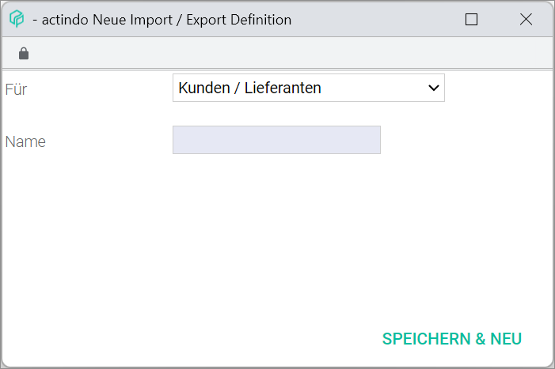
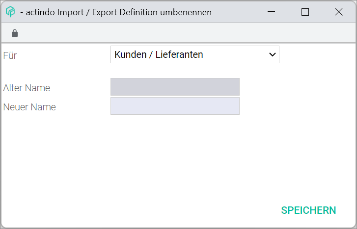

[!!User interface Import](./03a_Import.md)
[!!User interface Export](./03b_Export.md)

# CSV format definition

*Accounting > Extras > Tab CSV FORMAT DEF.*

> [Info] This tab can also be accessed in the *Import/export definitions* window via the following tabs in the user interface:
- [IMPORT](./03a_Import.md#import/export-definitions)
- [EXPORT](./03b_Export.md#import/export-definitions)
- [DEBTORS/CREDITORS](./02a_DebtorsCreditors.md#import/export-definitions)
- [BANK DATA TAKEOVER](./01_Header.md#import/export-definitions)

**Name**

- Import/export definition type  
    Click the drop-down list to select a predefined import/export definition type. All available definition types are displayed in the list. Depending on the selected option, the displayed fields and options in this tab vary.

- Import/export definition  
    Click the drop-down list to select the desired import/export definition. All available definitions are displayed in the list. The options displayed vary depending on the option selected in the import/export definition type drop-down list.

- [ADD]  
    Click this button to create an import/export definition. The *New import/export definition* window is displayed, see [New import/export definition](#new-import/export-definition).

- [EDIT]  
    Click this button to rename an import/export definition. The *Rename import/export definition* is displayed, see [Rename import/export definition](#rename-import/export-definition).

- [DELETE]  
    Click this button to delete an import/export definition. A confirmation window is displayed. Click the [OK] button to confirm the deletion or click the [CANCEL] button to cancel the deletion.

**Fields in the definition**  

The list displays all fields contained in the selected import/export definition. Select a field in the list to change its position, exclude it from the list or display its position (column and row) within the definition. The fields displayed vary depending on the option selected in the import/export definition type drop-down list.

-  (Up)  
    Click this button to move the selected field up in the list.

-  (Down)  
    Click this button to move the selected field down in the list.

**Column**  

The letter and number in parentheses indicate the column where the selected field in the definition is located.

-  (Left)  
    Click this button to include the field selected in the *Possible fields* list to the definition by moving it into the *Fields in the definition* list.

-  (Right)  
    Click this button to exclude the field selected in the *Fields in the definition* list from the definition by moving it into the *Possible fields* list.

**Possible fields**  

This list displays all fields available for the selected import/export definition. Select a field in the list to include it to the definition. The fields displayed vary depending on the option selected in the import/export definition type drop-down list.

- [INSERT IGNORE FIELD]  
    Click this button to add an *Ignore field* field to the *Fields in the definition* list. That is to indicate that this field in the definition does not need to be exported or imported.

**CSV format definition**

- *Field separator*  
    Enter the separator to be used to separate fields. By default, this field is preset to **;** (semicolon).

- *Escape character*  
    Enter the character to be used in escape sequences, that is, combinations of characters used to represent non-printable and special characters, such as tabs or new lines. By default, this field is preset to **\\** (backslash).

- *Column name*  
    Click the drop-down list to select the export/import setting for column names. The following options are available:
    - **Yes**   
        The column name is included in the export/import.
    - **No**   
        No column name is included in the export/import.

- *Date format*  
    Click the drop-down list to select the desired date and time format. The following options are available:
    - **DD[-./]MM[-./]YYYY HH:MM:SS**   
    - **YYYY-MM-DD HH:MM:SS**   
    - **MM/DD/YYYY HH:MM:SS**   
    - **YYYYMMDD**   

- *Example data set*  
    An example of a data set with the current field definition is displayed. This field is read-only.

- *Field delimiter*  
    Enter the character to be used to delimit fields. By default, this field is preset to **"** (quotation mark).

- *Row end character*  
    Click the drop-down list to select the applicable encoding. By default, this field is preset to **Automatic**. The following options are available:
    - **Automatic**   
    - **Windows (\r\n)**   
    - **Unix (\n)**   
    - **MacOS (\r)**  
    - **OS/390 (\x85)**

- *Character set*  
    Click the drop-down list to select the applicable encoding. By default, this field is preset to **Automatic**. The following options are available:
    - **Automatic**   
    - **ISO-8859-1**   
    - **ISO-8859-15**   
    - **UTF-8**  
    - **UTF-16**
    - **Code page 850**  
    - **Apple Mac**

- *Incorrect row end character*  
    Click the drop-down list to select the appropriate option. The following options are available:
    - **Ignore**   
        Any incorrect row end character is ignored by the system.
    - **Repair**   
        Any incorrect row end character is must be repaired.

- *Number format*  
    Click the drop-down list to select the desired number format. The following options are available:
    - **100.000,00**   
    - **100,000.00**

- [SAVE]  
    Click this button to save any changes.

## New import/export definition  

*Accounting > Extras > Tab CSV FORMAT DEF. > Button ADD*

- *For*  
    Click the drop-down list to select the import/export definition type to which the new definition will be added. All available definition types are displayed in the list.  

- *Name*  
    Enter a name for the new import/export definition.

- [SAVE & NEW]  
    Click this button to save the new import/export definition. The *New import/export definition* window is closed. The new definition is displayed in the import/export definition drop-down list.  

## Rename import/export definition  

*Accounting > Extras > Tab CSV FORMAT DEF. > Button EDIT...*

- *For*  
    Import/export definition type of the definition that will be renamed. The definition to be renamed must be included in the selected definition type in the drop-down list. Otherwise, an error message will be displayed when saving.

- *Old name*  
    Current name of the selected import/export definition. This field is read-only.

- *New name*  
    Enter a new name for the selected import/export definition.

- [SAVE]  
    Click this button to rename the selected import/export definition. The *Rename import/export definition* window is closed. The renamed definition is displayed in the import/export definition drop-down list.
