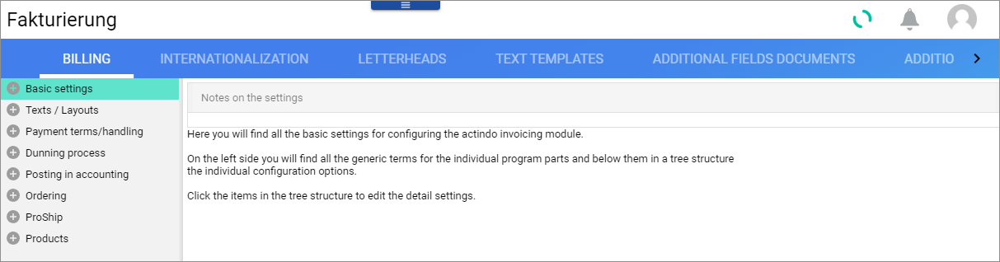
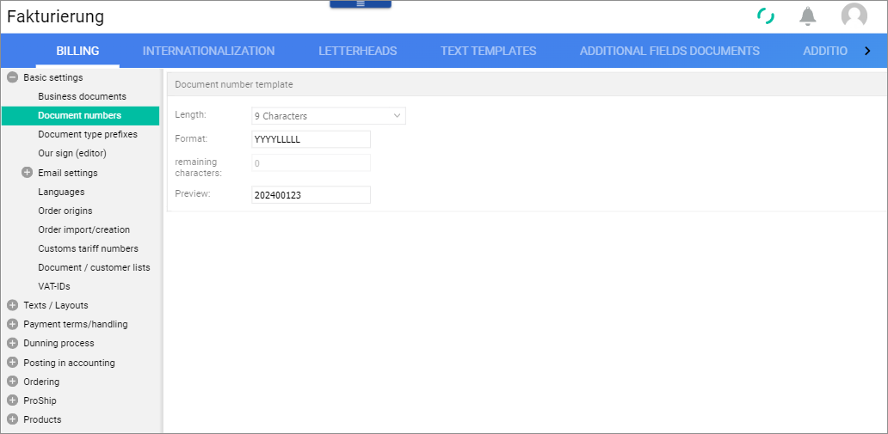

# Configure the business documents

A business document is the proof of a business transaction that is categorized into different types (business document type) depending on the respective transaction (for example, order, delivery, or return). The creation and posting of a business document triggers certain processes in the workflow.

Besides, in the *Actindo Core1 Platform*, a business document is a basic entity containing data on an order. Some of the most important business documents are the order confirmation, the delivery note, the invoice, and the dispatch note. Most business documents originate in the *Order Management* module, but not all of them. This is the case, for example, of the dispatch note, which is created in the *Fulfillment* module based on the delivery note from *Order Management*. The business documents are provided with logic, which allows them to trigger certain actions in the workflow based on the data they contain.

Certain business documents may be assigned special functions, that of head document and/or delivery head. 

A **head document** is the first document in the business document chain. It temporarily reserves stock in the warehouse (reservation posting). The rest of documents in the chain will be derived from it. It is freely configurable which document is to be used as a head document, although the logical sequence of the order process must be taken into account.

The **deliver head** is a business document that permanently reserves stock in the warehouse (reserved for open delivery bills). It is freely configurable which document is to be used as the leading document for deliveries, although the logical sequence of the order process must be taken into account.

In the [Basic order management process](../../Core1/Overview/05_BasicOrderManagementProcess.md), the head document and the deliver head are the same document, in this case the order confirmation. Nevertheless, a different configuration is possible.

## Business document types

There are 16 business documents originating in the *Order Management* module. Based on them, other business documents can be created. This is the case of the dispatch note, created in the *Fulfillment* module and used to request an external fulfiller to pick, pack, and send an order and provide them with the necessary data. 

In the following, an overview of the *Order Management* business documents is provided:

### Offer

The offer (Angebot in German, preset abbreviation AN) is created as a supplier's response to an inquiry. In a quotation, a supplier provides specific product quantities, delivery dates, and other order conditions that they can meet. If included in the business document chain, it would usually precede the order confirmation.  

### Order confirmation

The order confirmation (Auftragsbestätigung in German, preset abbreviation AB) is created by the system when an order is placed in a sales channel and imported into the *Omni-Channel* module. The order in *Omni-Channel* is then exported to the *Order Management* module, where the order confirmation is created. It is often used both as head document and as deliver head. This means that it is the first document of the chain and that it temporarily reserves stock (reservation posting) the *Warehousing* module, as described in the in the basic order management process. For a detailed description of the process, see [Basic order management process](../../Core1/Overview/05_BasicOrderManagementProcess.md).  

### Invoice

The invoice (Rechnung in German, preset abbreviation RE) is usually created after the order confirmation. It creates an open item in the customer account in the *Accounting* module after a delivery note has been created. This business document is sent to the customer together with the shipment.

### Cash invoice

The cash invoice (Barrechnung in German, preset abbreviation RB) is created in the *POS* module for a cash sale and immediate withdrawal. A cash invoice immediately generates a sales posting in the *Warehousing* module, as no reservation is required for immediate withdrawal.

[comment]: <> (Unsicher: Old POS oder noch aktuell? Unterschied mit Bon/Bill? Immediate withdrawal nötig?)

### Partial invoice

The partial invoice (Abschlagsrechnung in German, preset abbreviation AR) is issued for a partial amount of a product not yet delivered or a service not yet provided as an advance payment. Once the partial invoice exists in the document chain, it will be recognized by the invoice, subsequently created, and the amount will be allocated/offset accordingly.

[comment]: <> (anrechnen?)

### Correction invoice

The correction invoice (Korrekturrechnung in German, preset abbreviation GU) is a business document with a positive balance to correct an incorrect outgoing invoice that has already been sent but not yet paid. The correcting invoice and original invoice must be traceable at all times.

[comment]: <> (Vorher Gutschift, daher GU??? Noch zu klären, Unterschied zwischen GU und WG)

### Value credit

The value credit (Wertgutschrift in German, preset abbreviation WG) is created after delivery in the event of a price reduction, e.g. due to a defective product. As the customer does not have to return the product, a value credit note does not represent a stock movement, unlike a credit note.

[comment]: <> (Es gibt keine Credit note/Gutschrift in Fakturierung! Credit/Gutschrift: Beleg, der nach einer eingetroffenen Retoure als Rückerstattung des retournierten Produkts erstellt wird. Credit note/Gutschrift höchstwahrscheinlich jetzt Correction invoice -GU- genannt.)

### Delivery note

The delivery note (Lieferschein in German, preset abbreviation LI) is a business document that lists all the products a delivery contains, as well as the type and quantity of them.

### Dunning notice

The dunning notice (Mahnung in German, preset abbreviation MA) is sent to a business partner to claim an overdue payment item, for example an invoice.

### Purchase order

The purchase order (Lieferantenbestellung in German, preset abbreviation BE) is issued as a binding order to a supplier to deliver certain products. In legal terms, a purchase order is a declaration of intent required to conclude a purchase contract.

### Loan voucher

The loan voucher (Leihbeleg in German, preset abbreviation LB) is created to keep track of a product that is being loaned to a customer. It reduces the stock of the borrowed product in the *Warehousing* module. If the customer returns the product, it is posted back in. If the customer keeps the product, a sale posting is created.

### Proforma invoice

The proforma invoice (Proformarechnung in German, preset abbreviation PR) is issued in order to fulfill the purpose of the declaration obligation for goods traffic with third countries. In contrast to the conventional invoice, the buyer is not requested to pay. It is therefore not recorded in the accounts.

### Reversal document

The reversal document (Stornobeleg in German, preset abbreviation ST) is used to neutralize an incorrect outgoing invoice that has already been paid and posted. It refers to the original invoice and renders it invalid. A new invoice can then be issued under a new invoice number. It cancels any existing firmly reserved stock (reserved for open delivery note posting in *Warehousing*), releasing the stock and making it available again.

The reversal document can only be created before a delivery note has been created.

[comment]: <> (VOR Lieferschein!)

### Dropship delivery note

The dropship delivery note (Lieferschein Dropshipping in German, preset abbreviation LD) is created when a a drop shipment order is received. It does not create a real stock posting in the warehouse, but only a pseudo-posting of the dropship type for informational purposes, since the materials are not kept nor managed in Actindo *Warehousing* module, but in the warehouse of a third party.

### Return

The return (Retoure in German, preset abbreviation RT) is created when a return is registered in the *Returns* module.

### Return to customer or supplier

The return to customer to customer or supplier (Rücksendung zum Kunden o. Lieferanten in German, preset abbreviation RS) is created when a return is registered in the *Returns* module and the follow-up action "Back to supplier and after receipt back to customer" is activated. This document is then processed as a normal delivery note in the shipping function, so that the ordered product can be sent back to the supplier.

## Define the basic settings

> [Info] The *Order Management* module is undergoing a major redesigning process and therefore only the core features and settings are described in this documentation.

#### Prerequisites

No prerequisites to fulfill.

#### Procedure

*Order Management > Settings > Billing*

1. Click the  (expand) icon next to the *Basic settings* menu entry on the left menu.  
    The *Basic settings* menu is displayed.

2. Select the *Document numbers* menu entry.  
    The *Document number template* setting is displayed on the right side.
    
    

3. Click the *Length* drop-down menu and select the desired character length for your business document numbers. You can choose from 6 up to 14 characters. The standard value is 9 characters.

4. Enter the desired format in the *Format* field. The standard format is YYYYLLLLL. YYYY represents the year, L stands for locale, that is, any stand-alone character.
    The *Remaining characters* field changes automatically to display the characters that still need to be entered in the pattern.

Document type prefixes

## Define the printing settings

#### Prerequisites

#### Procedure

## Define the email settings

#### Prerequisites

#### Procedure

## Define the payment handling settings

#### Prerequisites

#### Procedure

## Define the posting settings

#### Prerequisites

#### Procedure