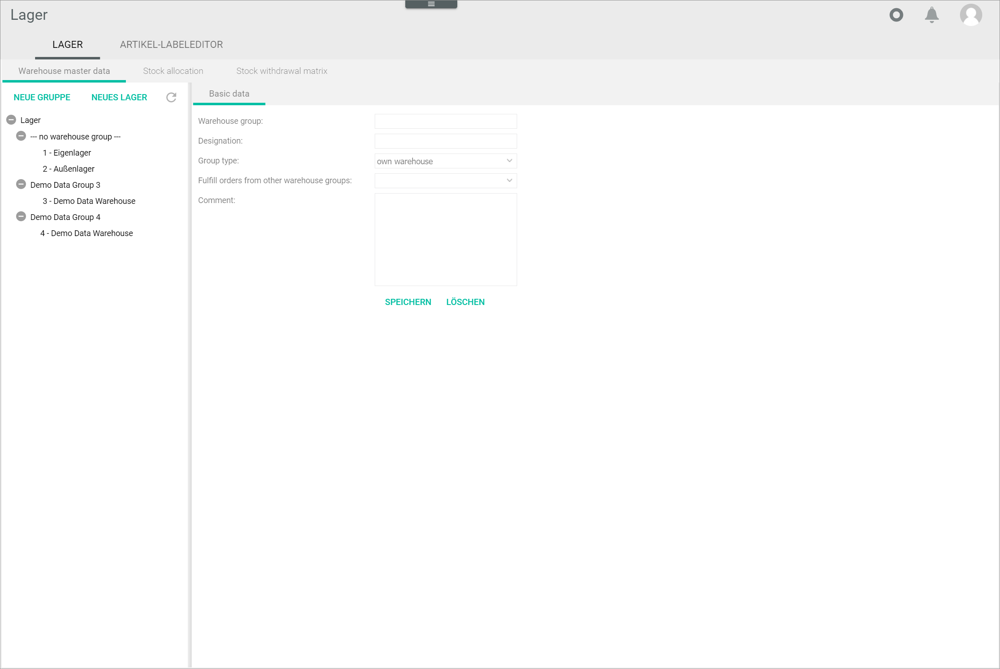
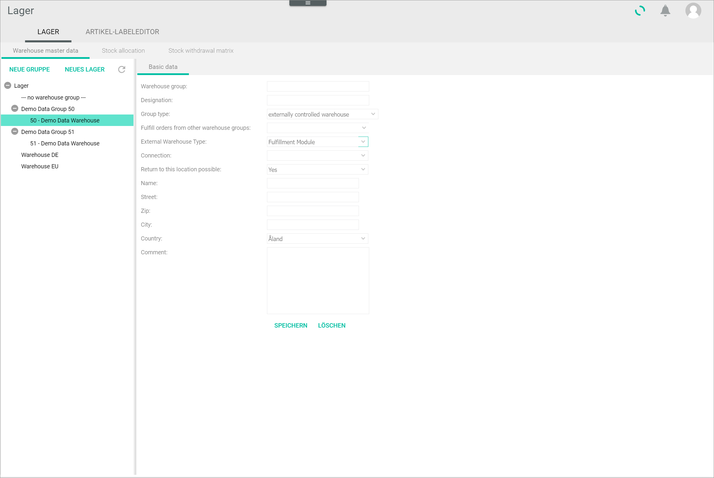

[!!Configure warehouses](./02_ConfigureWarehouses.md)
[!!User interface to be completed](../UserInterface/XX_tobecompleted.md)

# Configure the warehouse groups

A warehouse group is an higher-level  classification of storage facilities according to customer-defined criteria, for example location or type of product. Warehouse groups are physically separated from each other and, therefore, a delivery note is issued for each warehouse group. A warehouse group can contain an unlimited number of warehouses.  

Warehouses can be created, edited and deleted.

## Add a warehouse group

Add a warehouse group to which you can assign any number of specific warehouses, for instance a sales warehouse, a returns warehouse and a quarantine warehouse.

[comment]: <> (Terminologie korrigieren)

#### Prerequisites

The *Warehouse groups* plugin must be installed.

[comment]: <> (Stimmt das noch? Lagergruppe-, Lager-, Lagerplanung- und Lagerreichweiten...- Plugings müssen generell zusammen mit Lager installiert sein? Oder passiert das beim Installation von Lager-Modul?)

#### Procedure

*Warehousing > Settings > Tab WAREHOUSE > Sub-tab Warehouse master data*

1. Click the [NEW GROUP] button in the *Warehouse master data* sub-tab.  
    The *Basic data* sub-tab is displayed.

    

2. Enter a unique number for the warehouse group in the *Warehouse group* field.

3. Enter a description for the warehouse group in the *Designation* field. This description will be displayed later on in the left side bar in the *Warehouse master data* sub-tab.

4. Click the *Group type* drop-down list and select the appropriate option. The following options are available:
    - **Own warehouse group**  
        Select this option if the warehouse group is managed by yourself.
    - **Externally controlled warehouse group**  
        Select this option if the warehouse group is managed by a third party. 

    Depending on the selected option, the fields displayed differ. 

5. For the next steps to create a warehouse, follow the appropriate procedure:

    - [Create an own warehouse group](#create-an-own-warehouse-group)
    - [Create an externally controlled warehouse group](#create-an-externally-controlled-warehouse-group)

### Create an own warehouse group

#### Prerequisites

- A warehouse group has been added, see [Add a warehouse group](#add-a-warehouse-group).
- The **Own warehouse group** option has been selected in the *Group type* field.

#### Procedure

*Warehousing > Settings > Tab WAREHOUSE > Sub-tab Warehouse master data > Select Own warehouse group*

1. If necessary, click the *Fulfill orders from other warehouse groups* drop-down list and select the appropriate option. All available warehouse groups are displayed in the list. The **No warehouse group** option includes all warehouses that have not been assigned to any warehouse group.

[Comment]: <> (Tooltip: If orders cannot be completely fulfilled from the warehouse groups selected here, the missing products are taken from this warehouse group. The delivery note is printed in this storage group and contains all items. -> Frage: "from the warehouse groups selected here" oder "warehouse group"? Man kann nur eine Gruppe wählen, oder? Julian: Offenbar kann man nur eine Lagergruppe wählen. So gewollt oder Bug?)
        
2. If desired, enter any comments in the *Comment* field.

3. Click the [SAVE] button.  
    The warehouse group has been saved.

4. Click the  (Refresh) button in the upper right corner of the left side bar to update the list of warehouses. The new warehouse group is displayed in the list of warehouses.

### Create an externally controlled warehouse group

#### Prerequisites

- A warehouse group has been added, see [Add a warehouse group](#add-a-warehouse-group).
- The **Externally controlled warehouse group** option has been selected in the *Group type* field.
- At least one connection has been established in the *Fulfillment* module, see [Create a connection](../../Fulfillment/Integration/01_ManageConnections.md#create-a-connection).

#### Procedure

*Warehousing > Settings > Tab WAREHOUSE > Sub-tab Warehouse master data > Select Externally controlled warehouse group*

1. If necessary, click the *Fulfill orders from other warehouse groups* drop-down list and select the appropriate option. All available warehouse groups are displayed in the list. The **No warehouse group** option includes all warehouses that have not been assigned to any warehouse group.

[comment]: <> (Tooltip: If orders cannot be completely fulfilled from the warehouse groups selected here, the missing products are taken from this warehouse group. The delivery note is printed in this storage group and contains all items. -> Frage: "from the warehouse groups selected here" oder "warehouse group"? Man kann nur eine Gruppe wählen, oder? Julian: Offenbar kann man nur eine Lagergruppe wählen. So gewollt oder Bug?)
        
2. Click the *External warehouse type* drop-down list and select the appropriate option. The following options are available:
    - **Legacy (obsolete)**  
        Select this option if ...
    - **Fulfillment module**  
        Select this option if the external warehouse is accessed via a connection in the *Fulfillment* module. 

[comment]: <> (Julian: bedeutet obsolete, dass diese Option nicht mehr zutrifft, also kann man ignorieren? Gibt es andere mögliche Optionen, außer Fulfillment?)

3. Click the *Connection* drop-down list and select the applicable connection. All connections established in the *Fulfillment* module are displayed in the list.

[comment]: <> (*Return to this location possible* obsolete?)

4. If desired, enter the address details in the corresponding fields.

6. If desired, enter any comments in the *Comment* field.

7. Click the [SAVE] button.  
    The warehouse group has been saved.

8. Click the  (Refresh) button in the upper right corner of the left side bar to update the list of warehouses. The new warehouse group is displayed in the list of warehouses.

[comment]: <> (Evtl. zwei komplett separate procedures mit H2?)

## Edit a warehouse group

Once you have created a warehouse group, you can edit it. 

#### Prerequisites

At least one warehouse group has been created, see [Create a warehouse group](#create-a-warehouse-group).

#### Procedure

*Warehousing > Settings > Tab WAREHOUSE > Sub-tab Warehouse master data*

1. Click the warehouse group you want to edit.  
    The *Basic data* sub-tab of the selected warehouse group is displayed.

    

2. Modify any settings as necessary in the applicable fields.  

    [Info] If the warehouse group contains warehouses, the warehouse group number cannot be modified.  

3. Click the [SAVE] button.  
    The changes have been saved.

## Delete a warehouse group

#### Prerequisites

#### Procedure

