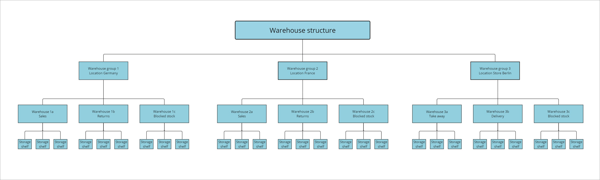
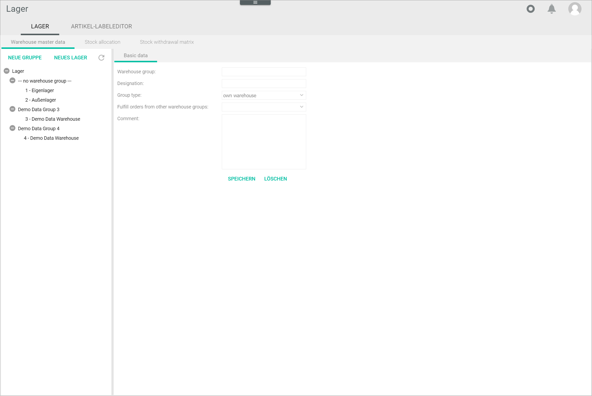
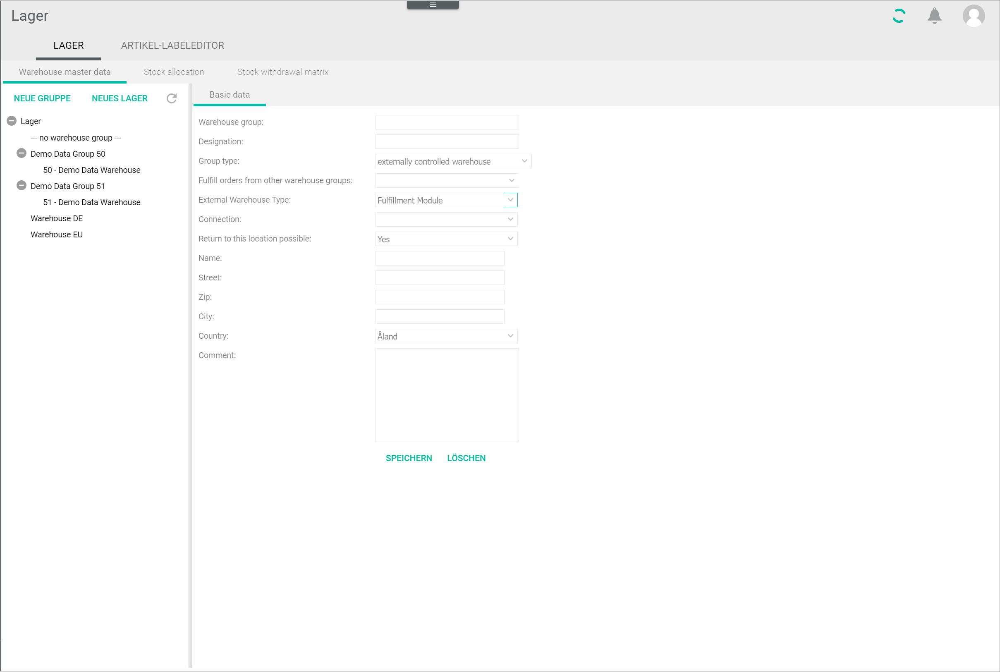
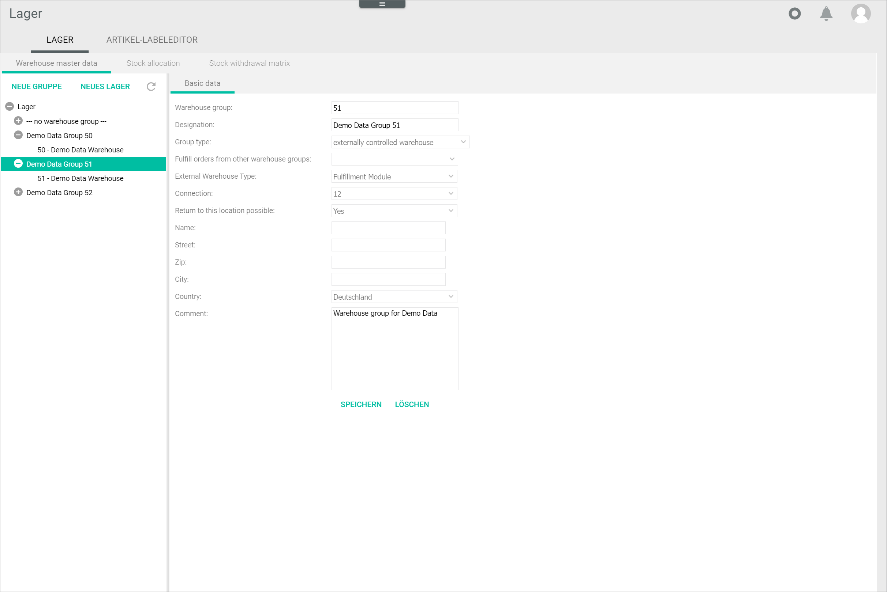

[!!Configure the warehouses](./02_ConfigureWarehouses.md)
[!!User interface Warehouse](../UserInterface/03a_Warehouse.md)
[!!Create a connection in Fulfillment](../../Fulfillment/Integration/01_ManageConnections.md)

# Configure the warehouse groups

The *Warehousing* module allows you create complex warehouse structures. Before you start configuring the warehouse groups, you must define the structure you want to reproduce in the Core1. This will depend on the nature of your business and on your own warehousing facilities. Below we offer you a simple warehouse structure for exemplary purposes.

A warehouse group is a higher-level classification of warehousing facilities according to customer-defined criteria, such as location or product type. For example, you can create a warehouse group for each country where you have warehousing facilities. 

Warehouse groups are physically and conceptually separated from each other and therefore one delivery note must be issued for each warehouse group and handled separately. A warehouse group can contain an unlimited number of warehouses, see [Configure the warehouses](./02_ConfigureWarehouses.md). 

Warehouse groups can be created, edited, and deleted. Bear in mind, though, that you cannot delete a warehouse group that already contains warehouses.

To be able to manage the warehouses, the following plugins must be installed:   
- *Warehouse groups 2.0.0*  
- *Calculation of the range of storage and ordering by range of storage 2.0.0*  
- *Warehouse planning 2.0.0*   

## Create a warehouse group

Create a warehouse group to include a number of warehouses that share a common configuration. You can create a warehouse group managed by your own company and a warehouse group managed by an external third party, such as fulfiller. The configuration set for the warehouse group applies to all warehouses included in the group. 

### Create an own warehouse group

Create an own warehouse group, that is, a warehouse group managed by your company. 

#### Prerequisites

No prerequisites to fulfill.

#### Procedure

*Warehousing > Settings > Tab WAREHOUSE > Tab Warehouse master data*

1. Click the [NEW GROUP] button in the *Warehouse master data* tab.  
    The *Basic data* tab is displayed.

    

2. Enter a unique number for the warehouse group in the *Warehouse group* field. This is the warehouse group ID.

3. Enter a description for the warehouse group in the *Designation* field. This description will be displayed later on in the left side bar in the *Warehouse master data* tab.

4. Click the *Group type* drop-down list and select the **Own warehouse group** option.  

5. If necessary, click the *Fulfill orders from other warehouse groups* drop-down list and select a warehouse group. All available warehouse groups are displayed in the list.    
        
6. If desired, enter any comments in the *Comment* field.

7. Click the [SAVE] button.  
    The warehouse group has been saved.

8. Click the  (Refresh) button in the upper right corner of the left side bar to update the list of warehouses.   
    The new warehouse group is displayed in the list of warehouses.

### Create an externally controlled warehouse group

Create an externally controlled warehouse group, that is, a warehouse group managed by a third party, such as a fulfiller.

#### Prerequisites

At least one connection has been established in the *Fulfillment* module, see [Create a connection](../../Fulfillment/Integration/01_ManageConnections.md#create-a-connection).

[comment]: <> (Evtl. auf Create connection in OC verweisen, wenn vereinheitlicht) 

#### Procedure

*Warehousing > Settings > Tab WAREHOUSE > Tab Warehouse master data*

1. Click the [NEW GROUP] button in the *Warehouse master data* tab.  
    The *Basic data* tab is displayed.

    

2. Enter a unique number for the warehouse group in the *Warehouse group* field. This is the warehouse group ID.

3. Enter a description for the warehouse group in the *Designation* field. This description will be displayed later on in the left side bar in the *Warehouse master data* tab.

4. Click the *Group type* drop-down list and select the **Externally controlled warehouse** option.  
    The additional fields and drop-down lists available for this option are displayed.

    

5. If necessary, click the *Fulfill orders from other warehouse groups* drop-down list and select a warehouse group. All available warehouse groups are displayed in the list.  
       
6. Click the *External warehouse type* drop-down list and select the **Fulfillment module** option.  
    
    > [Info] The **Legacy** option in the *External warehouse type* drop-down list is no longer supported. Therefore, it is not described in this documentation.

7. Click the *Connection* drop-down list and select the appropriate connection. All connections established in the *Fulfillment* module are displayed in the list.

8. Click the *Return to this location possible* drop-down list and select the appropriate option. The following options are available:  
    - **Yes**  
        Select this option to allow returned materials to be sent to this warehouse group.
    - **No**   
        Select this option if you do not want to allow returned materials to be sent to this warehouse group. 

9. Click the *Country* drop-down list and select the country where your warehousing facilities are located.

10. Click the *Zip* field and enter the applicable zip code.
    
    > [Info] Both country and zip code are needed to determine where the materials are shipped from, which is relevant to define the applicable tax regime. Any other address-related fields are optional.

11. If desired, enter any comments in the *Comment* field.

12. Click the [SAVE] button.  
    The warehouse group has been saved.

13. Click the  (Refresh) button in the upper right corner of the left side bar to update the list of warehouses.  
    The new warehouse group is displayed in the list of warehouses.

## Edit a warehouse group

Once you have created a warehouse group, you can edit it. Bear in mind, though, that you cannot edit the warehouse group ID if the warehouse group already contains warehouses.

#### Prerequisites

At least one warehouse group has been created, see [Create a warehouse group](#create-a-warehouse-group).

#### Procedure

*Warehousing > Settings > Tab WAREHOUSE > Tab Warehouse master data*

1. Click the warehouse group you want to edit.  
    The *Basic data* tab of the selected warehouse group is displayed.

    > [Caution] **Potential loss of data**    
    Editing has the potential to cause loss of data due to overwrite. The overwrite cannot be undone and the overwritten data cannot be restored. Check all your entries before proceeding.

    

2. Modify any settings as necessary in the available fields.  

3. Click the [SAVE] button.  
    The changes have been saved.  

    > [Info] If the warehouse group already contains warehouses, the warehouse group ID cannot be modified. A window with the following error message is displayed: *Error while saving: There are warehouses in this warehouse group*.

## Delete a warehouse group

After you have created a warehouse group, you can delete it if it is no longer needed or you create it mistakenly. Bear in mind, though, that you cannot delete a warehouse group that already contains warehouses.

#### Prerequisites

At least one warehouse group has been created, see [Create a warehouse group](#create-a-warehouse-group).

#### Procedure

*Warehousing > Settings > Tab WAREHOUSE > Tab Warehouse master data*

1. Click the warehouse group you want to delete.  
    The *Basic data* tab of the selected warehouse group is displayed.

    > [Caution] **Loss of data**  
    Deleting will permanently remove the selected data. The deletion cannot be undone and the deleted data cannot be restored. Problems may occur due to unresolved dependencies. Make sure you really want to delete the selected data.

    

2. Click the [DELETE] button.   
    The warehouse group is deleted and is no longer displayed in the list of warehouses.
    
    > [Info] If the warehouse group already contains warehouses, it cannot be deleted. A window with the following error message is displayed: *Error while deleting: There are warehouses in this warehouse group.* In this case, you have to delete the warehouses included in the warehouse group first, see [Delete a warehouse](./02_ConfigureWarehouses.md#delete-a-warehouse).